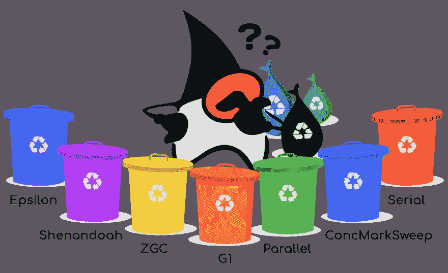
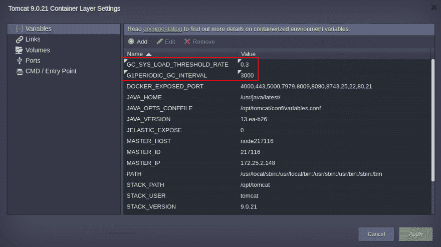
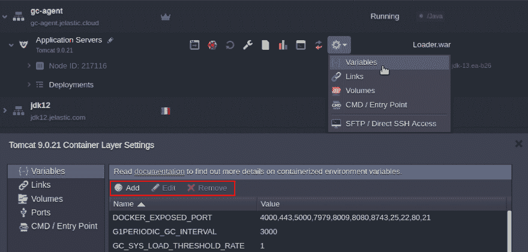
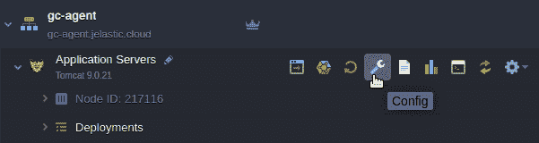
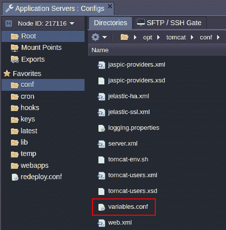
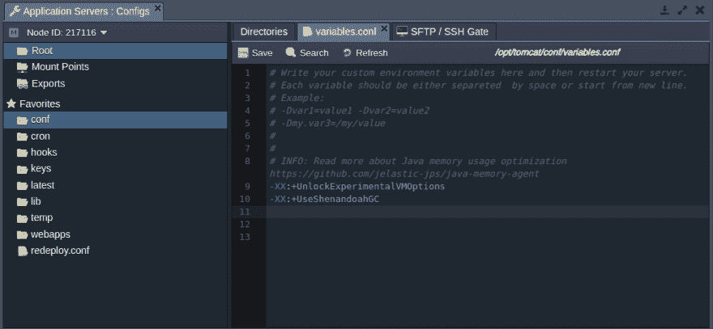
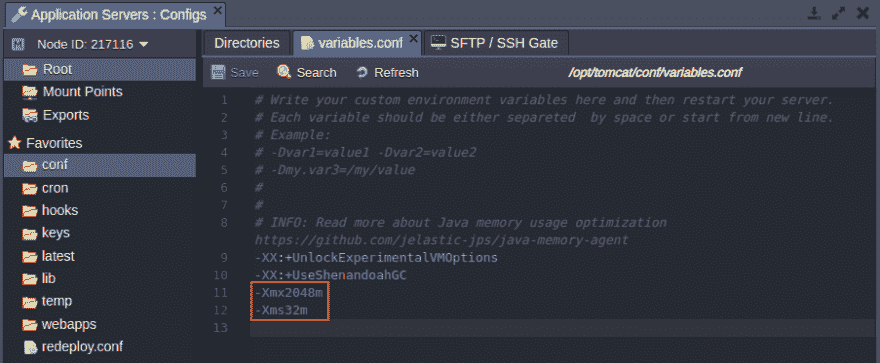
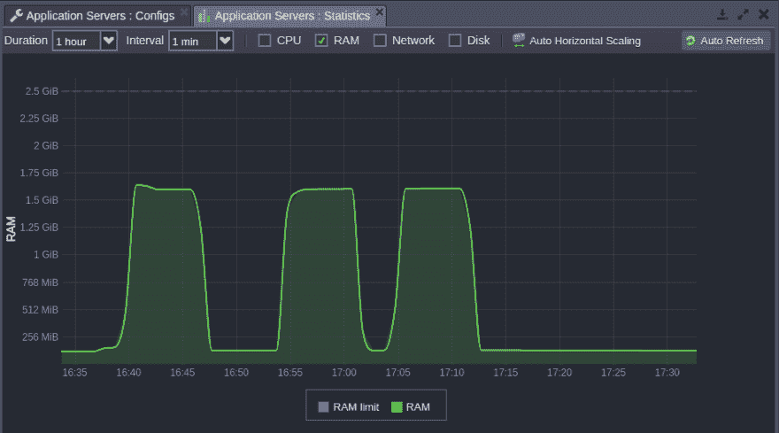

# Java 垃圾收集类型和设置

> 原文：<https://dev.to/tetiana_ftv/java-garbage-collection-types-and-settings-3opj>

性能和价格是应用程序托管中始终重要的两大考虑因素。而且，我们经常会问自己，如何在不影响应用性能的同时降低成本。在本文中，我们将使用垃圾收集来解决 Jelastic 托管的 Java 应用程序的自动内存管理问题。

让我们弄清楚什么是垃圾收集，它对 Java 应用程序有什么作用，以及它在 Jelastic PaaS 中是如何工作的。

## Java 垃圾收集概述

垃圾收集是自动内存管理的一种形式。它的目的是在内存中找到不再需要的数据对象，并使它们的空间可供重用。

创建的对象使用一些内存，这些内存在有引用使用该对象之前保持分配状态。当一个对象没有引用时，就认为不再需要它了，该对象占用的内存可以回收。通过这种方式，您不必为未使用的资源付费，并且可以降低成本。

我们已经[测试了不同种类的垃圾收集器(GC)](https://jelastic.com/blog/tuning-garbage-collector-java-memory-usage-optimization/) ，并考虑到 Jelastic 提供的自动垂直伸缩，为我们云中托管的 Java 应用程序定义了最合适的垃圾收集器。作为我们调查的结果，我们调整了 Jelastic 中垃圾收集器的默认设置，以增加用户的利益。

[](https://res.cloudinary.com/practicaldev/image/fetch/s--b4JFA_Xk--/c_limit%2Cf_auto%2Cfl_progressive%2Cq_auto%2Cw_880/https://jelastic.com/blog/wp-content/uploads/2019/08/java-garbage-collector-types.png)

Jelastic 支持以下 GC:

*   **G1 GC (-XX:+UseG1GC)** 是 Jelastic PaaS 中的默认 GC。垃圾优先(G1)是一个服务器风格的垃圾收集器，用于具有大量内存的多处理器机器。堆被划分成固定大小的区域，G1 跟踪这些区域中的活动数据。当需要垃圾收集时，它首先从活动数据较少的区域收集。

*   **Shenandoah GC(-XX:+UseShenandoahGC)**是 JVM 的并发垃圾收集器。并发意味着 GC 试图在不中断应用程序性能的情况下并行执行大多数活动。这种并行性使得“停止世界”(STW)暂停极短，这是每个 GC 最需要的任务。另一个固有的优势是可以高效地处理大小堆，而不会影响 STW 暂停的长度。注意，要使用这个 GC，需要用-XX:+unlockeexperimentalvmoptions 解锁实验选项。

*   **ZGC (-XX:+UseZGC)** 是低延迟可伸缩垃圾收集器。设计用于需要大堆和低延迟的应用程序。它使用一堆一代垃圾，并在不中断应用程序工作的情况下并行执行大多数(但不是全部)垃圾收集。这极大地限制了垃圾收集对应用程序响应时间的影响。注意，在调用这个 GC 类型之前，需要用-XX:+unlockeexperimentalvmoptions 解锁实验选项。

*   **Epsilon GC(-XX:+UseEpsilonGC)**是一个被动 GC，它处理内存分配，当对象不再被使用时不会清除它。当应用程序耗尽 Java 堆时，JVM 就会关闭。因此，EpsilonGC 延长了应用程序的寿命，直到内存耗尽并转储内存，这对于应用程序内存使用调试以及测量和管理应用程序性能非常有用。注意，在调用这个 GC 类型之前，需要用-XX:+unlockeexperimentalvmoptions 解锁实验选项。

*   **并行**
    **par new GC(-XX:+UseParNewGC)**是一个“stop-the-world”多线程垃圾收集器。主要是为了收集年轻一代的物品。由于年轻一代通常体积较小，ParNew 的收集速度非常快，不会对您的应用程序造成太大影响。此外，ParNew 还压缩了未使用的 RAM，支持自动垂直扩展，这是 Jelastic 的一个突出特性。
    **并行 GC (-XX:+UseParallelGC)** 仅在年轻一代需要并行收集方法时使用。与 ParNew GC 不同，它不能与 ConcMarkSweep GC 同时应用。
    **并行旧 GC (-XX:+UseParallelOldGC)** 利用并行“标记和压缩”算法，该算法捕获所有应用程序线程，然后使用多个垃圾收集器线程处理标记和后续压缩。

*   **concmarksweavegc(-XX:+UseConcMarkSweepGC)**收集器是为那些喜欢较短垃圾收集暂停时间的应用程序设计的，这些应用程序在运行时可以与垃圾收集器共享处理器资源。当应用程序对垃圾收集暂停时间的要求较低时，使用这样的收集器是有意义的。

*   **串行 GC (-XX:+UseSerialGC)** 在单线程中执行垃圾收集，在所有 GC 类型中具有最低的内存消耗，但同时，它会产生长时间的暂停，这会导致应用程序性能下降。

## Jelastic PaaS 中的默认 JVM 选项

默认情况下，Jelastic PaaS 对 JVM 8+版本使用 G1 GC。对于较低版本，它采用全新的 GC。此外，对于低于 12 的 JVM 版本，je lastic attachs[je lastic-GC-agent . jar](https://github.com/jelastic-jps/java-memory-agent)支持旧版本的垂直伸缩。

对于 JVM 12+版本，该平台提供了[集成垂直伸缩](https://jelastic.com/blog/elastic-jvm-vertical-scaling/)，以确保通过以下预设容器[变量](https://docs.jelastic.com/container-variables)进行 G1 触发:

*   **G1 periodic _ GC _ INTERVAL = 3000**垃圾收集的时间间隔，以毫秒为单位(默认为 15 分钟)
*   **GC _ SYS _ LOAD _ THRESHOLD _ RATE = 0.3**自定义乘数，灵活调整 G1 periodicgcsystemloadthreshold 值
*   **G1 periodic _ GC _ SYS _ LOAD _ THRESHOLD = { CPU _ cores _ number } * GC _ SYS _ LOAD _ THRESHOLD _ RATE**如果一分钟平均系统负载低于设定值，则激活垃圾收集。如果设置为零，则忽略此条件。

[](https://res.cloudinary.com/practicaldev/image/fetch/s--keSyJQgm--/c_limit%2Cf_auto%2Cfl_progressive%2Cq_auto%2Cw_880/https://jelastic.com/blog/wp-content/uploads/2019/08/java-garbage-collection-variables-for-scaling.png)

您可以通过执行 **ps -ax | grep java** 来检查 Java 进程的当前设置。您将看到类似这样的内容:

*/usr/Java/libericajdk-12 . 0 . 1/bin/Java . orig-server-XX:G1 periodicgcsystemloadthreshold = 0.6-XX:G1 periodicgcinterval = 900k-XX:+UseStringDeduplication-*

*XX:+use G1 GC-xmaxf 0.3-xminf 0.1-xmx 1638m-Xmn30M-Xms32M-jar je lastic-hello world-1.1 . war*

Jelastic 还会自动配置以下参数:

xmx–容器中总可用 RAM 的 80%
Xms–32MB
Xmn–30MB

如果 JVM 版本高于 12，平台还会配置以下 Java 选项:

*   **G1 periodicgcsystemloadthreshold = CPU _ COUNT * 0.3**基于容器中可用 CPU 内核数量的平均负载的 30%
*   从任何先前的垃圾收集暂停开始，15 分钟应该已经过去了。要了解更多细节，您可以查看下面这个由[管理 Java 选项自动配置的脚本](https://github.com/jelastic-jps/java-memory-agent/blob/master/scripts/memoryConfig.sh)。

## 定制 Jelastic PaaS 中的 GC 设置

如果您认为自定义默认设置可以提高性能或减少内存消耗，您可以根据应用程序的要求对它们进行调整。我们建议，只有当您完全理解这些变化对您的应用程序行为的影响时，才定制这些配置。

您可以根据您的应用需求，通过[环境变量](https://docs.jelastic.com/environment-variables)设置一个定制的 GC 参数(请不要将它们与 Java 选项混淆)。

[](https://res.cloudinary.com/practicaldev/image/fetch/s--UvZ9ZGft--/c_limit%2Cf_auto%2Cfl_progressive%2Cq_auto%2Cw_880/https://jelastic.com/blog/wp-content/uploads/2019/08/java-garbage-collection-variables.png)

*   **_JAVA_OPTIONS 和 JAVA _ TOOL _ OPTIONS**–请[阅读关于这些选项的更多信息](https://stackoverflow.com/questions/28327620/difference-between-java-options-java-tool-options-and-java-opts)。Java 选项可用于更改默认 GC 类型，例如:_ JAVA _ OPTIONS = "-XX:+UnlockExperimentalVMOptions-XX:+UseShenandoahGC "
*   **GC _ DEF**–垃圾收集器的类型，例如 GC_DEF=G1GC
*   **XMX _ DEF _ PERCENT**–RAM 百分比以 XMX 的形式提供，例如 XMX_DEF_PERCENT=80
*   **XMX_DEF** (或者只是 XMX)–Java 堆内存的最大大小，例如，如果总 RAM 是 2048Mb，则 XMX_DEF=1638
*   **XMS_DEF** (或者只是 XMS)——初始 java 堆大小，例如 XMS=32M
*   **XMN _ DEF**–年轻一代的堆大小，例如 XMN = 3000 万
*   **G1PERIODIC_GC_INTERVAL** (仅适用于 open JDK 12/13)–G1 定期收集的频率，以毫秒为单位(G1 periodicgcinterval–默认为 15 分钟)；置 0 禁用，G1PERIODIC_GC_INTERVAL=900
*   **G1 Periodic _ GC _ SYS _ LOAD _ THRESHOLD**(仅适用于 open JDK 12/13)——如果平均一分钟系统负载低于设定值，则允许 G1 周期性收集执行；如果设置为零，则忽略此条件。默认情况下，它等于{ CPU _ 核心数}*{GC_SYS_LOAD_THRESHOLD_RATE}
*   **GC _ SYS _ LOAD _ THRESHOLD _ RATE**(仅适用于 open JDK 12/13)–自定义乘数以灵活调整 G1 periodicgcsystemloadthreshold 值(默认为 0.3)，例如 G1 periodic _ GC _ SYS _ LOAD _ THRESHOLD _ RATE = 0.3
*   **FULL _ GC _ AGENT _ DEBUG**–启用(true)或禁用(false)调试模式来跟踪日志中的 Java GC 进程，例如 FULL_GC_AGENT_DEBUG=true
*   **FULL _ GC _ PERIOD**–设置完整 GC 调用之间的间隔(以秒为单位);默认为 900，即 15 分钟，例如 FULL_GC_PERIOD=900
*   **MAXPERMSIZE**–只为那些 Java 容器自动定义，这些容器运行低于第 8 版的 JVM，分配的 RAM 数量为> 800 MiB。在所有其他情况下(即，如果容器缩放限制小于 7 [cloudlets](https://docs.jelastic.com/cloudlet) 或者它使用 Java 8 ),则省略该参数。MaxPermSize 设置的实际值是根据 Xmx 内存量除以 10 计算的，但不能设置为大于最大值 256 MiB。例如，MAXPERMSIZE=163
*   **XMINF_DEF**–该参数控制堆中的最小可用空间，并指示 JVM 扩展堆，如果在执行垃圾收集后，它没有至少 XMINF _ DEF 值的可用空间。例如，XMINF_DEF=0.1
*   **XMAXF_DEF**–该参数控制如何扩展堆，并指示 JVM 在空闲空间量超过 XMAXF _ DEF 值时压缩堆。例如，XMAXF_DEF=0.3

或者，所有这些参数都可以通过容器中的 **variables.conf** 传递给 Java 进程。

所有指向配置、可执行或日志文件的路径可以根据您使用的 Java 服务器而有所不同，并且可以通过[配置文件管理器](https://docs.jelastic.com/configuration-file-manager)或 [SSH](https://docs.jelastic.com/ssh-access) 来访问。

1.  打开 **Conf** 文件来配置您的 Java 服务器。

[](https://res.cloudinary.com/practicaldev/image/fetch/s--qBkLdzdF--/c_limit%2Cf_auto%2Cfl_progressive%2Cq_auto%2Cw_880/https://jelastic.com/blog/wp-content/uploads/2019/08/java-garbage-collection-configurations.png)

1.  对于 Tomcat，导航到**opt>Tomcat>conf>variables . conf**文件。

[](https://res.cloudinary.com/practicaldev/image/fetch/s--YdcgFNZ1--/c_limit%2Cf_auto%2Cfl_progressive%2Cq_auto%2Cw_880/https://jelastic.com/blog/wp-content/uploads/2019/08/java-garbage-collection-configurations2.png)

在打开的 variables.conf 文件中，您可以覆盖垃圾收集器的默认设置，甚至可以添加另一个垃圾收集器来替换默认的垃圾收集器(G1)。因此，如果您想使用 ShenandoahGC，只需将它添加到 variables.conf 中，如下例所示:

```
 -XX:+UnlockExperimentalVMOptions

     -XX:+UseShenandoahGC 
```

[](https://res.cloudinary.com/practicaldev/image/fetch/s--rpRYm9G4--/c_limit%2Cf_auto%2Cfl_progressive%2Cq_auto%2Cw_880/https://jelastic.com/blog/wp-content/uploads/2019/08/java-garbage-collection-change-GC.png)

此后，在启动 Java 服务器时，将只使用指定的垃圾收集器，而不考虑分配的资源量。

此外，您可以使用该文件中陈述的其他 JAVA 选项来控制 JVM 如何处理其堆内存。

[](https://res.cloudinary.com/practicaldev/image/fetch/s--z0QWZ8h---/c_limit%2Cf_auto%2Cfl_progressive%2Cq_auto%2Cw_880/https://jelastic.com/blog/wp-content/uploads/2019/08/java-garbage-collection-heap-memory.png)

作为正确配置选项的结果，可以通过 [Statistics](https://docs.jelastic.com/view-app-statistics) 选项卡观察 GC 的运行情况。

[](https://res.cloudinary.com/practicaldev/image/fetch/s--K8JckT-E--/c_limit%2Cf_auto%2Cfl_progressive%2Cq_auto%2Cw_880/https://jelastic.com/blog/wp-content/uploads/2019/08/java-garbage-collection-statistics.png)

就是这样！在云中运行 Java 应用程序的同时享受资源效率。用[je elastic Multi-Cloud PaaS](https://jelastic.cloud/)亲自尝试一下。