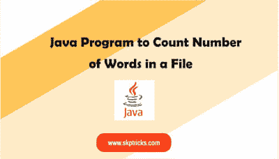

# 计算文件字数的 Java 程序

> 原文：<https://dev.to/skptricks/java-program-to-count-number-of-words-in-a-file-405n>

来源:[计算文件字数的 Java 程序](https://www.skptricks.com/2019/08/java-program-to-count-number-of-words-in-file.html)

本教程解释了如何用 java 计算一个文件的字数。发现字数应该是有价值的部分。在中计算单词出现次数的原因是，几乎所有依赖于用户输入的文本框都对可以插入的字符数有一定的限制。

[点击此处阅读更多信息](https://www.skptricks.com/2019/08/java-program-to-count-number-of-words-in-file.html)