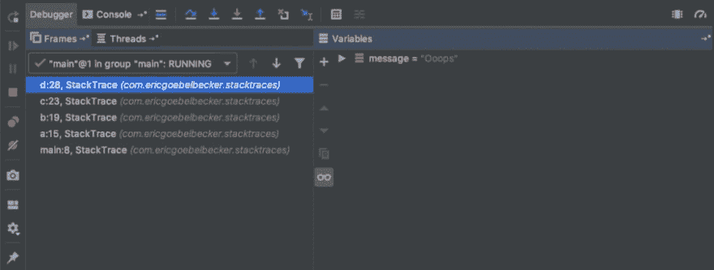

# Java 堆栈跟踪:理解它并使用它进行调试

> 原文：<https://dev.to/scalyr/java-stack-trace-understanding-it-and-using-it-to-debug-5a3a>

将 Java 代码部署到生产环境会限制您的故障排除选项。使用调试器连接到您的生产应用程序通常是不可能的，您甚至可能无法获得控制台访问。因此，即使有了监控，您最终还是要对许多问题进行事后诊断。这意味着查看[日志](https://www.scalyr.com/blog/get-started-quickly-javascript-logging/)，如果幸运的话，使用 Java 堆栈跟踪。

没错，我说如果有堆栈跟踪就很幸运了。这就像一下子得到一个指南针、一张地图和一张头等舱机票一样！让我们讨论一下什么是 Java 堆栈跟踪，以及如何使用它。

[](https://res.cloudinary.com/practicaldev/image/fetch/s--DKRHWx8k--/c_limit%2Cf_auto%2Cfl_progressive%2Cq_auto%2Cw_880/https://library.scalyr.com/2019/05/24093715/Coffee_cups_with_scalyr_colors_signifying_java_stack_trace.png)

## 什么是 Java 堆栈跟踪？

堆栈跟踪，也称为堆栈回溯，甚至简称为回溯，是堆栈帧的列表。这些帧代表应用程序执行过程中的某个时刻。堆栈帧是关于代码调用的方法或函数的信息。因此，Java 堆栈跟踪是一个帧列表，从当前方法开始，一直延伸到程序启动时。

有时会混淆堆栈和堆栈。栈是一种数据结构，相当于你桌上的一堆文件:它是先进后出的。你把文件放入文件堆中，然后按与放入文件相反的顺序取出。堆栈，更准确地说是运行时堆栈或调用堆栈，是程序执行时创建的一组堆栈框架，以堆栈数据结构组织。

让我们看一个例子。

### Java 堆栈跟踪示例

让我们来看一个 Java 程序。该类调用四个方法，并从最后一个方法向控制台打印堆栈跟踪。

```
public class StackTrace {

  public static void main(String[] args) {
    a();
  }

  static void a() {
    b();
  }

  static void b() {
    c();
  }

  static void c() {
    d();
  }

  static void d() {
    Thread.dumpStack();
  }
}
```

当您运行该类时，您会看到类似这样的内容:

```
java.lang.Exception: Stack trace
at java.base/java.lang.Thread.dumpStack(Thread.java:1383)
at com.ericgoebelbecker.stacktraces.StackTrace.d(StackTrace.java:23)
at com.ericgoebelbecker.stacktraces.StackTrace.c(StackTrace.java:19)
at com.ericgoebelbecker.stacktraces.StackTrace.b(StackTrace.java:15)
at com.ericgoebelbecker.stacktraces.StackTrace.a(StackTrace.java:11)
at com.ericgoebelbecker.stacktraces.StackTrace.main(StackTrace.java:7)

```

d()方法()位于堆栈的顶部，因为应用程序在那里生成跟踪。main()方法在底部，因为那是程序开始的地方。当程序启动时，Java 运行时执行 main()方法。Main()调用了一个()。a()叫 b()，b()叫 c()，c()叫 d()。最后，d()调用 dumpStack()，后者生成输出。这个 Java 堆栈跟踪按照程序执行的顺序向我们展示了程序执行了什么。

Java 堆栈跟踪是某个时刻的快照。您可以看到您的应用程序在哪里以及它是如何到达那里的。这是很有价值的见解，你可以用几种不同的方式。

## 如何使用 Java 堆栈跟踪

既然您已经看到了 Java 堆栈跟踪向您展示了什么，那么您如何使用它们呢？

### Java 异常

堆栈跟踪和异常通常是相互关联的。当您看到 Java 应用程序抛出异常时，通常会看到一个堆栈跟踪记录。这是因为异常是如何工作的。

当 Java 代码抛出异常时，运行时会在堆栈中查找有处理程序可以处理它的方法。如果它找到一个，它将异常传递给它。如果没有，程序退出。所以异常和调用堆栈是直接链接的。理解这种关系将有助于您找出代码抛出异常的原因。

让我们更改我们的示例代码。

首先，修改 d()方法:

```
static void d() {
  throw new NullPointerException("Oops!");
}

```

然后，更改 main()和 a()，以便 main 可以捕获异常。您需要向()添加一个已检查的异常，以便代码可以编译。

```
public static void main(String[] args) 
{
  try {
    a();
  } catch (InvalidClassException ice) {
    System.err.println(ice.getMessage());
  }
}

static void a() throws InvalidClassException 
{
  b();
}
```

您在故意捕捉“错误的”异常。运行这段代码，看看会发生什么。

```
Exception in thread "main" java.lang.NullPointerException: Oops!
at com.ericgoebelbecker.stacktraces.StackTrace.d(StackTrace.java:29)
at com.ericgoebelbecker.stacktraces.StackTrace.c(StackTrace.java:24)
at com.ericgoebelbecker.stacktraces.StackTrace.b(StackTrace.java:20)
at com.ericgoebelbecker.stacktraces.StackTrace.a(StackTrace.java:16)
at com.ericgoebelbecker.stacktraces.StackTrace.main(StackTrace.java:9)

```

异常在堆栈中向上冒泡超过 main()，因为您试图捕获一个不同的异常。所以运行时抛出它，终止应用程序。尽管如此，您仍然可以看到堆栈跟踪，因此很容易确定发生了什么。

现在，更改 main()来捕捉 NullPointerException。您也可以从()中移除选中的异常。

```
public static void main(String[] args) {
  try {
    a();
  } catch (NullPointerException ice) {
    System.err.println(ice.getMessage());
  }
}

static void a() {
  b();
}

```

重新运行程序。

```
Oops!

```

我们失去了堆栈跟踪！通过只打印附加到异常的消息，您错过了一些重要的上下文。除非你能记起你为什么写**哎呀！**在这条消息中，追踪这个问题将会变得复杂。让我们再试一次。

```
public static void main(String[] args) {
  try {
    a();
  } catch (NullPointerException npe) {
    npe.printStackTrace();
  }
}
```

重新运行应用程序。

```
java.lang.NullPointerException: Oops!
at com.ericgoebelbecker.stacktraces.StackTrace.d(StackTrace.java:28)
at com.ericgoebelbecker.stacktraces.StackTrace.c(StackTrace.java:24)
at com.ericgoebelbecker.stacktraces.StackTrace.b(StackTrace.java:20)
at com.ericgoebelbecker.stacktraces.StackTrace.a(StackTrace.java:16)
at com.ericgoebelbecker.stacktraces.StackTrace.main(StackTrace.java:9)

```

那更好！我们看到堆栈跟踪，它在异常发生的 d()处结束，即使 main()打印了它。

### 记录 Java 堆栈跟踪

如果您不想将错误消息打印到控制台，而是打印到日志文件，该怎么办？好消息是，大多数日志记录器，包括 Log4j 和 Logback，如果您用正确的参数调用它们，将会编写带有堆栈跟踪的异常。

将异常对象作为消息的最后一个参数传入，不带格式指令。因此，如果您使用 [Log4j](https://www.scalyr.com/blog/log4j2-configuration-detailed-guide/) 或 Logback，示例代码如下:

```
logger.error(“Something bad happened:”, npe);

```

您会在日志文件中看到以下内容:

```
Something bad happened:
java.lang.NullPointerException: Oops!
at com.ericgoebelbecker.stacktraces.StackTrace.d(StackTrace.java:28)
at com.ericgoebelbecker.stacktraces.StackTrace.c(StackTrace.java:24)
at com.ericgoebelbecker.stacktraces.StackTrace.b(StackTrace.java:20)
at com.ericgoebelbecker.stacktraces.StackTrace.a(StackTrace.java:16)
at com.ericgoebelbecker.stacktraces.StackTrace.main(StackTrace.java:9)

```

对于异常和堆栈跟踪，您可以做的最好的事情之一是记录它们，以便您可以使用它们来隔离问题。如果您习惯于打印有用的日志消息，包括堆栈跟踪和日志索引等详细信息，那么像 Scalyr 这样的搜索工具将成为您的故障排除工具包中最强大的工具之一。

### Java 调试器

调试器的工作原理是控制程序的运行时，让你既能观察又能控制它。为此，它向您显示程序堆栈，并使您能够在任一方向上遍历它。当您在调试器中时，与查看日志消息中的堆栈跟踪相比，您可以获得更完整的堆栈帧图片。

让我们做一个小的代码更改，然后将示例代码放入调试器中。

首先，向 d()方法添加一个局部变量:

```
static void d() {
  String message = “Oops.”
  throw new NullPointerException(message);
}

```

然后在调试器中 d()抛出异常的地方添加一个断点。我用 IntelliJ 的调试器来调试这个图像。

[](https://res.cloudinary.com/practicaldev/image/fetch/s--vZLr5i3j--/c_limit%2Cf_auto%2Cfl_progressive%2Cq_auto%2Cw_880/https://library.scalyr.com/2019/05/22083305/debugger-1024x388.png)

这里你可以看到我们添加到 d()的字符串是堆栈框架的一部分，因为它是一个局部变量。调试器在堆栈内部运行，并为您提供每一帧的详细图片。

### 强制线程转储

线程转储是很好的事后分析工具，但对于运行时问题也很有用。如果您的应用程序停止响应或者消耗的 CPU 或内存比您预期的多，您可以使用 **jstack 检索关于正在运行的应用程序的信息。**

修改 main()，使应用程序一直运行到终止:

```
public static void main(String[] args) throws Exception {
  try {
      while(true) {
          Thread.sleep(1000);
      }
  } catch (NullPointerException ice)  {
      ice.printStackTrace();
  }
}

```

运行应用程序，确定其 pid，然后运行 jstack。在 Windows 上，你需要在运行代码的 DOS 窗口中按下 **ctrl-break** 。

```
$ jstack <pid>
```

Jstack 将生成大量输出。

```
2019-05-13 10:06:17
Full thread dump OpenJDK 64-Bit Server VM (12+33 mixed mode, sharing):

Threads class SMR info:
_java_thread_list=0x00007f8bb2727190, length=10, elements={
0x00007f8bb3807000, 0x00007f8bb2875000, 0x00007f8bb2878000, 0x00007f8bb4000800,
0x00007f8bb300a800, 0x00007f8bb287b800, 0x00007f8bb287f000, 0x00007f8bb28ff800,
0x00007f8bb300b800, 0x00007f8bb3805000
}

"main" #1 prio=5 os_prio=31 cpu=60.42ms elapsed=103.32s tid=0x00007f8bb3807000 nid=0x2503 waiting on condition  [0x0000700001a0e000]
   java.lang.Thread.State: TIMED_WAITING (sleeping)
    at java.lang.Thread.sleep(java.base@12/Native Method)
    at com.ericgoebelbecker.stacktraces.StackTrace.main(StackTrace.java:9)

"Reference Handler" #2 daemon prio=10 os_prio=31 cpu=0.08ms elapsed=103.29s tid=0x00007f8bb2875000 nid=0x4603 waiting on condition  [0x0000700002123000]
   java.lang.Thread.State: RUNNABLE
    at java.lang.ref.Reference.waitForReferencePendingList(java.base@12/Native Method)
    at java.lang.ref.Reference.processPendingReferences(java.base@12/Reference.java:241)
    at java.lang.ref.Reference$ReferenceHandler.run(java.base@12/Reference.java:213)

"Finalizer" #3 daemon prio=8 os_prio=31 cpu=0.13ms elapsed=103.29s tid=0x00007f8bb2878000 nid=0x3903 in Object.wait()  [0x0000700002226000]
   java.lang.Thread.State: WAITING (on object monitor)
    at java.lang.Object.wait(java.base@12/Native Method)
    - waiting on <0x000000070ff02770> (a java.lang.ref.ReferenceQueue$Lock)
    at java.lang.ref.ReferenceQueue.remove(java.base@12/ReferenceQueue.java:155)
    - locked <0x000000070ff02770> (a java.lang.ref.ReferenceQueue$Lock)
    at java.lang.ref.ReferenceQueue.remove(java.base@12/ReferenceQueue.java:176)
    at java.lang.ref.Finalizer$FinalizerThread.run(java.base@12/Finalizer.java:170)

"Signal Dispatcher" #4 daemon prio=9 os_prio=31 cpu=0.27ms elapsed=103.28s tid=0x00007f8bb4000800 nid=0x3e03 runnable  [0x0000000000000000]
   java.lang.Thread.State: RUNNABLE

"C2 CompilerThread0" #5 daemon prio=9 os_prio=31 cpu=6.12ms elapsed=103.28s tid=0x00007f8bb300a800 nid=0x5603 waiting on condition  [0x0000000000000000]
   java.lang.Thread.State: RUNNABLE
   No compile task

"C1 CompilerThread0" #7 daemon prio=9 os_prio=31 cpu=12.01ms elapsed=103.28s tid=0x00007f8bb287b800 nid=0xa803 waiting on condition  [0x0000000000000000]
   java.lang.Thread.State: RUNNABLE
   No compile task

"Sweeper thread" #8 daemon prio=9 os_prio=31 cpu=0.73ms elapsed=103.28s tid=0x00007f8bb287f000 nid=0xa603 runnable  [0x0000000000000000]
   java.lang.Thread.State: RUNNABLE

"Service Thread" #9 daemon prio=9 os_prio=31 cpu=0.04ms elapsed=103.27s tid=0x00007f8bb28ff800 nid=0xa503 runnable  [0x0000000000000000]
   java.lang.Thread.State: RUNNABLE

"Common-Cleaner" #10 daemon prio=8 os_prio=31 cpu=0.27ms elapsed=103.27s tid=0x00007f8bb300b800 nid=0xa303 in Object.wait()  [0x000070000293b000]
   java.lang.Thread.State: TIMED_WAITING (on object monitor)
    at java.lang.Object.wait(java.base@12/Native Method)
    - waiting on <0x000000070ff91690> (a java.lang.ref.ReferenceQueue$Lock)
    at java.lang.ref.ReferenceQueue.remove(java.base@12/ReferenceQueue.java:155)
    - locked <0x000000070ff91690> (a java.lang.ref.ReferenceQueue$Lock)
    at jdk.internal.ref.CleanerImpl.run(java.base@12/CleanerImpl.java:148)
    at java.lang.Thread.run(java.base@12/Thread.java:835)
    at jdk.internal.misc.InnocuousThread.run(java.base@12/InnocuousThread.java:134)

"Attach Listener" #11 daemon prio=9 os_prio=31 cpu=0.72ms elapsed=0.10s tid=0x00007f8bb3805000 nid=0x5e03 waiting on condition  [0x0000000000000000]
   java.lang.Thread.State: RUNNABLE

"VM Thread" os_prio=31 cpu=3.83ms elapsed=103.29s tid=0x00007f8bb2874800 nid=0x3703 runnable

"GC Thread#0" os_prio=31 cpu=0.13ms elapsed=103.31s tid=0x00007f8bb282b800 nid=0x3003 runnable

"G1 Main Marker" os_prio=31 cpu=0.26ms elapsed=103.31s tid=0x00007f8bb2845000 nid=0x3103 runnable

"G1 Conc#0" os_prio=31 cpu=0.04ms elapsed=103.31s tid=0x00007f8bb3810000 nid=0x3303 runnable

"G1 Refine#0" os_prio=31 cpu=0.39ms elapsed=103.31s tid=0x00007f8bb2871000 nid=0x3403 runnable

"G1 Young RemSet Sampling" os_prio=31 cpu=13.60ms elapsed=103.31s tid=0x00007f8bb2872000 nid=0x4d03 runnable
"VM Periodic Task Thread" os_prio=31 cpu=66.44ms elapsed=103.27s tid=0x00007f8bb2900800 nid=0xa403 waiting on condition

JNI global refs: 5, weak refs: 0

```

我的应用程序运行 11 个线程，jstack 为所有线程生成了一个堆栈跟踪。第一个线程名为 main，非常有用，是我们关心的线程。你可以看到它在等待中沉睡()。

## Java 堆栈跟踪:您的路线图

堆栈跟踪不仅仅是应用程序中的一张图片。它是一个瞬间的快照，包括你的代码到达那里的每一步。没有理由害怕在日志中看到，因为它们是 Java 给你的礼物，告诉你到底发生了什么。确保在出现错误时记录它们，并将它们发送到像 [Scalyr](https://www.scalyr.com/product) 这样的工具，这样就很容易找到它们。

既然您已经理解了什么是 Java 堆栈跟踪以及如何使用它，那么请看一下您的代码。你是否丢弃了代码中关于错误和异常的关键信息？调用 **Thread.dumpstack()** 是否可以帮助您隔离一个重复出现的 bug？也许是时候用一些策略性选择的断点通过调试器运行你的应用程序几次了。