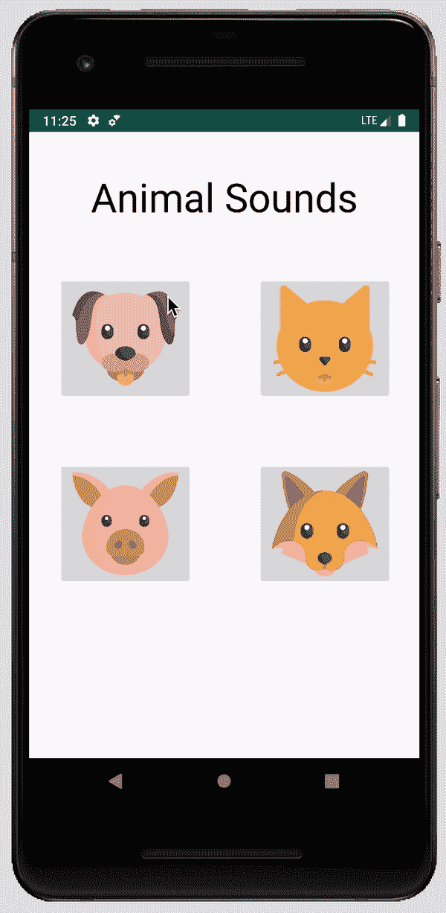
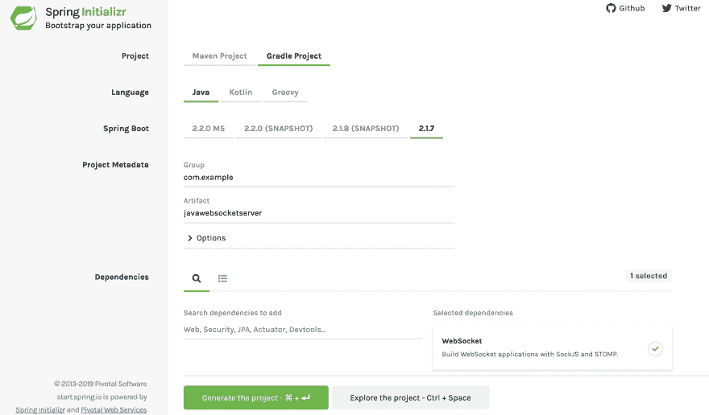
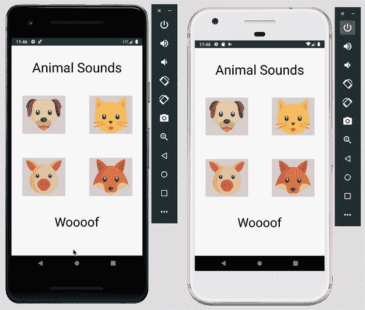

# 基于 Android 和 Spring Boot 的 Java WebSocket 编程

> 原文：<https://dev.to/pubnub/java-websocket-programming-with-android-and-spring-boot-3eag>

[WebSocket 协议](https://www.pubnub.com/blog/websockets-vs-rest-api-understanding-the-difference/?utm_source=Syndication&utm_medium=DevTo&utm_campaign=SYN-CY19-Q3-DevTo-August-19)为客户端和服务器之间的双向通信提供了一个永远在线的连接。这对于需要实时连接的应用来说非常棒，比如[多人游戏](https://www.pubnub.com/blog/tag/multiplayer-gaming/?utm_source=Syndication&utm_medium=DevTo&utm_campaign=SYN-CY19-Q3-DevTo-August-19)、[物联网设备](https://www.pubnub.com/blog/tag/internet-of-things/?utm_source=Syndication&utm_medium=DevTo&utm_campaign=SYN-CY19-Q3-DevTo-August-19)和[聊天应用](https://www.pubnub.com/blog/tag/chat/?utm_source=Syndication&utm_medium=DevTo&utm_campaign=SYN-CY19-Q3-DevTo-August-19)。在本教程中，我们将设置一个简单的 Android 客户端，它将使用 [Spring Boot](https://spring.io/projects/spring-boot) 连接到 WebSocket 服务器。

[](https://res.cloudinary.com/practicaldev/image/fetch/s--jUC9qAGn--/c_limit%2Cf_auto%2Cfl_progressive%2Cq_auto%2Cw_880/https://www.pubnub.com/wp-content/uploads/2014/09/WebSockets-Diagram.png)

你可以在 [GitHub 库](https://github.com/ocastroa/java-websocket-demo)中查看完整的项目。

## Android WebSocket 客户端

对于 Android 客户端，我们将制作一个简单的演示应用程序，其中包含四个可爱动物的图像按钮。首先，在 [Android Studio](https://developer.android.com/studio) 上初始化一个新项目，有一个基本活动，叫做 **JavaWebSocketClient** 。我们将为应用程序使用一个轻量级的 WebSocket 客户端库，可以在这个 [repo](https://github.com/gusavila92/java-android-websocket-client) 中找到。为了使用这个库，我们必须将它添加到 app 目录中的 **build.gradle** 文件中。将以下内容添加到依赖项中，并同步项目:

```
dependencies { 
    // Add this
    implementation 'tech.gusavila92:java-android-websocket-client:1.2.2'    
    implementation fileTree(dir: 'libs', include: ['*.jar'])
    ...
} 
```

Enter fullscreen mode Exit fullscreen mode

请确保在清单文件中包含互联网访问权限:

```
<uses-permission android:name="android.permission.INTERNET" /> 
```

Enter fullscreen mode Exit fullscreen mode

### 连接客户端到服务器

进入**MainActivity.java**，导入以下包，设置 **onCreate()** :

```
import android.os.Bundle;
import android.support.v7.app.AppCompatActivity;
import android.util.Log;
import android.view.View;
import android.widget.TextView;
import java.net.URI;
import java.net.URISyntaxException;
import tech.gusavila92.websocketclient.WebSocketClient;

public class MainActivity extends AppCompatActivity {
  private WebSocketClient webSocketClient;

  @Override
  protected void onCreate(Bundle savedInstanceState) {
    super.onCreate(savedInstanceState);
    setContentView(R.layout.animal_sounds);
    createWebSocketClient();
  }
} 
```

Enter fullscreen mode Exit fullscreen mode

接下来，创建一个新方法**createWebSocketClient()**:

```
private void createWebSocketClient() {
    URI uri;
    try {
      // Connect to local host
      uri = new URI("ws://10.0.2.2:8080/websocket");
    }
    catch (URISyntaxException e) {
      e.printStackTrace();
      return;
    }

    webSocketClient = new WebSocketClient(uri) {
      @Override
      public void onOpen() {
        Log.i("WebSocket", "Session is starting");
        webSocketClient.send("Hello World!");
      }

      @Override
      public void onTextReceived(String s) {
        Log.i("WebSocket", "Message received");
        final String message = s;
        runOnUiThread(new Runnable() {
          @Override
          public void run() {
            try{
              TextView textView = findViewById(R.id.animalSound);
              textView.setText(message);
            } catch (Exception e){
                e.printStackTrace();
            }
          }
        });
      }

      @Override
      public void onBinaryReceived(byte[] data) {
      }

      @Override
      public void onPingReceived(byte[] data) {
      }

      @Override
      public void onPongReceived(byte[] data) {
      }

      @Override
      public void onException(Exception e) {
        System.out.println(e.getMessage());
      }

      @Override
      public void onCloseReceived() {
        Log.i("WebSocket", "Closed ");
        System.out.println("onCloseReceived");
      }
    };

    webSocketClient.setConnectTimeout(10000);
    webSocketClient.setReadTimeout(60000);
    webSocketClient.enableAutomaticReconnection(5000);
    webSocketClient.connect();
  } 
```

Enter fullscreen mode Exit fullscreen mode

这可能看起来很多，但实际上，我们正在用这种方法做四件关键的事情:

1.  启动到本地主机" ws://10.0.2.2:8080/websocket "的新连接。
2.  一旦连接打开，就向服务器发送消息。
3.  在应用程序上显示从服务器发送的消息。
4.  设置超时和自动重新连接。

现在我们已经将客户机连接到了服务器，让我们来设置向服务器发送消息的方法。

### 向服务器发送消息

在**MainActivity.java**中，将以下内容添加到 **sendMessage()** :

```
public void sendMessage(View view) {
   Log.i("WebSocket", "Button was clicked");

   // Send button id string to WebSocket Server
   switch(view.getId()){
     case(R.id.dogButton):
       webSocketClient.send("1");
       break;

     case(R.id.catButton):
       webSocketClient.send("2");
       break;

     case(R.id.pigButton):
       webSocketClient.send("3");
       break;

     case(R.id.foxButton):
       webSocketClient.send("4");
       break;
   }
 } 
```

Enter fullscreen mode Exit fullscreen mode

当按钮被按下时，*按钮 id* 被发送到服务器。这个方法是从文件 **animal_sounds.xml** 中调用的，你可以从我的 [Java WebSocket 编程 Repo](https://github.com/ocastroa/java-websocket-demo/blob/master/JavaWebSocketClient/app/src/main/res/layout/animal_sounds.xml) 中得到。确保修改 **values** 目录下的文件 [**strings.xml**](https://github.com/ocastroa/java-websocket-demo/blob/master/JavaWebSocketClient/app/src/main/res/values/strings.xml) ，这样您就不会在 xml 文件中得到任何错误。

客户端最后要做的事情是在 [**可绘制的**](https://github.com/ocastroa/java-websocket-demo/tree/master/JavaWebSocketClient/app/src/main/res/drawable) 目录中添加动物的图片。这些图片由来自 www.flaticon.com 的[的](https://www.flaticon.com/) [Freepik](https://www.flaticon.com/authors/freepik) 制作。

在模拟器中运行 Android 应用程序:

[](https://res.cloudinary.com/practicaldev/image/fetch/s--KHWR72Sn--/c_limit%2Cf_auto%2Cfl_progressive%2Cq_66%2Cw_880/https://www.pubnub.com/wp-content/uploads/2019/08/clicking_buttons_client.gif)

因为服务器没有设置，所以现在什么也没有发生。我们现在就开始吧！

## Spring Boot WebSocket 服务器

对于我们的服务器，我们将使用 Spring Boot，这使得用最少的配置创建生产级的 Spring 应用程序变得容易。为了快速启动我们的项目，我们将使用 [Spring Initializr](https://start.spring.io/) 。我们将生成一个 [Gradle](https://gradle.org/) 项目，但是如果你愿意，你也可以生成一个 [Maven](https://maven.apache.org/) 项目。像下面的截图一样配置 Initializr，并确保添加 WebSocket 作为依赖项:

[](https://res.cloudinary.com/practicaldev/image/fetch/s--nfcea362--/c_limit%2Cf_auto%2Cfl_progressive%2Cq_auto%2Cw_880/https://www.pubnub.com/wp-content/uploads/2019/08/spring_initializr-1.png)

生成项目以下载 zip 文件。解压缩文件后，转到 **src** 目录，继续点击子目录，直到找到**JavaWeBSocketservapp****。java** 文件。

```
package com.example.javawebsocketserver;

import org.springframework.boot.SpringApplication;
import org.springframework.boot.autoconfigure.SpringBootApplication;

@SpringBootApplication
public class JavaWebSocketServerApplication {
  public static void main(String[] args) {
    SpringApplication.run(JavawebsocketserverApplication.class, args);
  }
} 
```

Enter fullscreen mode Exit fullscreen mode

在目录中添加两个文件:**WebSocketHandler.java**和**WebSocketConfiguration.java**。

### 处理 WebSocket 消息

我们必须处理到达服务器的传入消息。为此，在**中，**继承类[**AbstractWebSocketHandler**](https://docs.spring.io/spring/docs/current/javadoc-api/org/springframework/web/socket/handler/AbstractWebSocketHandler.html)来实现方法 **handleTextMessage()** 。将以下代码添加到文件中:

```
package com.server.javawebsocketserver;

import org.springframework.web.socket.TextMessage;
import org.springframework.web.socket.WebSocketSession;
import org.springframework.web.socket.handler.AbstractWebSocketHandler;
import java.io.IOException;

public class WebSocketHandler extends AbstractWebSocketHandler {
    @Override
    protected void handleTextMessage(WebSocketSession session, TextMessage message) throws IOException {
        String msg = String.valueOf(message.getPayload());
        // Send back unique message depending on the id received from the client
        switch(msg){
            case("1"):
                System.out.println("Dog button was pressed");
                session.sendMessage(new TextMessage("Woooof"));
                break;

            case("2"):
                System.out.println("Cat button was pressed");
                session.sendMessage(new TextMessage("Meooow"));
                break;

            case("3"):
                System.out.println("Pig button was pressed");
                session.sendMessage(new TextMessage("Bork Bork"));
                break;

            case("4"):
                System.out.println("Fox button was pressed");
                session.sendMessage(new TextMessage("Fraka-kaka-kaka"));
                break;

            default:
                System.out.println("Connected to Client");
        }
    }
} 
```

Enter fullscreen mode Exit fullscreen mode

在该方法中，我们简单地获取消息有效负载的字符串值，并执行一个 **switch** 表达式，用每个案例的值来检查消息的值。带有动物声音的独特消息被发送给客户端。

### 配置 WebSocket 请求处理

在**中，实现接口[**WebSocketConfigurer**](https://docs.spring.io/spring/docs/current/javadoc-api/org/springframework/web/socket/config/annotation/WebSocketConfigurer.html)并在文件中添加以下代码:** 

```
package com.server.javawebsocketserver;

import org.springframework.context.annotation.Configuration;
import org.springframework.web.socket.config.annotation.EnableWebSocket;
import org.springframework.web.socket.config.annotation.WebSocketConfigurer;
import org.springframework.web.socket.config.annotation.WebSocketHandlerRegistry;

@Configuration
@EnableWebSocket
// Add this annotation to an @Configuration class to configure processing WebSocket requests
public class WebSocketConfiguration implements WebSocketConfigurer {
    @Override
    public void registerWebSocketHandlers(WebSocketHandlerRegistry registry) {
        registry.addHandler(new WebSocketHandler(), "/websocket");
    }
} 
```

Enter fullscreen mode Exit fullscreen mode

我们设置方法**registerWebSocketHandlers**将 [WebSocketHandler](https://docs.spring.io/spring/docs/current/javadoc-api/org/springframework/web/socket/config/annotation/WebSocketHandlerRegistry.html#addHandler-org.springframework.web.socket.WebSocketHandler-java.lang.String...-) 配置到路径“ **/websocket** ”。

这就是服务器端的全部内容。现在我们已经设置好了一切，让我们启动 WebSocket 服务器并运行应用程序！

## 在服务器和客户端之间发送数据

在终端中，转到您的 Spring Boot 项目的根目录，并运行以下命令来启动服务器:

```
gradle bootRun 
```

Enter fullscreen mode Exit fullscreen mode

接下来，在 Android Studio 中运行 Android 客户端，一旦应用程序加载，单击四个按钮中的任何一个。

[](https://res.cloudinary.com/practicaldev/image/fetch/s--mxKM05VI--/c_limit%2Cf_auto%2Cfl_progressive%2Cq_auto%2Cw_880/https://www.pubnub.com/wp-content/uploads/2019/08/client_server_screenshot.png) 
玩玩 Android 应用程序，看看如何使用 WebSockets 将消息从客户端发送到服务器！

## 将 Android 客户端更新为 Pub/Sub

将数据从客户端发送到服务器或从服务器发送到客户端并不困难，而且可以很快完成。但是，如果您想在客户端之间发送数据，该怎么办呢？如果不在服务器上实现一些路由和代理逻辑，就不能直接连接客户机。

我们可以使用几个工具来减少这项任务的耗时。一种这样的工具是[套筒。IO](https://www.pubnub.com/learn/glossary/what-is-socketio/?utm_source=Syndication&utm_medium=DevTo&utm_campaign=SYN-CY19-Q3-DevTo-August-19) ，在客户端之间建立实时的双向连接。这是一个很好的开源工具，但是我们仍然需要设置一个服务器，并将客户端连接到服务器。有没有一种更简单的方法可以在客户端之间安全可靠地发送数据，而无需手动设置服务器？有了 PubNub，我们可以。

[](https://res.cloudinary.com/practicaldev/image/fetch/s--6VVKTa27--/c_limit%2Cf_auto%2Cfl_progressive%2Cq_66%2Cw_880/https://www.pubnub.com/wp-content/uploads/2016/08/pubsub-1.gif)

PubNub 提供了实时基础设施来支持任何使用 TCP 的设备。我们可以使用 [PubNub 的全球数据流网络](https://www.pubnub.com/products/global-data-stream-network/?utm_source=Syndication&utm_medium=DevTo&utm_campaign=SYN-CY19-Q3-DevTo-August-19)在 100 毫秒内从客户端到客户端、客户端到服务器或服务器到客户端传输数据！使用 PubNub，连接到通道的设备之间会建立一个始终在线的连接，类似于 WebSockets。最好的部分是你不必担心设置服务器和维护服务器，因为 PubNub 是[无服务器](https://www.pubnub.com/blog/everything-you-wanted-to-know-about-serverless-but-were-afraid-to-ask/?utm_source=Syndication&utm_medium=DevTo&utm_campaign=SYN-CY19-Q3-DevTo-August-19)的，并且是无限可扩展的。

为了了解 PubNub 如何简化从客户端到客户端发送数据的过程，我们将修改我们之前构建的 Android 应用程序。但是首先，注册一个[免费的 PubNub 账户](https://dashboard.pubnub.com/signup/?utm_source=Syndication&utm_medium=DevTo&utm_campaign=SYN-CY19-Q3-DevTo-August-19)。你可以在[的 PubNub Admin Dashboard](https://admin.pubnub.com/?utm_source=Syndication&utm_medium=DevTo&utm_campaign=SYN-CY19-Q3-DevTo-August-19) 中获得你唯一的 pub/sub 密钥。

### 修改 Android 客户端

为了区分更新的应用程序和旧的应用程序，创建一个名为 **PubNubJavaClient** 的新 Android 项目。为了使用 [PubNub 的 Android SDK](https://www.pubnub.com/docs/android-java/pubnub-java-sdk/?utm_source=Syndication&utm_medium=DevTo&utm_campaign=SYN-CY19-Q3-DevTo-August-19) ，在 app 目录下的 **build.gradle** 文件中添加以下内容并同步项目:

```
dependencies {
    implementation group: 'com.pubnub', name: 'pubnub-gson', version: '4.25.0' // Add this
    implementation fileTree(dir: 'libs', include: ['*.jar'])
    ...
} 
```

Enter fullscreen mode Exit fullscreen mode

包括对清单文件的以下权限:

```
<uses-permission android:name="android.permission.INTERNET" />
<uses-permission android:name="android.permission.ACCESS_NETWORK_STATE" /> 
```

Enter fullscreen mode Exit fullscreen mode

除了 MainActivity.java，其他都一样。从之前的 app 中，添加以下文件到更新后的 app:**[animal _ sounds . XML](https://github.com/ocastroa/java-websocket-demo/blob/master/JavaWebSocketClient/app/src/main/res/layout/animal_sounds.xml)**、 [**strings.xml**](https://github.com/ocastroa/java-websocket-demo/blob/master/JavaWebSocketClient/app/src/main/res/values/strings.xml) 以及 [**drawable**](https://github.com/ocastroa/java-websocket-demo/tree/master/JavaWebSocketClient/app/src/main/res/drawable) 目录中的图片。一旦你完成这个，去**MainActivity.java**添加新的代码。导入以下包并设置 **onCreate()** :

```
import android.support.v7.app.AppCompatActivity;
import android.os.Bundle;
import android.view.View;
import android.widget.TextView;
import com.pubnub.api.PNConfiguration;
import com.pubnub.api.PubNub;
import com.pubnub.api.callbacks.PNCallback;
import com.pubnub.api.callbacks.SubscribeCallback;
import com.pubnub.api.models.consumer.PNPublishResult;
import com.pubnub.api.models.consumer.PNStatus;
import com.pubnub.api.models.consumer.pubsub.PNMessageResult;
import com.pubnub.api.models.consumer.pubsub.PNPresenceEventResult;
import java.util.Arrays;

public class MainActivity extends AppCompatActivity {
  PubNub pubnub;
  TextView textView;

  @Override
  protected void onCreate(Bundle savedInstanceState) {
    super.onCreate(savedInstanceState);
    setContentView(R.layout.animal_sounds);

    initPubNub(); // Initialize PubNub
  } 
```

Enter fullscreen mode Exit fullscreen mode

调用 **initPubNub()** 来初始化 PubNub:

```
public void initPubNub(){
  PNConfiguration pnConfiguration = new PNConfiguration();
  pnConfiguration.setPublishKey("ENTER_YOUR_PUB_KEY"); // REPLACE with your pub key
  pnConfiguration.setSubscribeKey("ENTER_YOUR_SUB_KEY"); // REPLACE with your sub key
  pnConfiguration.setSecure(true);
  pubnub = new PubNub(pnConfiguration);

  // Listen to messages that arrive on the channel
  pubnub.addListener(new SubscribeCallback() {
    @Override
    public void status(PubNub pub, PNStatus status) {
    }

    @Override
    public void message(PubNub pub, final PNMessageResult message) {
      // Replace double quotes with a blank space
      final String msg = message.getMessage().toString().replace("\"", ""); 
      textView = findViewById(R.id.animalSound);

      runOnUiThread(new Runnable() {
        @Override
        public void run() {
          try{
            // Display the message on the app
            textView.setText(msg);
          } catch (Exception e){
              System.out.println("Error");
              e.printStackTrace();
          }
        }
      });
    }

    @Override
    public void presence(PubNub pub, PNPresenceEventResult presence) {
    }
  });

  // Subscribe to the global channel
  pubnub.subscribe()
    .channels(Arrays.asList("global_channel"))
    .execute();
} 
```

Enter fullscreen mode Exit fullscreen mode

在这种方法中，我们做了三件关键的事情:

1.  初始化 PubNub 客户端 API。确保用您的 Pub/Sub 密钥替换“ENTER_YOUR_PUB_KEY”和“ENTER_YOUR_SUB_KEY”。
2.  设置一个侦听器，以便在消息到达通道时得到通知。正如我们之前所做的，在应用程序上显示消息供客户端查看。
3.  订阅将在其中发布消息的全球频道。

当用户按下按钮时，方法 **sendMessage()** 被调用:

```
// This method is called when a button is pressed
public void sendMessage(View view) {
  // Get button ID
  switch(view.getId()){
    case(R.id.dogButton):
      publishMessage("Woooof");
      break;

    case(R.id.catButton):
      publishMessage("Meooow");
      break;

    case(R.id.pigButton):
      publishMessage("Bork Bork");
      break;

    case(R.id.foxButton):
      publishMessage("Fraka-kaka-kaka");
      break;
  }
} 
```

Enter fullscreen mode Exit fullscreen mode

这个方法类似于我们之前所做的，除了现在我们发布实际的消息，动物的声音，到全球频道而不是服务器。我们使用 **publishMessage()** 作为辅助函数来发布消息。

```
public void publishMessage(String animal_sound){
  // Publish message to the global chanel
  pubnub.publish()
    .message(animal_sound)
    .channel("global_channel")
    .async(new PNCallback<PNPublishResult>() {
      @Override
      public void onResponse(PNPublishResult result, PNStatus status) {
        // status.isError() to see if error happened and print status code if error
        if(status.isError()) {
          System.out.println("pub status code: " + status.getStatusCode());
        }
      }
    });
} 
```

Enter fullscreen mode Exit fullscreen mode

这就是我们启动和运行应用程序所需要的一切！

## 客户端之间发送数据

在两个模拟器中运行 Android 应用程序，实时查看消息。

[](https://res.cloudinary.com/practicaldev/image/fetch/s--6GIYKFGT--/c_limit%2Cf_auto%2Cfl_progressive%2Cq_66%2Cw_880/https://www.pubnub.com/wp-content/uploads/2019/08/client_to_client.gif)

既然你已经知道了如何用 Java 的 WebSockets 发送数据，那么一定要看看 Python 的 [Socket 编程](https://www.pubnub.com/blog/socket-programming-in-python-client-server-p2p/?utm_source=Syndication&utm_medium=DevTo&utm_campaign=SYN-CY19-Q3-DevTo-August-19)和 Node.js 的 [WebSocket 编程](https://www.pubnub.com/blog/nodejs-websocket-programming-examples/?utm_source=Syndication&utm_medium=DevTo&utm_campaign=SYN-CY19-Q3-DevTo-August-19)中的其他教程。**