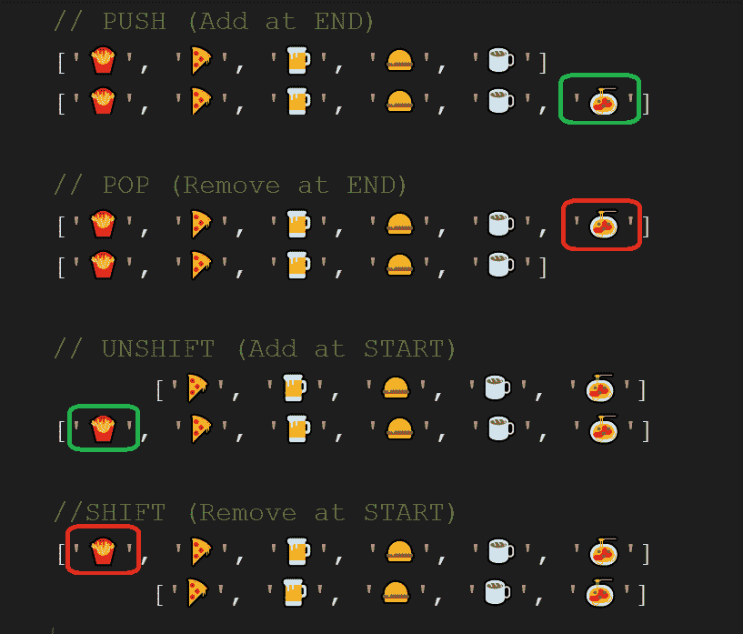

# JavaScript 数组-推送/弹出/移位/取消移位-可视化解释

> 原文：<https://dev.to/imkirusrinivas/javascript-array-push-pop-shift-unshift-visual-explanation-49ee>

JavaScript 数组 push，pop，shift，unshift，带可视化说明。

将元素添加到数组末尾(在末尾添加)
弹出移除数组末尾的元素(在末尾移除)

Unshift -将元素添加到数组的开始处(在开始处添加)
Shift -将元素移除到数组的开始处(在开始处移除)

