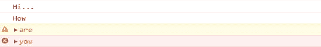
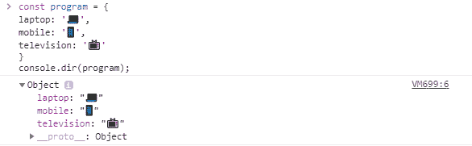
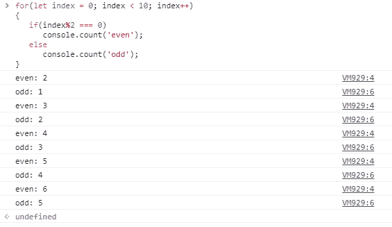
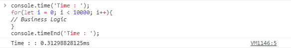
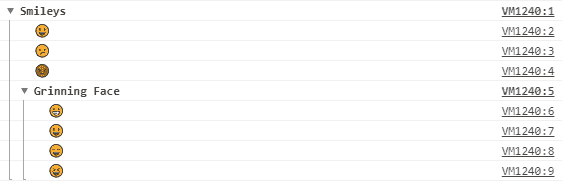

# JavaScript —控制台 API

> 原文：<https://dev.to/vaibhav111tandon/javascript-console-api-3el3>

### JavaScript —控制台 API

[](https://res.cloudinary.com/practicaldev/image/fetch/s--EaUCi9PK--/c_limit%2Cf_auto%2Cfl_progressive%2Cq_auto%2Cw_880/https://cdn-images-1.medium.com/max/1024/1%2Afc6C7DzrvULAfG3GNyWQ8w.png)

控制台 API 是调试时最重要的工具之一。它帮助开发人员，或者更恰当地说，防止开发人员一次又一次地应用 **alert()** 。

控制台 API 可用于:-

*   记录
*   维护
*   清算
*   包括…在内
*   时机
*   分组

让我们从第一个开始，

> **测井**

**console.log()** 是用于将值记录到控制台的最常用方法。

```
const name = "JAVASCRIPT";
console.log("--\> " + name + " \<--"); // --\> JAVASCRIPT \<-- 
```

除了 log()之外，还有一些其他的日志记录方法，比如 info()、warn()和 error。

```
console.log("Hi...");
console.info("How");
console.warn("are");
console.error("you"); 
```

输出看起来有点像这样，

<figure>[](https://res.cloudinary.com/practicaldev/image/fetch/s--4n5fozj3--/c_limit%2Cf_auto%2Cfl_progressive%2Cq_auto%2Cw_880/https://cdn-images-1.medium.com/max/550/1%2Ahbpsi_nY7P8wfWQ50ojHOw.png) 

<figcaption>输出以上代码</figcaption>

</figure>

现在，可以使用 trace()
来触发堆栈跟踪

```
function hello(name = 'JAVASCRIPT') {
 console.trace(name); 
 return `${name}! is a programming language`; 
}
hello(); 
```

还有 console.dir()、console.dirxml()和 console.debug()

**console.dir()**

```
const program = {
laptop: '💻',
mobile: '📱',
television: '📺'
}

console.dir(program); 
```

它主要用于以格式化的方式打印对象

<figure>[](https://res.cloudinary.com/practicaldev/image/fetch/s--yK0nFITx--/c_limit%2Cf_auto%2Cfl_progressive%2Cq_auto%2Cw_880/https://cdn-images-1.medium.com/max/586/1%2AYxe2zIAP8TZj7I6lfzw8zQ.png) 

<figcaption>输出为以上代码</figcaption>

</figure>

**console.dirxml()** 用于打印 DOM 元素。

**console.debug()** 只是 console.log()的别名。

> 维护

console.assert()用于执行断言测试。

```
console.assert('📺' == '2', 'No it is not equal');
// Output : No it is not equal 
```

> 清洁

如果您想要清除控制台，那么使用这个 console.clear()。

> 包括…在内

console.count()用于统计特定语句被调用的次数。

```
for(let index = 0; index \< 10; index++)
{
 if(index%2 === 0)
 console.count('even');
 else
 console.count('odd');
} 
```

输出:

<figure>[](https://res.cloudinary.com/practicaldev/image/fetch/s--zJuFj4tK--/c_limit%2Cf_auto%2Cfl_progressive%2Cq_auto%2Cw_880/https://cdn-images-1.medium.com/max/565/1%2Ajh0IBFvmDhIQIIyWiwkQdQ.png) 

<figcaption>输出以上代码</figcaption>

</figure>

> 时机

console 对象具有 time()和 timeEnd()方法，有助于分析代码片段的性能。首先通过提供一个字符串参数调用 console.time()，然后是要测试的代码，最后用相同的字符串参数调用 console.timeEnd()。

```
console.time('Time : ');

for(let i = 0; i \< 10000; i++){
// Business Logic
}

console.timeEnd('Time : '); 
```

输出:

<figure>[](https://res.cloudinary.com/practicaldev/image/fetch/s--CrK22fpl--/c_limit%2Cf_auto%2Cfl_progressive%2Cq_auto%2Cw_880/https://cdn-images-1.medium.com/max/585/1%2AgJtIYSz1vyDt6JfhSkhu3Q.png) 

<figcaption>输出以上代码</figcaption>

</figure>

在 time()和 timeEnd()内传递的字符串应该始终相同。

> 分组

console.group()和 console.groupEnd()用于将控制台消息分组为

```
console.group('Smileys');
console.log('😃');
console.log('😕');
console.log('😡');
console.group('Grinning Face');
console.log('😀');
console.log('😃');
console.log('😄');
console.log('😆');
console.groupEnd();
console.groupEnd(); 
```

输出:

[](https://res.cloudinary.com/practicaldev/image/fetch/s--CFC2sQlN--/c_limit%2Cf_auto%2Cfl_progressive%2Cq_auto%2Cw_880/https://cdn-images-1.medium.com/max/562/1%2AIyGbJW1KP-12AJJkpWsK6Q.png)

这些是 Javascript 控制台 API 的一些方法。

如果你喜欢这个帖子，就按支持我👏。

谢谢你