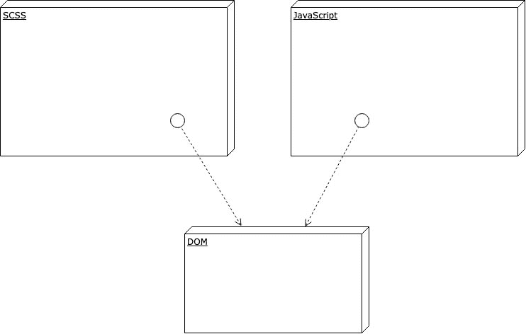
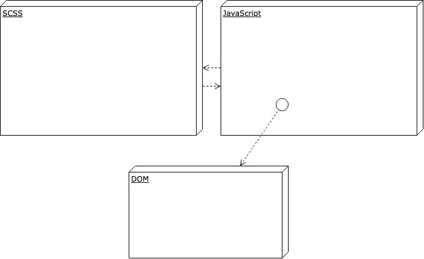

# 🎩JavaScript 增强的 Scss mixins！🎩解释的概念

> 原文：<https://dev.to/adam_cyclones/javascript-enhanced-scss-mixins-concepts-explained-3mpo>

在下一篇文章中，我们将探索 CSS @apply 来增强我们在这里讨论的内容。已弃用的建议:(

### 传统 Web 开发流程

传统上，我们使用 css 来设计网页样式，然后用 JavaScript 添加更多样式，这通常是通过添加任意类作为中介来实现的。

除了样式之外，我们还在 JavaScript 中创建了业务逻辑和其他一些东西。关注点的分离掩盖了这样一个事实，即 JavaScript 确实设计了应用程序的样式，这项工作原本是为 css 和 css 单独设计的。

css 确实有一些疯狂的能力，在某种程度上可以和 JavaScript 一样好(真正聪明的东西需要预处理器)，但通常 JavaScript 有基于 css 的更强大的 API，我说的是[胡迪尼](https://github.com/w3c/css-houdini-drafts/wiki/specs)，[网络动画 API](https://developer.mozilla.org/en-US/docs/Web/API/Web_Animations_API/Using_the_Web_Animations_API) ，[匹配媒体——也就是 JavaScript 的媒体查询](https://developer.mozilla.org/en-US/docs/Web/API/Window/matchMedia)等等。

所以传统模型看起来有点像这样。

[](https://res.cloudinary.com/practicaldev/image/fetch/s--FJutE3Vd--/c_limit%2Cf_auto%2Cfl_progressive%2Cq_auto%2Cw_880/https://thepracticaldev.s3.amazonaws.com/i/ptuqv66xo0txrwwn9ju8.jpg)

CSS 与 dom 对话，JavaScript 与 dom 对话，JavaScript 添加了更多的类或样式，CSS 准备好处理状态更改，因为它是为了处理将来时而创作的，但实际发生的只是 JS 更改了 dom，如果你想想，这有点低效，你的 CSS 中的所有潜在状态，可能永远不会与用户交互。

### JavaScript 增强版 Sass

所以这种技术还没有一个名字，我称之为(Jess，JavaScript enhanced stylesheet)，事实上它是一种模式，并不真正与 sass 联系在一起，但它可以在任何预处理器中完成，甚至可能应该编写一个新的工具，这是一个范式的转变，这就是为什么我很兴奋。

CSS 变量/自定义属性已经很出色了，我过去常常想，我用 sass，我不需要 CSS 变量，但它们是非常不同的东西，如果你这样想，就不要想了。CSS 变量是动态的，就像在你的 devtools 中改变它们并看到它们更新你的 hole UI 一样。实际上，你不再是在一个变量中设计元素和类的样式。但是我们能更进一步吗？

答案当然是肯定的，我们实际上可以在 JavaScript 中直接获取和设置 CSS 变量，这意味着一些事情，首先 CSS 不再处理未来时态状态的变化，它是实时的，由 JavaScript 事件触发，例如，CSS 值可以更新到滚动位置。厉害！现在 JavaScript 已经完全控制了 CSS 和 Dom。但是如果有一种模式可以用 JavaScript 的能力来增强 CSS 呢？如果 CSS 如此透明地控制 JavaScript 的样式逻辑，以至于您可以清楚地看到关注点的分离，会怎么样？

我说的是反转流程，这样 CSS 就可以调用 JavaScript 并在风格上影响 dom(或者用 JavaScript 做任何事情，包括使用我前面提到的更强大的 API)

```
button {
    // Allows only focus outline on keys
    @include fucus(no-click);
} 
```

Enter fullscreen mode Exit fullscreen mode

然后，mixin 把任务交给了 JavaScript 🧙‍♂️

[](https://res.cloudinary.com/practicaldev/image/fetch/s--AJ77-eJe--/c_limit%2Cf_auto%2Cfl_progressive%2Cq_auto%2Cw_880/https://thepracticaldev.s3.amazonaws.com/i/t5wlas8zbi7vpf6dzyal.jpg)

已经有可能通过简单的 scss 混合功能方便地实现。这个想法很简单。创建一个 mixin 来捕获它所使用的选择器，然后这个选择器被提供给一个生成的 CSS 变量`--#{key}: .my-selector;`，这里 key 需要是惟一的，因为这样我们就可以在`:root`存储更多的变量，而不会意外地覆盖先前调用的 mixin，也就是说我们希望不止一次地使用 mixin。使用`random(9*9*9*9)`生成一个 scss guid，这是一个非常大的数字，重复的几率非常非常低。所以我们现在在`:root`上有了这个随机 guid，其中包含值，mixin 调用者的选择器。接下来，我们用一个 guid 抓取 CSS 变量的根，嘿，很快我们就可以使用这个选择器遍历并更改元素了。

如果您想看到这种工作方式，请查看本系列的其余部分，深入研究代码，看看有什么不同。