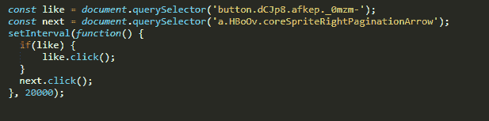

# JavaScript INSTAGRAM bot

> 原文：<https://dev.to/danijelajs/javascript-instagram-bot-3nmk>

你懂一点点 **JavaScript** ，想在 Instagram 上建立你的 following，但又不想把密码分享给某个 app，又不懂 BackEnd？！别担心，我有你的家人！😁

我将向你展示如何建立你的个人 instagram“机器人”😁

1.  首先，在新标签页打开 Instagram，登录，然后输入你想要的标签，打开第一张图片。

2.  现在，您将检查❤️按钮，浏览器控制台将打开，您将看到按钮的类。通常你得用二等或三等。

3.  打开控制台。像一样创建一个名为**的变量，对箭头分页➡️做同样的操作，调用变量 **next** 。使用**查询选择器**访问按钮元素和分页。**

4.  现在使用 **setInterval** 方法。

5.  使用 if 语句，如果有 like 按钮，则为该按钮添加一个 click 事件。然后为分页添加另一个单击事件。

6.  因为 Instagram 喜欢封禁有“奇怪”活动的账号，所以把间隔设为 15-20 秒。瞧！

你现在有了你的个人机器人，而不需要“共享”你的密码。你可以用它来关注 instagram 或其他社交媒体上的人。看你的了！

顺便说一句，我不知道这是否归类为机器人，但它会有所帮助😁