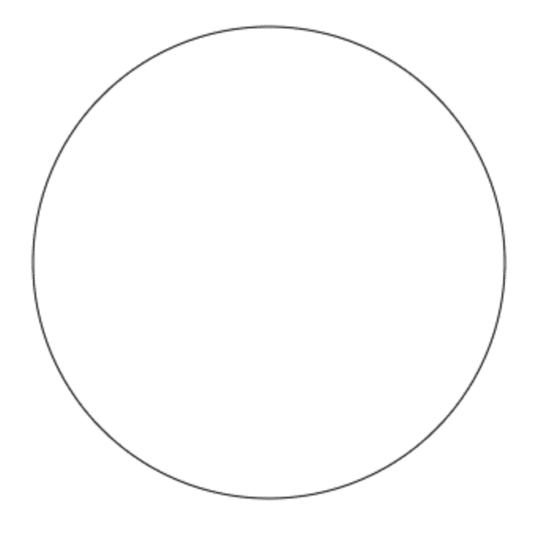

# Javascript 从头学习-00002

> 原文：<https://dev.to/deliaslan/javascript-learning-from-scratch-00002-4mp5>

变量

var 圆= 40；

椭圆(100，100，圆，圆)；

# 如果椭圆的宽度和高度大小相同，那么它就是一个圆。

# 椭圆函数的高度和宽度值相等时，得到一个圆。

||||||||||||||||||||||||||||||||||||||||||