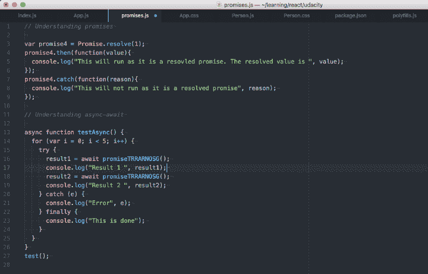
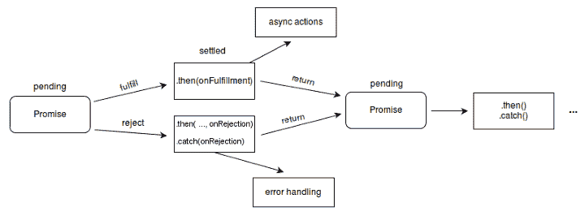

# JavaScript:承诺还是异步等待？

> 原文：<https://dev.to/nkgokul/javascript-promises-or-async-await-2a7m>

* * *

我最近读了一篇中型文章，作者声称使用 async-await 比使用 promises 更好。

虽然这在一般情况下可能是正确的，但我认为这种概括太宽泛了，对 async-await 或 promises 都不公平。对于 JavaScript 新手来说，理解这些并决定使用哪一个可能是一个挑战。在这篇文章中，我将列出我学到的关于这些的东西，以及我如何决定何时使用它们。
我在某处读到 async-await 是使用承诺的语法糖。因此，在了解 async-await 或决定使用哪种方法之前，请确保您对承诺有很好的理解。
以下是我遵循的一些经验法则。

* * *

### 使用承诺的经验法则

 
来源:MDN

1.  每当使用异步或阻塞代码时，都要使用承诺。将贴图解析为 then，拒绝贴图以捕捉所有实际用途。
2.  确保为所有的承诺都编写了`.catch`和`.then`方法。
3.  如果在两种情况下都需要做些什么，使用`.finally`。
4.  我们只有一次机会改变每个承诺。
5.  我们可以为一个承诺添加多个处理程序。
6.  Promise 对象中所有方法的返回类型，不管它们是静态方法还是原型方法，都是 Promise。
7.  在`Promise.all`中，承诺的顺序保持在 values 变量中，不管哪个承诺首先被解决。

一旦你对承诺有了概念，看看 async-await。它有助于您编写可读性更好的代码。如果使用不当，它也有不好的一面。

* * *

### 异步等待的经验法则

下面是我在使用 async 和 await 时用来保持理智的经验法则列表。

1.  `async`函数返回一个承诺。
2.  函数使用隐式承诺来返回结果。即使你没有明确地返回一个承诺，异步函数也会确保你的代码通过一个承诺传递。
3.  `await`阻止异步函数中的代码执行，它(await 语句)是异步函数的一部分。
4.  在一个异步函数中可以有多个`await`语句。
5.  当使用`async await`时，确保使用 try catch 进行错误处理。
6.  在循环和迭代器中使用 await 时要格外小心。您可能会陷入编写顺序执行代码的陷阱，而这本来可以很容易地并行完成。
7.  `await`永远是为了一个承诺。
8.  承诺创建启动异步功能的执行。await 只阻塞异步函数中的代码执行。它只确保在承诺解析时执行下一行。因此，如果一个异步活动已经开始，await 将不会对它产生任何影响。

* * *

### 我应该使用承诺还是异步等待

答案是我们会两者并用。

以下是我用来决定何时使用承诺以及何时使用异步等待的经验法则。

1.  async `function`返回一个承诺。反之亦然。每一个返回承诺的函数都可以被认为是异步函数。
2.  `await`用于调用一个异步函数，并等待其解析或拒绝。await 阻止代码在其所在的异步函数中执行。
3.  如果函数 2 的输出依赖于函数 1 的输出，我使用 await。
4.  如果两个函数可以并行运行，那么创建两个不同的异步函数，然后并行运行它们。
5.  要并行运行承诺，创建一个承诺数组，然后使用`Promise.all(promisesArray)`。
6.  每次你使用`await`的时候，记住你正在写阻塞代码。随着时间的推移，我们往往会忽略这一点。
7.  与其创建包含许多 await `asyncFunction()`的大型异步函数，不如创建较小的异步函数。这样，我们会意识到不要写太多的阻塞代码。
8.  使用更小的`async`函数的另一个好处是，你可以强迫自己思考哪些`async`函数可以并行运行。
9.  如果您的代码包含阻塞代码，最好使它成为异步函数。通过这样做，您可以确保其他人可以异步使用您的函数。
10.  通过从阻塞代码中创建异步函数，用户(将调用您的函数)可以决定他们想要的异步级别。

我希望这有助于您决定何时使用 promises，何时使用 async-await。