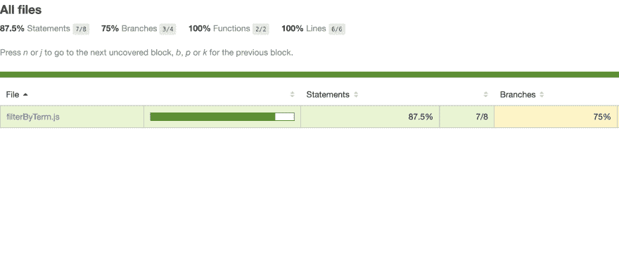
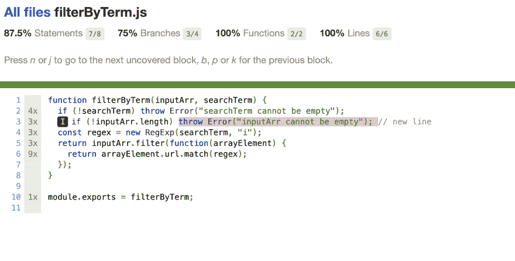

# Jest 初学者教程:JavaScript 测试 Jest 入门

> 原文：<https://dev.to/valentinogagliardi/jest-tutorial-for-beginners-getting-started-with-jest-for-javascript-testing-e6c>

**刚刚越过 dev.to 上的 5k follower！谢谢大家！多么神奇的社区啊！谁也在推特上？下面连线= > [我在这里](https://twitter.com/gagliardi_vale)** 。

*什么是测试？如何用 Jest 测试 JavaScript 代码？用这个 Jest 教程学习测试 JavaScript 的基础知识吧！*

## 什么叫检测？

在技术术语中**测试意味着检查我们的代码是否满足某些期望**。例如:给定一些**输入**，一个名为“transformer”的函数应该返回**期望输出**。

测试有很多种，很快你就会被术语淹没，但是长话短说**测试分为三大类**:

*   **单元测试**
*   **集成测试**
*   **UI 测试**

在这个 Jest 教程中，我们将只讨论**单元测试**，但是在文章的最后你会找到其他类型测试的参考资料。

## Jest 教程:Jest 是什么？

[Jest](https://jestjs.io/) 是 JavaScript test runner，即用于创建、**运行**、**结构化测试**的 JavaScript 库。Jest 以 NPM 包的形式发布，你可以将它安装在任何 JavaScript 项目中。Jest 是目前最受欢迎的测试运行程序之一，也是 Create React 应用程序的默认选择。

## 首先:我怎么知道要考什么？

当涉及到**测试**时，即使是一个简单的代码块也可能让初学者陷入瘫痪。最常见的问题是**“我怎么知道要测试什么？”**。如果你正在编写一个 web 应用程序，测试应用程序的每一页和每一次用户交互是一个很好的起点。但是网络应用程序也是由像功能和模块这样的**代码单元构成的**，它们也需要被测试。大多数时候有两种情况:

*   你继承了**遗留代码**，它来自**，没有经过测试**
*   你必须**凭空实现一个新功能**

怎么办？对于这两种情况，你都可以把**测试**想象成**检查给定函数是否产生预期结果**的代码片段。下面是一个典型的测试流程:

1.  导入要测试的函数
2.  给函数一个**输入**
3.  **定义期望**输出的内容
4.  **检查功能是否产生预期输出**

真的，就是这样。如果你用这些术语来思考，测试就不再可怕了:**输入-预期输出-断言结果**。一分钟后，我们还将看到一个方便的工具，几乎可以准确地检查要测试的内容。现在手放在笑话上！

## Jest 教程:设置项目

与每个 JavaScript 项目一样，您需要一个 NPM 环境(确保您的系统上安装了 Node)。创建一个新文件夹，并用
初始化项目

```
mkdir getting-started-with-jest && cd $_
npm init -y 
```

Enter fullscreen mode Exit fullscreen mode

接下来安装 Jest 用:

```
npm i jest --save-dev 
```

Enter fullscreen mode Exit fullscreen mode

让我们也配置一个 NPM 脚本来从命令行运行我们的测试。打开 **package.json** ，配置名为“test”的脚本运行 Jest:

```
 "scripts":  {  "test":  "jest"  }, 
```

Enter fullscreen mode Exit fullscreen mode

你可以走了！

## Jest 教程:规范和测试驱动开发

作为开发者，我们都喜欢创造力和自由。但是当涉及到严肃的事情时，大多数时候你就没有那么多特权了。通常情况下，我们必须遵循**规范**，也就是说，一个**书面或口头描述要构建什么**。

在本教程中，我们从项目经理那里得到了一个相当简单的规范。一个超级重要的客户端需要一个 **JavaScript 函数来过滤一组对象。**

对于每个对象，我们必须检查一个名为“url”和**的属性，如果属性值匹配给定的术语**，那么我们应该**将匹配的对象包含在结果数组**中。作为一名精通测试的 JavaScript 开发人员，你想要遵循**的测试驱动开发**，这是一门强制**在开始编码**之前写一个失败测试的学科。

默认情况下，Jest 希望在项目文件夹中的一个名为 ****tests**** 的文件夹中找到测试文件。然后创建新文件夹:

```
cd getting-started-with-jest
mkdir __tests__ 
```

Enter fullscreen mode Exit fullscreen mode

接下来在 ****测试**** 中创建一个名为 **filterByTerm.spec.js** 的新文件。您可能想知道为什么扩展名包含“. spec”。这是从 Ruby 借鉴来的一个惯例，用于将文件标记为给定功能的**规范**。

现在让我们开始测试吧！

## Jest 教程:测试结构和第一个失败的测试

是时候创建你的第一个笑话测试了。打开 **filterByTerm.spec.js** 并创建一个测试块:

```
describe("Filter function", () => {
  // test stuff
}); 
```

Enter fullscreen mode Exit fullscreen mode

我们的第一个朋友是 **describe** ，一个包含一个或多个相关测试的 Jest 方法。每当你开始为一个功能编写一套新的测试时，将它包装在一个**描述**块中。如您所见，它有两个参数:一个描述测试套件的字符串和一个包装实际测试的回调函数。

接下来，我们将遇到另一个名为 **test** 的函数，它是实际的测试块:

```
describe("Filter function", () => {
  test("it should filter by a search term (link)", () => {
    // actual test
  });
}); 
```

Enter fullscreen mode Exit fullscreen mode

至此，我们已经准备好编写测试了。记住，测试是关于**输入、功能和预期输出**的事情。首先让我们定义一个简单的输入，一个对象数组:

```
describe("Filter function", () => {
  test("it should filter by a search term (link)", () => {
    const input = [
      { id: 1, url: "https://www.url1.dev" },
      { id: 2, url: "https://www.url2.dev" },
      { id: 3, url: "https://www.link3.dev" }
    ];
  });
}); 
```

Enter fullscreen mode Exit fullscreen mode

接下来，我们将定义**预期结果**。根据规范，测试中的**函数应该忽略那些 url 属性与给定的搜索词不匹配的对象。**例如，我们可以期待一个只有一个对象的数组，给定“link”作为搜索词:

```
describe("Filter function", () => {
  test("it should filter by a search term (link)", () => {
    const input = [
      { id: 1, url: "https://www.url1.dev" },
      { id: 2, url: "https://www.url2.dev" },
      { id: 3, url: "https://www.link3.dev" }
    ];

    const output = [{ id: 3, url: "https://www.link3.dev" }];
  });
}); 
```

Enter fullscreen mode Exit fullscreen mode

现在我们准备编写实际的测试。我们将使用 **expect** 和 Jest **matcher** 来检查我们虚构的(目前)函数在被调用时是否返回预期的结果。下面是测试:

```
expect(filterByTerm(input, "link")).toEqual(output); 
```

Enter fullscreen mode Exit fullscreen mode

为了进一步分解，下面是如何在代码中调用函数:

```
filterByTerm(inputArr, "link"); 
```

Enter fullscreen mode Exit fullscreen mode

在 Jest 测试中，你应该将函数调用封装在 **expect** 中，它与一个**匹配器**(一个用于检查输出的 Jest 函数)一起进行实际的测试。下面是完整的测试:

```
describe("Filter function", () => {
  test("it should filter by a search term (link)", () => {
    const input = [
      { id: 1, url: "https://www.url1.dev" },
      { id: 2, url: "https://www.url2.dev" },
      { id: 3, url: "https://www.link3.dev" }
    ];

    const output = [{ id: 3, url: "https://www.link3.dev" }];

    expect(filterByTerm(input, "link")).toEqual(output);

  });
}); 
```

Enter fullscreen mode Exit fullscreen mode

(要了解更多关于 Jest matchers 的信息，请查看[文档](https://jestjs.io/docs/en/getting-started))。

此时，您可以尝试使用:

```
npm test 
```

Enter fullscreen mode Exit fullscreen mode

您将看到测试失败的场景:

```
 FAIL  __tests__/filterByTerm.spec.js
  Filter function
    ✕ it should filter by a search term (2ms)

  ● Filter function › it should filter by a search term (link)

    ReferenceError: filterByTerm is not defined

       9 |     const output = [{ id: 3, url: "https://www.link3.dev" }];
      10 | 
    > 11 |     expect(filterByTerm(input, "link")).toEqual(output);
         |     ^
      12 |   });
      13 | });
      14 | 
```

Enter fullscreen mode Exit fullscreen mode

ReferenceError: filterByTerm 未定义。这实际上是一件好事。让我们在下一节中修复它！

## Jest 教程:修复测试(并再次破坏)

真正缺少的是 **filterByTerm** 的实现。为了方便起见，我们将在测试所在的同一个文件中创建函数。在一个**真实项目中，你将在另一个文件中定义函数，并从测试文件**中导入它。

为了通过测试，我们将使用一个名为 **[filter](https://developer.mozilla.org/en-US/docs/Web/JavaScript/Reference/Global_Objects/Array/filter)** 的本地 JavaScript 函数，它能够从数组中过滤出元素。下面是 **filterByTerm** :
的一个最小实现

```
function filterByTerm(inputArr, searchTerm) {
  return inputArr.filter(function(arrayElement) {
    return arrayElement.url.match(searchTerm);
  });
} 
```

Enter fullscreen mode Exit fullscreen mode

它是这样工作的:对于输入数组的每个元素，我们检查“url”属性，用 **[match](https://developer.mozilla.org/en-US/docs/Web/JavaScript/Reference/Global_Objects/String/match)** 方法将它与正则表达式进行匹配。下面是完整的代码:

```
function filterByTerm(inputArr, searchTerm) {
  return inputArr.filter(function(arrayElement) {
    return arrayElement.url.match(searchTerm);
  });
}

describe("Filter function", () => {
  test("it should filter by a search term (link)", () => {
    const input = [
      { id: 1, url: "https://www.url1.dev" },
      { id: 2, url: "https://www.url2.dev" },
      { id: 3, url: "https://www.link3.dev" }
    ];

    const output = [{ id: 3, url: "https://www.link3.dev" }];

    expect(filterByTerm(input, "link")).toEqual(output);
  });
}); 
```

Enter fullscreen mode Exit fullscreen mode

现在再次运行测试:

```
npm test 
```

Enter fullscreen mode Exit fullscreen mode

看着它过去！

```
 PASS  __tests__/filterByTerm.spec.js
  Filter function
    ✓ it should filter by a search term (link) (4ms)

Test Suites: 1 passed, 1 total
Tests:       1 passed, 1 total
Snapshots:   0 total
Time:        0.836s, estimated 1s 
```

Enter fullscreen mode Exit fullscreen mode

干得好。但是我们测试完了吗？还没有。怎样才能让我们的功能失效？。让我们用一个大写的搜索词来强调这个函数:

```
function filterByTerm(inputArr, searchTerm) {
  return inputArr.filter(function(arrayElement) {
    return arrayElement.url.match(searchTerm);
  });
}

describe("Filter function", () => {
  test("it should filter by a search term (link)", () => {
    const input = [
      { id: 1, url: "https://www.url1.dev" },
      { id: 2, url: "https://www.url2.dev" },
      { id: 3, url: "https://www.link3.dev" }
    ];

    const output = [{ id: 3, url: "https://www.link3.dev" }];

    expect(filterByTerm(input, "link")).toEqual(output);

    expect(filterByTerm(input, "LINK")).toEqual(output); // New test

  });
}); 
```

Enter fullscreen mode Exit fullscreen mode

运行测试...它将会失败。是时候再次修复它了！

## Jest 教程:修复大写测试

**filterByTerm** 也应该考虑大写的搜索词。换句话说，它应该返回匹配的对象，即使搜索词是一个大写字符串:

```
filterByTerm(inputArr, "link");
filterByTerm(inputArr, "LINK"); 
```

Enter fullscreen mode Exit fullscreen mode

为了测试这个条件，我们引入了一个新的测试:

```
expect(filterByTerm(input, "LINK")).toEqual(output); // New test 
```

Enter fullscreen mode Exit fullscreen mode

为了让它通过，我们可以调整提供给 **match** :
的正则表达式

```
//
    return arrayElement.url.match(searchTerm);
// 
```

Enter fullscreen mode Exit fullscreen mode

我们可以构造一个**不区分大小写的正则表达式**，而不是直接传递 searchTerm，也就是说，一个不考虑字符串大小写的匹配表达式。修复方法如下:

```
function filterByTerm(inputArr, searchTerm) {
  const regex = new RegExp(searchTerm, "i");
  return inputArr.filter(function(arrayElement) {
    return arrayElement.url.match(regex);
  });
} 
```

Enter fullscreen mode Exit fullscreen mode

下面是完整的测试:

```
describe("Filter function", () => {
  test("it should filter by a search term (link)", () => {
    const input = [
      { id: 1, url: "https://www.url1.dev" },
      { id: 2, url: "https://www.url2.dev" },
      { id: 3, url: "https://www.link3.dev" }
    ];

    const output = [{ id: 3, url: "https://www.link3.dev" }];

    expect(filterByTerm(input, "link")).toEqual(output);

    expect(filterByTerm(input, "LINK")).toEqual(output);
  });
});

function filterByTerm(inputArr, searchTerm) {
  const regex = new RegExp(searchTerm, "i");
  return inputArr.filter(function(arrayElement) {
    return arrayElement.url.match(regex);
  });
} 
```

Enter fullscreen mode Exit fullscreen mode

再运行一次，看它是否通过。干得好！作为一个**练习，您编写两个新的测试**并检查以下条件:

1.  测试搜索词“uRl”
2.  测试**空搜索词**。函数应该如何处理？

你将如何组织这些新的测试？

在下一节中，我们将看到测试中的另一个重要主题:**代码覆盖率**。

## Jest 教程:代码覆盖

什么是**代码覆盖率**？在谈论它之前，让我们对代码做一个快速调整。在项目根目录下创建一个名为 **src** 的新文件夹，并创建一个名为 **filterByTerm.js** 的文件，我们将在其中放置并**导出**我们的函数:

```
mkdir src && cd _$
touch filterByTerm.js 
```

Enter fullscreen mode Exit fullscreen mode

这里是文件 **filterByTerm.js** :

```
function filterByTerm(inputArr, searchTerm) {
  if (!searchTerm) throw Error("searchTerm cannot be empty");
  const regex = new RegExp(searchTerm, "i");
  return inputArr.filter(function(arrayElement) {
    return arrayElement.url.match(regex);
  });
}

module.exports = filterByTerm; 
```

Enter fullscreen mode Exit fullscreen mode

现在让我们假设我是你的新同事。我对测试一无所知，我没有询问更多的上下文，而是直接在函数中添加了一个新的 **if 语句** :

```
function filterByTerm(inputArr, searchTerm) {
  if (!searchTerm) throw Error("searchTerm cannot be empty");
  if (!inputArr.length) throw Error("inputArr cannot be empty"); // new line
  const regex = new RegExp(searchTerm, "i");
  return inputArr.filter(function(arrayElement) {
    return arrayElement.url.match(regex);
  });
}

module.exports = filterByTerm; 
```

Enter fullscreen mode Exit fullscreen mode

filterByTerm 中有一行新代码，似乎不会进行测试。除非我告诉你“有一个新的语句要测试”，否则你不会确切地知道在我们的函数中要测试什么。几乎不可能想象出我们的代码可以采用的所有路径，因此**需要一种工具来帮助发现这些盲点**。

这个工具叫做**代码覆盖**，它是我们工具箱中的一个强大工具。 **Jest 内置了代码覆盖率**，你可以通过两种方式激活它:

1.  通过命令行传递标记“- coverage”
2.  通过在 package.json 中配置 Jest

在运行覆盖测试之前，确保**在 ****测试**/filter byterm . spec . js**:
中导入 filterByTerm**

```
const filterByTerm = require("../src/filterByTerm");
// ... 
```

Enter fullscreen mode Exit fullscreen mode

保存文件并运行覆盖率测试:

```
npm test -- --coverage 
```

Enter fullscreen mode Exit fullscreen mode

下面是你得到的:

```
 PASS  __tests__/filterByTerm.spec.js
  Filter function
    ✓ it should filter by a search term (link) (3ms)
    ✓ it should filter by a search term (uRl) (1ms)
    ✓ it should throw when searchTerm is empty string (2ms)

----------------------|----------|----------|----------|----------|-------------------|
File             |  % Stmts | % Branch |  % Funcs |  % Lines | Uncovered Line #s |
----------------------|----------|----------|----------|----------|-------------------|
All files        |     87.5 |       75 |      100 |      100 |                   |
 filterByTerm.js |     87.5 |       75 |      100 |      100 |                 3 |
----------------------|----------|----------|----------|----------|-------------------|
Test Suites: 1 passed, 1 total
Tests:       3 passed, 3 total 
```

Enter fullscreen mode Exit fullscreen mode

对我们函数的测试覆盖率的一个很好的总结。如你所见**线 3 未被覆盖**。通过测试我添加的新语句，尝试达到 100%的代码覆盖率。

如果你想保持代码覆盖率始终活跃，在 **package.json** 中配置 Jest，如下:

```
 "scripts":  {  "test":  "jest"  },  "jest":  {  "collectCoverage":  true  }, 
```

Enter fullscreen mode Exit fullscreen mode

您也可以将标志传递给测试脚本:

```
 "scripts":  {  "test":  "jest --coverage"  }, 
```

Enter fullscreen mode Exit fullscreen mode

如果你是一个视觉型的人，也有一种方法可以得到代码覆盖率的 HTML 报告，就像配置 Jest 一样简单:

```
 "scripts":  {  "test":  "jest"  },  "jest":  {  "collectCoverage":  true,  "coverageReporters":  ["html"]  }, 
```

Enter fullscreen mode Exit fullscreen mode

现在，每次运行 npm 测试时，您都可以访问项目文件夹中一个名为 **coverage** 的新文件夹:**getting-started-with-jest/coverage/**。在这个文件夹中，你会发现一堆文件，其中 **/coverage/index.html** 是你的代码覆盖率的完整 html 摘要:

[](https://res.cloudinary.com/practicaldev/image/fetch/s--6-bg0FuA--/c_limit%2Cf_auto%2Cfl_progressive%2Cq_auto%2Cw_880/https://thepracticaldev.s3.amazonaws.com/i/g7qyq5x65m6ndzczn57n.png)

如果您单击函数名，您还会看到确切的未测试代码行:

[](https://res.cloudinary.com/practicaldev/image/fetch/s--bdDS954b--/c_limit%2Cf_auto%2Cfl_progressive%2Cq_auto%2Cw_880/https://thepracticaldev.s3.amazonaws.com/i/oqmfwqfuk33h20fcctr7.png)

整洁不是吗？有了代码覆盖率，当你有疑问时，你可以发现测试什么。

## Jest 教程:如何测试 React？

**React** 是一个超级流行的 JavaScript 库，用于创建动态用户界面。Jest 可以流畅地测试 React 应用(Jest 和 React 都来自脸书的工程师)。Jest 也是 Create React App 中默认的测试运行器。

如果你想学习如何测试 React 组件，看看 **[测试 React 组件:最权威的指南](https://www.valentinog.com/blog/testing-react/)** 。该指南涵盖了**单元测试组件**、类组件、**带挂钩的功能组件**，以及新的 Act API。

## 结论(何去何从)

测试是一个大而有趣的话题。有许多类型的测试和许多用于测试的库。在这个 Jest 教程**中，你学习了**如何为覆盖率报告配置 Jest，如何组织和编写一个简单的**单元测试**，以及如何测试 JavaScript 代码。

要了解更多关于 UI 测试的信息，我强烈建议看一看用 Cypress 进行的 JavaScript 端到端测试(T2)。

即使与 JavaScript 无关，我也建议阅读 Harry Percival 的《用 Python 进行测试驱动开发》。它充满了所有测试的技巧和诀窍，并深入涵盖了所有不同类型的测试。

如果你准备好迈出这一步，学习**自动化测试和持续集成**，那么[自动化测试和 JavaScript 持续集成](https://www.valentinog.com/blog/ci-js/)就是为你准备的。

你可以在 Github 上找到本教程的代码:[getting-started-with-jest](https://github.com/valentinogagliardi/getting-started-with-jest)以及练习的解答。

感谢阅读，敬请关注！