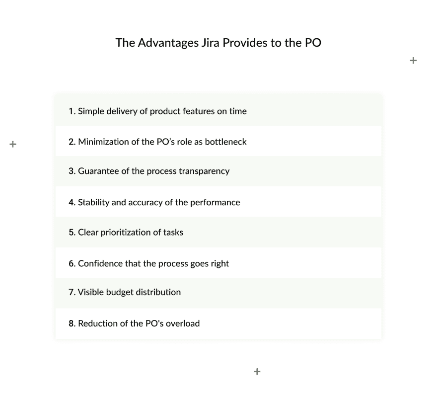

# 吉拉产品所有者指南

> 原文：<https://dev.to/django_stars/jira-guide-for-product-owners-5h3f>

### **本文由 Django Stars 的项目经理 Nataliia Peterheria** - *撰写。*

我叫 Nataliia Peterheria，在三年多的时间里，我一直担任项目经理，负责各种复杂程度的项目。敏捷和技术统治着世界，因此通过将它们结合起来，我们创造出易于使用的复杂数字产品。吉拉是使用敏捷方法构建产品的完美工具。在这里，我分享了我使用吉拉管理工作过程的经验，展示了如何使用它来更好地与开发团队沟通，并揭示了如何充分利用它的技巧。

敏捷、Scrum、看板...你可能已经听说过这些名字，甚至在你的作品中使用过。这些花哨的词汇旨在描述和实现每个产品所有者在开发过程中努力追求的一件事:有效的控制、可预测性、透明度和结果。为了实现这个目标，你投入时间和精力进行计划、跟踪、评估和与团队的沟通。大量的时间和精力。但是，如果您可以用这段时间来完善项目策略，而不是向您的团队解释一周前您分配给他们的任务，会怎么样呢？

这种材料是在无数完全不同的项目之后诞生的，这些项目有一个共同点——一个商业团队用商业语言与工程师交谈，反之亦然。

> 虽然有效的沟通对项目的成功至关重要，但使用团队协作工具来帮助过程的所有方面找到共同语言也是必要的。这就是为什么我坚持在每个项目中使用吉拉，如果项目中的每个人都知道如何使用它，事情会容易得多。

这些信息对每个开始一个项目并和一个工程师团队一起工作的人都很有用:创始人、企业家、产品所有者，以及其他很少或没有使用吉拉经验的非技术专业人士。

吉拉在行业中被广泛使用，有两个用户群体——喜欢它的人和讨厌它的人。他们之间唯一的区别是前者知道如何使用它。我们已经在他们中间呆了十多年，并准备分享我们的经验。读完这些材料后，你也会知道其中的秘密，而且，你可能会爱上吉拉，爱上它如何帮助你进行有效的计划、透明的跟踪和准确的评估。

## 为什么每个人都用吉拉，8 个理由也这样做

如果您仍然想知道为什么您应该花一些时间来熟悉吉拉，让我们描述一下您将获得的优势，以及为什么这个工具如此值得的几个原因。

### 什么是吉拉？

吉拉是一个帮助组织软件开发过程的工具，使它在各个方面都透明和方便。吉拉不仅帮助计划和组织任何规模的开发团队的工作，这些团队可以位于世界上的任何时间和任何时区。它还可以更好地控制其工作，并对未来的性能进行预测。

听起来不错，对吧？但是为什么学会有效地使用它对你来说如此重要呢？根据我们十年的经验，我们总结了以下几点。

> 吉拉是 IT 行业的标准管理工具。这意味着如果你计划和一个开发团队一起工作，你必须学会如何使用吉拉。

没有其他方法来管理团队协作。明确地说，还有其他工具，但吉拉是如此广泛和普遍承认，它现在是明确的行业领导者。就像哈利·波特一样，在被选为特别的那个之前，他一直“只是哈利”，吉拉只是一个管理工具(虽然，是一个非常方便的工具)，被业界提升到第一位。现在，吉拉用于管理绝大多数项目，并且大多数开发人员默认使用它。

### 开始“吉拉之旅”的 8 个理由

我们已经描述了吉拉是什么，所以现在是“为什么”的时候了。首先，**在吉拉的帮助下，你将能够在预定的范围内管理、控制和预测你的产品未来发展的时间**。

这些是该软件的主要功能，稍后我们将讨论如何尽可能多地利用它。然而，经营吉拉也有一些隐藏的优势。首先，以熟悉的格式设置的任务对于软件开发工程师来说更容易理解。这是怎么回事？

> 接受工程师的思维模式与业务方面不同的事实。作为一个产品所有者，你必须学会如何说“技术”,以便在开发过程的每一点上与工程师保持一致。

有技术头脑的人以表格的形式思考。所以，如果你开始以这种方式组织信息，你将会大大减少误解，激发创造力，这是第二个隐藏的优势。吉拉在这方面有很多机会，不像聊天或电子邮件那样，在商业交流中更常见。如果你的需求是结构良好且清晰的，开发人员就不必花费额外的时间将它们翻译成可理解的形式。相反，他们可以把精力放在真正的工作上:找到一个简洁、清晰、合适的解决方案。开发人员应该知道业务领域，但是他们经常不知道它微小的具体现实。

请记住，有时对业务部门和产品负责人来说很清楚的事情，对工程师来说一点也不明显。如果我们可以说的话，他们属于另一个国家。例如，让我们暂时搬到伦敦地铁，或伦敦人称之为“地铁”。如果你来自纽约，在伦敦乘坐地铁，你可能会被一条不太清楚的规则搞糊涂:不刷你的牡蛎卡就不能出站。如果你在纽约，你绝不会想到“敲出来”退出；在伦敦，这是必须的。这对伦敦人来说是显而易见的，但纽约人需要被告知他或她必须这么做。当涉及到商业和工程时，情况也差不多。

现在让我们回到你应该尝试吉拉的主要原因和它能给你提供什么。

## 吉拉为产品所有者提供的优势

#### 按时交付产品功能简单。

吉拉允许你轻松地计划每个 sprint 的范围，控制过程，主动回答团队的请求，并解决问题。这些帮助您坚持最初的时间估计，并按时交付特性。

#### 最小化采购订单的瓶颈作用。

通常，产品所有者是负责通知团队业务方面的决策和优先级的人。如果 PO 没有时间通知团队，整个流程可能会中断。吉拉减轻了采购订单的负担，从而提供了更好的流程。

#### 过程透明度的保证。

吉拉记录了每个任务的每个动作，所以你可以看到谁对每个问题做了什么。

#### 表演的稳定性和准确性。

吉拉是自学的。根据团队在当前项目中的表现，它可以预测他们在下一个项目中的表现。因此，团队合作的速度是稳定的和可预测的，这使得评估更加准确。

#### 明确任务的优先顺序。

你可以从最重要的到最不重要的对任务进行优先级排序。因此，团队将理解优先级。如果两个任务在优先级上发生冲突，吉拉会知道哪一个更重要。

#### 对过程顺利进行的信心。

吉拉允许通过记录对任务的每个操作来跟踪任务的执行。它通知这个人是否需要他做一些动作。你可以看到团队在开发过程中面临什么问题，并主动响应他们的请求。

#### 可见的预算分配。

吉拉为每个 sprint 生成报告，因此您可以知道实际性能与估计值有多大关联。此外，在吉拉，团队记录花费在任务上的所有时间，因此很容易看到预算花在了哪些行动上。

#### 减少阿宝的霸王。

最后，但也许是最重要的原因。负责计划和最终产品愿景的产品负责人可以对所有问题有一个快速和非常详细的看法，而不是回复与团队关于所有任务进度的无休止的聊天。

简而言之，作为一个行业标准，吉拉是每个与开发团队一起从事项目工作的人必须知道的。它极大地简化了流程组织，并节省了大量时间，这些时间可以用于战略规划，而不是控制流程。吉拉会为你做得更好。如果你要开始一个新项目，你从来没有和开发团队一起工作过，或者你有但是想提高你的吉拉技能，你会发现这个指南很有用。If 将向您展示如何使用吉拉达到最佳效果，有哪些有效的工具隐藏在那里，以及如何使用它们。

在此留下您的电子邮件，获取以 PDF 格式发送给您的关于如何充分利用吉拉的 **20 页分步指南**，这样您就可以立即设置您的项目。

##### 输入电子邮件获取您的吉拉指南

<button class="btn btn-primary ds-form__submit">获取电子书</button>

##### 抓住了！立即查看您的收件箱

这篇[吉拉产品负责人指南](https://djangostars.com/blog/jira-essentials-for-product-owners-a-must-have-project-setup-guide/)最初发布在 Django Stars 博客上。