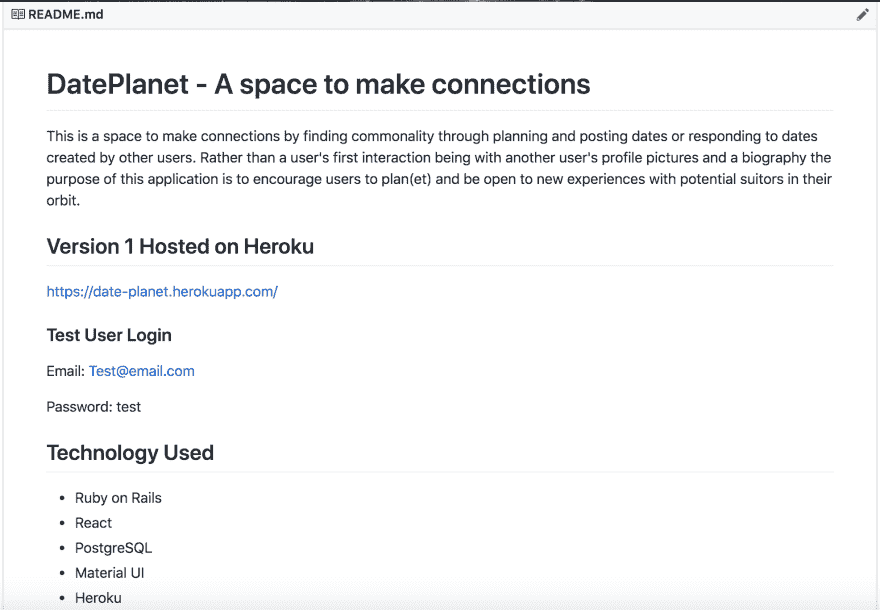

# 求职资源和技巧

> 原文：<https://dev.to/kcarrel/job-search-resources-and-tips-50od>

作为一名前训练营毕业生，我一直试图在找工作时广撒网。在这样做的时候，我整理了一份我一直在使用的资源和技巧的清单，希望对处于类似情况的其他人有所帮助。

# 工作公告板/网络

*   [Angel.co](https://angel.co/)
*   [雇佣技术女性](https://www.hiretechladies.com/jobs)
*   埃尔法
*   [玻璃门](https://www.glassdoor.com/index.htm)
*   [LinkedIn](https://www.linkedin.com/jobs/)
*   [独角兽棋盘](https://unicornboard.com/)

# 技能型招聘

*   [三重交换](https://triplebyte.com/)
*   [舱口](https://www.hatchways.io/#/)

# 面试准备

*   [LeetCode](https://leetcode.com/problemset/all/)
*   [黑客排名](https://www.hackerrank.com/)
*   [代码大战](https://www.codewars.com/)
*   [技术面试手册](https://yangshun.github.io/tech-interview-handbook/)
*   [查看我的技术面试方法](https://dev.to/kcarrel/an-approach-to-technical-interviews-3l66)

# 提示

*   [制作作品集！](https://kcarrel.github.io/)
*   为您想要强调的项目写清楚自述文件
*   让招聘人员/招聘经理轻松查看您的项目！我喜欢亲自使用 Heroku。
*   写一篇技术博客
*   利用科技推特网
*   加入/参加当地的技术聚会团体和他们的休闲频道
*   无论是以面试准备、个人项目还是学习新技能的形式，继续编码
*   记得休息。找工作本身就是一份全职工作，但即便如此，也要休息一下！
*   询问你认识的开发人员他们是否愿意进行模拟面试或信息面试
*   利用你的关系网！很多时候，你会发现人们乐于以任何方式提供帮助。

你有什么建议或资源想要分享吗？