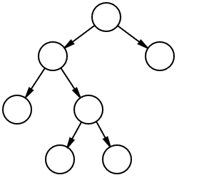

# 成为更好的程序员之旅(第三天)

> 原文：<https://dev.to/montanacoder/journey-to-become-a-better-programmer-day-3-35lh>

旅程，我用这个词是因为它听起来不错。这几天我对这个词的理解。我已经踏上了更好地理解二叉树的旅程。在过去的几天里，我一直在遍历一些树，以了解它们是如何工作的，我很舒服地遍历有序二叉树。

设置

```
function Node(val) {
    this.value=val
     this.left=null
     this.right=null
}

var tree2 = new Node(5);
tree2.left = new Node(10);
tree2.left.left = new Node(17);
tree2.left.right = new Node(3);
tree2.right = new Node(8); 
```

目标:按树的顺序排列一个数组。

BT(二叉树)总是有根的。根将是树开始的地方，就像一个真正的树一样🙂。从该根开始，将有一个节点，该节点将有两个分支，一个左分支和一个右分支，如果我们谈论的是 BTS(二叉查找树),那么左分支和右分支的规则是不同的(在不同的日子讨论这一点)。

[](https://res.cloudinary.com/practicaldev/image/fetch/s--R2Csa0Ks--/c_limit%2Cf_auto%2Cfl_progressive%2Cq_auto%2Cw_880/https://www.statisticshowto.datasciencecentral.com/wp-content/uploads/2017/12/full-binary-tree.png) 
我想用上面列出的所有数字制作一个图像，但是，我似乎无法上传本地图像。

当你看这个装置的时候，你可以看到树已经建好了。在我们开始编码之前，我们需要了解如何在 BT 中移动。我们从最远的“左边”开始记录那个数字，然后到节点记录那个数字，然后到右边，是的，你猜对了，也记录那个节点。

根据设置，你认为排序后的数组最终会是什么样子？

1.  [5,10,17,3,8]
2.  [5,17,10,3,8]
3.  [17,5,3,10,8]
4.  [17,10,8,5,3]
5.  [17,10,3,5,8]
6.  [10,17,5,3,8]

让我们走一遍，只是为了确保我们理解发生了什么。

因此，在 BT 的图像中，我们将“17”放在最左边(tree2.left.left ),然后反弹到父节点“10 ”( tree 2 . left ),最后访问“10”的右边节点“3 ”,从那里我们只需重复完全相同的过程。我们回到节点“10 ”,因为我们已经记录了它，所以我们移动到“5”上面的节点，是的，然后我们得到最后一个数字“8 ”,它是最右边的数字。

```
 What tree2 would look like 
                        5
                       / \
                      10  8
                     / \
                    17  3 
```

代码:

现在我们可以在纸上做了，让我们把它编码起来

```
function inOrder (tree) {
    let res= [ ]
    helper(tree, res)
    return res
} 

function helper (tree, res) {
  if (tree){
        if (tree.left){
            helper(tree.left, res) //we do this so we keep calling this function 
                                      (recursive) until the node we land on 
                                       doesn’t have a left child.
        }

        res.push(tree.val) // adds the current node to `res` array.

         if (tree.right){  //once the left is done we move tot he right
           helper(tree.right, res)
        }
    }
} 

 inOrder(tree2) 
```

现在试试这棵树:

```
var tree3 = new Node(6);
tree3.left = new Node(3); 
```

或者

```
var tree1 = new Node(4);
tree1.left = new Node(1);
tree1.right = new Node(3); 
```

一步一步来，你得到了什么？

对我来说，理解整个过程的关键是与橡皮鸭交谈。如果你不确定我在说什么，看看 [@rachelsoderberg](https://dev.to/rachelsoderberg) 的[橡胶鸭子调试](https://dev.to/rachelsoderberg/rubber-ducky-debugging-1jbe)。

对我个人来说，这是一场斗争，我在纸上理解了 BT 以及它是如何工作的，但对 BTS 的规则感到困惑，或者我想得太多了，我的代码将是 30 行，有几个循环和几个 if 语句。