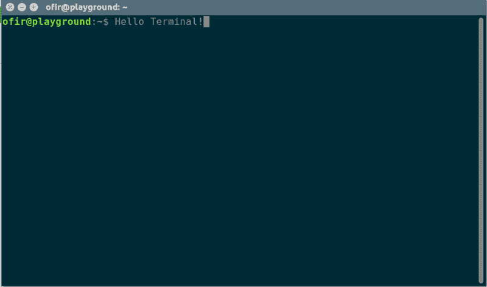
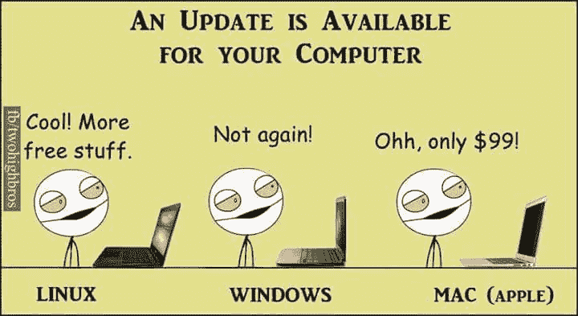
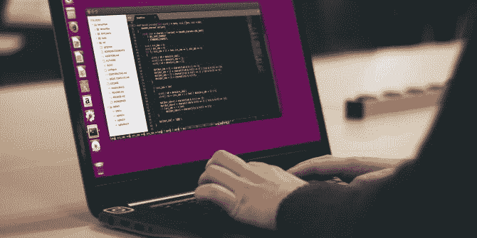
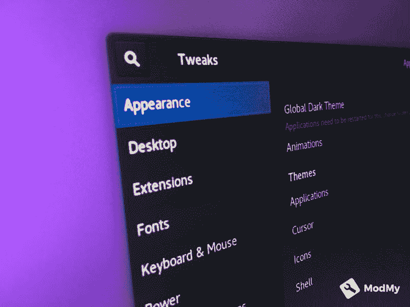
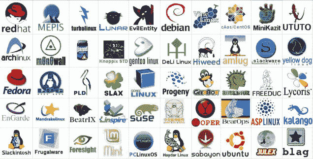
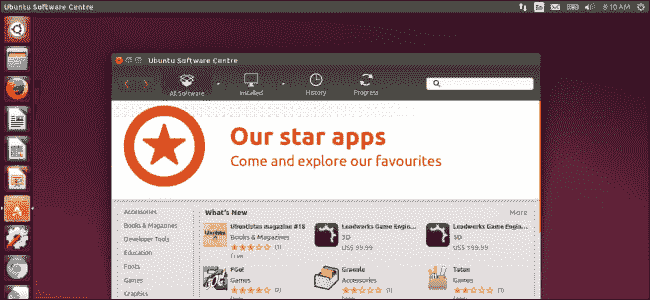

# Linux 之旅

> 原文：<https://dev.to/rubiin/journey-to-linux-3m83>

在我们进入主题之前，Linux 实际上是一个内核而不是操作系统。操作系统实际上是 GNU/ Linux(我假设你已经知道了)。但是为了简单起见，我将用 Linux 来解决这个问题。

2010 年 12 月中旬，我最后一次以主操作系统的身份启动 windows。从那时起，我的主要计算环境——至少在笔记本电脑上——是 GNU/Linux。这不是一个快速的决定，而是我在使用 windows 时面临的数百万眼球转动和折磨的结果。

首先，windows 过去/现在都不是免费的，你必须投入几百美元才能获得 Windows 许可证，这在当时对于像我这样的大学生来说是很难获得的。虽然你可以一直使用盗版的 windows 和 cracks，这在互联网上很容易得到，但这是有代价的。安装了裂缝后几分钟，你的机器就会爬满间谍软件、病毒和点击劫持软件，天知道还有什么东西会偷偷篡改你的隐私，这也是 Linux 最适合我的需求的原因之一。同样在 win 7 之后，我开始使用 metro view 的 UI 有点糟糕(尽管他们在后来的版本中意识到了这一点)，我最喜欢的软件很少或没有向后兼容性，更不用说长达一小时的更新屏幕和设置开发工具的麻烦了(P.S .是计算机科学专业的学生)。然后我下定决心宣布# Windependence。

我是从大学里的一个开发小组那里知道 linux 的，他们用一些很棒的 wikiss 帮助我，这些 wiki 又帮助我为我的笔记本电脑安装了这个操作系统。我想从 noob 友好的东西开始，ubuntu 成了我玩的第一个 Linux 发行版。过去，我熟悉了 windows 上的点击安装功能，最初几天对命令感到不安，但之后，我掌握了它(作为开发人员的特权),并成为了一名快乐的终端用户。linux 开启了一个全新的机会和平台
以下是我喜欢 Linux 的几个原因:

*   更新并不令人头痛。他们是光荣的

*   Linux 社区非常棒，有大量的指南可以帮助你

*   Linux 是免费的，并且对设备有强大的支持

*   非常适合程序员

*   定制操作系统的任何方面

*   满足您需求的大量发行版

*   可靠并尊重你的隐私
    

*   轻松安装软件(使用终端或 GUI)

