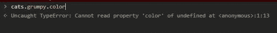

# JS Bites:无法读取未定义的内容

> 原文：<https://dev.to/ranewallin/js-bites-could-not-read-something-of-undefined-33i1>

[](https://res.cloudinary.com/practicaldev/image/fetch/s--lGUMTHw4--/c_limit%2Cf_auto%2Cfl_progressive%2Cq_auto%2Cw_880/https://thepracticaldev.s3.amazonaws.com/i/k9hankvp6p9bjc7y3a52.JPG)

我辅导新的 Javascript 开发人员。总的来说，他们遇到的最常见的错误是“无法读取未定义的 some_property”一个有经验的开发人员通常会立刻明白哪里出错了，但是对于新开发人员来说，这有时会导致几个小时的沮丧。

### 那么，它到底意味着什么呢？

用最简单的话来说，这个错误意味着您试图访问的内容要么不存在，要么不是您所想的那样。

这里有几个例子

```
const result = await axios.post(API_URL, user);

console.log(result.data.user.name + " has been added to the database!"); 
```

Enter fullscreen mode Exit fullscreen mode

在上面的例子中，前端团队认为后端会在其响应中返回新用户数据的副本。实际上，后端只是返回“成功”这导致`console.log()`返回一个错误，它`Cannot read name of undefined.`

```
let cats = [
    {
        name: "Grumpy",
        color: "Grey"
    },
    {
        name: "Heathcliff",
        color: "Orange",
    },
    {
        name: "Felix",
        color: "Black"
    }
  ];

console.log(cats.grumpy.color); 
```

Enter fullscreen mode Exit fullscreen mode

在上面的例子中，一个新的开发人员没有正确理解如何使用对象，尤其是对象数组。

### 看到这个错误怎么办？

任何时候你在处理数据时，你都应该在开始处理数据之前`console.log()`它，即使你确定你知道它是什么。一旦你看到数据，通常很快就能发现哪里出了问题。

如果我将数据从一个地方传递到另一个地方(从后端传递到前端，通过 React props，从一个函数传递到另一个函数，等等)，我喜欢在数据传递之前和之后注销数据。这让我可以确认事情正按照我期望的方式进行。

你也可以使用像 Quokka 这样的扩展，它允许你在你的编辑器中看到实时代码覆盖和你的权利。

然而，最重要的是继续编码。您看到的错误越多，您最终知道如何修复的错误就越多。知道答案的人之所以知道答案，是因为他们曾经有过问题。

* * *

```
 JS Bites

 Have you ever need a quick solution to a problem, but when you search 
 Google you are met with pages of tutorials and detailed instructions that 
 bury the information you need? That's what JS Bites attempts to solve. 
 Each post is a small, bite-sized primer on a very specific JS topic. The 
 aim is to provide enough detail to boost understanding, but not so much that 
 you become overwhelmed or lost. 
```

Enter fullscreen mode Exit fullscreen mode