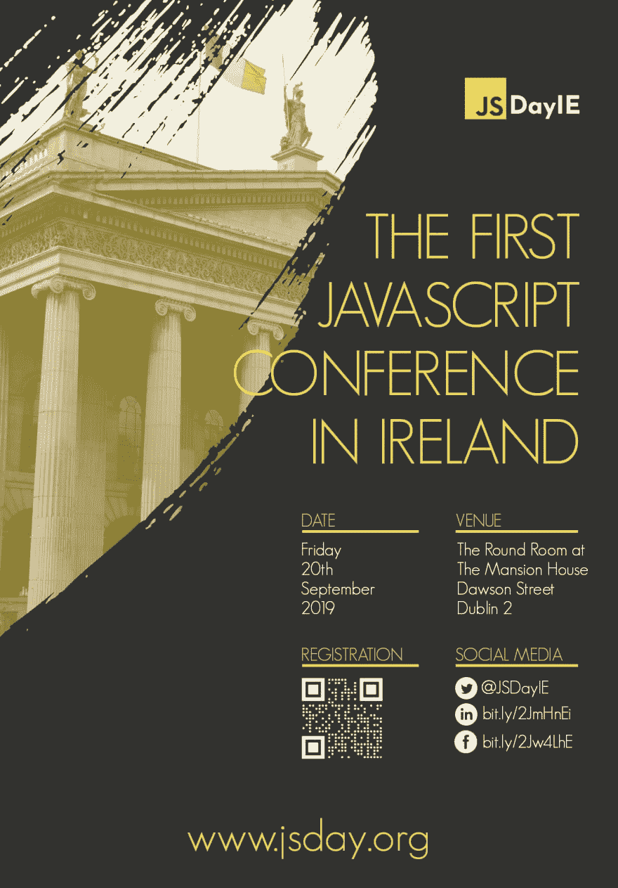

# JSDayIE 2019 门票现已发售！

> 原文：<https://dev.to/remojansen/jsdayie-2019-tickets-now-on-sale-2l02>

我非常高兴地宣布，经过几个月的努力，JSDayIE 门票现在开始发售了！

大约一年前，我开始在 JSDayIE 上工作，这是爱尔兰的第一个 JavaScript 会议。

爱尔兰有一个巨大的开发者社区，事实上，都柏林有非常高的开发者比率，它是许多全球软件公司的欧盟总部所在地，如微软、谷歌、Twitter 或 Airbnb。

然而，由于一些奇怪的原因，爱尔兰没有一个专门针对 web 开发社区的会议(几年前爱尔兰是 Web 峰会的所在地，但它搬到了里斯本)。所以我决定实现它，并宣布了 JSDayIE。

我们已经在 www.jsday.org 宣布了一些演讲者和其他细节。请访问我们的网站以了解更多关于此次活动的信息。

门票起价 95 欧元+增值税，会议将于 2019 年 9 月 20 日星期五**举行。如果你不住在爱尔兰，JSDayIE 可能是一个游览都柏林和发现爱尔兰的好借口。**

我加入 Dev.to 社区已经两年多了，我想感谢其他成员给所有 Dev.to 成员 [15%的折扣代码](https://ti.to/wolk-software-limited/jsdayie-2019/discount/Dev) ，让这个网站变得如此愉快和受欢迎。

我期待着欢迎开发社区的许多成员参加这次活动！