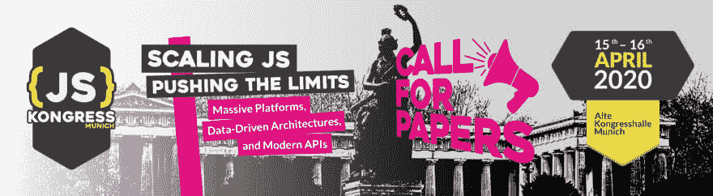
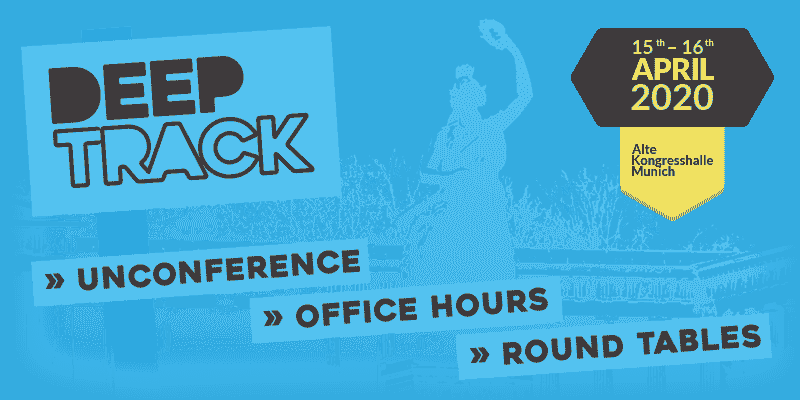

# JSK 20 公开征集论文

> 原文：<https://dev.to/jskongress/jsk-20-opens-call-for-papers-3pcp>

<figure>

<figcaption>JS kong RESS 2020，4 月 15-16 日|扩展 JS —挑战极限:大规模平台、数据驱动架构和现代 API</figcaption>

</figure>

 JS Kongress 于 4 月 15 日—16 日回到慕尼黑。  今天，我们很高兴地宣布 JS Kongress 2020 征文活动:加入我们，让我们关注解决方案和最佳实践。CfP 开放至 2019 年 10 月 15 日。

JS Kongress 2020 的重点是**扩展 JS——推动极限:大规模平台、数据驱动的架构和现代 API**。

编程语言 JavaScript 比以往任何时候都更重要，并且在服务器和硬件、本地应用程序和游戏中无处不在。随着**增长**，每个公司和项目都增加了规模扩张的痛苦。和缩放问题是困难的问题。

我们希望发现**各种扩展领域**，并探索这些领域中的问题和优化:

*   如何**优化编码和架构**以实现扩展
*   JS 引擎是如何发展的，V8、SpiderMonkey、JavaScriptCore 中的性能优化方法是什么
*   如何在 React、Angular 或 Vue.js 中**缩放大规模前端**
*   如何**提高 Node.js 性能**
*   如何**扩展团队并与数百名工程师一起工作**
*   如何**水平扩展**以及如何使用**现代云基础设施**如 Kubernetes 进行扩展
*   如何用 JavaScript 构建大规模数据驱动的平台
*   如何处理 Javascript 服务上**巨大的并发和不断增加的负载**

**扩展影响每个人**:前端、后端、架构师和团队。请参加 4 月 15 日至 16 日在慕尼黑举办的 JS Kongress 2020，让我们一起关注**解决方案和最佳实践**。[提交你的想法> >](https://sessionize.com/js-kongress-2020/?utm_source=medium&utm_medium=blogpost&utm_campaign=20190613_cfp&utm_nooverride=1)

* * *

**常见问题:**

–**门票:** CfP 开启意味着下一批门票也已经开始发售。聪明鸟的门票(299 欧元而不是 429 欧元)将一直有效，直到论文征集结束或售罄。[去售票处> >](https://ti.to/munich-dev-events/js-kongress-2020/?utm_source=medium&utm_medium=blogpost&utm_campaign=20190613_cfp&utm_nooverride=1)

–**退款政策:**我们会退还差旅费(详情见下文)，并在演讲者酒店住三晚。一旦你被录取，我们可以退款或者给你一张免费票的优惠券。

最多可享受三晚酒店住宿。报销差旅费的上限:— DACH 地区:150 欧元—欧洲境内:最高 300 欧元—欧洲境外:最高 900 欧元—大洋洲:1200 欧元

–所有投稿必须使用**英语**。

–会谈计划持续 **25 分钟，没有提问&和个人介绍**。介绍将在讲座开始前与司仪一起完成。

–我们的 **CFP 评选过程是不公开的**，这意味着所有的论文直到评选过程的最后一刻都是匿名的。我们的计划委员会将对您的提案进行排名和评论，该委员会由 IT 领域的专家和社区人士组成。

–请注意，提交您的想法即表示您同意遵守 JS kong RESS【https://js-kongress.com/code-of-conduct/[的**行为准则**](https://js-kongress.com/code-of-conduct/?utm_source=medium&utm_medium=blogpost&utm_campaign=20190613_cfp&utm_nooverride=1)

[简而言之],我们希望所有的参与者，包括演讲者和主持人，都遵守我们的行为准则，其核心是:JS Kongress 应该是一个对每个人都安全和富有成效的环境。请确保您的演讲，包括所有支持材料和非正式评论，欢迎并尊重所有参与者，无论其种族、性别、性别认同和性别表达、年龄、性取向、残疾、外貌、国籍、种族、宗教信仰或无宗教信仰。

**–主题** : JS Kongress 2020 是关于扩展 JS——推动极限:大规模平台、数据驱动架构和现代 API。考虑你的贡献与主题相关，并且让听众感兴趣。

* * *

**重要日期:**

–提交截止日期:2019 年 10 月 15 日(欧洲中部时间 22:00)

[现在提交你的想法> >](https://sessionize.com/js-kongress-2020/?utm_source=medium&utm_medium=blogpost&utm_campaign=20190613_cfp&utm_nooverride=1)

–接受通知:2019 年 12 月 15 日至 2019 年 12 月 20 日

–会谈日期:2020 年 4 月 15 日和 2020 年 4 月 16 日

有任何问题或意见吗？[hello@js-kongress.com](//mailto:hello@js-kongress.com?subject=CfP%20JS%20Kongress%2020)

* * *

同时，我们#DeepTrack 的存储库也在等待您的贡献:

**#jskongress** 是关于 JavaScript 所有事情的会议。用  为 JS 社区手工制作！ **2020 年，4 月 15 日至 16 日，德国慕尼黑 Alte kongress Halle**。2 天，1 个会议阶段，附加 **#DeepTrack** (去 [GitHub repo 取消会议](https://github.com/JSKongress/JS-Kongress-Munich-Deep-Track))。包括晚间娱乐和鼓舞人心的节目。

<figure>

<figcaption>JS kong RESS 2020 # deep track 4 月 15-16 日:Unconference，办公时间，圆桌</figcaption>

</figure>

帖子 [JSK 20 开放征文](https://js-kongress.com/2019/06/13/jsk-20-opens-call-for-papers/)最早出现在 [JS KONGRESS 2020:扩展 JS——挑战极限:大规模平台、数据驱动架构和现代 API。](https://js-kongress.com)。