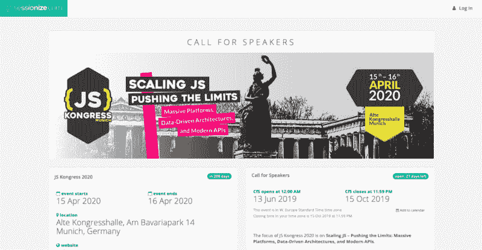
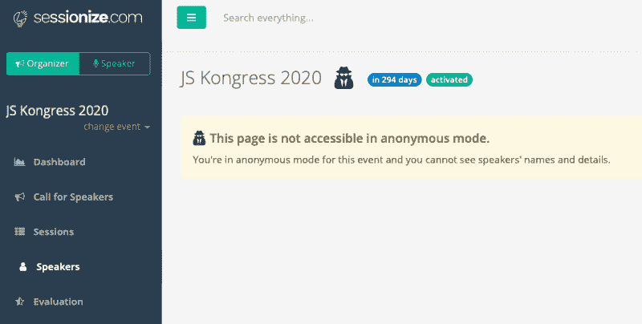
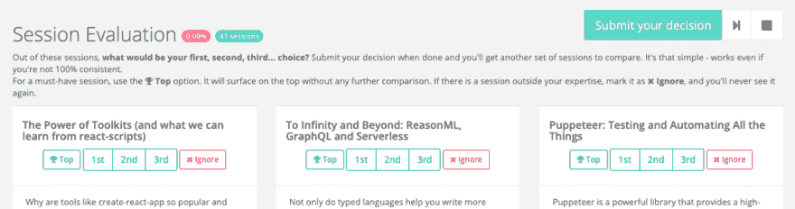
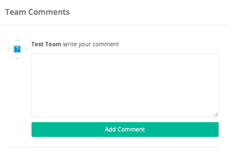
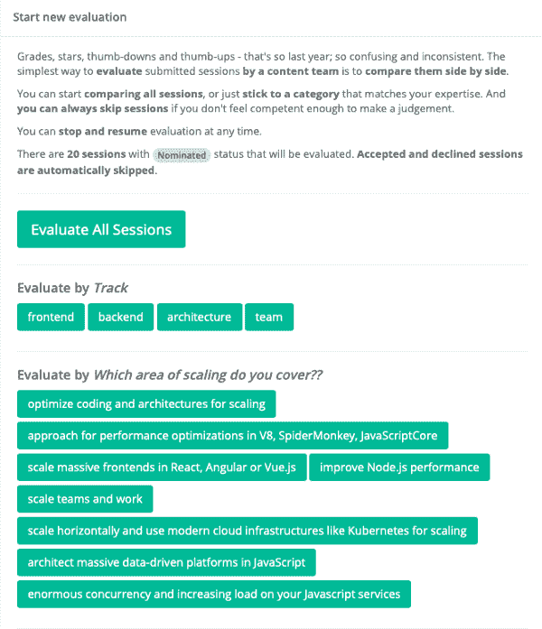
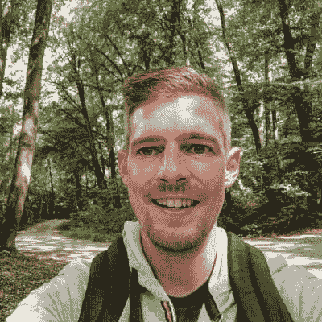
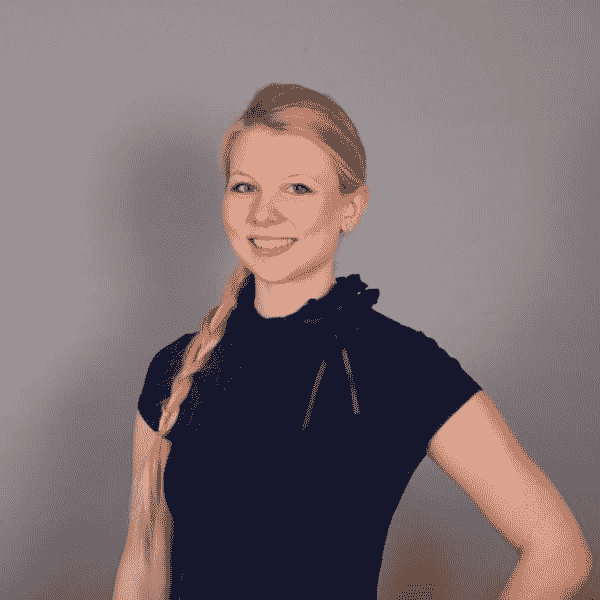

# jsk20 调度程序和完整程序委员会

> 原文：<https://dev.to/jskongress/jsk20-scheduling-process-and-the-complete-program-committee-5bk2>

<figure> 

<figcaption>节目委员会:米洛什、杰西卡、乔韦、瓦妮莎、戈洛、玛德琳、约翰内斯、克拉拉(从左上顺时针)</figcaption>

</figure>

在我们之前的一篇帖子中，我们介绍了 JS Kongress 2020 项目委员会的第一批成员——现在他们加入了更多的成员。从 10 月 16 日开始，当论文征集截止时，他们将审查您在 CfP 中提交的所有想法，并为该计划创建一个选择:让我们为这些了不起的社区人士热烈鼓掌！

### 为节目的匿名选择

对于 2019 年 3 月的最后一期，我们在 CfP 中收到了约 250 篇论文，并能够在委员会的帮助下提出一个伟大的计划:[请在此找到 2019 年的计划。](https://2019.js-kongress.com/schedule/)

我们已经通过征文表格收到了一些建议，但我们仍然期待着您的建议！CfP 开放至 10 月 15 日— [在此提交您的论文](https://sessionize.com/js-kongress-2020)。

<figure> 

<figcaption>今年，我们第一次在 sessionize 上进行 CfP(或该工具所称的“召集演讲者”)——从后端的角度来看，这是一个很棒的工具。你们中的许多人可能已经在平台上为演讲者和组织者创建了一个帐户，否则，你将不得不创建一个帐户，以确保当你回来时可以访问你的论文。你觉得通过 sessionize 提交怎么样？请告诉我们！</figcaption>

</figure>

这是【talks 如何入选 JS kong RESS 2020 项目:

整个过程的核心是**匿名**评选。论文征集完成后，所有投稿都是匿名的。只有会议标题、内容以及与座右铭“扩展 JS-推动极限:大规模平台、数据驱动架构、现代 API”的整合与提案评估相关。计划委员会将作为“内容团队”被分配到工具中的活动，因此只能以匿名模式访问:他们的视图不包含作者(未来的演讲者)的任何个人数据，这也保护了您的个人数据。这些信息将仅用于 Orga-Team 邀请您并为 JS Kongress 网站创建您的演讲者资料(这是演讲者资料的外观[https://2019.js-kongress.com/speakers/mariko-kosaka/](https://2019.js-kongress.com/speakers/mariko-kosaka/))。

<figure> 

<figcaption>在匿名模式下，演讲不会链接到演讲者个人资料。内容团队(我们称之为项目委员会)根本无法访问演讲者数据。</figcaption>

</figure>

这意味着，委员会**盲目评估**提议的贡献是否适合计划重点。同样，当论文不符合今年的座右铭或主题超出他们的专业范围时，他们可以选择“忽略”。在这种情况下，其他节目委员会(PC)成员的评估将决定该讲座是否被投票决定在主舞台上举行。保时捷中心不会孤立地看待提案，而是将它们与该领域的其他讲座进行比较:三场讲座同时进行，然后将根据哪一场最适合(第一、第二、第三场)，或者是否是活动的必备项目(上图)进行排序。

此外，我们要求委员会就为什么以这种方式评估提交的内容以及对演示者的建议提供**反馈**。这不仅使得在势均力敌的情况下更容易决定哪个演示文稿将包含在程序中，而且还应该帮助提交者。因为数字评定并不总是说明一切，所以“第一”或“忽略”可能有许多原因。我们将向您发送团队意见，无论您的发言是否在日程安排中，或者这次未能成行。我们也想支持你未来的提议。

sessionize 中我们最喜欢的一个特性是按轨迹或区域进行的**评估。因此，PC 不会发现自己面临许多许多提案(记住，2019 年我们收到了超过 250 个想法)。他们可以轻松地比较针对某个领域提交的报告，例如，评估所有关于“优化编码和架构以实现扩展”的报告，下一步，他们将评估我们收到的关于“在 Angular、React 或 Vue 中扩展大规模前端”等领域的所有想法。**

所有评审完成后，就轮到组织团队了—[请看这里](https://js-kongress.com/team/)，我们在这里介绍自己。在 sessionize 的“管理”视图中，演讲建议链接到演讲者个人资料。邀请演讲人的**重点是:**

*   **多元化活动:**我们想邀请来自技术领域代表性不足的群体的每一个人，例如女性、有色人种、残疾人、LGBTQIA+(我们的多元化奖学金项目即将开始，敬请关注！)
*   此外，我们鼓励**第一次发言的人**(CfP 表格中有一个复选框，用于请求对您的第一次或其中一次发言的支持):Orga-Team 以及您的同伴发言人将在准备内容、您的幻灯片以及为舞台做准备方面提供支持。
*   **没有贸易展览:**我们确实避免只为他们公司的产品/服务举办营销展览的演讲者(谈论你的“宝贝”不一定是纯粹的营销，请在谈话描述中包括在项目中的使用和与客户的使用，以及砖块世界的例子)
*   **独特的节目:**很明显，我们更喜欢以前没有展示过的演讲，或者只以另一种语言展示过的演讲(在#jskongress 上的所有演讲都将使用英语)。但是如果你的提议非常合适，我们还是会考虑的。
*   **一条连续的线索，讲述一个故事:**所有演讲的内容都给出了一个概述，并深入探讨了“攀登 JS——挑战极限”

JS Kongress 团队将结合 PC 的评估和意见，讨论所有可用的信息(对实现活动目标很重要的信息，参见上文的主要焦点)。

根据两个标准，我们从拼图的碎片中组装该计划:JS Kongress 2020 将是一个多元化、国际化和受欢迎的社区，讨论“攀登 JS——推动极限”,相互倾听，交流新想法，超越自己的鼻子。这是我们项目背后的格言，是项目委员会充满激情的工作和巨大的动力使之成为可能。

> 非常感谢你们的伟大工作，PC 成员！

### # 2020 女议员计划委员会

这些是 2020 年议会计划委员会的成员。点击他们名字后面的链接，找到一些激励你提交论文的理由，以及他们对项目的看法。

<figure>

<figcaption>Golo Roden([鼓励仍然很有趣的技术深度探索，对细节给予了很多关注](https://medium.com/@jskongress/please-welcome-golo-roden-in-the-program-committee-cc7ad44b53fe))， [Klara](https://medium.com/u/cd6e1f7f5587) ( [很快爱上了 JavaScript &它提供的所有可能性](https://medium.com/@jskongress/klara-fleischmann-adds-1-more-perspective-to-the-program-committee-6b8516b73ed2) d)， [Johannes Weber](https://medium.com/u/3ef5bc84bb92) ( [作为双重代理——PC 和 Orga 团队的一部分——他提供了一些“内部”信息](https://medium.com/@jskongress/double-agent-jowe-from-the-orga-team-spies-the-program-committee-c58038a0077a))</figcaption>

</figure>

<figure> 

<figcaption>[玛德琳·诺伊曼](https://medium.com/u/dc12db360dc4) ( [带来了她作为鲁尔吉斯会议组织者的经验](https://medium.com/@jskongress/hands-up-for-madeleine-neumann-8239cc0f0277))，[米洛苏塔诺瓦茨](https://medium.com/u/d3d973645fb) ( [给出了热心组织聚会的提示](https://medium.com/@jskongress/please-welcome-pc-member-milo%C5%A1-sutanovac-ee6dae11e6d9))，[杰西卡·罗斯](https://medium.com/u/e2bf65445f72) ( [很想在舞台上看到你自己的故事](https://medium.com/@jskongress/jessica-rose-joins-the-program-committee-3e21ec9e073e) )</figcaption>

</figure>

<figure> 

<figcaption>[约翰内斯·埃瓦尔德](https://medium.com/u/55c7e6a8aa4f) ( [其本人的提议从未被接受](https://medium.com/@jskongress/johannes-ewald-joins-the-program-committee-b7a6642fdf99))，以及[瓦妮莎·博纳](https://medium.com/u/df1f2fee7b13) ( [为你的#慕尼黑之旅](https://medium.com/@jskongress/new-member-for-the-pc-vanessa-b%C3%B6hner-b64bc7ef6f83)增加 9 大技巧)。</figcaption>

</figure>

> 非常感谢您的时间和承诺！

* * *

*   你可以在[https://medium . com/@ JS Kongress/CFP-FAQ-first-members-join-program-Committee-8 FEC 626 a1 ce 0](https://medium.com/@jskongress/cfp-faq-first-members-join-program-committee-8fec626a1ce0)上找到 JS Kongress 2020 的**征文 FAQ**
*   CfP 开放至 2019 年**，10 月 15 日** —请在 https://sessionize.com/js-kongress-2020[提交您的想法](https://sessionize.com/js-kongress-2020)
*   我们也期待**你对 https://github.com/JSKongress/JS-Kongress-Munich-Deep-Track的#深度追踪**(这不是征稿，你创建程序)的投入

jsk20 调度过程和完整的计划委员会第一次出现在 [JS KONGRESS 2020:扩展 JS-挑战极限:大规模平台、数据驱动架构和现代 API。](https://js-kongress.com)。