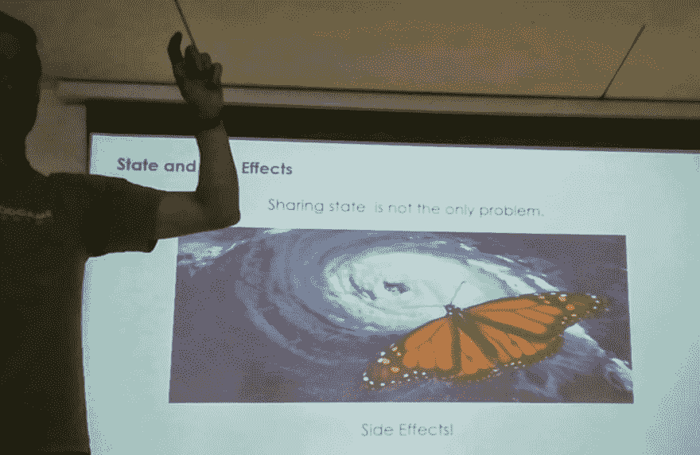

# 快速启动 React 开发(简介)

> 原文：<https://dev.to/dvddpl/jump-start-with-react-development-intro-20j9>

另一个部门的一个团队最近与我的团队合并了，这些新的开发人员将从 PHP 开发中跳出来做出反应。

他们是经验丰富的开发人员，但是当然，跳入不同的技术堆栈即使不是令人畏惧，至少也是耗时的。因此，我准备了一份演示文稿来加速他们的学习曲线。
我试图浓缩开始构建 React 单页面应用程序所需的大部分基本和不太基本的概念，而不必太担心配置、抽象结构，并试图最小化它们的 **Javascript 疲劳。**

结果是一个长达 1 小时 30 分钟、包含约 40 张幻灯片的庞大演示。我尽量减少文本的行数，主要放一些要点、代码片段和一些有趣的 gif 图片。我讨厌演讲基本上是一墙大声朗读的文本...)

由于演示被安排在午饭后,我本以为会有一些困倦的面孔，但我必须说，演示进行得相当顺利，而且——至少对我来说——似乎比预期的要短。

观众很少，我认识在场的每一个人，所以最后我很放松，感觉不像是公开演讲，然而，房间和屏幕很大，内容也足够长，所以我认为这是一次很好的培训，我真的很喜欢。

希望我会将演示扩展到其他部门，我正计划写一些关于 **React** 、 **Redux** 和 **Saga** (这是我们目前使用的堆栈)的博客文章，并摘录研讨会的内容。