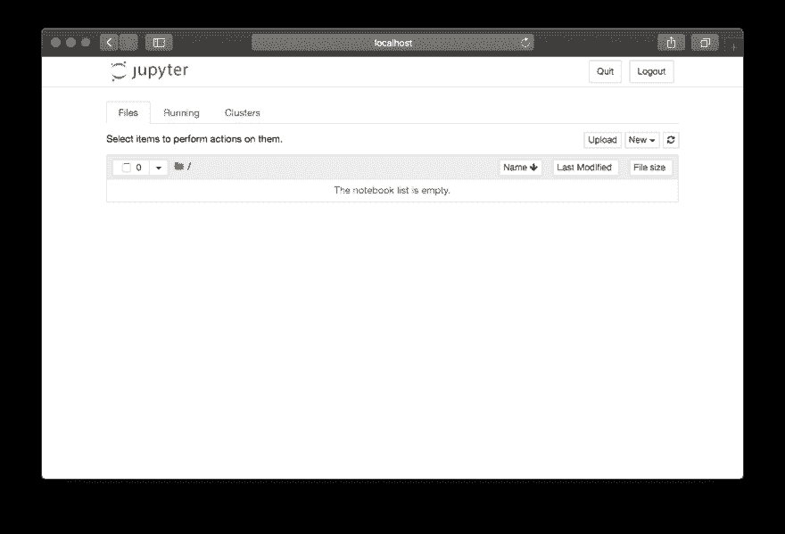
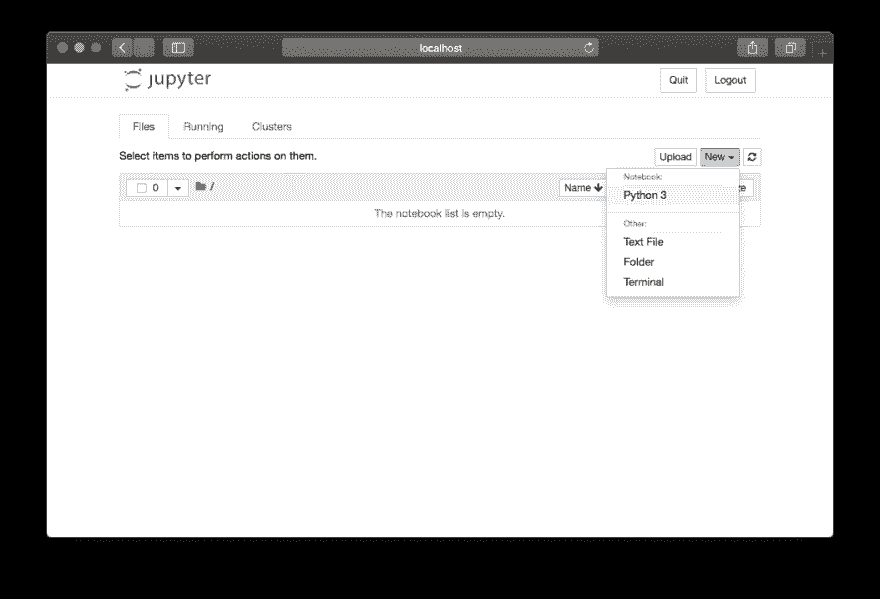
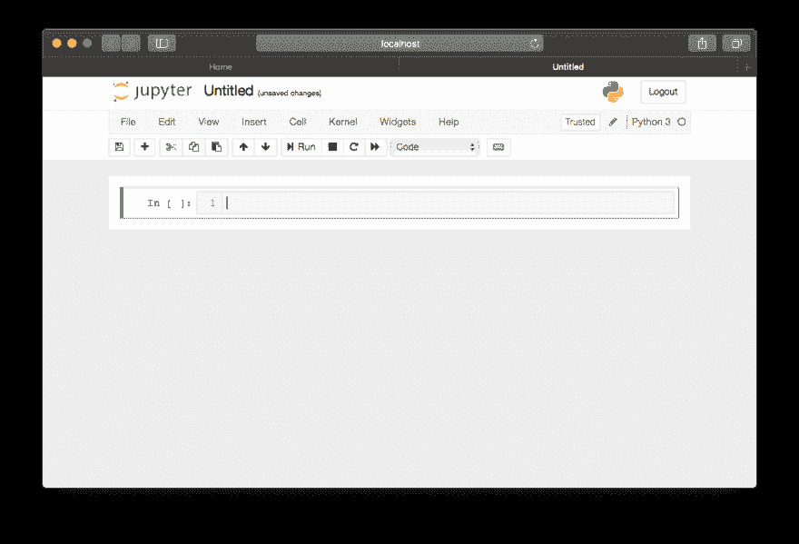
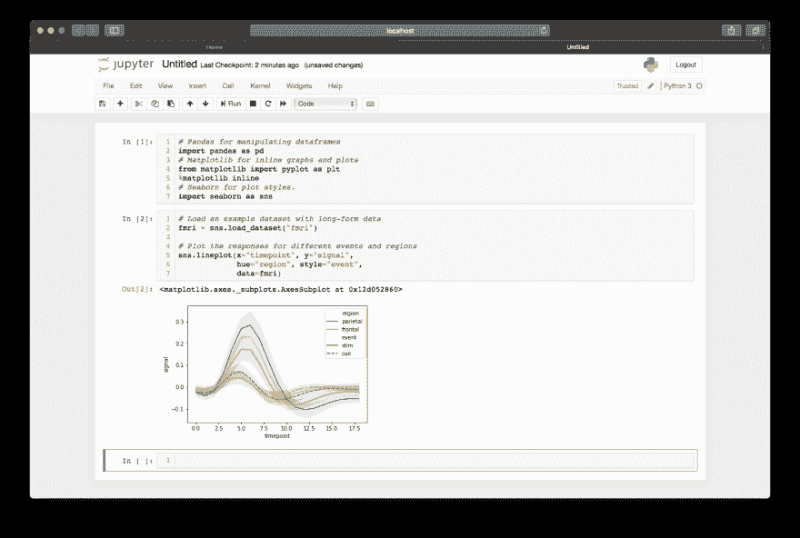
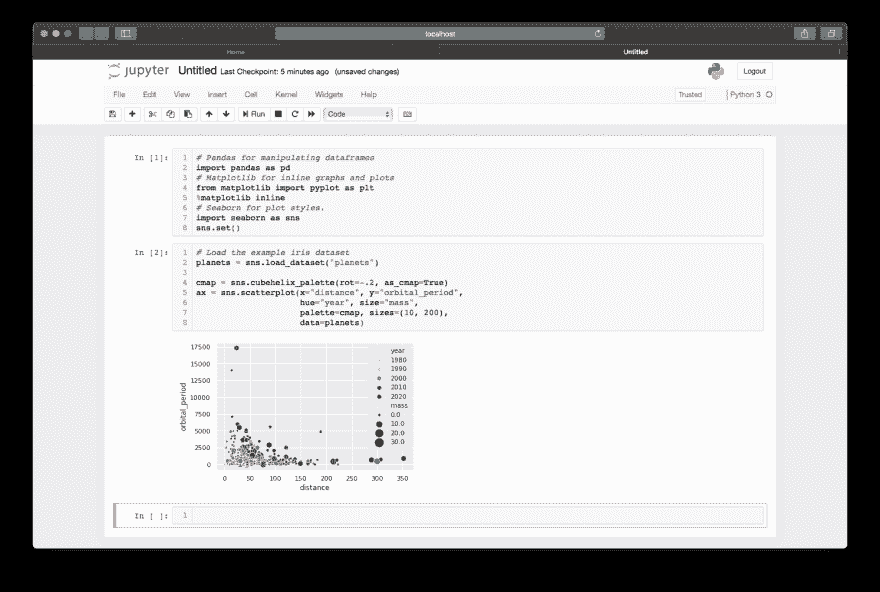

# 面向软件工程师的 Jupyter 笔记本🚀

> 原文：<https://dev.to/tbutterwith/jupyter-notebooks-for-software-engineers-18m5>

Jupyter Notebook 是一个交互式 web 应用程序，它与 iPython repl 接口，允许您运行结构化但迭代的 Python 脚本。这是数据科学家快速构建管道原型、可视化数据或执行特别分析的实际选择。

Jupyter 笔记本是可视化您可能拥有的任何数据集并进行特别分析的绝佳方式。它对于查询数据库和以可重复的方式显示数据特别有用。

## 设置您的环境

在从事任何 python 项目时，我喜欢使用 Pyenv 和 Pyenv 虚拟环境包装器来管理所有不同的 python 版本和依赖项。您可以在 [Pyenv GitHub repo](https://github.com/pyenv/pyenv#installation) 和[虚拟环境包装器](https://github.com/pyenv/pyenv-virtualenv#installation)上找到的安装指南。

如果您尚未安装 Python 3.6，请运行以下命令:

```
$ pyenv install 3.6.0 
```

设置新的虚拟环境并激活它:

```
# Create a Python 3.6.0 environment called jupyter-notebooks
$ pyenv virtualenv 3.6.0 jupyter-notebooks

# Start the virtual environment
$ pyenv activate jupyter-notebooks 
```

接下来，安装您将需要的所有依赖项:

```
$ pip install jupyter pandas numpy matplotlib seaborn 
```

最后，在您想要保存笔记本的目录中启动 jupyter 服务器:

```
$ jupyter notebook 
```

[](https://res.cloudinary.com/practicaldev/image/fetch/s--r8uwn2TZ--/c_limit%2Cf_auto%2Cfl_progressive%2Cq_auto%2Cw_880/https://thepracticaldev.s3.amazonaws.com/i/xmsgvlp5k8ey0bjj0ncm.png)

<figcaption>A New Jupyter Window</figcaption>

## 创建笔记本

笔记本是使用页面右上角的下拉菜单创建的。Jupyter 将自动打开并启动笔记本，这样您就可以准备好开始了。
[T3】](https://res.cloudinary.com/practicaldev/image/fetch/s--t_eRqFZb--/c_limit%2Cf_auto%2Cfl_progressive%2Cq_auto%2Cw_880/https://thepracticaldev.s3.amazonaws.com/i/toxaas293t172mb9aizs.png)

<figcaption>The Jupyter New Notebook Dropdown Menu</figcaption>

[](https://res.cloudinary.com/practicaldev/image/fetch/s--MZ9Mvd-Y--/c_limit%2Cf_auto%2Cfl_progressive%2Cq_auto%2Cw_880/https://thepracticaldev.s3.amazonaws.com/i/jvh0rn7qf27vfye95j11.png)

<figcaption>An Empty Jupyter Notebook</figcaption>

与任何其他 Python 文件一样，最好的做法是在文件的顶部包含您的导入。在 Jupyter 中，我们可以使用第一个单元格。编写完脚本后，按 Shift + Enter 运行单元格。

```
# Pandas for manipulating dataframes import pandas as pd

# Matplotlib for inline graphs and plots from matplotlib import pyplot as plt
%matplotlib inline

# Seaborn for plot styles. import seaborn as sns 
```

## 读入数据

### CSV

Pandas 有一个读取 csv 文件的便捷功能。下面是几个例子，但是如果你需要更多的信息，Chris Albon 有一篇关于导入 csv 文件的很棒的博文。

```
# if the file has headers df = pd.read_csv('path_to_file')

# if the file has no headers df = pd.read_csv('path_to_file', headers=None) 
```

## 探索数据

加载数据框后，有多种方法可以对其进行研究。要检查前 *n* 行，使用`head`函数，该函数默认返回前 5 行，但可以返回任何给定的数字。

```
# Print the first 5 df.head()

# Print the first 10 df.head(10) 
```

为了找出数据帧中保存的数据的一些基本信息，`describe`函数输出一个值的汇总，不包括任何`NaN`值。

```
df.describe() 
```

最后，为了完整地查看数据帧，pandas 提供了一个`option_context`函数来临时设置`with`上下文中的选项。

```
# Set the max rows to print to 999 and print. with pd.option_context('display.max_rows', 999):
    print (df) 
```

## 修改和过滤数据

为了访问数据框中的各个列和值，pandas 提供了`loc`参数。

```
# fetch a column df['column_name']

# fetch a row df.loc['index_value']

# fetch a single value df.loc['index_value', 'column_name']

# filter a data-frame by a given condition df.loc[lambda df: df['column_name'] > 3] 
```

使用`apply`功能可以轻松添加或修改列

```
# create a new column based on other column values df['new_column'] = df['old_column'].apply(lambda val: val * 2)

# override a column df['old_column'] = df['old_column'].apply(lambda val: val * 2) 
```

## 基本图形

在 Jupyter 笔记本上绘图就像调用一个单独的 seaboard 函数一样简单。

```
# create a line plot using your data frame sns.lineplot(x="my_x_field", y="my_y_field", data=my_data_frame) 
```

[](https://res.cloudinary.com/practicaldev/image/fetch/s--bFrpSCYD--/c_limit%2Cf_auto%2Cfl_progressive%2Cq_auto%2Cw_880/https://thepracticaldev.s3.amazonaws.com/i/rah0c6p0jcw8hbel1lb4.png)

<figcaption>An Example Line Plot</figcaption>

```
# create a scatter plot sns.scatterplot(x="my_x_field", y="my_y_field", size="attribute_z",
                sizes=(10, 200), # size boundaries
                data=my_data_frame) 
```

[](https://res.cloudinary.com/practicaldev/image/fetch/s--48kc_yto--/c_limit%2Cf_auto%2Cfl_progressive%2Cq_auto%2Cw_880/https://thepracticaldev.s3.amazonaws.com/i/xbcicclke90cjtdqu0wh.png)

<figcaption>An Example Scatter Plot</figcaption>

Seaborn 网站提供了一个全面的例子列表，每个例子都有用来生成它们的代码片段和一些要探索的示例数据集。

## 奖金

最近，GitHub 已经开始在他们的 UI 中呈现 Jupyter 笔记本，使得运行和共享笔记本比以往任何时候都更容易。iPython 库有一个[很好的例子](https://github.com/ipython/ipython/blob/6.x/examples/IPython%20Kernel/Index.ipynb)。

### 有用的链接

[熊猫](https://pandas.pydata.org/)
[【seaborn】](https://seaborn.pydata.org)
[【jupyter】](https://jupyter.org/)