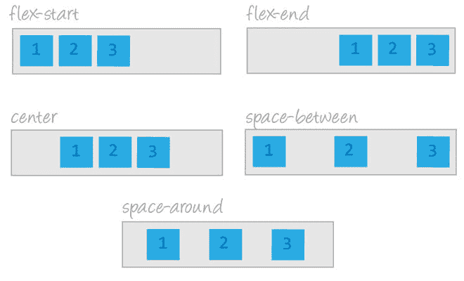
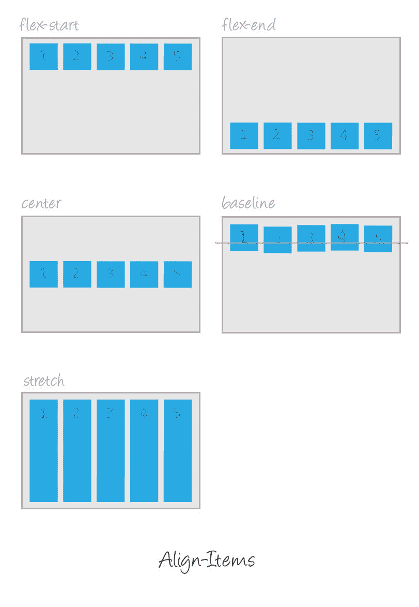

# 第一次尝试对齐内容和对齐项目😊

> 原文：<https://dev.to/dillionmegida/justify-content-align-items-at-your-first-try-3ged>

`CSS Flex property`是目前前端开发人员广泛采用和使用的属性。你几乎离不开它。它的联想是旁边使用次数最多的`CSS Grid Property`。就我个人而言，我使用`flex`的目的是，如果`flex`是人类，我可能已经被诅咒了，😂你可以看看我的博客-[dillionmegida.com](http://dillionmegida.com)桌面版&手机版。是的，这一切都是`flex`。
虽然我不怎么用`grid`，或者可能还没有。

你的故事已经说够了😕

# 对齐-内容&对齐-项目

撰写本文的目的是确保标题中两个属性的有效使用(尤其是在第一次尝试时)，因此，需要对`CSS Flex`有所了解。
阅读 [CSS Flex 点击这里](https://developer.mozilla.org/en-US/docs/Web/CSS/flex)

> `justify-content`和`align-items`只能在元素显示设置为`flex`、`grid`或其他值时使用。
> 我会使用 flex 的显示屏

使用这两个属性可能会令人困惑，因为很难知道何时使用哪一个。如果你以前尝试过使用 flex，你会遇到这个问题(看起来是这样)。我希望在这篇文章的结尾，帮助你获得对 flex 的这些(经常使用的)属性的有效理解，并且帮助你在第一次尝试时得到确切的用法。我们走吧。🤓

💻 ...

如我所说，它需要 flex 显示值

```
....
element {
    display: flex;
}
.... 
```

Enter fullscreen mode Exit fullscreen mode

我愿意相信我们目前理解了`flex`。

```
element {
    display: flex;
    justify-content: flex-start|flex-end|center|space-between|space-around|space-evenly;
    align-items: flex-start|flex-end|center|stretch|baseline;
} 
```

Enter fullscreen mode Exit fullscreen mode

当元素的显示设置为 flex 时，默认方向为“row”。
也可以手动设置为 row。

```
element {
    display: flex;
    flex-direction: row;
} 
```

Enter fullscreen mode Exit fullscreen mode

我把这称为`horizontal flow`。

当`justify-content`用于水平流时，它沿水平方向对齐元素。

[](https://res.cloudinary.com/practicaldev/image/fetch/s--gb2hpBPK--/c_limit%2Cf_auto%2Cfl_progressive%2Cq_auto%2Cw_880/https://assets.wordpress.envato-static.com/uploads/2015/06/02-flex-justify-content-design-style.jpg)

当`align-items`用于水平流时，它沿垂直方向对齐元素。

[](https://res.cloudinary.com/practicaldev/image/fetch/s--QeQD_VY0--/c_limit%2Cf_auto%2Cfl_progressive%2Cq_auto%2Cw_880/https://codropspz-tympanus.netdna-ssl.com/codrops/wp-content/uploads/2014/10/align-items-illustration.jpg)

您可以阅读更多关于相关 flex 属性值的信息(比如`flex-start`、`flex-end`)。

*   [CSS 调整内容](https://www.w3schools.com/cssref/css3_pr_justify-content.asp)
*   [CSS 对齐项目](https://www.w3schools.com/cssref/css3_pr_align-items.asp)

我不想偏离本文的目的，所以我不会解释这些术语的用法。

> 我想确保适当决定何时使用这些属性。

现在，当一个元素的`flex direction`被设置为`column`时，流程发生变化。

它拥有另一个流，我称之为`vertical flow`

当`justify-content`用于垂直流时，它以另一种方式排列元素——沿着垂直方向。因此，为它设置的所有值将只在这个方向上起作用。

当`align-items`用于垂直流时，它沿水平方向对齐元素。因此，为它设置的所有值将只在这个方向上起作用。

这两个属性只是在方向改变时交换了工作。

我使用的流动术语(`vertical flow`和`horizontal flow`)只是我发明的愚蠢的名字🙈，有官方(或者更确切地说，专业)术语称之为横轴和主轴

> 秘密很简单。
> 
> `justify-content`与流一起工作，而`align-items`只是做相反的事情。
> 
> `flex-direction: row` - `HORIZONTAL flow` - `HORIZONTAL direction`为`justify-content` - `VERTICAL direction`为`align-items`
> 
> `flex-direction: column` - `VERTICAL flow` - `VERTICAL direction`为`justify-content` - `HORIZONTAL direction`为`align-items`

好了🙂，我知道没错😲，就这么简单。

我几乎一直在使用 flex，在设计图库、排列元素时，尤其是当我想将一个元素放在另一个元素的中心时。仅在某些情况下倾向于将项目居中，但是使用 power flex ☠️，我可以将我想要的任何项目居中。
我只是这样做；

```
.parent-element {
    display: flex;
    justify-content: center;
    align-items: center;
} 
```

Enter fullscreen mode Exit fullscreen mode

通过这些简单的设置，`.parent-element`类下的所有元素将垂直和水平居中。

我希望现在你能很容易地决定如何有效地使用- `justify-content` & `align-items`😎

有用的资源- [在 Flex 容器中对齐项目](https://developer.mozilla.org/en-US/docs/Web/CSS/CSS_Flexible_Box_Layout/Aligning_Items_in_a_Flex_Container)

感谢阅读。

请分享您的评论。