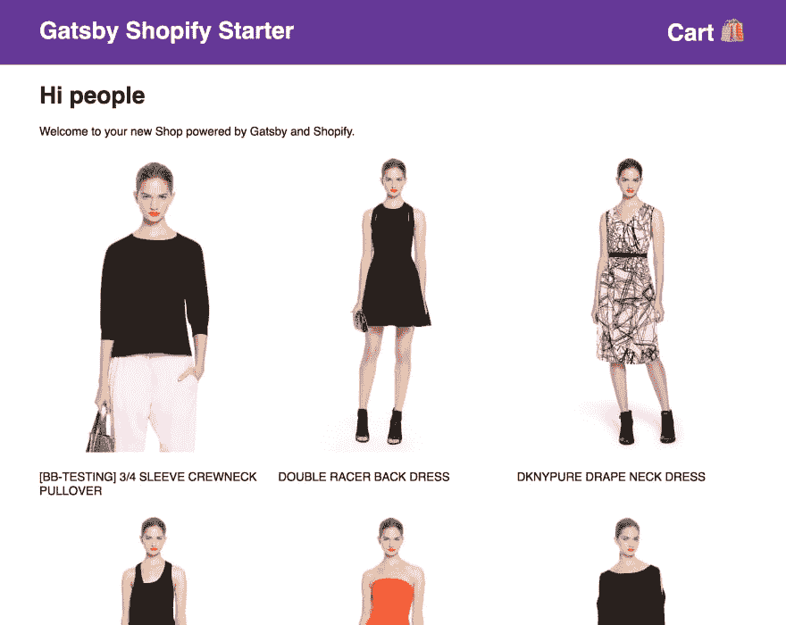
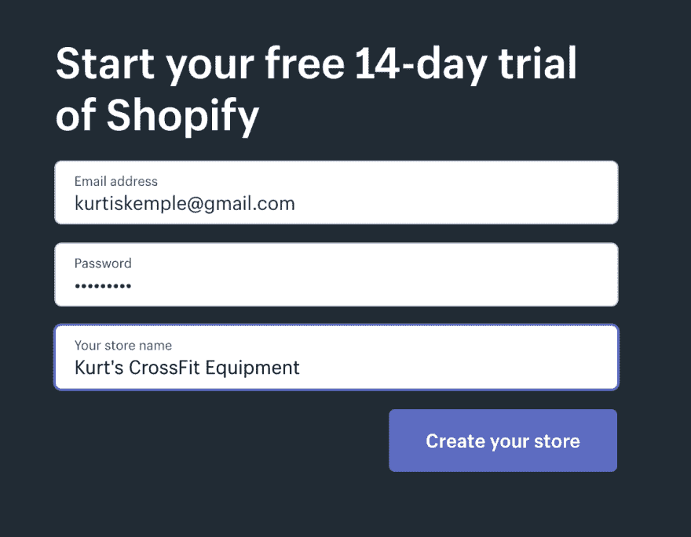
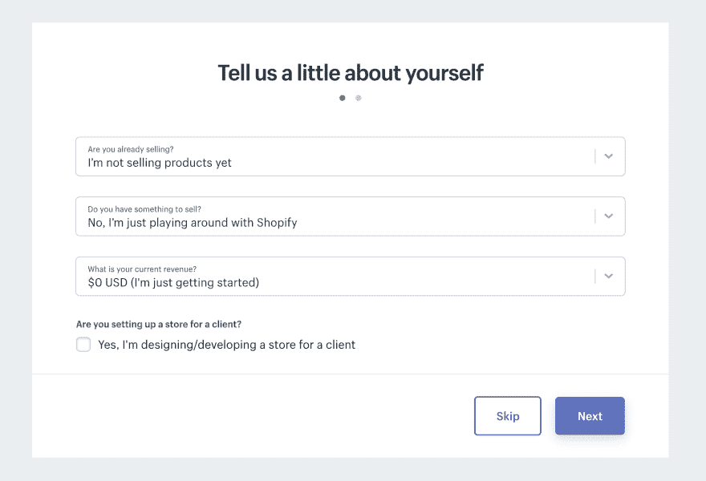
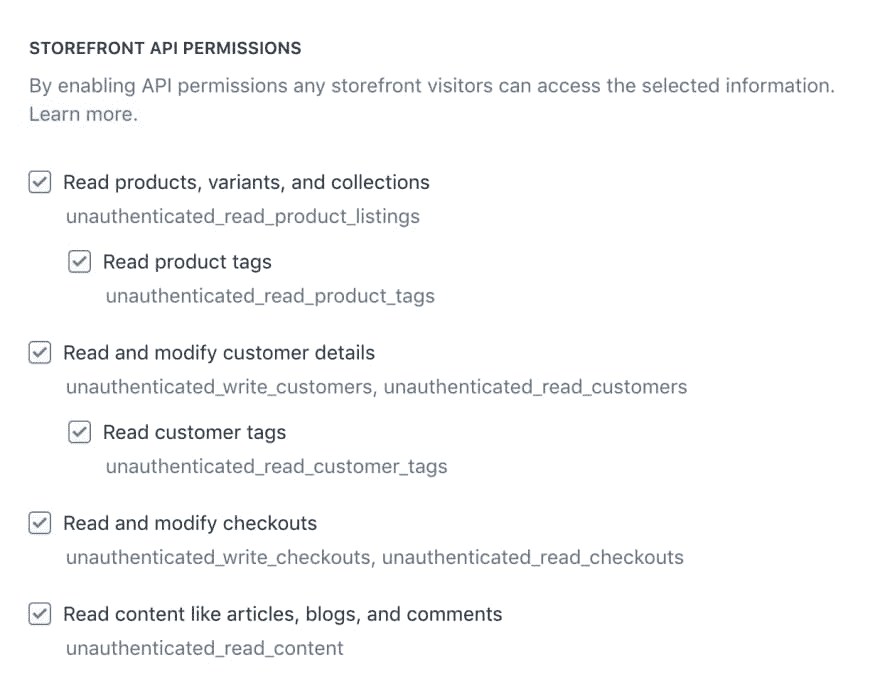
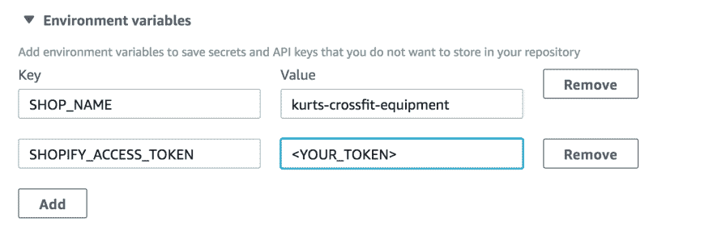
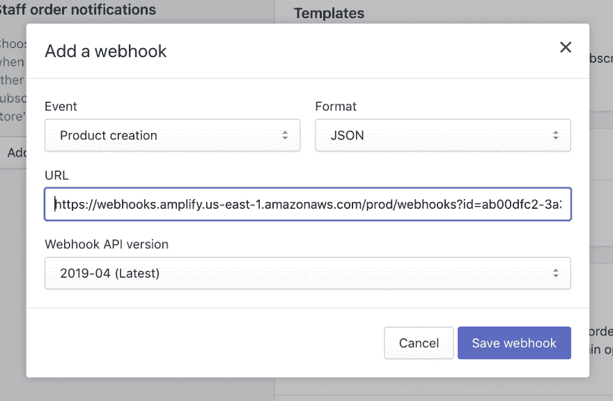
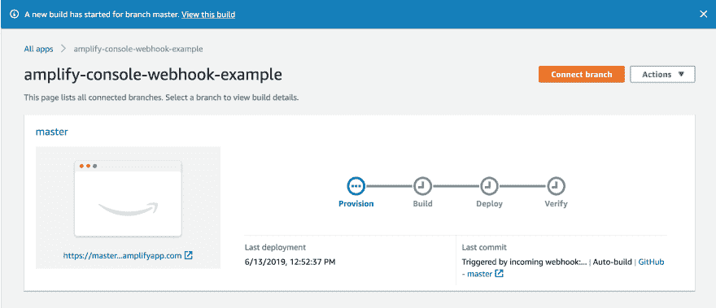

# 通过 AWS Amplify 控制台中的 Web 挂钩保持静态内容新鲜

> 原文：<https://dev.to/kkemple/keeping-your-static-content-fresh-with-web-hooks-in-aws-amplify-console-56lj>

如今，当谈到构建网站和 web 应用程序时，经常会听到“JAMstack”这个术语。JAMstack 代表 JavaScript、API 和标记。想法是用 JavaScript 创建静态标记，通过与 API 通信来提供支持。

这种堆栈变得如此受欢迎的原因是因为它允许网站或应用程序捆绑在一起，并通过 CDN 在“边缘”提供服务。再加上一个理想的高性能应用程序，它可以与高性能 API 对话，这样你就可以获得快速的用户体验。博客、仪表盘甚至电子商务网站都是以这种风格构建的。

但是，因为内容是静态的，所以要确保内容始终是最新的并正确反映备份数据，可能会变得繁琐或过于复杂。当数据由第三方供应商(如 headless CMSs 和电子商务平台)提供时，这个问题会变得更加严重。

在这篇博文中，我将讲述如何用 Gatsby 和 Shopify 创建一个静态的电子商务网站，当网站的代码发生变化或者 Shopify 中的数据更新时，这个网站将会重新构建和部署。我们将使用 AWS Amplify 控制台来完成这项工作。Amplify Console 为部署和托管 web 应用程序提供了基于 Git 的工作流。

## 设置您的商店

你需要做的第一件事是启动一个新项目！对于这个例子，我们将使用一个 [Gatsby & Shopify starter](https://www.gatsbyjs.org/starters/AlexanderProd/gatsby-shopify-starter/) ，它将为我们提供一个能够处理大多数基本电子商务功能的基本 web 应用程序。要使用这个启动器创建一个新的 Gatsby 项目，运行以下命令:

```
npx gatsby new my-shop https://github.com/AlexanderProd/gatsby-shopify-starter
cd my-shop
gatsby develop 
```

接下来打开浏览器到 [http://localhost:8000](http://localhost:8000) 查看你的 app。它应该是这样的:

[](https://res.cloudinary.com/practicaldev/image/fetch/s--q0EmbU16--/c_limit%2Cf_auto%2Cfl_progressive%2Cq_auto%2Cw_880/https://thepracticaldev.s3.amazonaws.com/i/gmc1ywjmj7z60m2jl219.png)

一旦您确认您的应用程序正在运行，您将需要创建一个 Shopify 帐户。您将无法对当前使用的帐户进行更新。要创建一个账户，导航到[shopify.com](http://shopify.com/)并点击`Start Free Trial`按钮。输入要求的信息和您的店铺名称，以下是我使用的信息:

[](https://res.cloudinary.com/practicaldev/image/fetch/s--Lt0Ah3s3--/c_limit%2Cf_auto%2Cfl_progressive%2Cq_auto%2Cw_880/https://thepracticaldev.s3.amazonaws.com/i/ly9ru1ssuokjpwooyqng.png)

一旦你选择了你的店铺名称，你将被要求回答几个问题，以下是我选择的答案:

[](https://res.cloudinary.com/practicaldev/image/fetch/s--JXn82h9u--/c_limit%2Cf_auto%2Cfl_progressive%2Cq_auto%2Cw_880/https://thepracticaldev.s3.amazonaws.com/i/5afevrcoto40v8w6xmh6.png)

填写完问题后，点击`Next`，填写个人详细信息。然后点击`Go to My Store`。

> 我建议您现在也确认一下您的电子邮件。

进入商店管理门户后。导航至左侧菜单面板中的`Products`并创建新产品。确保设置价格、图像和至少 1 的数量。

接下来，您需要创建一个私有应用程序来获取 API 访问令牌。在下一步中，您将需要这些。按照此处的说明[创建您的应用并获取您的访问令牌。](https://help.shopify.com/en/api/getting-started/authentication/private-authentication#generate-credentials-from-the-shopify-admin)

> 注意，您需要启用 Storefront API 并检查所有权限！您还需要使用 Storefront API 令牌，而不是 Admin API 令牌！见下图:

[](https://res.cloudinary.com/practicaldev/image/fetch/s--pvouYznJ--/c_limit%2Cf_auto%2Cfl_progressive%2Cq_auto%2Cw_880/https://thepracticaldev.s3.amazonaws.com/i/jhhwigw281xofh4ip6s3.png)

一旦你有了凭证，打开`.env.development`，用你自己的替换现有的 API 令牌和商店名称。

```
SHOP_NAME=kurts-crossfit-equipment
SHOPIFY_ACCESS_TOKEN=<YOUR_STOREFRONT_API_TOKEN> 
```

在您替换了环境变量之后，重新启动 Gatsby，您现在应该可以看到您商店的产品了！

## 部署您的商店

现在你有了一个正常运作的商店。下一步是将其部署到 CDN，这样用户就可以进行购买了！为了建立部署管道，您需要创建一个新的 git 存储库，并将其连接到 Amplify 控制台。

首先与您选择的提供商(GitHub、GitLab、BitBucket、CodeCommit)创建一个新的回购，然后推送您的应用程序。

> 在将代码添加到源代码控制之前，删除`.env.production`并将`.env.development`添加到您的`.gitignore`文件中。然后运行:`git rm —cached .env.development`。

```
git add .
git commit -m 'initial commit'
git remote add origin <YOUR_REPOSITORY>
git push —set-upstream origin master 
```

下一步是将您的存储库连接到 Amplify 控制台。打开 AWS 控制台，点击`Connect App`按钮。选择您的新存储库，选择您想要构建的分支，然后点击`Next`。

Amplify 控制台将自动检测这是一个 Gatsby 项目，并自动为您填充正确的构建设置。但是，您需要添加 Shopify 环境变量。添加店铺名称和访问令牌，然后点击`Next`，再点击`Save and Deploy`进入下一步。

[](https://res.cloudinary.com/practicaldev/image/fetch/s--ggEFaqnw--/c_limit%2Cf_auto%2Cfl_progressive%2Cq_auto%2Cw_880/https://thepracticaldev.s3.amazonaws.com/i/yyo7ekikynj1h5xaxshm.png)

此时，Amplify Console 将在全球 CDN 中构建和部署您的商店。构建完成后，通过导航到提供的 URL 来验证您的商店是否处于活动状态。由于应用程序连接到您的存储库，每次您推送至您为构建指定的分支时，Amplify Console 都会为您重新构建和部署应用程序。

当涉及到代码更改时，这对于保持您的网站新鲜非常好，但是当您在 Shopify 中更改信息时会发生什么呢？发生这种情况时，如何触发重建？嗯，Amplify Console 支持基于传入的 webhooks 触发构建。在下一节中，您将设置一个并将其连接到 Shopify。

## 设置网页挂钩，保持内容新鲜

在放大控制台中，从侧面菜单中选择`Build Settings`。在`Incoming Webhooks`部分，点击`Create webhook`。为它提供一个名称，以及它应该在哪个分支上触发构建，然后点击`Create`。

复制 webhook URL，然后转到您的 Shopify 商店管理面板。导航至`Settings > Notifications`并向下滚动页面。在`Webhooks`部分，点击`create webhook`。

从事件列表中，选择`Product creation`并将 webhook URL 从 Amplify 控制台粘贴到 Shopify 中的 URL 输入中。保存 webhook。

[](https://res.cloudinary.com/practicaldev/image/fetch/s--YfNlrJYQ--/c_limit%2Cf_auto%2Cfl_progressive%2Cq_auto%2Cw_880/https://thepracticaldev.s3.amazonaws.com/i/4l8wccfpgooresvrl2kd.png)

现在是验证它是否有效的时候了！创建一个新产品，保存后，返回 Amplify 控制台，查看是否为您的应用程序触发了新版本。

[](https://res.cloudinary.com/practicaldev/image/fetch/s--L1wtmMv5--/c_limit%2Cf_auto%2Cfl_progressive%2Cq_auto%2Cw_880/https://thepracticaldev.s3.amazonaws.com/i/nlvbae8k4qoam6fgjcco.png)

如果你的 webhook 配置正确，你会看到一个新的构建已经开始了！恭喜你，你现在可以使用同一个 URL 在 Shopify 中添加任意数量的 webhooks 了！这将适用于任何支持调用 webhooks 的服务！