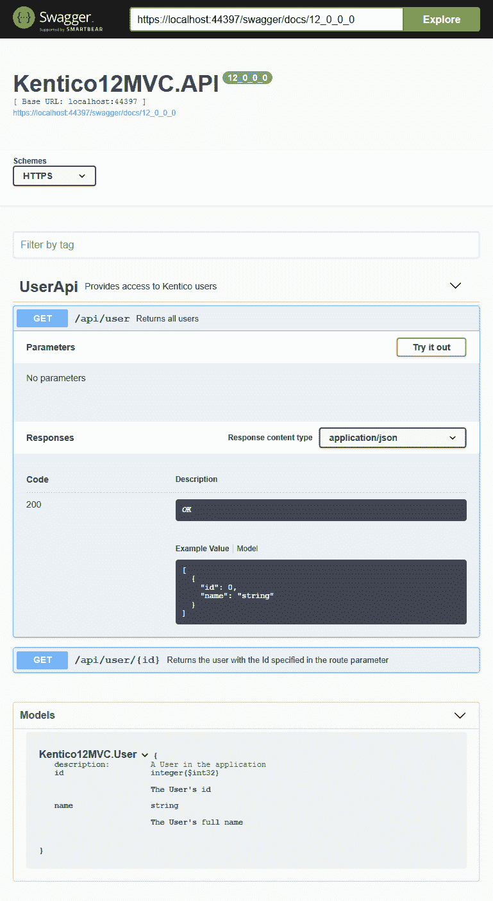

# Kentico 12:设计模式第 7 部分-集成 Web API 2

> 原文：<https://dev.to/seangwright/kentico-12-design-patterns-part-7-integrating-web-api-2-4ldg>

<figure>

[](https://res.cloudinary.com/practicaldev/image/fetch/s--Y_WMxk-w--/c_limit%2Cf_auto%2Cfl_progressive%2Cq_auto%2Cw_880/https://thepracticaldev.s3.amazonaws.com/i/dcl0raddowtu0vncahpz.jpg)

<figcaption>Photo by [Alain Pham](https://unsplash.com/@alain_pham) on [Unsplash](https://unsplash.com)</figcaption>

</figure>

我最近在[biztream](https://www.bizstream.com/)阅读了 [Mike Webb](https://www.bizstream.com/about/team/mike-webb) 的一篇[精彩帖子](https://www.bizstream.com/blog/may-2019/how-to-set-up-web-api-in-a-kentico-12-mvc-project)，讲述了如何快速将 API 特性集成到我们的 Kentico 12 MVC 应用程序中。👍

如果你没有使用过 Web API 2，ASP。NET 的 API 框架，我强烈建议阅读一下这篇文章。👌🚀

我想在这里介绍一些我在过去几年在 Kentico 中使用 Web API 2 时发现的最佳实践和惯例( [WiredViews](https://www.wiredviews.com/) 从 Kentico 8 开始就已经将 Web API 2 集成到 Kentico 中了！).

* * *

## 路由🗺

### 属性路由

ASP.NET MVC 允许开发人员通过`RouteCollection.MapRoute()`方法使用约定胜于配置的方法定制路由。

Web API 2 提供了类似的方法，使用基于[约定的路由](https://docs.microsoft.com/en-us/aspnet/web-api/overview/web-api-routing-and-actions/routing-in-aspnet-web-api)和`HttpConfiguration.Routes.MapHttpRoute()`，但是我推荐使用[属性路由](https://docs.microsoft.com/en-us/aspnet/web-api/overview/web-api-routing-and-actions/attribute-routing-in-web-api-2)。

属性路由允许更容易地定制和分层/面向资源的 URL 结构。

因为 API 通常是通过 URL 模式发现的，而不是通过跟踪链接，所以能够识别哪个 URL 模式匹配`ApiController`的每个方法是非常有帮助的。

### 路线提供商

如果您想集中一些路由配置，框架中有一些钩子点可以帮助您。

一个定制的`DefaultDirectRouteProvider`类可以用来[在一个位置插入一个一致的路由前缀](https://www.strathweb.com/2015/10/global-route-prefixes-with-attribute-routing-in-asp-net-web-api/)。

实现可能是这样的:

```
protected override string GetRoutePrefix(HttpControllerDescriptor controllerDescriptor)
{
    string controllerPrefix = base.GetRoutePrefix(controllerDescriptor);

    return controllerPrefix is null
        ? "api"
        : string.Format("{0}/{1}", "api", controllerPrefix);
} 
```

Enter fullscreen mode Exit fullscreen mode

这是在你所有的`ApiController`上添加`[RoutePrefix("api/...")]`的一个很好的选择。😁

我还建议您为 API 路由添加前缀，使它们与 MVC 路由分开，因为您将在同一个应用程序中托管这两个框架。

* * *

## API 文档

### 昂首阔步

当我们查看 URL 和可发现性时，有一个重要的工具我们可以轻松地添加到我们的应用程序中，以暴露这些 API 端点(甚至测试它们！)

如果你没有听说过 [Swagger](https://swagger.io/) ，它是一套显示交互式仪表盘的工具，由定制的 API 支持。当使用 API 的开发人员(例如:前端)不是构建 API 的开发人员(例如:后端)时，在项目中使用 Swagger 会非常有帮助。

用户可以查看应用程序的整个 API，并通过填写一些字段并单击“试用”来测试它。

> 如果你仍然不确定我在说什么，看看这个[现场演示](https://petstore.swagger.io/)

### 招摇-网

然而，Swagger 并不特定于一种语言或框架，所以我们需要一种方法将其集成到我们的 ASP.NET 应用程序中。

这就是大摇大摆网的用武之地。Swagger-Net 是 Swagger 的一个包装器，它在我们的`ApiController`类上使用 XML 注释，然后为我们的 API 自动生成正确的 Swagger UI。

> 还有另一个项目叫做 [Swashbuckle](https://github.com/domaindrivendev/Swashbuckle) ，我用了几年，提供了类似的功能，但是维护者的重点已经转移到 ASP.NET 核心。
> 
> 我现在推荐您在基于 ASP.NET 的 Kentico 12 MVC 应用程序中使用 Swagger-Net。

下面是带有一些 XML 文档注释的示例`User`和`ApiController`类:

```
namespace Kentico12MVC
{
    /// <summary>
    /// A User in the application
    /// </summary>
    public class User
    {
        /// <summary>
        /// The User's id
        /// </summary>
        public int Id { get; set; }

        /// <summary>
        /// The User's full name
        /// </summary>
        public string Name { get; set; }
    }

    /// <summary>
    /// Provides access to Kentico users
    /// </summary>
    [RoutePrefix("user")]
    public class UserApiController : ApiController
    {
        /// <summary>
        /// Returns all users
        /// </summary>
        [Route("")]
        [ResponseType(typeof(IEnumerable<User>))]
        public IHttpActionResult GetUsers()
        {
            var users = UserInfoProvider
                .GetUsers()
                .AsEnumerable()
                .Select(u => new User { Id = u.UserID, Name = u.UserName });

            return Ok(users);
        }

        /// <summary>
        /// Returns the user with the Id specified in the route parameter
        /// </summary>
        /// <param name="id"></param>
        [Route("{id:int}")]
        [ResponseType(typeof(User))]
        public IHttpActionResult GetUser(int id)
        {
            var user = UserInfoProvider.GetUserInfo(id);

            return Ok(new User { Id = user.UserID, Name = user.UserName });
        }
    }
} 
```

Enter fullscreen mode Exit fullscreen mode

以上将在您的站点中生成以下 Swagger UI:

[](https://res.cloudinary.com/practicaldev/image/fetch/s--Oi7QeGF9--/c_limit%2Cf_auto%2Cfl_progressive%2Cq_auto%2Cw_880/https://thepracticaldev.s3.amazonaws.com/i/zfori7krbnynsj7x9rr6.png)

相当酷！😎😎😎

> 我创建了一个 [GitHub Gist](https://gist.github.com/seangwright/7699f89e3ce7a637bdd8e7e912a30e04) ，它详细描述了我将 Swagger-Net 集成到 Web API 2 中所做的一些定制配置。

* * *

## 错误处理

### IExceptionHandler

当异常发生在 ASP.NET MVC 中时，我们有几种方法来防止这些异常上升到框架中并使应用程序崩溃。

> 没有人希望他们的用户看到[死亡](https://stackoverflow.com/questions/5443334/asp-net-hacking-the-yellow-screen-of-death)的丑陋黄屏。😨

为了全局处理错误，在 ASP.NET，我们通常在我们的`Global.asax.cs`文件中添加一个事件处理程序，如下所示:

```
public void Application_Error(object sender, EventArgs e)
{
    ApplicationErrorLogger.LogLastApplicationError();
} 
```

Enter fullscreen mode Exit fullscreen mode

在 Web API 2 中，最好的方法是创建并注册一个自定义的`IExceptionHandler`。

此类型有一个公共方法`HandleAsync`，每当在请求/响应管道中生成未处理的异常时，都会调用该方法。

您可以使用这个方法将不同的`IHttpActionResult`实例分配给`ExceptionHandlerContext.Result`属性。然后，这个结果将被发送回请求者。

### 自定义异常类型

我总是在我的应用程序中创建定制的异常类型来表示不可恢复的错误(例如:`NotAuthenticatedException`、`NotFoundException`、`BadRequestException`)。

使用一些反射，我们可以确定由`IExceptionHandler`捕获的异常是否是这些自定义类型之一，然后返回正确的`HttpStatusCode`和错误消息:

```
private (HttpStatusCode code, ApiError error) BuildError(Exception exception)
{
    var buildApiError = CaptureErrorId(Guid.NewGuid());

    switch (exception)
    {
        case HttpException httpEx:
            return ((HttpStatusCode)httpEx.GetHttpCode(), buildApiError("HTTP_EXCEPTION", "Server error"));
        case NotAuthenticatedException notAuthNEx:
            return (HttpStatusCode.Unauthorized, buildApiError("NOT_AUTHENTICATED", "This endpoint requires authentication"));
        case NotAuthorizedException notAuthZEx:
            return (HttpStatusCode.Forbidden, buildApiError("NOT_AUTHORIZED", "The request was not authorized to perform that action"));
        case BadRequestException badRequestEx:
            return (HttpStatusCode.BadRequest, buildApiError("BAD_REQUEST", "The request was malformed"));
        case NotFoundException notFoundEx:
            return (HttpStatusCode.NotFound, buildApiError("NOT_FOUND", "The requested data could not be found"));
        default:
            return (HttpStatusCode.InternalServerError, buildApiError("APPLICATION_EXCEPTION", "Server error"));
    }
} 
```

Enter fullscreen mode Exit fullscreen mode

这也是集中日志的好地方，使用 Kentico 的`EventLogProvider.LogException()`方法或类似 [Serilog](https://serilog.net/) 的东西。👍

> 在这个 [GitHub Gist](https://gist.github.com/seangwright/139868f800503c118be9675cc8aa02c3) 中，我有一个用于自定义错误处理的代码示例

* * *

## 序列化

### 集中存储序列化配置

与应用程序中的 MVC 特性相比，API 特性更依赖于序列化。这主要是因为进出 API 的所有数据都可能是 JSON 格式的。

如果你开始定制`IHttpActionResult`类型，你将需要使用`JsonMediaTypeFormatter`创建 API 响应，如果你希望你的定制结果更容易测试的话。

集中`JsonMediaTypeFormatter`配置的最简单方法是将它添加到您的 IoC 容器中，然后在您需要的地方将其作为依赖项注入。

> 参见上面的自定义错误处理要点，以了解这方面的示例。

这意味着当我为我的 API 配置格式时，我从我的容器中解析它:

```
// In my Web Api configuration class

var config = new HttpConfiguration();

// ...

config.Formatters.Add(container.Resolve<JsonMediaTypeFormatter>()); 
```

Enter fullscreen mode Exit fullscreen mode

### 序列化和数据库日期精度

除了在 DI 容器中集中配置您的序列化之外，您还需要仔细检查您的序列化设置是否配置为与您的数据库的需求相匹配。

我的通常是这样的:

```
builder.Register(c => new JsonSerializerSettings
{
    Formatting = Formatting.None,

    // UTC Date serialization configuration
    DateFormatHandling = DateFormatHandling.IsoDateFormat,
    DateParseHandling = DateParseHandling.DateTimeOffset,
    DateTimeZoneHandling = DateTimeZoneHandling.Utc,

    // Use X digits of precision (fffffff) to match data store datetimeoffset(X)
    DateFormatString = "yyyy-MM-ddTHH:mm:ss.fffK",

    ContractResolver = new CamelCasePropertyNamesContractResolver()
}) 
```

Enter fullscreen mode Exit fullscreen mode

如果您在页面类型或定制模块类字段中使用特定的`datetimeoffset`数据类型，您将希望确保 JSON 序列化与该精度相匹配，否则您可能会在序列化/反序列化过程中丢失数据。😯

> 如果您对[乐观并发控制](https://en.wikipedia.org/wiki/Optimistic_concurrency_control)使用“最后修改日期”,这个问题经常会出现——您需要来自客户端的反序列化日期与数据库中的日期完全匹配。

您可能还想偶尔在 MVC 代码中序列化/反序列化 JSON。

如果这是一个需求，并且您希望您的`JsonSerializerSettings`与您在 API 管道中配置的相匹配，那么使用一个定制的`ValueProviderFactory`来处理`application/json`请求。

> 如何做到这一点的例子可以在这个 [GitHub 要点](https://gist.github.com/seangwright/64b6fdbb0f7578517dbae8634733aae9)中找到

* * *

## 定义您的 API 合同

### 请求和响应类型

当编写`ApiControllers`来公开来自 Kentico 的数据时，我们的第一个倾向可能是直接返回我们从`*Provider`类查询的`*Info`和自定义 PageType 对象。

我认为这种方法有两个问题。

1.  ❌它向外界公开了系统内部(大部分与 Kentico 中的数据持久性有关)。这可能导致紧耦合和泄漏的抽象。
2.  ❌来自数据库的 Kentico 类型有许多字段和值，其中大部分与 API 的消费者无关。这导致了过重的负载和混乱的 API 响应。

正如 Kentico 建议创建视图模型类来将数据传输到我们的视图，我们也应该在 API 表示层使用定制的模型类型(我们的`ApiController`类)。

我遵循将这些类型命名为`*Request`和`*Response`类的惯例。这样更容易谈论它们，确定它们的目的，并避免上述两个问题。

### 请求验证☑

有一个很棒的库可以帮助验证请求类实例是否有效。

我推荐使用 [FluentValidation](https://fluentvalidation.net/) 来制定灵活的、可读的、可测试的验证需求。

下面是一个请求类及其相关验证器类的例子:

```
public class CustomerCreateRequest
{
  public int Id { get; set; }
  public string FirstName { get; set; }
}

public class CustomerRequestValidator :
    AbstractValidator<CustomerCreateRequest> {

  public CustomerRequestValidator() {
    RuleFor(c => c.Id).GreaterThan(0);
    RuleFor(c => c.FirstName).NotEmpty();
  }

} 
```

Enter fullscreen mode Exit fullscreen mode

比起属性验证，我更喜欢这种类型的验证，主要是因为这更强大。

我还建议让您的端点在功能上粒度化。端点做得越多，出错的机会就越大，这意味着要处理回滚事务以确保一致性。

每个请求需要验证的越少，无效的就越少。

如果每个端点都被消费者视为一个事务(合理的期望！)且“请求事务”最多映射到一个或两个数据库/系统事务，那么您的系统状态将更容易管理，并且更难进入无效或不完整的状态。😄

* * *

## 通过面向方面编程(AOP)横切关注点

### 测井

除了将日志添加到您的定制`IExceptionHandler`之外，您可能还想将日志添加到应用程序的其他部分——成功处理请求的地方。

我的建议是，既然你无论如何都要使用 IoC 容器，那么就通过 AOP 来应用日志记录——更具体地说是用[修饰](https://autofaccn.readthedocs.io/en/latest/advanced/adapters-decorators.html#decorators)。

> 注意:所有这些模式同样适用于你的 MVC 代码。

假设您有一个如下返回用户的`IUserService`:

```
public interface IUserService
{
    UserInfo GetUser(int userId);
} 
```

Enter fullscreen mode Exit fullscreen mode

我们还假设您有一个如下所示的实现:

```
public class KenticoUserService : IUserService
{
    public UserInfo GetUser(int userId) =>
        UserInfoProvider.GetUserInfo(userId);
} 
```

Enter fullscreen mode Exit fullscreen mode

现在，如果您想在每次成功找到用户时记录日志，如果没有找到用户，您会将这些日志语句放在哪里？🤔

我认为你不会把它们放在我们上面看到的代码中的任何地方。😦

相反，我们应该用另一个只做一件事的实现来修饰`IUserService`——日志。然后，它将检索用户的过程委托给`KenticoUserService`。🧐

下面是一个示例实现:

```
public class LogUserServiceDecorator : IUserService
{
    private readonly IUserService original;

    public LogUserServiceDecorator(IUserService original)
    {
        Guard.Against.Null(original, nameof(original));

        this.original = original;
    }

    public UserInfo GetUser(int userId)
    {
        var user = original.GetUser(userId);

        if (user is null)
        {
            Log.Debug("User with {userId} not found", userId);
        }
        else
        {
            Log.Debug("User with {userId} found!", userId);
        }

        return user;
    }
} 
```

Enter fullscreen mode Exit fullscreen mode

上面的`original`类字段是“修饰”类型。`LogUserServiceDecorator`类型实现了`IUserService`契约，并且每当我们请求在构造函数中注入`IUserService`时，它将是我们的应用程序中实际提供的类型。

`LogUserServiceDecorator`在其中保存了“原始的”`KenticoUserService`(作为`IUserService`)，它被称为`userId`参数来完成获取用户的实际工作。

然后，我们的装饰服务记录由`original`服务返回的结果信息。

最后，装饰服务返回`user`，完成`IUserService`契约，而应用程序的其余部分和“原始”实现则一无所知。🤯

每个类都服务于一个目的，横切关注点(如日志)不会增加我们业务逻辑的长度或复杂性。🙌

> 仅供参考，我使用上面的`original`作为一个指示性名称——在做 AOP 时没有这样命名的惯例。

### 缓存💸

您可能正在为您的 MVC 应用程序使用输出缓存，特别是考虑到一个复杂的 Kentico 站点的数据量可能会非常大。

您可能还应该在 API 层中使用缓存。

Kentico 提供了调用您传递给它的委托的`CacheHelper.Cache()`方法，并在将值返回给调用者之前缓存该委托的结果。

您需要做的只是设置缓存项所依赖的缓存键(哪些数据更改会使缓存无效)，以及您希望数据缓存多长时间。

这里有一个很好的小助手类，可以让缓存更容易:

```
public static class CacheSettingsExtensions
{
    /// <summary>
    /// Assigns an array of cache dependency keys to the given CacheSettings
    /// and a function which returns a result to be cached
    /// </summary>
    public static T SetCacheDependency<T>(
        this CacheSettings cs, 
        string[] cacheDependencyKeys, 
        Func<T> getResult)
    {
        cs.CacheDependency = cs.Cached
            ? CacheHelper.GetCacheDependency(cacheDependencyKeys)
            : cs.CacheDependency;

        return getResult();
    }
} 
```

Enter fullscreen mode Exit fullscreen mode

您可以如下使用上面的类:

```
var cacheDependency = new string[] { "cms.user|all" };

IEnumerable<UserInfo> users = CacheHelper
    .Cache(cs => cs.SetCacheDependency(
            cacheDependency,
            () => UserInfoProvider.GetUsers().AsEnumerable()),
        new CacheSettings(120, "api.user.all");

return users; 
```

Enter fullscreen mode Exit fullscreen mode

我敢打赌，您已经知道我会如何推荐将缓存集成到您的 API 层中！没错——AOP！😜

为了模仿前面的`LogUserServiceDecorator`示例，我们可以创建一个`CacheUsersServiceDecorator`并用对您的“原始”服务的调用来替换`UserInfoProvider.GetUsers().AsEnumerable()`。

* * *

## 了解 ASP.NET vs OWIN 管道

如果你对已经有了`Global.asax.cs`为什么还要有一个`Startup.cs`类，OWIN 是什么，以及为什么 Web API 2(如果你仔细看的话)看起来像 ASP.NET 核心感到困惑，那么理解它与 ASP.NET MVC 的不同会很有帮助。🤨

在设计或集成使用 Web API 2 或 MVC 但不同时使用两者的代码时，记住以下概念也是有帮助的。

### Startup.cs

`Startup.cs`来自于对 ASP.NET 应用在没有 IIS 和不断增长的`System.Web`库的情况下运行意味着什么的重新思考。

它是一种新型的 ASP.NET 入口点，定义了一系列“中间件”。

中间件是链接成管道的代码片段，可以按照定义的顺序对 HTTP 请求进行操作，也可以按照相反的顺序对生成的响应进行操作。

### OWIN 和武士刀

那么什么是 OWIN 和武士刀，它们是如何与 Web API 2 联系在一起的呢？

这里有一些定义

*   Web API 2:微软为一个类似 MVC 的模式提供的解决方案，该模式原生返回 XML/JSON，而不是服务器呈现的 HTML 视图，它在项目 Katana 基础设施上工作。

*   Project Katana:微软对 OWIN 契约(一个字典)的实现，它规定了 HTTP 请求和响应数据在通过处理管道(一堆代理/中间件)时存储在哪里。

*   OWIN:开放网络界面。NET 试图定义一种方法来分离。NET web 服务及其运行的服务器。OWIN 应用程序应该能够在 IIS 之外运行，并且有可能在 Windows 之外的操作系统上运行。(听起来很像 ASP.NET 核心！！)

> 你可以在微软的文档中找到大量关于 OWIN 和武士刀的历史信息。我在晚上喝一杯冰啤酒的时候读这些东西来找乐子。

下面是 Brock Allen (因 Identity Server 而出名)的视频演示，详细介绍了 2014 年初 OWIN 与经典 ASP.NET 建筑的不同之处。

## 知识

让我们回顾一下我们已经讨论过的许多要点:

*   按指定路线发送
    *   使用属性路由最大程度地符合 API 的设计方式。
    *   使用框架提供的钩子集中路由配置。
*   API 文档
    *   Swagger 是一个用于记录和探索 API 的很好的 UI。
    *   Swagger-Net 提供了一种简单的方法将 Swagger 集成到我们的 ASP.NET 应用程序中。
*   错误处理
    *   创建您自己的自定义错误处理程序来捕获和记录未处理的异常。
    *   使用自定义异常类型向客户端返回有用的 HTTP 状态代码。
*   序列化
    *   将您的序列化配置放在 IoC 容器中，以实现序列化一致性。
    *   确保日期序列化与数据库类型相匹配。
*   定义您的 API 合同
    *   在 API 的边缘使用请求和响应模型来抽象出 Kentico 实现细节。
    *   FluentValidation 是声明性地验证您的请求模型的好方法。
*   使用面向方面编程(AOP)
    *   日志是一个跨领域的问题，应该通过修饰来应用，而不是内嵌在您的业务逻辑中。
    *   Kentico 提供了有用的缓存方法，也可以用于装饰。
*   ASP.NET 和 OWIN
    *   对于 ASP.NET 来说,`Startup.cs`是一个新的入口/集成点。
    *   ASP.NET 核心的前身是 OWIN 和武士刀，是 Web API 2 的基础。

如果你一直跟我在一起，那么你是一个非常专注的开发者，重视知识，或者你只是有点无聊。🤣

不管怎样，我希望我关于如何在你的 Kentico 12 MVC 项目中使用 ASP.NET Web API 2 的这些想法是有帮助的。

* * *

如果您正在寻找更多的 Kentico 内容，请在 DEV:

## # [肯蒂科](https://dev.to/t/kentico) <button name="button" type="button" data-info="{&quot;className&quot;:&quot;Tag&quot;,&quot;style&quot;:&quot;full&quot;,&quot;id&quot;:5339,&quot;name&quot;:&quot;kentico&quot;}" class="crayons-btn follow-action-button whitespace-nowrap c-btn--secondary fs-base " aria-label="Follow tag: kentico" aria-pressed="false">跟随</button>

或者我的 [Kentico 12:设计模式](https://dev.to/search?q=Kentico%2012%20-%20Design%20Patterns)系列。