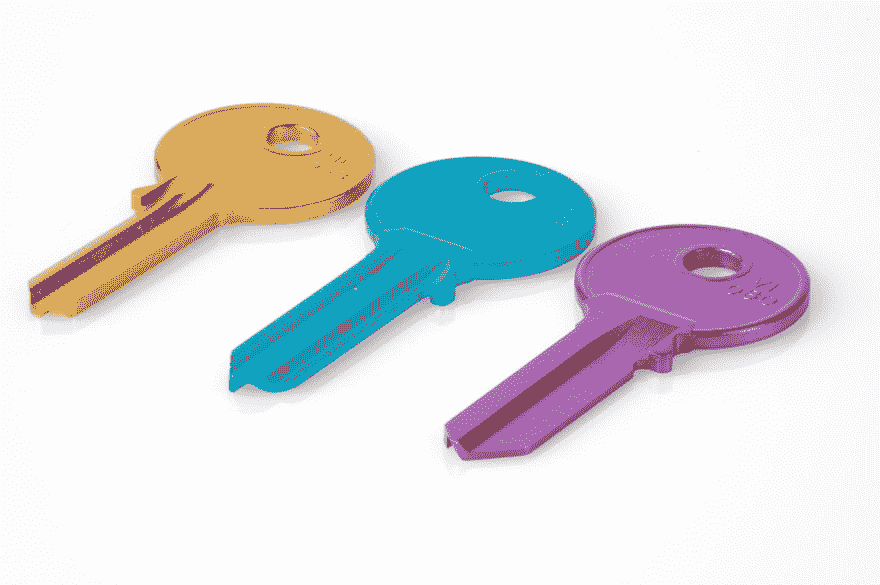

# Kentico CMS 快速提示:FluentCacheKeys -一致的缓存依赖项密钥生成

> 原文：<https://dev.to/wiredviews/kentico-cms-quick-tip-fluentcachekeys-consistent-cache-dependency-key-generation-9ek>

<figure>

[](https://res.cloudinary.com/practicaldev/image/fetch/s--zuJiRRg3--/c_limit%2Cf_auto%2Cfl_progressive%2Cq_auto%2Cw_880/https://thepracticaldev.s3.amazonaws.com/i/qz775qwmt5cyve6w6a70.jpg)

<figcaption>Photo by [Florian Berger](https://unsplash.com/@bergerteam) on [Unsplash](https://unsplash.com)</figcaption>

</figure>

## 肯蒂科💕贮藏

数据驱动的内容管理系统，如 Kentico CMS，严重依赖于缓存来实现灵活的内容合成，同时仍能以最快的速度向网站访问者提供信息。

门户引擎技术在 Kentico 12 之前驱动了大多数 Kentico 应用程序，它提供了现成的缓存配置，并允许在数据、组件、文件和页面级别进行高度可配置的缓存。

现在，开发人员承担了更多的缓存数据的责任，这些数据用于运行他们的 Kentico 12 MVC 应用程序💪。

幸运的是，由 Kentico 提供的用于在定制代码中缓存的[API 既强大又相对简单。](https://docs.kentico.com/k12sp/configuring-kentico/configuring-caching/caching-in-custom-code)

## 缓存依赖键的重要性

在之前的一篇文章中(链接如下),我写了如何使用软件设计模式缓存数据库查询的结果，比如面向方面编程、依赖注入和单一责任原则🤓。

> [](/seangwright) [## Kentico12: Design Pattern Part 12-Database Query Cache Pattern
> 
> ### Sean G Wright August Read
> 
> # Kentico # MVC # Caching # CSharp](/seangwright/kentico-12-design-patterns-part-12-database-query-caching-patterns-43hc)

在那篇文章中，我还详细介绍了为被缓存的数据指定正确的缓存依赖键对于保证缓存的有效性是多么重要。

当内容在 CMS 中更新时，我们希望(现在已经过时的)数据的缓存将被从缓存中清除👢。

如果我们在缓存中存储一些东西时没有指定正确的缓存依赖键，我们将冒这种情况不会发生的风险😨。

> 缓存依赖键是 CMS 中特定内容或信息与 MVC 应用程序中缓存的数据之间的粘合剂。

## 构建缓存依赖键可能很棘手

所以，现在你可能会想，“这似乎很重要，我们如何确保我们创建正确的密钥🤷‍♀️?"

嗯，Kentico 确实为我们可能缓存的各种类型的数据(页面、附件、媒体文件)提供了一个很好的缓存键模式表👍。

这些模式是字符串，用来自我们应用程序的运行时数据替换特定的占位符:

```
string key = "node|<site name>|<alias path>|<culture>"; 
```

Enter fullscreen mode Exit fullscreen mode

当令牌(如`<site name>`)被替换为真实的站点值时，我们最终得到一个如下所示的键:

```
string key = "node|corporatesite|/home|en-us"; 
```

Enter fullscreen mode Exit fullscreen mode

我们也可以使用 C# [字符串插值](https://docs.microsoft.com/en-us/dotnet/csharp/language-reference/tokens/interpolated)来帮助我们替换变量，而不是使用字符串连接👏。

```
string siteName = "Sandbox";
string nodeAliasPath = "/home";
string culture = "en-us";

string key = $"node|{siteName}|{nodeAliasPath}|{culture}"; 
```

Enter fullscreen mode Exit fullscreen mode

在我看来，他们可能很难读懂🧐，很容易打错⌨...(别忘了那些管子`|`！)

我们团队中的另一个开发人员，Michael 认为想出一个方法来一致地生成这些密钥以避免上面提到的问题是一个好主意💡。

我非常喜欢这个主意，⚡！

它可以帮助我们避免不可避免的重复代码中的错误(大量的查询`==`大量的缓存`==`大量的键)。

它还可以帮助我们编写测试，确保创建正确的缓存键😎。

因此，我创建了一个库，并将其开源，这样 Kentico 社区的其他人就可以试用它并给出一些反馈👐！

## FluentCacheKeys

库 FluentCacheKeys 受到了启发💗由其他几个具有可读性和易用性 API 的项目完成，如 [FluentAssertions](https://github.com/fluentassertions/fluentassertions) 、 [FluentValidation](https://github.com/JeremySkinner/FluentValidation) 和 [GuardClauses](https://github.com/ardalis/GuardClauses) 。

## /[kentico-fluent-cache-keys](https://github.com/wiredviews/kentico-fluent-cache-keys)

### 用于为 Kentico CMS 应用程序生成一致的缓存依赖项的实用程序库

```
# Kentico Fluent Cache Keys
Utility library for generating consistent cache dependency keys for Kentico CMS applications
[Install the NuGet Package](https://www.nuget.org/packages/WiredViews.Kentico.FluentCacheKeys/)
## Examples

### Creating cache keys for pages / documents / nodes

```csharp
FluentCacheKey.ForPage().WithDocumentId(5);

FluentCacheKey.ForPage().WithNodeId(4);

FluentCacheKey.ForPage().RelationshipsOfNodeId(4);

FluentCacheKey.ForPage().OfSite("Sandbox").WithAliasPath("/home");

FluentCacheKey.ForPage().OfSite("Sandbox").WithAliasPath("/home", "en-us");

FluentCacheKey.ForPages().OfSite("Sandbox").OfClassName(HomePage.CLASS_NAME);

FluentCacheKey.ForPages().OfSite("Sandbox").UnderAliasPath("/home");
```

### Creating cache keys for CMS objects / custom module classes

```csharp
FluentCacheKey.ForObject().OfClassName(UserInfo.OBJECT_TYPE).WithName("administrator");

FluentCacheKey.ForObject().OfClassName(UserInfo.OBJECT_TYPE).WithGuid(new Guid("9fb0c012-5d9b-4eb6-b5cd-0bb0daffaca0"));

FluentCacheKey.ForObject().OfClassName(UserInfo.OBJECT_TYPE).WithId(2);

FluentCacheKey.ForObjects().OfClassName(UserInfo.OBJECT_TYPE).All();
```

### Creating cache keys for attachments

```csharp
FluentCacheKey.ForAttachment().WithGuid(new Guid("9fb0c012-5d9b-4eb6-b5cd-0bb0daffaca0"));

FluentCacheKey.ForAttachments().OfDocumentId(4);

FluentCacheKey.ForAttachments().All();
```

### Creating cache keys for media files

```csharp
FluentCacheKey.ForMediaFile().WithGuid(new Guid("9fb0c012-5d9b-4eb6-b5cd-0bb0daffaca0"));

FluentCacheKey.ForMediaFile().PreviewWithGuid(new Guid("9fb0c012-5d9b-4eb6-b5cd-0bb0daffaca0"));
```

### Creating cache keys for custom tables

```csharp
FluentCacheKey.ForCustomTable().OfClassName("MyCustomTable").All();

FluentCacheKey.ForCustomTable().OfClassName("MyCustomTable").WithRecordId(5);
```

## References

### Kentico Documentation
- [Setting cache dependencies](https://docs.kentico.com/k12sp/configuring-kentico/configuring-caching/setting-cache-dependencies) for cache dependency key examples.

- [Caching in custom code](https://docs.kentico.com/k12sp/configuring-kentico/configuring-caching/caching-in-custom-code) for examples of how to use these keys.

### Blog Posts
- [Kentico 12: Design Patterns Part 12 - Database Query Caching Patterns](https://dev.to/seangwright/kentico-12-design-patterns-part-12-database-query-caching-patterns-43hc) for best practices
```

…[View on GitHub](https://github.com/wiredviews/kentico-fluent-cache-keys)

图书馆建在上面。NET Standard 2.0，所以它应该可以与任何使用。NET Framework 4.6.1 或更高版本以及任何。NET 核心项目。

> 当然，它也有测试🤘，这样您就可以看到示例并确保代码正确运行。

您可以在上面的资源库中查看源代码，所以在这里我想给出一些如何使用它的例子。

如果我们想为名为`Sandbox`的站点的别名路径`/Products/Coffee/Light-Roast`下的 CMS 树中的页面创建一个键，我们可以使用下面的调用来产生正确的字符串:

```
FluentCacheKey
    .ForPage()
    .OfSite("Sandbox")
    .WithAliasPath("/Products/Coffee/Light-Roast"); 
```

Enter fullscreen mode Exit fullscreen mode

Visual Studio 中的 intellisense 将确保一旦您选择了第一个方法(在本例中为`.ForPage()`)，只有在该上下文中有意义的方法才被允许使用(如`.OfSite(string siteName)`)😊。

我还颠倒了一些创建缓存键的语言，使其更加可读和直观:

```
FluentCacheKey
    .ForPages()
    .OfSite("Sandbox")
    .UnderAliasPath("/Products/Coffee/Light-Roast"); 
```

Enter fullscreen mode Exit fullscreen mode

在这里，我们立即知道我们正在创建对多个文档的依赖，由于`.ForPages()`，页面需要都属于同一个站点，并且在相同的路径下🤗。

我们还可以为 CMS 对象或定制模块类实例创建键:

```
FluentCacheKey
    .ForObject()
    .OfClassName(UserInfo.OBJECT_TYPE)
    .WithId(2); 
```

Enter fullscreen mode Exit fullscreen mode

及附件:

```
FluentCacheKey
    .ForAttachment()
    .WithGuid(new Guid("f4f35038-0b05-4e20-ae4e-807d9632a364")); 
```

Enter fullscreen mode Exit fullscreen mode

或者媒体文件:

```
FluentCacheKey
    .ForMediaFile()
    .WithGuid(new Guid("a6df379b-6c14-4578-8817-298bfe54a4c3")); 
```

Enter fullscreen mode Exit fullscreen mode

值得 Kentico 称赞的是，缓存键模式的变化并不多，但是有些采用了`siteName`而有些没有，这可能会令人困惑。我们还记得哪些文档采用文档 Id 而不是节点 Id 吗🤯。

出于这些原因，我认为像这样一个强制提供正确值的 API 可能会有所帮助。

我还喜欢在这里看不到原始的缓存键字符串，以及它们所有的管道和特定的令牌顺序。

* * *

随意安装 NuGet 包 :

```
$ dotnet add package WiredViews.Kentico.FluentCacheKeys 
```

Enter fullscreen mode Exit fullscreen mode

或者只是将代码复制到您自己的项目中，如果您愿意，可以进行一些更改。

* * *

## 总结

我希望这个包可以帮助你组织和阐明你的缓存管理代码，或者启发你提出自己的技术😃。

我一直在考虑编写一个工具来帮助构建一致的缓存项目名称部分，但是我还没有确定我真正喜欢的东西——有太多的变体和用例！

让我知道你的想法，或者如果你对一些公用事业有任何想法，可以帮助我们的 Kentico 项目📝。

感谢阅读🙏！

* * *

如果您正在寻找更多的 Kentico 内容，请在 DEV:

## # [肯蒂科](https://dev.to/t/kentico) <button name="button" type="button" data-info="{&quot;className&quot;:&quot;Tag&quot;,&quot;style&quot;:&quot;full&quot;,&quot;id&quot;:5339,&quot;name&quot;:&quot;kentico&quot;}" class="crayons-btn follow-action-button whitespace-nowrap c-btn--secondary fs-base " aria-label="Follow tag: kentico" aria-pressed="false">跟随</button>

或者我的 Kentico 博客系列:

*   [Kentico 12:设计模式](https://dev.to/search?q=Kentico%2012%20-%20Design%20Patterns)
*   [Kentico CMS 快速提示](https://dev.to/search?q=Kentico%20CMS%20Quick%20Tip)