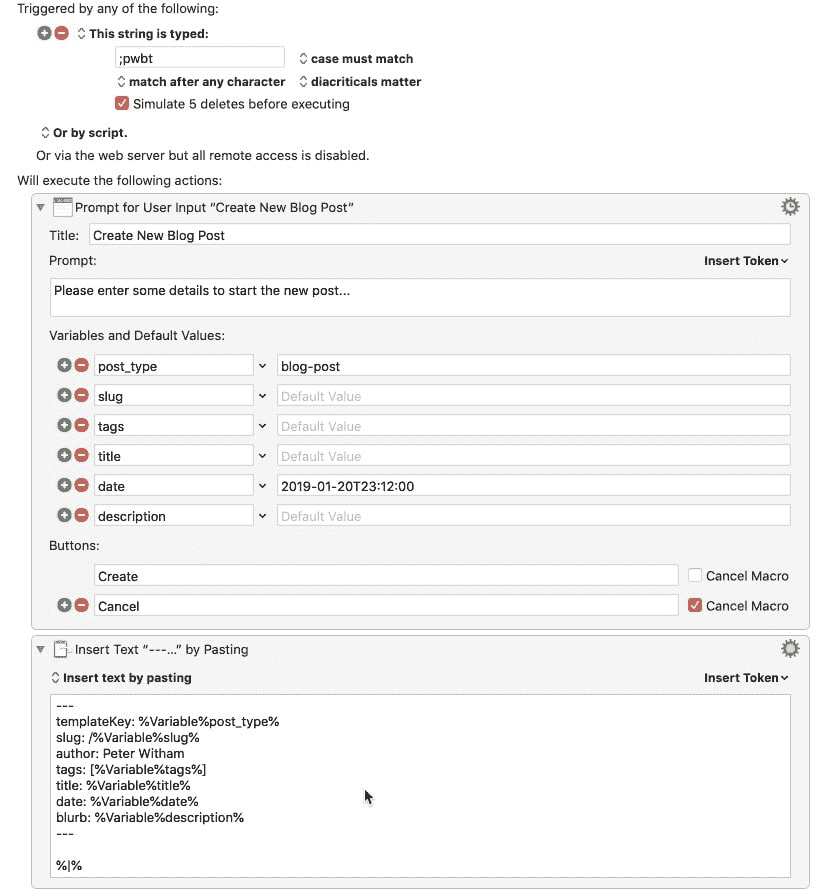

# 键盘大师 Markdown 博客帖子模板

> 原文：<https://dev.to/peterwitham/keyboard-maestro-markdown-blog-post-template-3khi>

有时候，我想快速地把一个想法写在博客上，而不需要弄乱所有的设置。所以我想为什么不使用键盘大师自动化呢，这是我在 macOS 上最喜欢的生产力工具之一。

很自然地，我想，是时候分享了。然后我意识到我不知道如何导出一个单独的宏，所以我分享了一个步骤的截图，如果你知道如何导出一个单独的宏，请在评论中告诉我，我很乐意分享。

这里有一些关于我用它做什么和它做什么的信息。

我一直在做一个盖茨比的博客，它对每篇文章都使用降价文件。每个帖子都有一系列我每次都必须填写的 *frontmatter* 元数据项。

当宏运行时，我已经将这些值分解到输入字段中，现在我所要做的就是输入数据并点击 *create* 。

这些值被输入到模板中，该模板被粘贴到我选择的编辑器中，然后它将光标放在正确的位置，让我开始输入内容。

要触发这个动作，我需要做的就是输入*；pwbt*

所以不考虑细节，这里是所有的宏观内容。

