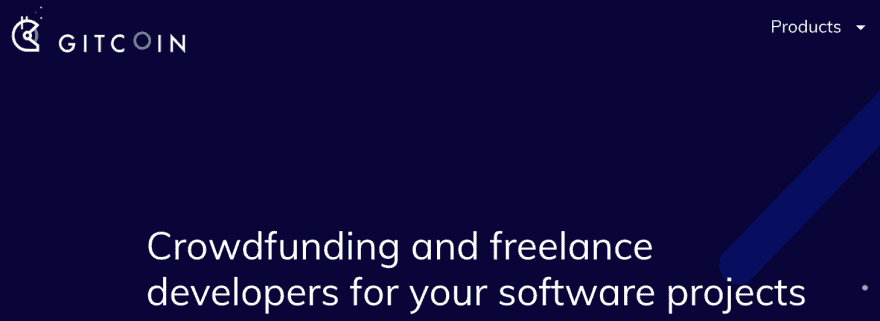
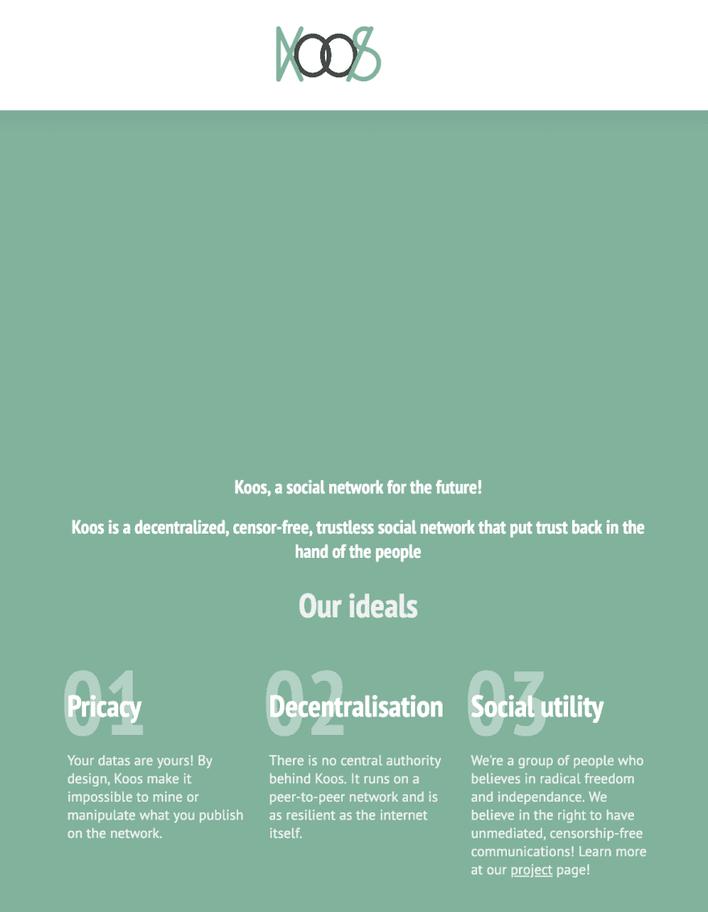

# Koos，一个去中心化的社交网络

> 原文：<https://dev.to/lcoenen/koos-a-decentralised-social-network-4mfd>

大约一个月前，我偶然发现了一个网站，这个网站为基于以太坊的开源项目提供奖金。那是在 *Grow 以太坊*黑客马拉松的中间。我被迷住了！

 。

我继续寻找一群人，给我的平面设计师朋友打电话，然后我们开始了！开始的时候有点坎坷——尽管我们都知道自己在干什么，但合作可能会很困难，尤其是在紧急情况下。回过头来看，我认为我们本应该更加渐进——实现一个特性，编写测试，重复。

但最终，我们成功开发了 Koos，一个基于 Fluence 和 IPFS 的去中心化社交网络。可以在 [koos.network](http://koos.network) 访问。

 。

不骗你，这只是一个概念证明。它有点工作，但要有坚实的东西，我需要写测试，重新因素/简化相当多的代码

但是，我仍然赚了一笔奖金，学会了组织一个项目，发现了很多很酷的新技术(3box，Aragon，Fluence，Arweave，...)并且已经成为一个由志同道合的人组成的全球社区的一部分，他们正在构建很酷的东西:)

所以，现在是周五晚上，我将在周末中断我的编程工作和我的兼职项目，我没有花时间做一些简单的事情，比如在大自然中散步，阅读或游泳，并且牺牲了一点我的生活质量。

但是，做了一些很酷的事情还是很有成就感的！谁知道呢，也许我会找到人帮我解决技术债务并添加功能，这样我们就可以拥有一个风味十足的分散式社交网络，人们可以在其中无限制地交流、会面、交易和交换！

欢迎你来帮助我们！查看我们的[投稿页面](https://gitlab.com/koos-project/koos/blob/master/CONTRIBUTING.md)。