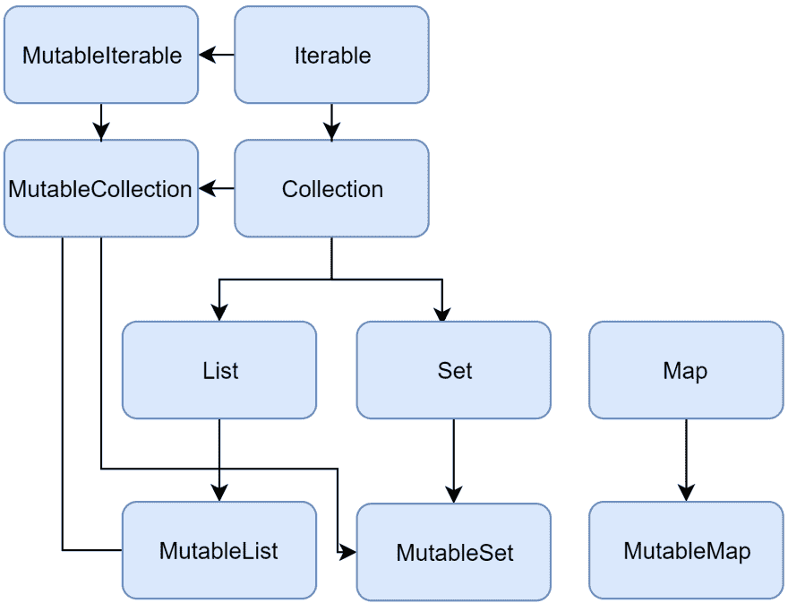

# Kotlin 集合及其与 Java 集合 API 的比较

> 原文：<https://dev.to/hugoltsp/kotlin-collections-and-how-it-compares-with-java-collections-api-cd4>

我们开发人员通常编写日常使用集合的软件，处理诸如从数据库获取产品列表、将一组数据写入 CSV 等文件的代码非常常见。因此，让我们来看看 Kotlin 集合是如何工作的，以及它们与 Java 集合 API 相比如何。

# 只读和可变集合

<figure>

[](https://res.cloudinary.com/practicaldev/image/fetch/s--sNmMKLBY--/c_limit%2Cf_auto%2Cfl_progressive%2Cq_auto%2Cw_880/https://thepracticaldev.s3.amazonaws.com/i/71zsvcjyol7n9ctxzn5q.png)

<figcaption>Overview of collections interfaces</figcaption>

</figure>

如图所示，Kotlin 有一个可变的对应部分，它为每个只读接口继承并添加了函数，如`fun add(element: E)`和`fun remove(element: E)`。ArrayList、HashSet、LinkedHashSet、LinkedHashMap 和 HashMap 类分别被视为 MutableList、MutableSet 和 MutableMap 的实现，它们与 Java Collections API 中的实现非常相似，事实上，它们是相同的，但被 Kotlin 标记为`typealias`，如在 [TypeAliases.kt 运行时库文件:](https://github.com/JetBrains/kotlin/blob/v1.3.31/libraries/stdlib/jvm/src/kotlin/collections/TypeAliases.kt)
中所见

```
@SinceKotlin("1.1") public actual typealias ArrayList<E> = java.util.ArrayList<E>
@SinceKotlin("1.1") public actual typealias LinkedHashMap<K, V> = java.util.LinkedHashMap<K, V>
@SinceKotlin("1.1") public actual typealias HashMap<K, V> = java.util.HashMap<K, V>
@SinceKotlin("1.1") public actual typealias LinkedHashSet<E> = java.util.LinkedHashSet<E>
@SinceKotlin("1.1") public actual typealias HashSet<E> = java.util.HashSet<E> 
```

#### 收藏-创建功能

| 类型 | 功能 | 易变性 |
| --- | --- | --- |
| 目录 | `listOf()` | 只读 |
| 可变列表 | `arrayListOf()` | 易变的 |
| 一组 | `setOf()` | 只读 |
| 可变集 | `hashSetOf()` | 易变的 |
| 地图 | `mapOf()` | 只读 |
| 可变地图 | `hashMapOf()` | 易变的 |

这些是用于在 Kotlin 中创建集合的顶级函数，例如:

```
 val list = listOf(1, 2, 3)
    val mutableArrayList = arrayListOf(1, 2, 3)
    val map = mapOf(1 to "one", 2 to "two") //key is an Int valued by a String
    val mutableHashMapOf = hashMapOf(1 to "one", 2 to "two")
    val set = setOf(1, 2, 3)
    val mutableHashSetOf = hashSetOf(1, 2, 3) 
```

如果我们要在 Java 中创建一个不可变的列表，我们必须将我们的集合包装在另一个列表中，如下所示:

```
 List<String> originalMutableList = new ArrayList<>();
    List<String> unmodifiableList = Collections.unmodifiableList(originalMutableList);
    // Collections.unmodifiableMap(...);
    // Collections.unmodifiableSet(...);
    // and so on... 
```

我们仍然有像`add`、`remove`和`clear`这样的方法，因为它是列表接口的一部分，在标准 Java 中，只读列表和可变列表之间没有这样的区别。

#### 过滤器、地图、平面地图和 zip

###### 滤镜

Kotlin 中的过滤列表很简单，看起来非常类似于我们处理 Java 8 流的方式，Kotlin 的 Iterable 接口有一个名为 filter 的方法，它接受一个谓词来处理集合。

```
 val countries = listOf("Brazil", "Argentina", "Germany")
    val filteredCountries = countries.filter { it.length > 6 } 
    //'it' means the instance itself, in that case a String representing a country name

    println(filteredCountries) // prints [Argentina, Germany] 
```

###### 地图和平面地图

与过滤非常相似，Map 和 flatMap 操作与 Java 8 中处理流时的操作相似。

地图:

```
 val countries = listOf("Brazil", "Argentina", "Germany")
    val countriesToLowerCase = countries.map(String::toLowerCase) //same as countries.map { it.toLowerCase() }

    println(countriesToLowerCase) //prints [brazil, argentina, germany] 
```

平面图:

```
 val countries = listOf("Brazil", "Argentina", "Germany")
    val listOfCharacters = countries.flatMap { it.toList() } // converts to a List of chars

    println(listOfCharacters) // prints [B, r, a, z, i, l, A, r, g, e, n, t, i, n, a, G, e, r, m, a, n, y] 
```

zip:

```
 val countries = listOf("Brazil", "Argentina", "Germany")
    val cities = listOf("Aracaju", "Ushuaia", "Berlin")

    val zippedPairs = cities.zip(countries) //creates a new list containing an ordered pair of the elements of these two lists

    println(zippedPairs) // prints [(Aracaju, Brazil), (Ushuaia, Argentina), (Berlin, Germany)] 
```

**请注意，与 Java 8 流不同，Kotlin 列表被急切地评估，这意味着不需要使用 collect()、forEach()等终端方法...运行中间操作。**

### 序列

序列就像是延迟求值的集合，这意味着当我们调用诸如 filter 和 map 之类的函数时，这些函数会添加中间步骤，在被请求时执行，也就是说，当一个*终端*函数被调用时。终端功能的例子有`toList()`、`first()`、`sumBy()`和`max()`。当事先不知道集合的大小时，或者当集合太大而不能一次处理或保存在内存中时，序列是一个很好的选择。

尽管有相似之处，但我更喜欢序列而不是流，因为在使用 Kotlin 时，它提供了更惯用、更均匀和更干净的代码。
另一件需要记住的重要事情是，在撰写本文时 [Kotlin 的目标是 JDK 1.6+](https://kotlinlang.org/docs/reference/faq.html#does-kotlin-only-target-java-6) ，这意味着如果你使用 Java 6，使用序列可能是你唯一的选择。

```
 val cities = listOf("Aracaju", "Ushuaia", "Berlin")

    val sequence = cities.asSequence().filter { it.startsWith("A") }.map { it.toUpperCase() }

    println(sequence.first()) //prints ARACAJU 
```

Kotlin 是一种为解决现实世界问题而创建的实用语言，它旨在提供已被证明是成功的流行功能。例如，对于集合，我们为可变和不可变的概念都内置了分离良好的组件。

希望你喜欢，非常感谢！(这是我第一篇顺便说说:D 的文章)。