# 科特林州 2019

> 原文：<https://dev.to/ofirmeg/kotlin-intro-background-basics-industry-and-performance-2194>

## 科特林历史

*   Kotlin v1.0 版于 2016 年 2 月 15 日发布
*   在 Google I/O 2017 上，Google 宣布了在 Android 上对 Kotlin 的一级支持。
*   Kotlin v1.2 于 2017 年 11 月 28 日发布。在 JVM 和 Javascript 平台之间共享代码的特性是新添加到这个版本中的。
*   Kotlin v1.3 于 2018 年 10 月 29 日发布，为异步编程带来了协程。
*   2019 年 5 月 7 日，谷歌宣布 Kotlin 编程语言现在是其 Android 应用开发者的首选语言。

## “科特林”是什么意思？

这个名字来自圣彼得堡附近的科特林岛。Andrey Breslav 提到，该团队决定以一个岛屿命名，就像 Java 以印度尼西亚的爪哇岛命名一样[8](尽管编程语言 Java 可能是以咖啡命名的)。
[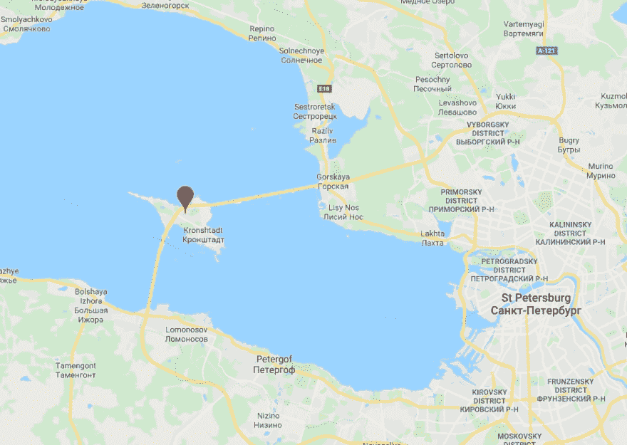T3】](https://res.cloudinary.com/practicaldev/image/fetch/s--onUWF8GG--/c_limit%2Cf_auto%2Cfl_progressive%2Cq_auto%2Cw_880/https://thepracticaldev.s3.amazonaws.com/i/97n16frg32yjma4y7zqc.png)

## 为什么是科特林？

[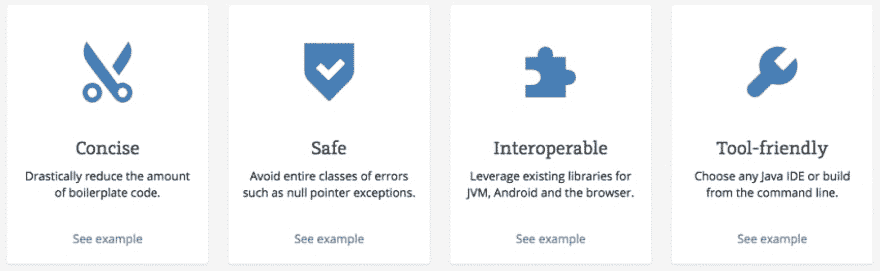](https://res.cloudinary.com/practicaldev/image/fetch/s--crPBUAuV--/c_limit%2Cf_auto%2Cfl_progressive%2Cq_auto%2Cw_880/https://thepracticaldev.s3.amazonaws.com/i/royaju9hpqb2611nq7mh.png) 
科特林也很好学。它的学习曲线非常短。

## 栈溢出调查 2019 -被爱

[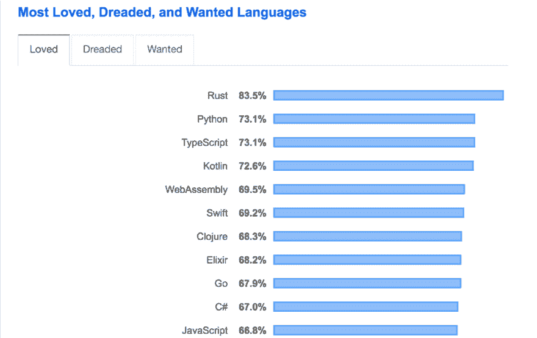](https://res.cloudinary.com/practicaldev/image/fetch/s--e_5LMzEp--/c_limit%2Cf_auto%2Cfl_progressive%2Cq_auto%2Cw_880/https://thepracticaldev.s3.amazonaws.com/i/34vw7ph7t2tmrszftstm.png) 
来源:【https://insights.stackoverflow.com/survey/2019】T4

这项调查是在谷歌宣布将科特林语作为首选语言之前进行的。

## 堆栈溢出调查 2019 -流行

2019，第一次 Kotlin get's 进入流行语言
 
来源:[https://insights.stackoverflow.com/survey/2019](https://insights.stackoverflow.com/survey/2019)

## GitHub 趋势- 2018

[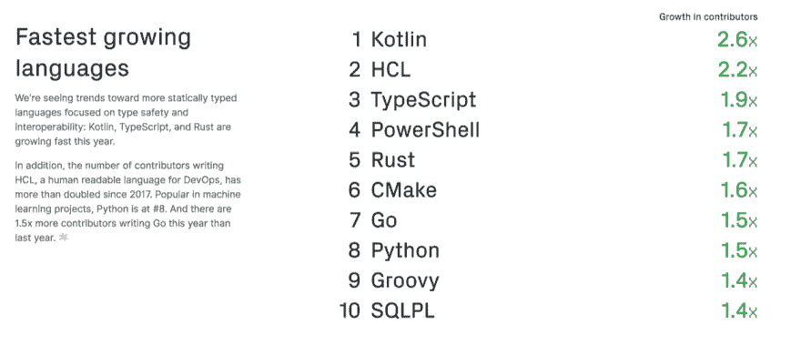](https://res.cloudinary.com/practicaldev/image/fetch/s--nSK6sDSY--/c_limit%2Cf_auto%2Cfl_progressive%2Cq_auto%2Cw_880/https://thepracticaldev.s3.amazonaws.com/i/7hnsm27f831qay1qfijq.png) 
来源:【https://octoverse.github.com/projects.html】T4

## 科特林是做什么用的

[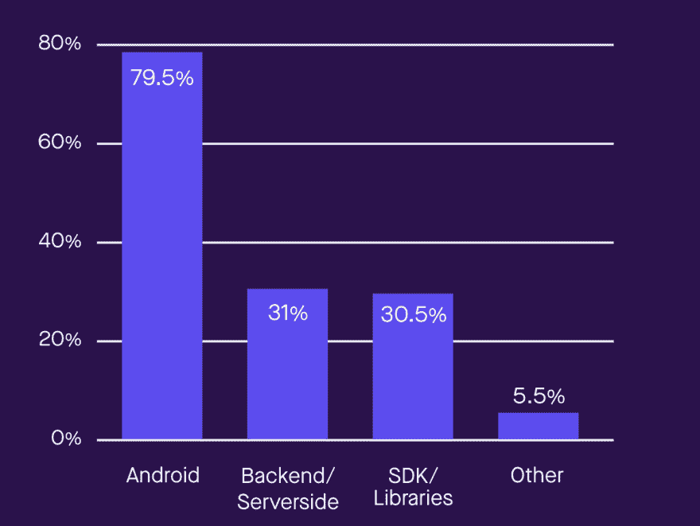](https://res.cloudinary.com/practicaldev/image/fetch/s--d2GEKahf--/c_limit%2Cf_auto%2Cfl_progressive%2Cq_auto%2Cw_880/https://thepracticaldev.s3.amazonaws.com/i/1843vppx3hlogyxl3o67.png) 
来源:【https://pusher.com/state-of-kotlin】T4

## 基本语法

[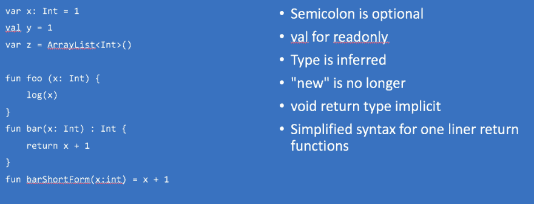](https://res.cloudinary.com/practicaldev/image/fetch/s--6QiCKJ0Z--/c_limit%2Cf_auto%2Cfl_progressive%2Cq_auto%2Cw_880/https://thepracticaldev.s3.amazonaws.com/i/ou71ezm904m2bsn0dau9.png)

## 数据类

[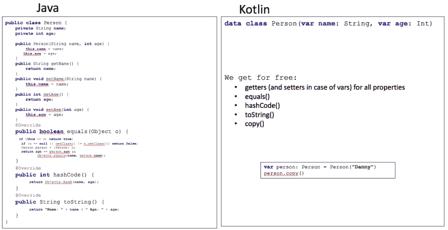](https://res.cloudinary.com/practicaldev/image/fetch/s--dzwS0HIU--/c_limit%2Cf_auto%2Cfl_progressive%2Cq_auto%2Cw_880/https://thepracticaldev.s3.amazonaws.com/i/j36do1utwt1uoofh0nux.png)

## 分机

[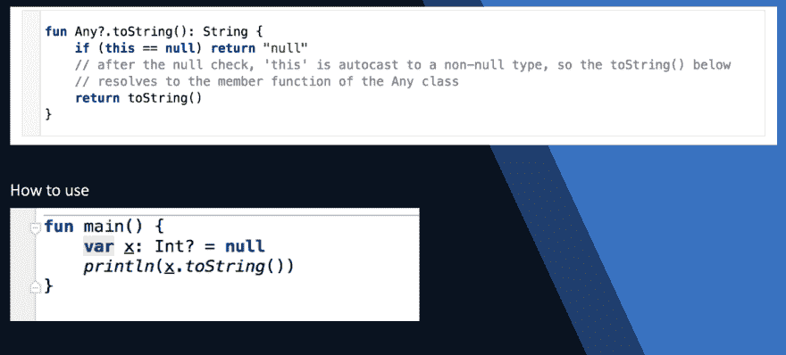](https://res.cloudinary.com/practicaldev/image/fetch/s--2AnV-tPX--/c_limit%2Cf_auto%2Cfl_progressive%2Cq_auto%2Cw_880/https://thepracticaldev.s3.amazonaws.com/i/pb8mcb486kwrtdts3zu5.png) 
这就是允许你在 Kotlin 中调用 toString()而不检查 null 的原因:检查发生在扩展函数内部。

## 序列与可迭代

 
使用序列我们检查 23 个节点，而使用 itarable 检查 21 个节点。显然，随着节点数量的增加，我们可以节省更多。

## 协程

Kotlin 对协程的支持有助于构建服务器端应用程序，这些应用程序可以通过适度的硬件要求扩展到大量的客户端。
[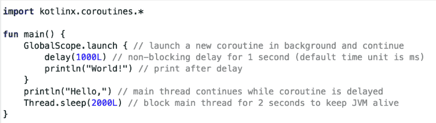](https://res.cloudinary.com/practicaldev/image/fetch/s--QGf3H0fK--/c_limit%2Cf_auto%2Cfl_progressive%2Cq_auto%2Cw_880/https://thepracticaldev.s3.amazonaws.com/i/s51qxevbocyeeyscom1i.png) 
输出:
[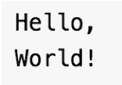](https://res.cloudinary.com/practicaldev/image/fetch/s--s8yyigfJ--/c_limit%2Cf_auto%2Cfl_progressive%2Cq_auto%2Cw_880/https://thepracticaldev.s3.amazonaws.com/i/mqei5rtcddll6h2kfw1u.png)

## 递归

在 Java 中，由于堆栈空间的开销，不推荐长递归。
在 Kotlin 中，我们进行了尾部优化:

[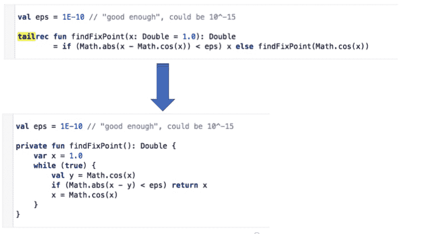](https://res.cloudinary.com/practicaldev/image/fetch/s--VE9wkpw6--/c_limit%2Cf_auto%2Cfl_progressive%2Cq_auto%2Cw_880/https://thepracticaldev.s3.amazonaws.com/i/vp3k8zxktbk367hrruaa.png)

## 表现

[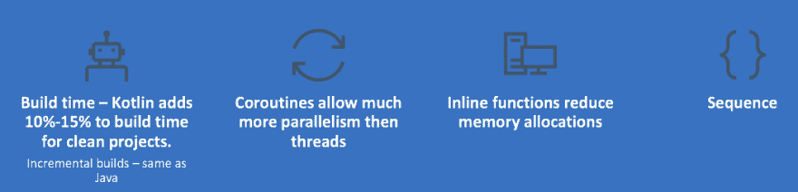](https://res.cloudinary.com/practicaldev/image/fetch/s--pgDtiJDJ--/c_limit%2Cf_auto%2Cfl_progressive%2Cq_auto%2Cw_880/https://thepracticaldev.s3.amazonaws.com/i/ve5j2l7ucov2pwd4idk7.png)

## 总结

Kotlin 看起来像是 Java 更好的替代品。它像 java 一样运行在 JVM 之上，因为它编译成字节码。Kotlin 不仅仅面向 android 开发者。我在我的后端服务器上使用它。它允许我编写更简洁的代码，并专注于业务逻辑，而不是 java 技术实现细节和样板代码。
重构旧的 java 项目变得容易多了(有了扩展、类委托等等),你可以开始用 Kotlin 编写新代码，同时用 Java 保留系统的旧部分。

## 更多详情

[https://kotlinlang.org/docs/reference/](https://kotlinlang.org/docs/reference/)
T3】https://play.kotlinlang.org/koans/