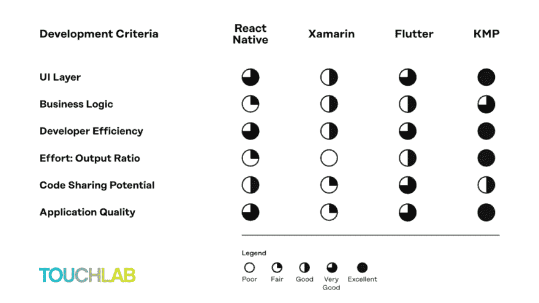

# Kotlin 多平台不能全部完成。这就是为什么你应该尝试一下！

> 原文：<https://dev.to/touchlab/kotlin-multiplatform-can-t-do-it-all-which-is-exactly-why-you-should-try-it-1p85>

在开始之前，我想明确一点，所有的工具都是为解决问题而创造的，但没有一个工具能解决所有的问题。如果你的开发团队很忙，或者高质量的用户界面不是主要的优先事项，那么继续选择一个“端到端”的开发平台，如 Xamarin 或 Flutter 或 React Native，为 Android 和 iOS 编写应用程序。你会完成任务的🎉！

现在，如果你已经为你的应用程序准备了用户界面，或者如果你想为每个平台优化用户界面，你可以使用 Kotlin 多平台。原因？它根本不做 UI(反正现在还不做)。但是它所做的——也确实做得很好——是 Android 和 iOS 应用程序的商业逻辑。

### 虽然其他多平台解决方案渴望支持所有应用层，但它们无法完全覆盖所有层。

而且跨平台共享 UI 代码也不一定是可取的。通常，当这一步完成后，需要进行多次迭代才能使 UI 的外观和行为更加自然。这将贯穿整个开发周期，给你的开发团队带来更多按时交付的压力。通常情况下，企业会在 UI 质量上追求更多的特性。共享用户界面是有风险的，而且很少对士气或业务有好处。

### 与 Xamarin、Flutter 或 React Native 不同，Kotlin 多平台并不生活在自己的生态系统中。相反，它非常像一本“选择你自己的冒险”的书，这就是它如此强大的原因。

虽然 KMP 目前只有有限的库(尽管数量正在增长)，但它确实使你能够在 iOS 和 Android 上使用所有现有的库和工具，所以没有必要等待库或实现黑客和变通办法。你不能在不遇到相当大的障碍的情况下用颤动或自然反应做到这一点。

Kotlin Multiplatform 的输出只是 Android 上的另一个包和 iOS 上的框架。这可以节省大量的时间和麻烦，因为花在编写桥代码或完全重写其他解决方案中缺少的东西上的时间要少得多。

要在 Flutter 中编码业务逻辑，您的团队首先必须在一个新的生态系统中用一种未被广泛使用的语言——Dart——编码共享逻辑，该生态系统的社区较小，并且很难将它与现有代码连接起来。在 React Native 中，您的移动团队需要让自己沉浸在 JavaScript 的新 ide 和其他工具的网络生态系统中。在 Xamarin 中，他们必须用 C#编写代码，使用 Visual Studio 和一个较小的、不太活跃的社区。更糟糕的是，无论您的团队使用哪种平台，他们都需要在本机代码和非本机代码之间建立沟通桥梁。

### 然而，在 Kotlin 多平台中，您的团队可以编写特定于平台的业务逻辑，与原生平台直接通信，无需等待库或实现黑客或变通方法。

(你想的话可以，那是你选择的冒险的一部分。)即使有任何问题，Kotlin 多平台的可选共享也意味着您只需要恢复与问题直接相关的代码，而不必因为一个坏的火花塞而拆除整个引擎。所以，你总是有选择的。

这当然很重要，因为业务逻辑决定了一个应用程序中所有功能的工作方式。因为您只需为这一层编写一次本机代码，所以可以加快开发时间，并有助于确保坚实的代码基础。此外，编写一组本机代码是一种非常有效的方法，可以为以后的版本提供可靠的代码。

### 换言之，Kotlin 多平台为您的开发团队提供了更大的灵活性。

其他多平台解决方案本质上是专有的，导致供应商锁定。实际上，这也导致需要管理第三个平台，因为生态系统与本地平台太不一样，而且因为它们试图解决所有问题，但它们不能解决所有问题，所以您将需要编写比宣传的更多的特定于平台的代码。

与 Xamarin 和 React Native 不同，Kotlin 多平台不需要 VM。Flutter 在生产中不需要 VM，但它确实将你置于一个用非本地语言编写的非本地生态系统中，不像 Kotlin 多平台那样尊重每个平台的本地语言和生态系统。Kotlin 多平台是您的团队目前可以使用的最原始的多平台解决方案。

### KMP 并不隐瞒你正在处理多个平台的事实，因为它已经编译成了 iOS 或 Android 的原生库。

没有需要处理的中间层，实际上消除了任何互操作瓶颈。由于 Kotlin 多平台与原生平台生态系统一起工作，而不是成为它自己的，开发人员可以使用他们一直使用的工具和库，包括 SwiftUI 和 Jetpack Compose 等新的平台创新。你确实遇到的限制并不是死胡同，因为你总是可以用 Kotlin、Swift 或任何能让你以最小的风险解决问题的语言来编码。

——

总之，下面是我们在 [Touchlab](https://touchlab.co) 如何衡量多平台解决方案的世界。下周，我们将分享更多关于我们排名的细节。同时，如果你有兴趣和我们谈谈 Kotlin 多平台，请[联系我们](https://touchlab.co/contact-us/)。

