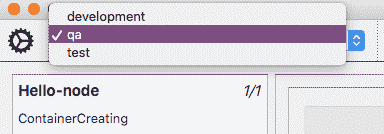
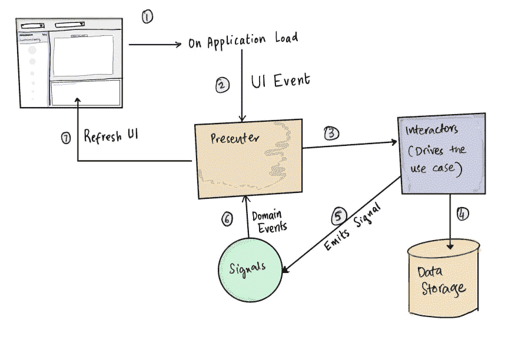

# kube rider::pyqt 5 的事件和信号

> 原文：<https://dev.to/namuan/kuberider-events-and-signals-with-pyqt5-3k8c>

[](https://res.cloudinary.com/practicaldev/image/fetch/s--vJEelrcM--/c_limit%2Cf_auto%2Cfl_progressive%2Cq_auto%2Cw_880/https://deskriders.dev/media/posts/5/kuberider-display-contexts.png)

在本文中，我将介绍 KubeRider 应用程序中的数据流。这个应用程序仍然很小，随着我添加更多的功能，我正在尝试一些想法。

该应用程序有四个主要组件。

*   [UI 小工具](https://github.com/namuan/kube-rider/tree/a777b79d3693dedeb4ac070bb9f6edc1140b2b64/kuberider/ui)
*   [主持人](https://github.com/namuan/kube-rider/tree/a777b79d3693dedeb4ac070bb9f6edc1140b2b64/kuberider/presenters)
*   [互动者](https://github.com/namuan/kube-rider/tree/a777b79d3693dedeb4ac070bb9f6edc1140b2b64/kuberider/domain)
*   [数据存储](https://github.com/namuan/kube-rider/tree/a777b79d3693dedeb4ac070bb9f6edc1140b2b64/kuberider/entities)

我发现使用事件在组件之间进行通信可以很容易地分离应用程序的不同部分。然而，它也有自己的挑战，我会在另一篇文章中介绍。

以应用程序启动时加载可用上下文的用例为例，下面的图表显示了不同组件之间的通信。

[](https://res.cloudinary.com/practicaldev/image/fetch/s--kyg2_q8f--/c_limit%2Cf_auto%2Cfl_progressive%2Cq_auto%2Cw_880/https://deskriders.dev/media/posts/5/kube-rider-components.jpeg)

以及实现这一功能的代码。

它从主表单后面的呈现者 [KubeRiderMainPresenter](https://github.com/namuan/kube-rider/blob/a777b79d3693dedeb4ac070bb9f6edc1140b2b64/kuberider/presenters/kube_rider_main_presenter.py#L7) 开始。它的工作是初始化一些东西，然后把剩下的用例留给特定于组件的演示者。

```
def after_window_loaded(self):
 if not self.initial_load:
 return

 self.initial_load = False
 self.contexts_loader.load_contexts()
 self.check_updates() 
```

上下文加载器是 [ContextsLoaderInteractor](https://github.com/namuan/kube-rider/blob/a777b79d3693dedeb4ac070bb9f6edc1140b2b64/kuberider/domain/contexts_interactor.py#L5) 的一个实例，它处理 kubectl 命令的执行以加载上下文。

它运行`kubectl config get-contexts --output='name'`命令来获取上下文列表，[解析它](https://github.com/namuan/kube-rider/blob/a777b79d3693dedeb4ac070bb9f6edc1140b2b64/kuberider/domain/contexts_interactor.py#L14)并将其保存在[应用状态](https://github.com/namuan/kube-rider/blob/a777b79d3693dedeb4ac070bb9f6edc1140b2b64/kuberider/entities/model.py#L11)中。

然后它[发出一个事件](https://github.com/namuan/kube-rider/blob/a777b79d3693dedeb4ac070bb9f6edc1140b2b64/kuberider/domain/contexts_interactor.py#L18)来通知上下文被成功加载。

```
app.data.signals.contexts_loaded.emit() 
```

然后这个事件在[工具栏呈现器](https://github.com/namuan/kube-rider/blob/a777b79d3693dedeb4ac070bb9f6edc1140b2b64/kuberider/presenters/toolbar_presenter.py#L19)中被使用来刷新工具栏中的用户界面。

```
app.data.signals.contexts_loaded.connect(self.on_contexts_loaded) 
```

然后从 state 加载上下文并填充组合框。

```
def on_contexts_loaded(self):
 contexts_ui = self.__get_combox_box("Contexts")
 contexts_ui.clear()
 contexts = app.data.load_contexts()
 for ctx in contexts:
 contexts_ui.addItem(ctx) 
```

此后，链继续加载当前活动的上下文，然后加载基于该上下文的名称空间，但一般模式遵循与上述相同的原则。