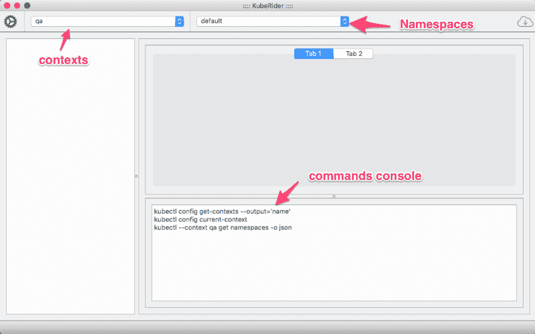
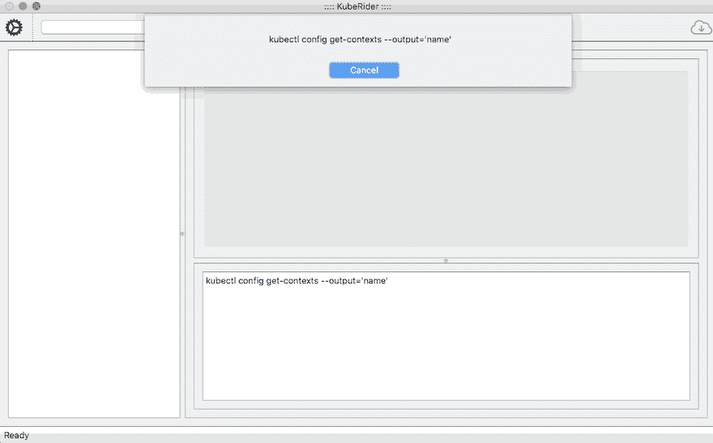

# KubeRider -加载上下文和名称空间

> 原文：<https://dev.to/namuan/kuberider-loading-contexts-and-namespaces-jmn>

KubeRider 是一个桌面应用程序，我正在构建它来处理 Kubernetes 集群。这篇文章是正在进行的 KubeRider 开发系列文章的一部分。

点击此处查看本系列的更多文章。

该应用程序是用 Python 编写的，并使用 PyQt5 作为桌面组件。我的计划是让大多数人管理 kubernetes 集群变得足够简单，而不必记住 CLI 开关。同时，控制台视图向您显示正在运行的命令，帮助您了解幕后发生的事情。

这个应用程序依赖于 [Kubectl](https://kubernetes.io/docs/tasks/tools/install-kubectl/) 来运行命令，所以要确保你已经安装了它并且正在运行。

当应用程序启动时，它试图获取所有可用的[上下文](https://kubernetes.io/docs/tasks/access-application-cluster/configure-access-multiple-clusters/)并选择当前选择的上下文。它还尝试加载选定上下文中所有可用的名称空间。

github
[https://github.com/namuan/kube-rider](https://github.com/namuan/kube-rider)