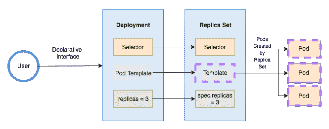
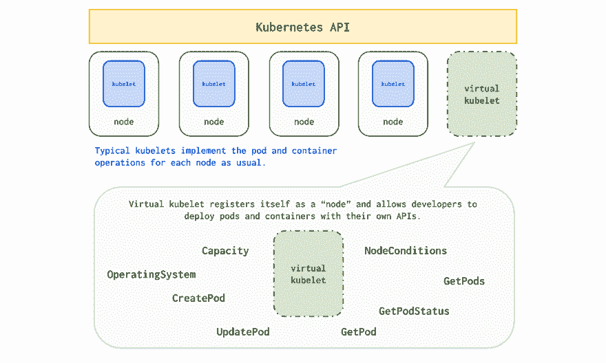
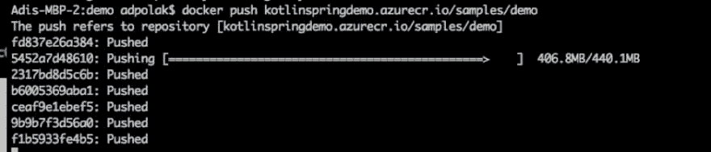
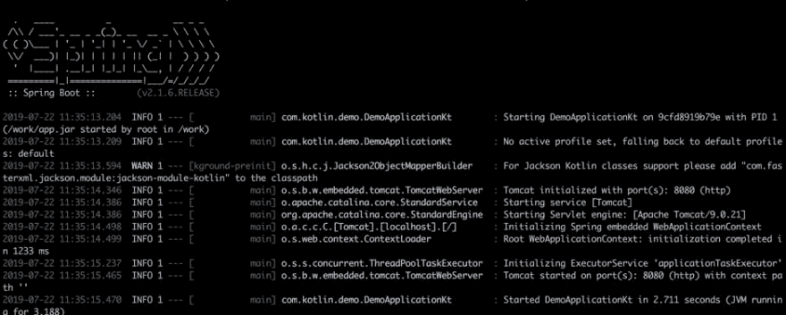

# 简而言之，Kubernetes 和虚拟 Kubelet

> 原文：<https://dev.to/adipolak/kubernetes-and-virtual-kubelet-in-a-nutshell-gn4>

今天你将学习如何使用一个 web 应用程序(它可以是任何编程语言，我们使用的是 Java & Kotlin)并使用 Kubernetes (K8s)和 Virtual Kubelet (VK)来分发它。

好吧，如果你还不知道为什么你应该考虑分发你的网络应用程序——在这里阅读我的帖子。

## 所以，你大概在问自己

## “Kubernetes 是什么，我能用它做什么？”

## 只是继续阅读

Kubernetes 是一个开源的容器编排系统，用于自动化应用程序部署、伸缩和管理。它用于构建分布式、可扩展的微服务。它带来了许多我们需要熟悉的新概念和术语，这些是最基本的:

### 基本词汇:

**节点** -硬件组件。通常一个虚拟机托管在云上，提供 CPU 和 RAM 资源供 Kubernetes 集群使用。

**Kubernetes 主节点**——负责管理 Kubernetes 集群状态的一个或多个节点。

**Kubelet** -在每个节点上运行的主要“节点代理”。它管理由 Kubernetes 创建的容器，并在其管理的节点上运行。它与 K8S 主机通信。

**容器** -容纳一个或多个容器。共享同一个 pod 的容器也共享资源和网络。Pod 可以负责不同节点上的容器——不同的物理机或虚拟机(VM)。它充当部署、水平扩展和复制的单元。

**PodSpec** -描述 pod 规范的 Yaml 或 JSON 文件。kubelet 使用它来确保容器是健康的，并且按照预期运行。

**集群** -连接在一起的一系列节点。

还有更多的概念和术语，但这是我们需要理解虚拟 kubelet 和开始使用 K8S 的基础。

**Kubernetes API**——运行在主节点上的服务器(REST ),直接与运行在节点上的 kubelets 通信。

在来自 [Kubernetes.io](https://kubernetes.io/blog/2018/07/18/11-ways-not-to-get-hacked/) 的图表中，我们可以看到节点和主节点:

[](https://res.cloudinary.com/practicaldev/image/fetch/s--P-ULtxNM--/c_limit%2Cf_auto%2Cfl_progressive%2Cq_auto%2Cw_880/https://d33wubrfki0l68.cloudfront.net/d35c2b375b43b4fa374ae834f95224975418e33f/6b4img/blog/2018-06-05-11-ways-not-to-get-hacked/kubernetes-control-plane.png)

嘿，豆荚在哪里？
嗯，豆荚可以是部署或者复制集的一部分。副本集/部署定义了分布在多个节点上的副本。这是另一个图表，显示了来自 [the new stack](https://thenewstack.io/kubernetes-deployments-work/) 网站的 pods 工作:

[](https://res.cloudinary.com/practicaldev/image/fetch/s--xoy9U-KH--/c_limit%2Cf_auto%2Cfl_progressive%2Cq_auto%2Cw_880/https://storage.googleapis.com/cdn.thenewstack.io/media/2017/11/07751442-deployment.png)

另一个图表显示了 ReplicaSet 如何与 Deployment 一起工作，其中 Deployment 可以被视为 ReplicaSet 的模板，replicas 默认为 3。来自 Nir Mata [站点](https://www.nirmata.com/2018/03/03/kubernetes-for-developers-part-2-replica-sets-and-deployments/)的图表:

[](https://res.cloudinary.com/practicaldev/image/fetch/s--XqKvyQ8Z--/c_limit%2Cf_auto%2Cfl_progressive%2Cq_auto%2Cw_880/https://www.nirmata.com/wp-content/uploads/2018/03/Deployment.png)

### 有多难处理的作品？

Kubernetes 管理 N 个节点，在这些节点中，有这些 kubelets。Kubelets 管理与节点和节点上运行的 pod 相关的一切。豆荚只是容器的集合。

当我们把一个应用程序放入容器中，上传到容器[注册表](https://azure.microsoft.com/en-in/services/container-registry/?WT.mc_id=devto-blog-adpolak)并部署到 Kubernetes。然后，它被部署到某个由 Kubernetes 集群管理的虚拟机上，在我们的例子中是[Azure Kubernetes Service(AKS)](https://docs.microsoft.com/en-us/azure/aks?WT.mc_id=devto-blog-adpolak)。我们可以从 CLI 和 UI 看到该虚拟机并对其进行跟踪——在这种情况下，不存在按秒计费或按需付费的计费方式，因为这是托管 K8S 服务的经典场景，即使我们最终不使用这些虚拟机，我们也要为其付费。

## 虚拟库伯勒(VK)呢？

使用 Virtual Kubelet，我们看不到实际的节点，每个使用的服务只有一个虚拟节点。它对我们来说是一个抽象概念，可以根据需要旋转任意多的豆荚。在幕后，我们可以有多个虚拟机，但对于我们正在使用的特定服务，我们只会看到一个虚拟机。我们不会暴露于在托管服务中运行的虚拟机，我们从虚拟 Kubelet 使用托管服务。虚拟 Kubelet 充当替身，帮助我们代理其他具有更高抽象的托管服务。

Virtual Kubelet 是 Kubernetes kubelet 的开源实现，目的是将 Kubernetes 连接到其他 API。它将自己注册为一个节点，并允许我们部署无限数量的吊舱和容器。它也给了我们连接无服务器容器平台的能力。这意味着我们可以使用任何无状态的应用程序，将其容器化，并通过 pods 进行配置，虚拟 Kubelet 将为我们管理它，并将它转移到托管服务。我们不需要管理基础设施。它可以向上或向下扩展，全部由服务管理。根据正在使用的托管服务，我们可以受益于[随用随付账户](https://azure.microsoft.com/en-in/offers/ms-azr-0003p?WT.mc_id=devto-blog-adpolak)、灵活的自动扩展等等。

当将 AKS 与 Azure 容器实例(ACI)相结合时，您将受益于容器的快速编排。我们使用*虚拟节点*将两者结合起来。导致集装箱调度的自动化。容器上下文中的调度指的是管理员将服务加载到主机系统上的能力，该主机系统定义了如何运行特定的容器。使用带有*虚拟节点*的 ACI 可以更快地调配 pod。

[虚拟节点](https://docs.microsoft.com/en-us/azure/aks/virtual-nodes-cli?WT.mc_id=devto-blog-adpolak)可以和 AKS 一起使用，由开源的虚拟 Kubelet 提供支持。

[](https://res.cloudinary.com/practicaldev/image/fetch/s--fdiLpTAB--/c_limit%2Cf_auto%2Cfl_progressive%2Cq_auto%2Cw_880/https://github.com/virtual-kubelet/virtual-kubelet/raw/master/website/static/img/diagram.svg%3Fsanitize%3Dtrue)

### **优点:**

**kubernetes**
之上的✅完全托管解决方案允许我们连接到来自不同地区的不同云提供商的许多托管解决方案。

**✅为您使用的**
完全付费像 [ACI](https://azure.microsoft.com/en-us/services/container-instances?WT.mc_id=devto-blog-adpolak) 或 [AWS Fargate](https://aws.amazon.com/fargate/) 这样的托管解决方案可以帮助我们根据自己的需求扩大或缩小规模，而无需我们的干预。

✅Portability
无论 K8S 在哪里运行，你都可以运行你的虚拟 Kubelet，并将其与你的托管服务相连接。

**✅地区和其他集群**
通过虚拟 Kubelet，您可以利用在其他地区甚至其他云提供商上运行的服务。

### **缺点:**

**❗️安全**
一般来说，你应该时刻考虑安全问题。记住，安全是每个人的工作！
一开始，使用 Kubernetes 的整体安全问题相当复杂。添加虚拟 Kubelet 时，应该注意与 Kubernetes 集群之外以及区域/云提供商之外的其他服务进行通信时可能出现的安全问题。
如果我们决定与 ACI 或其他内部服务合作，我们可以建立一个从 K8s 集群到 ACI 的内部虚拟网络。这样我们可以消除这种安全顾虑。

## 让我们用一个教程来实践一下

在 JVM 世界中，有许多框架可以帮助我们快速创建 web 应用程序。一个包括服务器和用户界面。我们的 app 用的是 Spring boot。Spring Boot 有许多嵌入式功能，如服务器等。对于服务器选项，我们可以从 Tomcat、Jetty 或 Undertow 中选择。

所以你可能会问自己，如何开始接触 Spring Boot？去 Spring initializer [站点](https://start.spring.io/)下载一个模板或者从这个 [github 库](https://github.com/adipola/virtual-kubelet-kotlin-spring-demo)下载演示应用。

在本教程中，我们将在 K8s 集群上的一个虚拟节点上部署一个 kotlin-spring 应用程序。我们将使用以下服务:AKS、ACR 和 ACI。

[](https://res.cloudinary.com/practicaldev/image/fetch/s--_yHeUZ19--/c_limit%2Cf_auto%2Cfl_progressive%2Cq_auto%2Cw_880/https://github.com/adipola/my-posts/blob/master/pictures/01-03-diagram.png%3Fraw%3Dtrue)

对于本教程，您需要:

1.  演示[应用](https://github.com/adipola/virtual-kubelet-kotlin-spring-demo)
2.  Azure 免费订阅
3.  [Azure CLI](https://docs.microsoft.com/en-us/cli/azure/install-azure-cli?WT.mc_id=devto-blog-adpolak&view=azure-cli-latest)
4.  [AKS 集群](https://docs.microsoft.com/en-us/azure/aks/kubernetes-walkthrough?WT.mc_id=devto-blog-adpolak)

**这是第一阶段**

此时，我们已经有了一个 AKS 集群，一个用于部署到我们的集群的应用程序，并且安装了 CLI 工具。
在第二阶段，我们将需要一个 ACI 帐户，Docker 注册表来存储我们的应用程序映像(我们将使用 Azure 容器注册表- [ACR](%5Bhttps://azure.microsoft.com/en-in/services/container-registry?WT.mc_id=devto-blog-adpolak%5D)

我们的演示应用程序附带了一个 docker 文件，该文件已经定义了应用程序，因此我们可以将其推送到 ACR。
在终端或 CMD 中导航到您的应用程序目录并运行:

```
set ACR_NAME={acr name}
az login
az acr login --name $ACR_NAME
docker build --no-cache -t demo .
docker tag demo $ACR_NAME.azurecr.io/samples/demo
docker push $ACR_NAME.azurecr.io/samples/demo 
```

这是推送过程:
[](https://res.cloudinary.com/practicaldev/image/fetch/s--WzTB3Sfs--/c_limit%2Cf_auto%2Cfl_progressive%2Cq_auto%2Cw_880/https://github.com/adipola/my-posts/blob/master/pictures/01-02-push_docker.png%3Fraw%3Dtrue)

测试你自己-用远程图像运行你的本地 docker

```
docker run -it --rm -p 8080:80 $ACR_NAME.azurecr.io/samples/demo 
```

docker 容器将开始在本地运行，您会看到类似这样的内容:
[](https://res.cloudinary.com/practicaldev/image/fetch/s--rbpTYWUC--/c_limit%2Cf_auto%2Cfl_progressive%2Cq_auto%2Cw_880/https://github.com/adipola/my-posts/blob/master/pictures/01-01-spring.png%3Fraw%3Dtrue) 
您可以用 *ctrl+C* 来停止它。

现在让我们连接到我们的 AKS 集群，因为我们需要我们的资源组名和我们的 AKS 集群名:

```
set RES_GROUP={resource group name}
set AKS_NAME={AKS name}
az aks get-credentials --resource-group $RES_GROUP --name $AKS_NAME 
```

*验证与集群的连接*

```
kubectl get nodes 
```

我们将获得我们的节点列表、版本、状态等等。

接下来，我们将在容器注册表(ACR)和 AKS 之间创建身份验证，这是一个重要步骤，没有它，AKS 集群将无法从注册表中提取映像。
我们将使用秘密跟踪[这个](https://docs.microsoft.com/bs-latn-ba/azure/container-registry/container-registry-auth-aks#access-with-kubernetes-secret?WT.mc_id=devto-blog-adpolak)

在你正在运行的教程中——记得**记下它们俩的**!

```
# Output used when creating Kubernetes secret.
echo "Service principal ID: $CLIENT_ID"
echo "Service principal password: $SP_PASSWD" 
```

登录 docker -
验证您的连接和密码

```
docker login $ACR_LOGIN_SERVER --username $CLIENT_ID --password $SP_PASSWD 
```

如果失败，AKS 将无法提取图像，在本教程的后面部分，您将会看到这个错误`got HTTP response status code 400 error code “InaccessibleImage”`。
确保一步一步地按照[链接](https://docs.microsoft.com/bs-latn-ba/azure/container-registry/container-registry-auth-aks#access-with-kubernetes-secret?WT.mc_id=devto-blog-adpolak)中的教程进行操作。

### 安装连接器:

为了安装连接器和使用虚拟节点的能力，我们将在我们的网络中创建一个子网，并将在那里安装一个 AKS 集群，并为虚拟节点添加附件。
这是一种更安全的方式，因为我们创建了一个独立于更大的 K8s 集群的内部网络。在这里遵循一步一步的[，但是不要部署应用程序——我们将部署我们的应用程序。](https://docs.microsoft.com/en-us/azure/aks/virtual-nodes-cli?WT.mc_id=devto-blog-adpolak)

部署应用程序运行:

```
kubectl apply -f kotlin-spring-virtual-kublet-linux.yaml 
```

这个 YAML 文件向 K8s、pods 和 kubelet 描述了我们希望我们的应用程序如何运行，部署和使用的服务是什么。我们文件中的每个部署组件都以`apiVersion`开头，后面是`kind`、`metadata`和`spec`在我们的文件中，我们有一个名为`azure-spring-kotlin-front-virtual-service`
的服务和一个名为`azure-spring-kotlin-front-virtual`的部署。
在`deployment`和`spec -> template -> spec`下，我们有了节点选择器的配置，我们的集群中可能有许多节点，我们希望将此应用部署到我们的虚拟节点一，而不是其他节点。为了实现这一点，在`nodeSelector`下，我们通过给`type`赋值`virtual-kubelet`来描述`type`。这指定了 pods 和 kubelet，我们将只在这个特定类型的节点上部署这个应用程序，而不在其他节点上部署。

我们的第二个组件是`kind` `service`，它的规格类型是`loadBalancer`，它将有一个应用程序的`External API`，所以我们可以在我们的浏览器中加载它。为此，我们需要首先公开它——注意，我们公开的是应用程序，而不是负载均衡器本身，因为我们可以公开一个部署:

```
kubectl expose deployment azure-spring-kotlin-front-virtual --type=LoadBalancer --port 80 --target-port 8080 
```

查找`External API`运行:

```
kubectl get services 
```

并在**azure-spring-kot Lin-front-virtual**入口搜索`External API`。

### 如何调试:

使用下面的命令进行调试，并了解集群中发生了什么:

```
kubectl get services
kubectl get pods
kubectl get deployment 
```

从上面的命令中，我们将获得各种组件的数据和第一状态，在找出我们可以运行的失败之后:

```
kubectl describe {pod/service/node} {name of pod/service/node} 
```

这将给我们一个 JSON 返回信息，如事件，在事件下我们将看到什么失败了，它可以是- `FailedSynch`应用程序状态`Terminated` -这通常反映了应用程序崩溃，我们应该使用
检查节点日志

```
kubectl logs {name of node} 
```

调试 K8s 集群还有很多命令，这只是冰山一角。随意发挥和调查的 API。

有什么我忘了说的要补充的吗？想讨论更多选项吗？在 [twitter](https://twitter.com/AdiPolak) 上写评论或发送 DM。

# 了解更多💡

👉🏼观看 Ria Bhatia 和 Scott Hanselman 在虚拟 Kubelet 上的视频

👉🏼[快速入门:](https://docs.microsoft.com/en-us/azure/dev-spaces/quickstart-java?toc=https%3A%2F%2Fdocs.microsoft.com%2Fen-us%2Fazure%2Faks%2FTOC.json&bc=https%3A%2F%2Fdocs.microsoft.com%2Fen-us%2Fazure%2Fbread%2Ftoc.json&WT.mc_id=devto-blog-adpolak)使用 Azure Dev Spaces 在 Kubernetes 上用 Java 开发

👉🏼Java 和 [Azure](https://azure.microsoft.com/en-us/develop/java/?WT.mc_id=devto-blog-adpolak)

👉🏼Kubernetes 和 Apache Spark on Azure [教程](https://docs.microsoft.com/en-us/azure/aks/spark-job?WT.mc_id=devto-blog-adpolak)