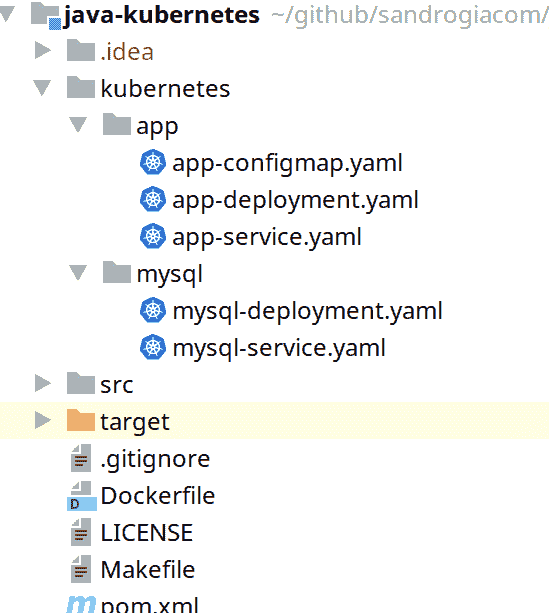

# 面向 Java 开发人员的 Kubernetes 部署应用程序

> 原文：<https://dev.to/sandrogiacom/kubernetes-for-java-developers-deploy-application-413k>

## 你好 Java 开发者

这是面向 Java 开发人员的 Kubernetes 系列的第三部分。继续之前，检查第[第](https://dev.to/sandrogiacom/kubernetes-for-java-developers-setup-41nk)和第[第二](https://dev.to/sandrogiacom/kubernetes-for-java-developers-creating-a-docker-image-1g36)部分。

在本教程中，我们将学习如何在 kubernetes 集群中构建和运行应用程序。

此时，我们有一个运行在 **docker** 上的 **Java 应用程序**，它也使用运行在 docker 上的 **mysql** 数据库。

## 为重要时刻准备环境

继续之前，请检查您是否有必要的工具。

只需检查:

`make --version`

`minikube version`

`kubectl version`

`vboxmanage --version`

如果您没有上述工具之一，请转至第一部分，按照说明操作并返回此处。

或者直接输入:

`make check`

上面的命令需要在项目的根目录下执行。如果您还没有它，请克隆它:

[https://github . com/sandrogiacom/Java-kubrites](https://github.com/sandrogiacom/java-kubernetes)

## 准备演示应用程序

转到 java-kubernetes 目录，键入`make`查看所有的`make`选项。

### 创建 minikube 机器

`make k-setup`启动 **minikube** ，启用 **ingress** ，创建**命名空间**“dev-to”。

## 创建 kubernetes 资源

检查包含子目录 **app** 和 **mysql** 的 kubernetes 文件夹。

[](https://res.cloudinary.com/practicaldev/image/fetch/s--CkYpjKYO--/c_limit%2Cf_auto%2Cfl_progressive%2Cq_auto%2Cw_880/https://thepracticaldev.s3.amazonaws.com/i/gik8s3f53uotkamw9hna.png)

**app-configmap.yaml**

*   带有环境变量的应用程序配置。

```
apiVersion: v1
kind: ConfigMap
metadata:
  name: myapp
  namespace: dev-to
data:
  DATABASE_SERVER_NAME: "mysql"
  DATABASE_USER_NAME: "myapp"
  DATABASE_USER_PASSWORD: "myapp_pwd" 
```

**app-deployment.yaml**

*   部署会创建一个复制的 pod。有关更多信息，请查看[文档](https://kubernetes.io/docs/concepts/workloads/controllers/deployment/)。

```
apiVersion: apps/v1
kind: Deployment
metadata:
  name: myapp
  namespace: dev-to
  labels:
    app: myapp
spec:
  selector:
    matchLabels:
      app: myapp
  template:
      metadata:
        labels:
          app: myapp
      spec:
        containers:
          - name: myapp
            image: java-k8s:latest
            imagePullPolicy: Never
            ports:
              - containerPort: 8080
                name: http
            envFrom:
              - configMapRef:
                  name: myapp 
```

这里重要的部分是**模板**，它定义了 docker 镜像的名称、http 端口和环境变量的源。

**app-service.yaml**

*   一种将运行在一组 pod 上的应用程序公开为网络服务的抽象方式。

```
kind: Service
apiVersion: v1
metadata:
  name: myapp
  namespace: dev-to
spec:
  selector:
    app: myapp
  type: NodePort
  ports:
    - protocol: TCP
      port: 8080
      targetPort: 8080 
```

在 **mysql** 文件夹中，我们只有部署和服务文件，因为环境变量在同一个文件中。

### 部署数据库

`make k-deploy-db`创建 mysql **部署**和**服务**。

检查服务是否正在运行:

`kubectl get pods -n dev-to`

访问本地主机中的数据库:

`kubectl port-forward -n dev-to <pod_name> 3306:3306`

### 构建应用程序和 docker 映像

`make k-build-app` **在 minikube 机器**内构建应用程序并创建 docker 映像。

`make k-deploy-app` **在集群**上部署应用。

检查服务是否正在运行:

`kubectl get pods -n dev-to`

## 检查应用程序 url

Minikube 为您提供了要访问的主机和端口。

类型:
`minikube -p dev.to service -n dev-to myapp --url`

下面的地址对你来说是不同的！

`http://192.168.99.133:30343`

`curl -X GET http://192.168.99.133:30343/persons`

在网页浏览器中直接打开应用:
`minikube -p dev.to service -n dev-to myapp`

## 结论

在这一部分中，我们学习了如何在本地 kubernetes 集群中构建和部署应用程序。

在下一部分中，我们将看到如何调试我们的应用程序以及微服务的一些良好实践。

回头见！

## 奖金

### 一步创建全部

要创建世界，只需在终端上复制并粘贴下面的命令。确保您位于项目的根目录中。

`make k-all`

[](https://twitter.com/sandrogiacom)