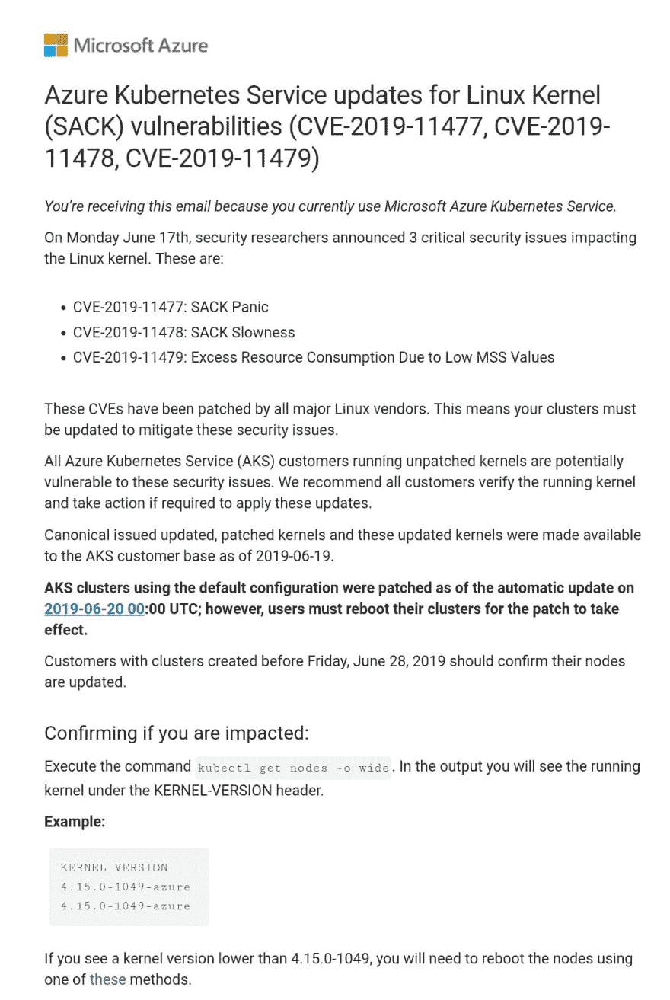

# Kured:重启你的 Azure Kubernetes 服务节点

> 原文：<https://dev.to/cmendibl3/kured-restart-your-azure-kubernetes-service-nodes-lcb>

两周前，我收到了一封来自微软 Azure 的电子邮件，解释说 Azure Kubernetes 服务已经打了补丁，但我必须重启我的节点(重启集群)才能完成操作。

[](https://res.cloudinary.com/practicaldev/image/fetch/s--jwiRPmN2--/c_limit%2Cf_auto%2Cfl_progressive%2Cq_auto%2Cw_880/https://carlos.mendible.com/assets/img/posts/aks_update_kured.png)

你需要知道的第一件事是，当这种事情发生时，Azure 平台会在集群的每个节点中创建一个名为`/var/run/reboot-required`的文件。

第二件事是一个名为 [Kured](https://github.com/weaveworks/kured) 的 Kubernetes 重启守护程序存在，如果安装在您的集群中，它将在每个 pod 上运行，监视`/var/run/reboot-required`文件的存在。 [Kured](https://github.com/weaveworks/kured) 然后为您处理重启，因此一次只重启一个节点。

那么，如何安装它并检查您的节点发生了什么呢？让我们看看:

## 1。检查节点

* * *

该死的，我运行的是受影响的内核版本:4.15.0-1049-azure。

```
kubectl get nodes -o wide

NAME STATUS ROLES AGE VERSION EXTERNAL-IP OS-IMAGE KERNEL-VERSION CONTAINER-RUNTIME
aks-agentpool-14502547-0 Ready agent 3d v1.12.8 <none> Ubuntu 16.04.6 LTS 4.15.0-1049-azure docker://3.0.4
aks-agentpool-14502547-1 Ready agent 3d v1.12.8 <none> Ubuntu 16.04.6 LTS 4.15.0-1049-azure docker://3.0.4
aks-agentpool-14502547-2 Ready agent 3d v1.12.8 <none> Ubuntu 16.04.6 LTS 4.15.0-1049-azure docker://3.0.4 
```

Enter fullscreen mode Exit fullscreen mode

## 2。安装 [Kured](https://github.com/weaveworks/kured)

* * *

```
kubectl apply -f https://github.com/weaveworks/kured/releases/download/1.2.0/kured-1.2.0-dockerhub.yaml 
```

Enter fullscreen mode Exit fullscreen mode

## 3。再次检查节点

* * *

```
kubectl get nodes -o wide 
```

Enter fullscreen mode Exit fullscreen mode

您可以看到前两个节点已经重新启动，第二个节点已经禁用了计划，因为它仍在进行中。

```
aks-agentpool-14502547-0 Ready agent 3d v1.12.8 <none> Ubuntu 16.04.6 LTS 4.15.0-1049-azure docker://3.0.4
aks-agentpool-14502547-1 Ready agent 3d v1.12.8 <none> Ubuntu 16.04.6 LTS 4.15.0-1050-azure docker://3.0.4
aks-agentpool-14502547-2 Ready,SchedulingDisabled agent 3d v1.12.8 <none> Ubuntu 16.04.6 LTS 4.15.0-1050-azure docker://3.0.4 
```

Enter fullscreen mode Exit fullscreen mode

要了解更多关于 [Kured](https://github.com/weaveworks/kured) 及其提供的功能，请点击[这里](https://github.com/weaveworks/kured)。

希望有帮助！