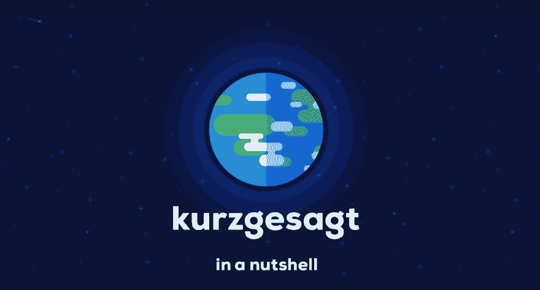
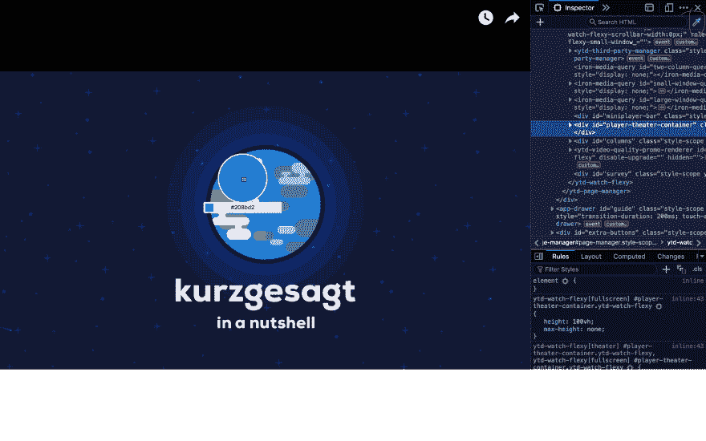
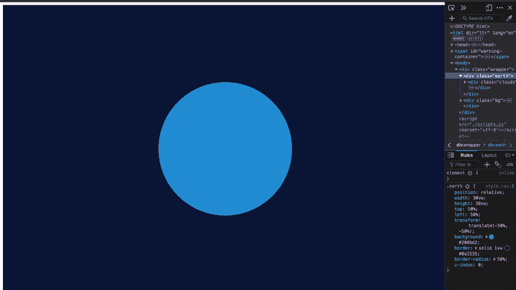
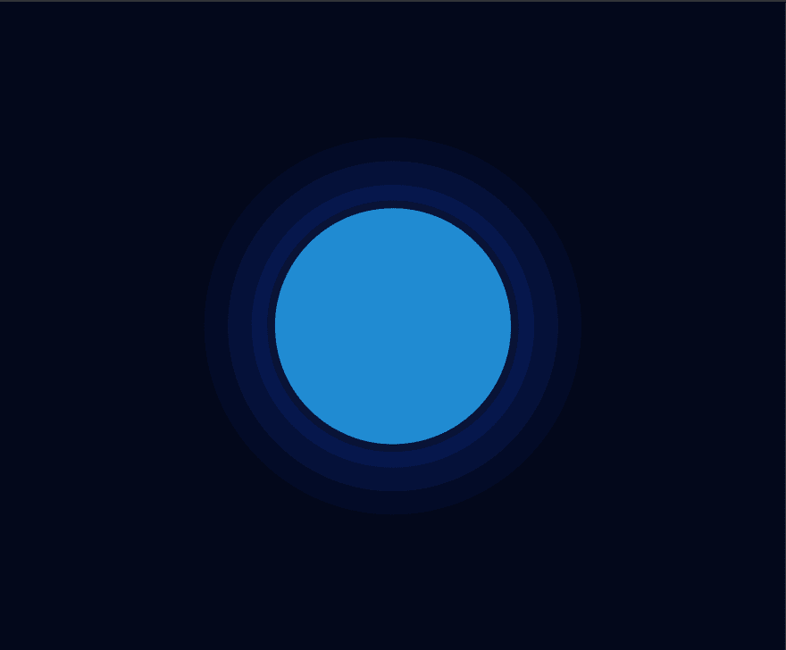
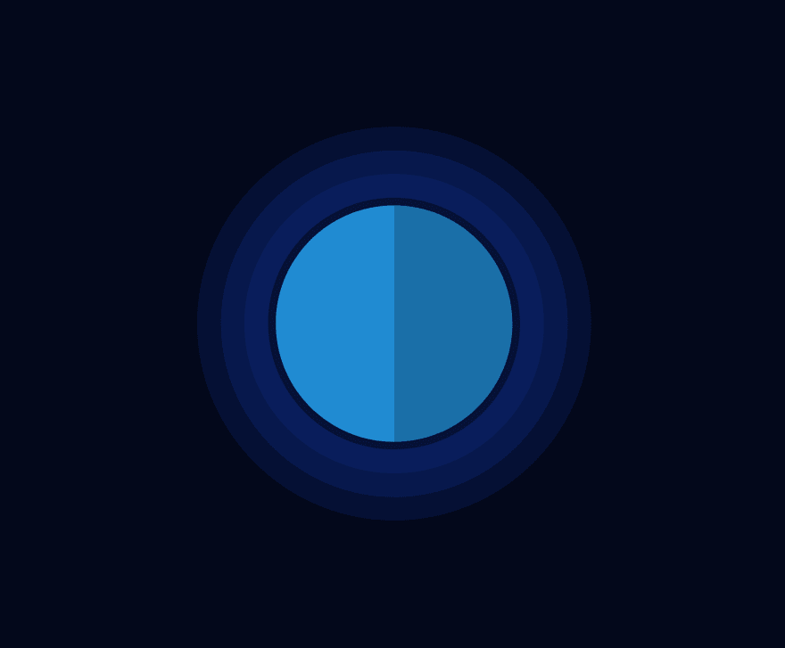

# 简而言之，地球- A CSS 娱乐

> 原文：<https://dev.to/moniet/kurzgesagt-earth-a-css-recreation-23b3>

[](https://res.cloudinary.com/practicaldev/image/fetch/s--FYk7yUOA--/c_limit%2Cf_auto%2Cfl_progressive%2Cq_auto%2Cw_880/https://thepracticaldev.s3.amazonaws.com/i/c9lnwdby3z7660hc4njw.png)

这个项目背后的想法是重新创建一个在 YouTube 频道 Kurzgesagt 的视频中发现的插图(如上图所示)；限制自己使用 HTML 和 CSS。

通过创作这幅插图，我的目的是学习和利用各种布局和响应设计的技术。此外，我想练习使用 BEM 方法编写可维护的 sass 代码。

最后，通过记录创建插图的过程，我希望分享我在布局方面的知识，并揭露 CSS 的一些怪癖。

## 第一步

#### 使用拖放工具

[](https://res.cloudinary.com/practicaldev/image/fetch/s--j6hZi22y--/c_limit%2Cf_auto%2Cfl_progressive%2Cq_auto%2Cw_880/https://thepracticaldev.s3.amazonaws.com/i/0muk5kfcdsldlo12toxr.png)

我用火狐浏览器中的 ***拾色器工具*** 从 Kurzgesagt 的视频中抓取调色板。在 Firefox 中，颜色工具会自动将十六进制值复制到剪贴板。通过这种方式，我能够在 SCSS 创建一个带有变量的调色板，如下:

```
// Palette
$earth-blue: #208bd2;
$trees: #45cb69;
$earth-outline-blue: #0a1436;
$earth-aura: #10329b;
$clouds: #ffffff;
$bg: #03081b; 
```

Enter fullscreen mode Exit fullscreen mode

看看 BEM 方法论，我发现不仅 html 标签，而且变量、混合和扩展都有描述性的名字是很重要的。

以这种方式，通过记忆将更容易回忆起代码，这最终允许更快的改变。

## 初始结构

开始时，我发现从定义布局蓝图的“块”或 html 的主要内容开始定义结构是很重要的。看着插图，我定义了一个基于以下块的基础结构:地球，云，树和地球的光环。

```
// base structure
<div class="wrapper">

    <div class="earth">
      <div class="earth_shadow_container">
        <div class="earth_shadow"></div>
      </div>

      <div class="clouds">
        <div class="lines_1"></div>
        <div class="lines_2"></div>
      </div>

      <div class="trees">
        <div class="line_1"></div>
        <div class="line_2"></div>
      </div>
    </div>

    <div class="earth_aura">
    </div>

    <div class="bg">
    </div>

  </div> 
```

Enter fullscreen mode Exit fullscreen mode

上面，我用描述性的名字来命名块。这符合 BEM 的标签命名指南，它规定你应该描述块的用途，而不是它的状态。

尽管为了说明可能稍微抽象了一些；我强烈地感觉到，关注命名约定这样的小事仍然是一种好的做法，因为它们使代码更具可读性。

此外，包装器——将包含所有元素——具有以下 CSS 代码来全屏呈现艺术:

```
.wrapper {
  display: block;
  position: relative;
  margin: 0 auto;
  width: 100vw;
  height: 100vh;
} 
```

Enter fullscreen mode Exit fullscreen mode

除了全屏显示之外，上面的代码还可以让其中的元素相对于用户的“视窗”(即用户设备的屏幕)轻松居中。这是通过使用 CSS 中的 vw 和 vh 相对单位来实现的。

## 制造地球

接下来，我开始把整个插图的“基础”放在一起，那就是地球；它的背景、边框、宽度和高度。

```
.earth {
  position: relative;
  width: 30vw;
  height: 30vw;
  top: 50%;
  left: 50%;
  transform: translate(-50%, -50%);
  background: $earth-blue;
  border: solid 1vw $earth-outline-blue;
  border-radius: 50%;
  z-index: 0;
  overflow: hidden;
} 
```

Enter fullscreen mode Exit fullscreen mode

在这里，我再次使用 vw 单位来调整地球的大小，这是因为它将根据视口的尺寸重新调整大小，所以任何人都可以在他们的设备上看到它。

最值得注意的是，下面的代码将地球居中，正好在屏幕的中间(垂直和水平):

```
top: 50%;
left: 50%;
transform: translate(-50%, -50%);
background: $earth-blue; 
```

Enter fullscreen mode Exit fullscreen mode

为了让我的代码*保持干燥*，我采用了上面的代码片段并创建了一个 [@extends](http://www.sass-lang.com/guide) 的实例，这将允许我在其他地方重用它。

扩展代码片段如下所示:

```
%centerElement {
  top: 50%;
  left: 50%;
  transform: translate(-50%, -50%);
} 
```

Enter fullscreen mode Exit fullscreen mode

现在我们有了一个看起来像这样的地球:
[](https://res.cloudinary.com/practicaldev/image/fetch/s--O7g9iL3R--/c_limit%2Cf_auto%2Cfl_progressive%2Cq_auto%2Cw_880/https://thepracticaldev.s3.amazonaws.com/i/eb69v0vhfy2ctj8aqpva.png)

## 气场

接下来，我专注于创造*地球光环*。我的想法是，我可以用“地球光环”块创建基本背景，并用:before 和:after 伪元素构建其他三个光环。

该项目的一个重要收获是`z-index`属性是多么有用。z-index 属性将允许你定义元素的“层”。简而言之(双关语)，允许您决定哪个元素在顶部、底部和中间。

完成光环，地球现在看起来是这样的:
[](https://res.cloudinary.com/practicaldev/image/fetch/s--sMubKV09--/c_limit%2Cf_auto%2Cfl_progressive%2Cq_auto%2Cw_880/https://thepracticaldev.s3.amazonaws.com/i/htvjgzk4yinimvem70ix.png)

## 地球的阴暗面

这是一段很难写的代码，有几种方法可以做到，比如 clip-path。然而，我坚持使用一个简单的 div 并将它的 overflow 改为 none。代码可能有点混乱，但这绝对是一种有用的技术。

### CSS 为地球阴影:

```
.earth_shadow_container {
  position: absolute;
  left: 50%;
  width: 100%;
  height: 100%;
  overflow: hidden;
}
.earth_shadow {
  position: absolute;
  left: -50%;
  width: 100%;
  height: 100%;
  background: rgba(0,0,0,0.2);
  border-radius: 50%;
  z-index: 1000;
} 
```

Enter fullscreen mode Exit fullscreen mode

请注意，z-index 很大，因为它允许云和树位于其下。

看起来是这样的:
[](https://res.cloudinary.com/practicaldev/image/fetch/s--zAXDlLwF--/c_limit%2Cf_auto%2Cfl_progressive%2Cq_auto%2Cw_880/https://thepracticaldev.s3.amazonaws.com/i/v1pp5mlgexrztbboyc6u.png)

## 树木

类似于地球的光环，我使用了元素的组合，它们的伪元素，和盒子阴影，来创建树。

首先，我将“树”容器放在地球块的中心。接下来，我给树编码如下:

```
.line_1 {
    position: absolute;
    top: 75%;
    left: 20%;
    width: 12vw;
    height: 4vw;
    background: $trees;
    border-radius: 50px;

    &:after {
      content: '';
      position: absolute;
      display: block;
      top: -150%;
      left: 70%;
      width: 8vw;
      height: 3vw;
      background: $trees;
      border-radius: 50px;
    }

    &:before {
      content: '';
      position: absolute;
      display: block;
      top: -200%;
      left: -50%;
      width: 5vw;
      height: 2vw;
      background: $trees;
      border-radius: 50px;
    }

  } 
```

Enter fullscreen mode Exit fullscreen mode

对云也进行了同样的处理。最后，我用 CSS 动画润色了插图，并添加了一个描述性的标题。

## 结果:

[https://codepen.io/mentezz/embed/YoPprB?height=600&default-tab=result&embed-version=2](https://codepen.io/mentezz/embed/YoPprB?height=600&default-tab=result&embed-version=2)