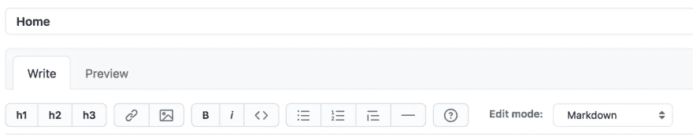
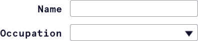
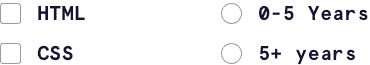

# WCAG 2.1 中的名称标签

> 原文：<https://dev.to/colabottles/label-in-name-in-wcag-2-1-1inf>

[](https://res.cloudinary.com/practicaldev/image/fetch/s--3_4Ag2f4--/c_limit%2Cf_auto%2Cfl_progressive%2Cq_auto%2Cw_880/https://res.cloudinary.com/colabottles/image/upload/v16056162img/accessibility.jpg)

[2018 年推出的 WCAG 2.1 建议](https://www.w3.org/TR/WCAG21/)。已经过去几年了，现在有了一些新的成功标准。在本文中，我将讨论名为的[标签，这是我们如何可视化地标记组件。我们将看看一些失败状态是什么样子的，如何修复它们，以及如何正确处理它们的例子。](https://www.w3.org/WAI/WCAG21/Understanding/label-in-name.html)

## 你在成功的标准上失去了我…

成功标准是非特定于技术的可测试的陈述。它们是我们确定我们的工作是否“可访问”的基线在这种情况下，“名义上的标签”是被评估的东西，这是一系列其他标准中的一个。WCAG 2.1 是规范的当前版本，而“名称中的标签”是第 2.5.3 项，表示它属于标准的第二类(“可操作”)，在该类别的第五部分(“输入模式”)下，标记为该部分的第三项。

WCAG 2.1 向后兼容 WCAG 2.0，这意味着它是 WCAG 2.0 的扩展。此外，WCAG 2.1 版和 2.2 版是相互结合的，它们可以一起工作。

## 标签中的名称

因此，言归正传， [2.5.3 名称中的标签](https://www.w3.org/TR/WCAG21/#label-in-name)(A 级)是新的，并在 WCAG 2.1 成功标准中进行了定义。下面是对它的描述:

> 对于带有包含文本或文本图像的标签的用户界面组件，名称包含可视显示的文本。

该成功标准(SC)的目的是确保**组件上标签可见的单词也包含在与组件相关的单词中**。这有助于确保任何人——无论是使用语音识别软件的人还是视力正常的人——都可以依靠标签来描述组件的意图或如何与之交互。请注意，可视文本标签和**程序名**不一定要精确，但是它们应该包含一个关联它们的公共工作(例如，“提交”和“立即提交”)。

关键是，在所读和所见之间，不会因为差异而产生混淆。
辅助技术在行动

让我们以 HTML 联系表单为例。用户可以使用语音识别软件来填写表格，并到达提交表格和发送表格的终点。

说按钮的标签和按钮中的可视文字不一致:

```
<form>
  <label>
    Message:
    <textarea name="message"></textarea>
  </label>

  <button aria-label="Submit">Send</button>
</form> 
```

Enter fullscreen mode Exit fullscreen mode

在上面的例子中，**按钮对辅助技术**不起作用。按钮包含文本“发送”，但它的`aria-label`是“提交”这就是失败之处。可视标签(“Send”)与编程名称(“Submit”)不一致，这两者之间没有关联。

当这些匹配或有共同术语时，语音识别软件的用户可以通过说出组件(如链接、按钮和菜单)的可视文本标签来导航。在这种情况下，我们可以通过匹配标签和文本来修复它。但是由于`aria-label`没有增加任何价值，因此将其完全移除是一个更好的解决方案:

```
<form>
  <label>
    Message:
    <textarea name="message"></textarea>
  </label>

  <button>Send</button>
</form> 
```

Enter fullscreen mode Exit fullscreen mode

如果使用屏幕阅读器的视力正常的用户听到的文本与他们在屏幕上看到的文本相似，他们也会有更好的体验。

当标签和可视文本不匹配时，试图使用可视文本标签作为导航(例如“移动到名字”)或选择手段的语音输入用户将被卡住，因为用户说出的可视标签不匹配或者不是作为语音输入命令的一部分而启用的可访问名称的一部分。

此外，当可访问名称不同于可见标签时，它可能充当隐藏命令，可以由语音输入用户意外激活*。SC 不适用于组件不存在可见文本标签的情况。*

 *## 代码在动作

这里有三种不同的故障状态。

*   [有问题的`<button>`元素](https://codepen.io/colabottles/pen/QWKWmEK)，其中口语标签和视觉标签没有关联。
*   [标签不匹配](https://codepen.io/colabottles/pen/poEoLPP)由于“易于接近的隐藏”跨度，口语文本比视觉标签阅读更多的内容。
*   [通过`aria-labelledby`输入带有语音标签](https://codepen.io/colabottles/pen/MWjWVXr)的输入，无法在语音和视觉标签之间建立关联。

同样，根据名称 SC 中的 2.5.3 标签，这些都是不良实践的例子。

> 在 2020 年[，WebAIM 百万项目](https://webaim.org/projects/million/)评估了 420 万个表单输入，发现其中 55%没有正确标注，或者通过`<label>`、`aria-label`或者`aria-labelledby`。

在处理表单时，我们大多数人都非常习惯于将一个`<label>`与一个`<input>`或其他表单控件配对。这真是太棒了，也是一种很好的方式来表明控件做了什么，但是还有控件的**编程名**，也就是使用`aria-label`的“可访问名”。

当`<label>`的名称可以与`aria-label`中的可编程(或可访问)名称相关联时，我们可以获得更好的用户体验。例如，如果我们使用“名字”作为输入的`<label>`，那么我们可能希望我们的`aria-label`是“名字”或者类似的东西。**对于有认知障碍的用户来说，无法将程序名称和可见标签联系起来可能是一个更大的挑战**。对于语音输入用户来说，这需要额外的认知负荷，他们必须记住说出与他们在控件上看到的可见标签不同的语音命令。当文本到语音转换用户需要吸收和理解无法连接到可见标签的语音输出时，也会产生额外的认知负荷。这些表单将被提交，但是这是以可访问性和残疾用户为代价的。

这是上面的三个例子！

参见 [CodePen](https://codepen.io) 上 Todd Libby ( [@colabottles](https://codepen.io/colabottles) )的《姓名中的笔[标签:Ex 4 -姓名中标签的正确用法](https://codepen.io/colabottles/pen/OJRPGYO)》。

## 标签中的文本细节

根据 WCAG SC，如果文本以象征性方式使用，而不是直接用人类语言表达，则不应被视为可见标签。富文本编辑器就是一个很好的例子，因为编辑器可能使用图像作为文本(包含在 [1.4.5 文本图像](https://www.w3.org/WAI/WCAG21/Understanding/images-of-text)中)。

[](https://res.cloudinary.com/practicaldev/image/fetch/s--wqukPjXq--/c_limit%2Cf_auto%2Cfl_progressive%2Cq_auto%2Cw_880/https://res.cloudinary.com/colabottles/image/upload/v16080722img/rte.webp)

为了使标签文本和可访问名称相互匹配，确定哪个*文本应该被视为任何给定控件的任何组件的标签是很重要的。在一个用户界面中，经常会有*多个*文本字符串可能与一个控件相关。[有理由](https://www.w3.org/WAI/GL/2016/WD-WCAG20-TECHS-20160105/G162)为什么紧邻的标签应该被认为是文本标签。它是关于为与组件交互的用户建立一个可预测的模式。这些原因表明应该放置可见标签:*

*   紧靠文本输入、下拉框和其他小部件或组件的左侧。
*   紧挨着复选框和单选按钮的右边。
*   在按钮或标签内，或在用作按钮的图标正下方。

[](https://res.cloudinary.com/practicaldev/image/fetch/s--ZdPWc32h--/c_limit%2Cf_auto%2Cfl_progressive%2Cq_auto%2Cw_880/https://res.cloudinary.com/colabottles/image/upload/v16080780img/Group-6a.jpg) 标签左边的输入和下拉选择菜单

[](https://res.cloudinary.com/practicaldev/image/fetch/s--upHC3-Q_--/c_limit%2Cf_auto%2Cfl_progressive%2Cq_auto%2Cw_880/https://res.cloudinary.com/colabottles/image/upload/v16080780img/Group-7a.jpg) 标签右边的复选框和单选按钮

[](https://res.cloudinary.com/practicaldev/image/fetch/s--w8LtBcmr--/c_limit%2Cf_auto%2Cfl_progressive%2Cq_auto%2Cw_880/https://res.cloudinary.com/colabottles/image/upload/v16080780img/Group-8a.jpg) 标签里面或下面有一个按钮，视符号而定

如果以象征性的方式使用，标点符号和大写字母也可以被认为是可选的。比如用“名”代替“名:”就可以，用“下一个”代替“下一个……”也可以，等等。

另一件需要考虑的事情是:WCAG SC 不会考虑没有可视标签的组件。

## 适当的标签有它的好处

将组件标签与其对应的可访问名称相匹配的核心好处是，它使语音输入用户能够激活页面上的控件，而不必改变焦点或在两个不同的术语之间进行猜测。

最后，在所见和所言之间使用清晰、一致的术语可以为每个人提供更愉快的用户体验，因为辅助技术读取的标签与也可以看到和读取的可见标签相匹配。这就是我们所说的包容性设计——每个人都是赢家，没有人被遗漏。

## 总结

我们刚刚分解了 WCAG 2.5.3 成功标准中关于名称标签的一些细节。这听起来像是一件简单的事情。但是正如我们所看到的，有些情况下并不那么明确。

当然，坚持这一标准的目标是使我们的工作对所有人都是可及的和包容的。WCAG 不仅通过提供指导方针，还通过设定合规等级(A、AA、AAA，其中 AAA 是最高等级)来帮助我们了解我们是否成功。标签中的文本属于 A 级，这意味着它是合规性的基本级别。为了获得分数，WCAG 正在[寻找](https://www.w3.org/TR/WCAG21/#label-in-name):

> […] [带有](https://www.w3.org/TR/WCAG21/#dfn-user-interface-components)[标签](https://www.w3.org/TR/WCAG21/#dfn-labels)的用户界面组件包括[文本](https://www.w3.org/TR/WCAG21/#dfn-text)或[文本图像](https://www.w3.org/TR/WCAG21/#dfn-images-of-text)，[名称](https://www.w3.org/TR/WCAG21/#dfn-name)包含可视呈现的文本。

我们可以通过查看网站的源代码，使用浏览器的开发工具，如 Chrome 或 Firefox，或者使用诸如[WAVE browser extension](https://wave.webaim.org/extension/)(Chrome 和 Firefox)和来自 Deque Systems (Chrome)的 [Axe 等工具运行可访问性审计，来测试并确保我们的代码是完整和正确的。](https://www.deque.com/axe/browser-extensions/)

简而言之，玻璃的另一面是真实的人，我们可以在代码和设计中做一些事情来帮助他们享受与我们制作的组件进行交互的乐趣。标签中的文本只是 WCAG 中列出的众多标准之一，虽然它看起来像一个小细节，但遵守它可以对我们的用户产生很大的影响。*