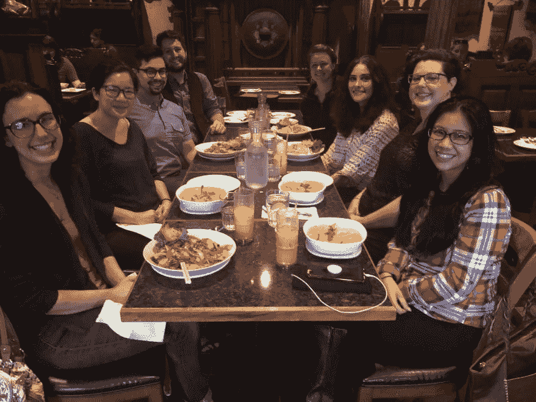

# Strong

> 原文：<https://dev.to/lisacee/lambda-strong-4mkg>

我昨天去了我的第一次聚会——我们是在一家餐馆认识的。我很焦虑。我计划过度了。我查了餐厅的菜单，停车情况。我是个杞人忧天者。我一直都是。我知道聚会是网络和程序员文化的重要组成部分，但我一直推迟参加。本人性格内向，患有广泛性焦虑症。相对而言，我是编程新手，我感觉自己比许多同龄人都老。但那些都只是借口。

TLDR:我真的很紧张，但是我去了我的第一次聚会，我很高兴我去了。

## 一点设置...

2018 年，我开始参加 [Lambda 学校](https://lambdaschool.com/)，这是一个在线但实时的计算机科学和网络开发项目。我拼命工作了 13 个月，毕业于 Lambda 的第一个兼职团队，同时还在我的有薪工作岗位上工作。不用说，我没怎么出门。当我参加社交活动时，我的朋友并不了解我正在学习的东西。他们支持我，为我感到高兴，但他们的理解仍然只是知道我会建立更好的网站。

我认为拉姆达学校意识到它的大多数学生和我的情况相似。我从来没有遇到过离开电脑的同学。虽然在 Lambda 学习是我进一步深造的最佳选择，但在线课程可能有点孤立。我很了解我的同学，但他们住在全国各地，不是我可以轻易结识或建立本地网络的人。这可能就是为什么 Lambda 鼓励本地聚会，甚至为每个学生的共享餐饮或活动支付 25 美元的津贴。

## 在聚会上

聚会在华盛顿州塔科马的一家泰国餐馆举行。Lambda 学校在西雅图北部有过多次聚会，但我一次也没参加过。塔科马离我住的地方更近，交通不那么拥挤。我找不到借口不参加。欢迎该地区的任何 Lambda 学生或毕业生参加聚会，但幸运的是，参加我聚会的所有人都是女性(还有几个男朋友+1)。虽然我们的生活非常不同，但我们都有参加 Lambda 的狂野经历，让我们走到了一起。随着我们边吃边聊，我们发现了更多的共同点:

*   放学后或学习时，我们都很难停止思考
*   我们都有强大的支持系统
*   不匹配的括号让我们都疯了

<figure>

<figcaption>That's me in the front, left. Hi!</figcaption>

</figure>

与这些女士的会面让我在编程之旅中不再感到孤独。尽管我已经毕业，而这些女士中的一些人刚刚起步，但我们都有自己的见解可以分享。Lambda 的课程随着时间的推移不断发展，所以新生可以告诉我 Lambda 现在教授的新技术和新方法。作为我们组唯一的毕业生，我分享了我的求职经历。我进去的时候感到尴尬，因为我还没有找到我的第一份难以捉摸的开发工作，但没有人评价我。作为开发人员，我们都是终身学习者，我们分享的故事只是添加到我们工具带上的工具。

## 最后的想法

我很高兴我去了这个聚会，拉姆达学校鼓励我去。我真的很担心参加，但最后，我累了，但对我的新联系感到兴奋。Lambda 学校的聚会是每月一次的，我会尽可能多地参加。在与这些女士分享这一餐的过程中，我受到启发，在我的 Twitter 游戏中变得更加活跃，并觉得自己有能力写这篇博客。

这次聚会也让我对下个月在西雅图参加另一个更大的 JavaScript 聚会感到勇敢和更有信心。

你对聚会有什么体验？请在评论中告诉我，感谢阅读。