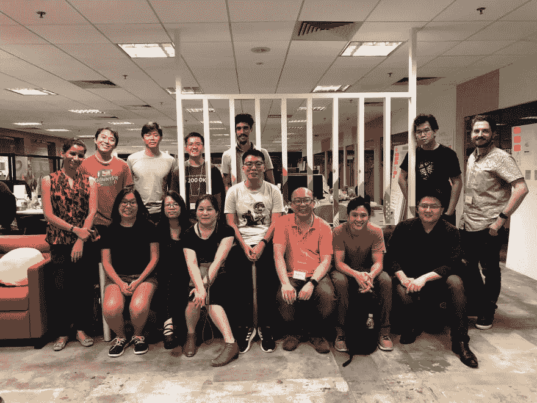
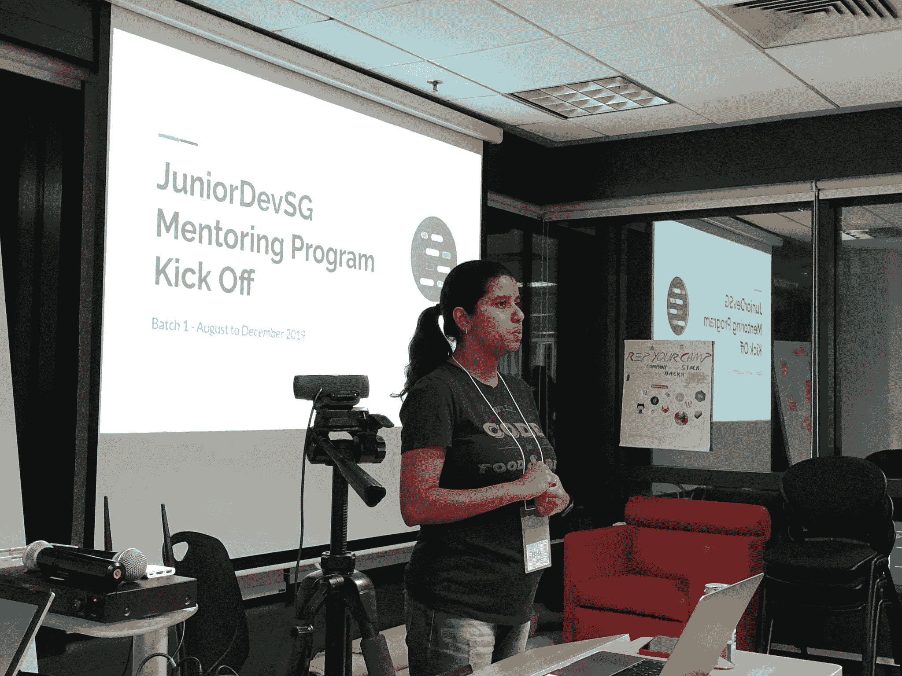

# 启动 JuniorDev SG 的指导计划

> 原文：<https://dev.to/steelwolf180/launch-of-juniordev-sg-s-mentoring-programme-26em>

# 简介

大约两年前，当我开始进入这个行业的时候。

书籍、播客、在线课程和 youtube 视频是我的灵感和教育来源。

在那里我学会了 Django 开发和其他开发实践。

# 缺乏对初级开发人员的支持

在那个时候，没有太多的开发团队专门为新加坡的初级开发人员服务。

希望成为新加坡开发者社区的一员，分享他们的奋斗历程，成长为更优秀的开发者。

希望有一天，帮助**升级**这些开发者成为**的技术领导者**。

帮助未来的开发者，推动我们小红点的技术发展。

当然，有 3 - 4 个编码训练营正在建立，以帮助缓解开发人员短缺和被裁减的 PMET 成为开发人员的再培训。

我觉得它无法满足大学毕业的初级开发人员、编码训练营或自学成才的开发人员的需求。

# 导师是初级开发人员的关键

尽管我的大部分技术知识和开发实践都来自在线资源和书籍。

我的成长很大程度上来自于我在[导师俱乐部](https://www.linkedin.com/company/mentorshub/)的导师 Kenny Liew 先生警惕的目光。

是谁给了我**重重的一击**的脑袋& **的建议**让我以一名开发者的身份打入当地的创业生态系统。

# 推出 JuniorDev SG 辅导计划

在从我们的试点批次获得初步反馈后，我想宣布我们启动了 [JuniorDev SG 指导计划](https://github.com/JuniorDevSingapore/mentoring-program/blob/master/about.md)。

上周三，我们在 SP Digital 进行了第一次会议。

他们慷慨地为我们提供了食物和场地赞助，以开展我们的指导项目。

## 每个环节的主题

对于导师计划，导师们在我们的集思广益会议期间选择了 6 个主题。

我们相信这可以帮助初级开发人员成长并提高他们作为开发人员的能力，以构建为他们的用户提供价值的软件。

*   职业道路——帮助学员选择自己的专业，找到自己作为开发人员的职业道路。
*   软技能——学习与软件团队或跨职能团队内部运作相关的软技能，以交付软件或成为一个人。
*   如何加快学习——帮助提高对行业相关新技术、方法或概念的理解的技巧和诀窍。
*   理解商业环境——理解商业目标、目的，管理客户或合作伙伴的期望，创建软件以向用户交付价值。
*   面试准备-帮助学员更好地准备公司提出的技术挑战和面试技巧，以获得他们想要的工作。
*   倦怠和冒名顶替综合征-识别倦怠和冒名顶替综合征的提示和技巧，希望能处理它，防止自己在工作或生活中倦怠。

# 结论

我希望在每次指导会议后分享更多我们的集体见解和理解，以帮助未来的初级开发人员，或者只是为他们自己在世界各地的初级开发人员提供一个指导框架。

# 参考文献

*   [JuniorDev SG 网站](https://juniordev.sg/)
*   [JuniorDev SG 辅导计划](https://github.com/JuniorDevSingapore/mentoring-program/blob/master/about.md)
*   [SP 数字](https://blog.spdigital.io/)
*   刘先生
*   [导师俱乐部](https://www.linkedin.com/company/mentorshub/)
*   [un draw 的插图](https://dev.toillustrations)