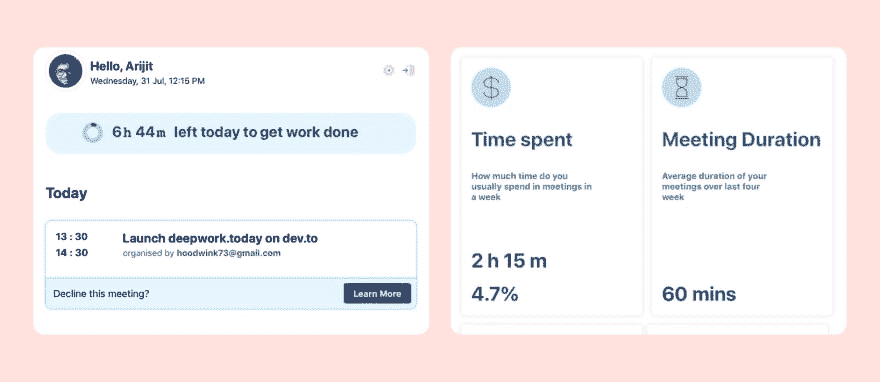

# 今天启动 deepwork

> 原文：<https://dev.to/hoodwink73/launching-deepwork-today-22mf>

**TL；博士** - [deepwork.today](https://deepwork.today) 帮你记录一天。永远知道你有多少时间来完成工作。拒绝不必要的会议。[注册以节省时间](https://deepwork.today)并提高您的工作效率。

我用 React 和 Firebase 开发了这个应用程序。我用了反应钩。我觉得我可以表达像访问 firestore，firebase 认证，使用媒体查询来适应布局等操作。简洁易读。我鼓励你去看看回购，特别是如果你对 React hooks 和 Firebase 的参考代码库感兴趣的话。

*   [深度工作-今天-客户](https://github.com/hoodwink73/my-week-in-meetings)
*   [深度工作-今天-燃烧基地](https://github.com/hoodwink73/my-week-in-meetings-firebase-app)

* * *

大家好！

我们的上一个雇主是一家大公司，我们意识到我们的合作是无组织的——没有议程，目标不明确，参与者太多。这些模棱两可的会议不仅耗费了我们的生产时间，还让我们意识到我们的脱离，并让我们质疑我们自己的机构是否能做好工作。

我使用番茄工作法已经有四年多了。这使我每天的努力更加一致。但是，无论我如何计划我的一天，临时会议和我组织内的其他分散注意力的事情都让我没有成就感。

当我们辞职时，我们有一些属于自己的时间。我们做了一些思考，以改善我们的个人协作努力。

而 [deepwork.today](https://deepwork.today) 就是这些思想的产物。

它提供了

*   ⏲️ **Deepwork 时钟**知道你每天的日程安排。我们经历过焦点不能像开关一样打开和关闭，所以我们为每次会议留出一些冷静的时间。时钟会不断地提醒你还剩多少时间来完成工作。

*   📗**一口大小的指南**帮助你判断会议的重要性和相关性。如果您找到了拒绝会议的正当理由，我们将为您提供一份*模板*回复。

*   💁**小贴士**帮你改进会议。我们阅读了一些关于如何更好地开会的文章，并把它们浓缩成易读的要点。

*   📈**会议分析**让你对一段时间以来的会议习惯有一个总体的了解。这些数字会帮助你决定

    *   合作对个人工作的比例是否不平衡
    *   会议持续时间能变得更有效吗
    *   一周中最忙的一天
    *   顶级合作者

## 让我们展开讨论

这是一个早期版本。我们选择与 dev.to 社区分享这个 **first** ,因为作为程序员，我们需要在我们个人的优先事项和我们的合作者的优先事项之间取得平衡。因此，我们需要干预来阐明我们的意图。

我希望你们能加入讨论，帮助我理解

*   为了保持协作和生产力之间的平衡，你每天要做的两件事
*   你多久拒绝一次会面？通常是什么原因？如果你有任何礼貌的方式说*不*。

请试用 [app](https://deepwork.today) 。分享你的反馈。

*   您认为如果我们允许您对会议(或简单的👍 👎)，那样会有帮助吗？
*   如果您想在我们的拒绝会议指南中添加更多理由
*   如果您想了解更多提示
*   你想添加什么特别的会议分析，为什么

你可以在评论中留下你的反馈，或者在 twitter 上给我发消息。

还有，如果你喜欢这个应用，请分享给你的朋友和同事。这是一个免费的应用程序。我们希望真正了解如何在不牺牲个人生产力的情况下让合作更有影响力。如果我们得到更多的反馈，这款应用可以更好地支持多样化的工作生活习惯。

谢谢你。

插图鸣谢- [荒唐.设计](https://absurd.design)