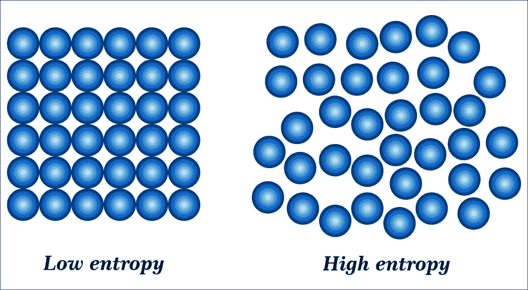
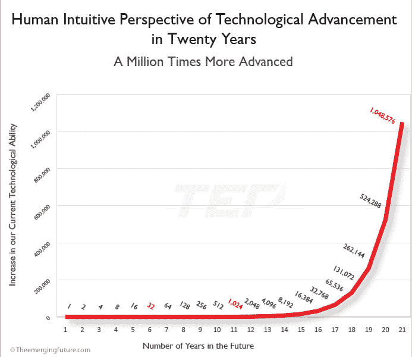

# 科技债务定律第一部分:科技债务不可避免的宏观趋势

> 原文：<https://dev.to/stepsize/laws-of-tech-debt-part-i-macro-trends-that-make-tech-debt-inevitable-193e>

你听说过一个软件开发团队*不用*处理技术债的吗？

我也没有。事实上:

> 工程师花费大约 33%的时间处理技术债务，这打击了团队的士气，并使公司每年损失大约 850 亿美元。

[*研究通过条纹*](https://stripe.com/files/reports/the-developer-coefficient.pdf)

让它深入人心。那是 850 亿美元。

所有工程时间的三分之一都花在处理技术债务上。它让软件工程师充满恐惧。这确实是他们工作中最糟糕的事情——雪上加霜的是，公司的其他人经常不能理解他们。这不是任何人的错，但技术债务被广泛误解。它慢慢地僵化了软件公司，直到他们不花几个月或几年的时间来重写他们的应用程序，就再也无法成长。。。这在今天的市场上是一辈子的事。

科技债务是常有的事，对吧？我们开始写代码，技术债务积累，然后*砰*，突然有太多了。我们的代码库陷入了债务的泥沼，我们陷入了技术破产。所以我们反抗它。我们忍受痛苦，偿还部分债务。也许我们会成功，也许不会。这就是软件行业的本质。我们就是这么做的。

但是一定要这样吗？是不是有一些软件开发的基本法则使得它如此？如果有，我们能不能利用这些法律？技术债务是生活中的事实，但技术破产不一定如此。

让我们从不同的科学中寻找一些线索，因为热力学定律可以给我们关键的见解，为什么技术债务是不可避免的。

# 使技术债务不可避免的宏观趋势

## 热力学第一定律

也被称为[能量守恒定律](https://www.britannica.com/science/thermodynamics/The-first-law-of-thermodynamics)，它指出:

> 孤立系统的总能量保持不变；据说它会随着时间的推移而保持不变。

换句话说，能量不能被创造或消灭，尽管它可以从一种形式变成另一种形式。

为了简单起见，让我们把我们的代码库想象成一个[孤立的系统](https://chem.libretexts.org/Bookshelves/Physical_and_Theoretical_Chemistry_Textbook_Maps/Supplemental_Modules_(Physical_and_Theoretical_Chemistry)/Thermodynamics/Fundamentals_of_Thermodynamics/A_System_and_Its_Surroundings#Isolated_System)。忽略第三方依赖和我们代码库之外的任何东西。在这些条件下——稳定数量的工程师，以高而稳定的速度发布特性——我们代码库中的熵值([是系统中无序和随机的度量](https://www.britannica.com/science/entropy-physics))保持不变。

我们的工程师不可能在一夜之间成为超人，所以如果他们已经满负荷工作，我们就无法提高他们的效率。但是我们可以雇佣更多的工程师，这增加了我们系统的能量。这就是为什么[布鲁克法则](https://en.wikipedia.org/wiki/Brooks%27s_law)是这样的:在一个已经高度混乱的系统中，增加人员到一个晚的软件项目会使它变得更晚，因为它增加了能量或者混乱。

高速增长的软件公司不断与这股力量斗争。他们筹集了一轮资金，在劳动力市场允许的情况下尽快将工程团队的规模扩大一倍，然后不得不应对代码库中“能量”的大幅增加。这通常是势不可挡的，如果他们未能实施对策，可能会导致技术债务急剧增加。

但是等等。为什么要导致技术债增加？

## 热力学第二定律

> 一个封闭系统的无序性是无法减少的，只能保持不变或者增加。

从本质上说，孤立的系统自然会退化到更无序的状态。这种“无序”——我们上面称之为“能量”或“混沌”——被称为熵。Ivar Jacobson 和他的朋友们研究了代码库中的熵现象，并创造了术语[软件熵](https://en.wikipedia.org/wiki/Software_entropy)。当代码库被修改时，它的熵会增加。这种日益严重的混乱是技术债务的原因。

回到我们高速发展的软件公司，他们的客户群不断扩大，市场也在升温。他们不断扩大的工程团队日夜赶工，以跟上增长的步伐。如果什么都不做，代码库将变得更加复杂。压力是存在的。

> 我将技术债务视为代码库中的熵。我认为它永远不会结束，它是一个持续的斗争。

[*罗恩·派杰斯*](https://twitter.com/mrp) *，卡塔公司工程副总裁*

当计划每个 sprint 时，我们的公司可以选择:他们应该做些什么来解决日益增长的复杂性吗？或者他们应该只是发布新功能？

热力学第三也是最后一条定律清楚地说明了为什么这种权衡并不明显。

## 热力学第三定律

> 当温度接近绝对零度时，系统的熵接近一个恒定值。

这个听起来复杂的陈述实际上非常简单，尽管热力学定律具有深远的-有时令人难以置信的-含义，但它们的原理很容易掌握。例如，当水以蒸汽的形式存在时，它的分子可以“自由”地以完全混乱的方式运行。熵无处不在。然而，当水结冰时，其分子被“截留”并留在原地(或多或少)。熵减小并接近一个恒定值。

那么，我们能做些什么来控制软件熵呢？

我们可以停止发送代码。这就是为什么一些团队喜欢有一个“代码冻结”,以便在发布给客户之前正确地对他们的系统进行 QA。如果代码库不再被修改，就不会有更多的熵，不会有更多的混乱，不会有更多意想不到的后果，也不会增加技术债务。

试图煽动永久的代码冻结是无意义的——我们必须出货。所以我们唯一的选择就是重构。

> 代码重构的过程会导致软件熵的逐步减少。

[*维基百科*](https://en.wikipedia.org/wiki/Software_entropy)

# 降低软件熵没那么简单

到目前为止一切顺利。事实上，这似乎有点像陈述显而易见的事实；任何了解构建软件的人都知道这些东西，至少直觉上是这样。

那么为什么我们还是被技术债搞得措手不及呢？

这是因为尽管我们知道我们应该重构以降低复杂性，但是还有无数的其他压力诱导力量阻止我们分配足够多的时间和资源来适当地做这件事。这意味着——在我们的代码库中，以及所有其他代码库中——软件熵在不断增加。

我们都知道摩尔定律，但是，想想比尔·盖茨对沃思定律的变体:

> 软件的速度每 18 个月减半。

比尔·盖茨

我确信，我们代码库中不断增长的熵是这条定律背后的主要驱动力。

软件熵的增长率与技术、软件市场和公司以及编码素养等事物的增长率直接相关，所有这些事物都在快速增长。

 
*来源:[新兴的未来](http://theemergingfuture.com/speed-technological-advancement-twenty-years.htm)*

想象一下这种期望给软件产品开发团队带来的压力。这些都是令人生畏的全球趋势，它们可能会让相对较小的一部分人感到崩溃。这几乎就像让他们对抗重力，通过拍打手臂来飞行。

 
*一个工程团队对抗科技债势力的真实镜头*

下周三，在本系列的第二部分，我们将关注不断将我们推向技术破产的微观趋势，以及高速增长的软件组织如何战胜它们。敬请期待！🙌🏻

* * *

你如何看待代码中的热力学定律？请在评论中告诉我！