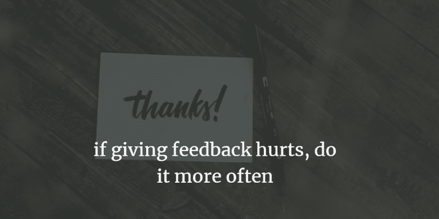
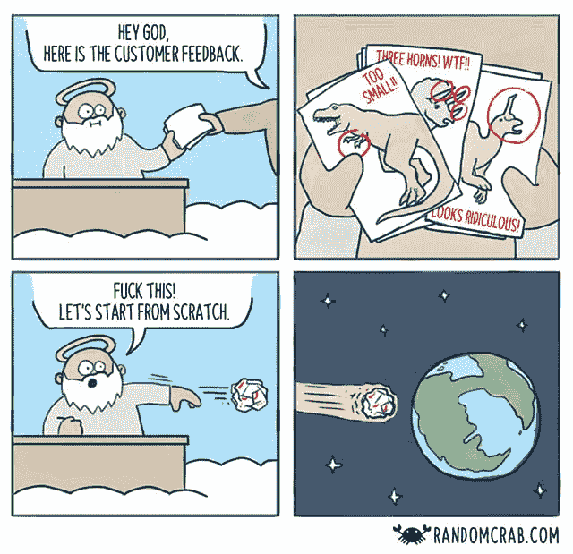

# 通过诚实的反馈引领改进

> 原文：<https://dev.to/gsferreira/leading-improvement-through-honest-feedback-3737>

上一次女服务员问你的饭菜，而你真的很诚实是什么时候？

不要感到羞耻。我确实去过那里。当饭菜干了或对你的口味来说太咸时，说它很好，这比我们想象的要普遍得多。

不幸的是，当事情出错时，诚实并不是我们人类倾向于感到舒服的事情。

你可能会问:我到底为什么要诚实，并冒险进入一个困难的转换？！

因为**最糟糕的反馈是假反馈**。

## 领先改进

你有没有想过，如果你是真诚的，餐馆本可以做些事情来改善？难道你不想让顾客告诉你应该做什么，让他们高兴吗？

现实是，没有真相，我们无法改进。

> 空洞的批评和谩骂对任何人都没有好处。但是真诚、有用、有见地的反馈是无价的礼物。
> 
> 塞斯﹒女神
> 
> [https://seths . blog/2014/01/the-feedback-you-waiting-for/](https://seths.blog/2014/01/the-feedback-youve-been-waiting-for/)

## 促进反馈

当你给出好的反馈时，你是在展示善意，即使这不是积极的反馈。他们应该把你看作一个不寄账单的顾问。下次当你不确定是否应该说出来时，记住最后他们应该感谢你的考虑。

显然在一些情况下你会发现栅栏。有些人更喜欢忽视和抗拒，但在这种情况下，只是继续前进。他们肯定不会在这个行业呆太久。

为了给予相互的建设性反馈，确保你**用“谢谢”**回应诚实的反馈。

如果你不摆出一副防御的姿态，而你看上去真的很感激，你会鼓励这种行为。

## 这可难了

DevOps 社区有一句我很赞同的口头禅:“如果疼，就多做几次”。我相信这也适用于反馈。开始要求诚实的反馈，甚至更多的开始给出反馈，可能会让人不舒服，尤其是当情况并不好的时候。但是，如果你一遍又一遍地做，你会发现它会变得很自然，你会停止过度思考它。

不要因为指出负面的东西而感到羞愧，这真的很重要，因为当你总是给出“OK 的答案”时，你诚实的正面评论不会产生影响。如果你被认为是一个诚实的人，你会被考虑在内。

## 使之容易

既然反馈如此有价值，为什么我们倾向于让别人给我们反馈变得如此困难？

可能我想告诉你我在使用你的产品时的感受，但是当我明白我需要在一个网站中创建一个用户并填写一份 20 字段长的 bug 报告时，你可以肯定我下次有改进想法时会继续前进。

因此，**请为您的系统带来一种收集反馈的简单方法**。任何人都应该能够在 40 秒内给你留下一张纸条，并感到无私，而不是 5 分钟的咒骂和失望。
如果你担心 40 秒钟不足以从用户那里获取你需要知道的所有信息，我敢打赌，用户会更乐意在事后回复你的问题。至少他们知道你听了。没有人愿意和数据库说话，尤其是没有人关心它的时候。

记住一个好主意可以在任何时间任何地点产生。

## 如何给出诚实的反馈

诚实并不意味着粗鲁地诚实。没有人想成为《厨房噩梦》的一部分，厨师戈登·拉姆齐大喊我们多么无能。那不好玩。

有更好的方式来传递反馈。我有 5 个建议，你可以从这里开始:

1.  要谦虚。
2.  将您的反馈表达为意见。例如，说食物“全是盐”和说“对我的口味来说太咸了”是不同的。
3.  只暴露你的前三个想法。不要太吹毛求疵。有一份物品的“购物清单”是没有用的。
4.  平衡正反馈和负反馈。当我们有不好的话要说时，我们很容易忘记说好的话。
5.  如果你有如何改进的想法，请说出来！

## 包装完毕

我们生活在一个在社交网络中寻求认可的社会，这个社会认为“喜欢”是一种好的反馈。这造成了我们对社会影响的错觉。所以，下次你看到某个人、服务或产品对你产生积极影响时，不要局限于在脸书或 Instagram 上关注他们。继续给他们发信息，告诉他们你的体验如何。

如果你在提供服务或销售产品，确保你很容易收到反馈，并鼓励你的客户这样做。

你准备好试一试了吗？我有一个挑战给你。在接下来的 24 小时内，确保您:

1.  给你最喜欢的服务之一发一条信息，告诉他们他们可以做的一件事来改善你的体验。别忘了告诉他们继续努力。😉
2.  对积极影响你生活的人说谢谢，你知道你从未告诉他们。
3.  请在下面的帖子中留下您真实的反馈😊