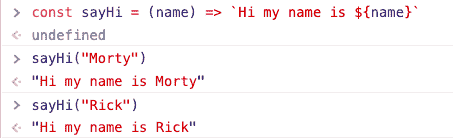

# 解锁 SSR 超能力(在 Go 中学习和使用模板)

> 原文：<https://dev.to/dpkahuja/learn-and-use-templates-in-go-5cei>

<figure>

<figcaption>Photo by John Doyle Unsplash</figcaption>

</figure>

在多年开发几个全栈应用的过程中，我意识到有些应用不需要一个完整的前端应用运行。这些应用中的大多数都提供静态内容，动态值随处可见。例如，考虑一下
你的社交媒体订阅源，某个类型的每个帖子看起来都一样，但它会用特定于该用户的数据填充
。他们使用某种模板来
实现它。

### 什么是模板？

模板本质上是用于创建动态内容的文本文件。
例如，下面的 javascript 函数将“name”作为参数，
产生不同的字符串。

我们也可以使用相同的原则在 Go 中生成网页。Web 模板允许我们为用户提供个性化的结果。使用字符串
串联生成 web 模板是一项繁琐的任务。它还会导致注射攻击。

### go 中的模板

“使用模板”中有两个软件包:

1.  [文本/模板](https://golang.org/pkg/text/template/)(用于生成文本输出)
2.  [html/模板](https://golang.org/pkg/html/template/)(用于生成防止代码注入的安全 HTML 输出)

它们基本上都有相同的接口，只是在后者上有细微的 web 特定差异
,比如对脚本标签进行编码以防止它们运行，将 map
解析为视图中的 json。

### 我们的第一个模板