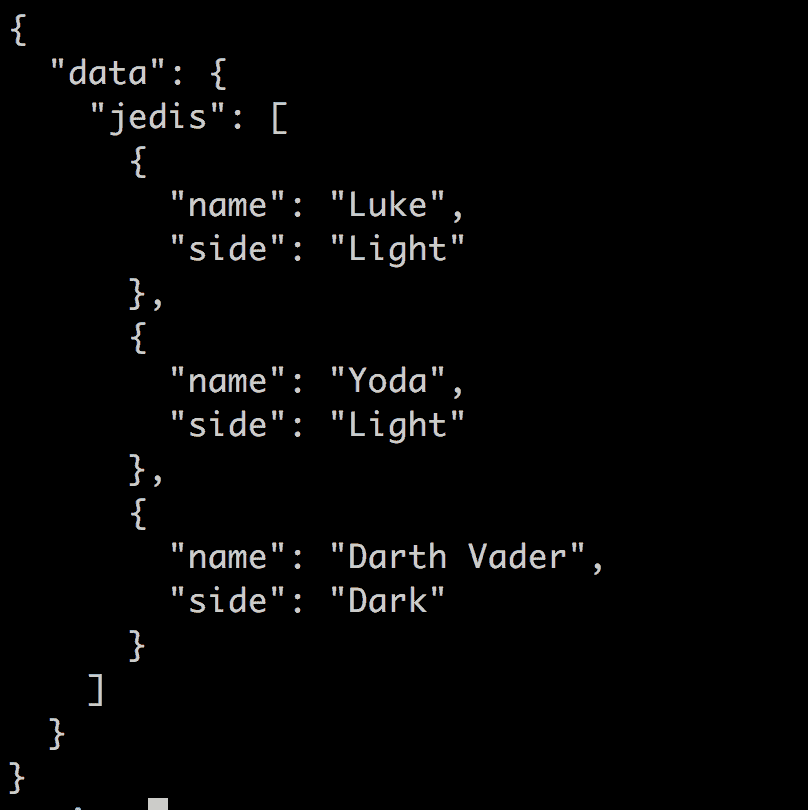
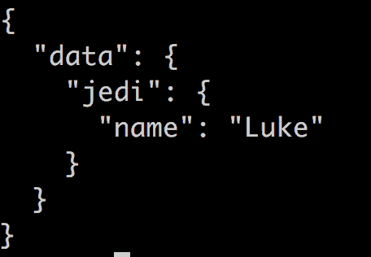

# 了解如何在中使用 GraphQL。NET Core 和 C#

> 原文：<https://dev.to/dotnet/learn-how-you-can-use-graphql-in-net-core-and-c-4h96>

> GraphQL 是由脸书创造的技术，它使前端能够与后端协商它想要的数据。它还使 API 的构建者能够将来自不同 API 的数据缝合在一起，如果您需要的话。这是一项非常酷的技术，它不仅仅适用于 JavaScript，你绝对可以在你的下一个. Net 项目中使用它。

在本文中，我们将涵盖:

*   为什么，为什么我们想要这项技术来构建 API
*   它由哪些部分组成
*   演示，让我们构建一个 API，并了解如何让它与我们的数据源一起工作

## 资源

*   GraphQL.org 这是 GraphQL 组织的网站。它包含了很多关于为什么要构建 GraphQL，存在哪些类型等等的信息。

*   这是目前最流行的 NuGet 包。它包含一个帮助你入门的 README 页面，还有不同类型的应用程序的演示，比如 MVC。

*   从...开始。Net Core in VS Code
    这个展示了你可以如何入门。VS 代码中的 Net Core。

*   我写的入门文章。Net Core 和 VS Code
    我为你写了一个很好奇的文章集。网芯。它展示了如何构建不同类型的项目，运行测试等等。它甚至涵盖了如何构建无服务器 API。

*   [如何在 JavaScript 中构建和使用 graph QL API](https://dev.to/azure/3-part-series-on-graphql-1fi1)
    如果你想了解 JavaScript 中的工作原理，可以看看我写的这些文章。

## 为什么，为什么我们首先需要它。REST API 有什么问题？

GraphQL 允许*内容协商*，这意味着您将只有一个端点。它还允许您准确地查询您想要的字段。在后端，您可以从不同的数据源获取数据，因此对于前端开发人员和后端开发人员来说，肯定有很好的理由感到兴奋。

## GraphQL 由哪些部分组成

GraphQL 由一个模式定义组成。您可以用一种叫做 GQL、GraphQL 查询语言的语言来定义这个模式，但是您也可以修饰类来响应某些资源请求(在以后的文章中会有更多相关内容)。

除了模式，还有一个核心概念叫做*解析器*。解析器只是一个知道如何处理传入查询的函数。解析器被映射到某个资源。

然后，您有一个名为 GraphiQL 的可视化环境，允许您运行查询。GraphQL 的大多数实现都带有某种形式的可视化环境。

### 如何查询

当您查询 GraphQL 时，它看起来有点特别，但它非常简单。要查询一个资源，您可以这样键入:

```
{ 
  resource
} 
```

然而，这还不够。您还需要指定您想要的列，比如:

```
{
  resource {
    column,
    column2
  }
} 
```

要使用参数进行查询，您可以像这样键入:

```
{
  users(id:1) {
    name,
    created
  }
} 
```

最终结果总是与您的查询相匹配的 JSON 响应。因此，如果我们使用上面的查询，我们将得到如下所示的结果:

```
{  "data":  {  "users":  [{  "name"  :  "chris",  "created":  "2018-01-01"  }]  }  } 
```

## 演示——我们来构建一个 API。

> 我们需要在代码中混合一些 GraphQL 理论。所以我们将引入一个概念，然后展示它的代码。

### 设置

我们需要做以下工作

1.  **创建**解决方案
2.  **创建**一个控制台应用程序
3.  **安装**graph QL nu get 包

**创建解决方案**

让我们开始创建一个解决方案目录，如下所示:

```
mkdir demo
cd demo 
```

接下来，让我们创建实际的解决方案文件:

```
dotnet new sln 
```

**创建控制台应用**

创建一个控制台项目就像输入:
一样简单

```
dotnet new console -o App 
```

然后导航到项目目录:

```
cd App 
```

**添加我们的 GraphQL NuGet 库**

接下来，让我们添加我们的 GraphQL NuGet 包

```
dotnet add package GraphQL 
```

### 你好 GraphQL

现在我们准备添加代码

```
// Program.cs

using System;
using GraphQL;
using GraphQL.Types;

namespace App
{
  class Program
  {
    static void Main(string[] args)
    {
      Console.WriteLine("Hello World!");
      var schema = Schema.For(@"
          type Query {
              hello: String
          }
          ");

      var root = new { Hello = "Hello World!" };
      var json = schema.Execute(_ =>
      {
          _.Query = "{ hello }";
          _.Root = root;
      });

      Console.WriteLine(json);
    }
  }
} 
```

上述代码中有三个有趣的部分:

1.  **声明**我们的模式
2.  **定义**我们的解析器
3.  **执行我们的查询**API

**声明我们的模式**

我们输入到`Schema.For`中的字符串包含一种叫做 GQL 或 GraphQL 查询语言的东西。它通常定义三件事:

1.  **查询**，这是我们可以查询的内容
2.  **类型**，我们还没有任何类型，但我们将在本文稍后介绍。
3.  突变，这就是我们所说的，语义上意味着我们将改变一些东西

让我们特别关注我们设置模式的部分:

```
var schema = Schema.For(@"
  type Query {
      hello: String
  }
"); 
```

现在，我们只有`type Query`，它说我们可以查询`hello`，响应是字符串类型`hello: string`。

**解析我们的查询**

模式只是谜题的一部分。另一部分是解析器代码。这段代码实际上处理了一个传入的请求。在我们的例子中，解析器代码如下:

```
var root = new { Hello = "Hello World!" }; 
```

正如我们在上面看到的，它在我们的查询`hello`中映射了一些东西，并且说——如果用户要求`hello`，那么我们将用`Hello World`来回答。

**执行查询**

在下面的代码中，我们通过将查询`{ hello }`赋给提供给`schema.Execute()`的 lambda 表达式中的属性`_.Query`来执行查询。

```
var json = schema.Execute(_ =>
{
    _.Query = "{ hello }";
    _.Root = root;
}); 
```

然后我们的查询结果被赋给我们的变量`json`，我们可以使用
很容易地将它打印到终端

```
Console.WriteLine(json); 
```

### 模式先行

这是一种不同的方法，在这种方法中，我们将使用类并修饰它们，其思想是类将包含在我们进行查询时充当解析器的方法。

要做到这一点，我们需要做到以下几点:

1.  **更新**我们的模式，我们需要一个新的自定义类型，我们需要在`Query`中公开它

2.  创建一些我们需要的类来支持我们的类型、我们的查询以及内存数据库

**模式更新**

到目前为止，我们的模式还没有自定义类型。让我们通过添加类型`Jedi`来改变这一点，并且让我们将它公开为我们可以查询的内容，就像这样:

```
 Schema.For(@"
  type Jedi {
      name: String,
      side: String
  }

  type Query {
      hello: String,
      jedis: [Jedi]
  }
  ", _ =>
{
_.Types.Include<Query>();
}); 
```

上面我们通过写`type Jedi`来添加`Jedi`作为类型，并且在`{}`中定义它的属性。然后我们将`jedis`添加到`Query`中，并说它的类型是`[Jedi]`，这意味着它是一个`Jedi`的数组。最后，我们给我们的`Schema.For()`第二个参数:

```
_.Types.Include<Query>(); 
```

这意味着我们指出了一个类`Query`，它将处理所有传入的请求。我们还没有这个类，所以让我们创建它。

**创建支持类**

首先，我们需要类`Query`。它现在有责任处理我们模式中`Query`内的任何东西，这意味着它需要处理`hello`和`jedis`。来看看`Query`能长什么样:

```
public class Query 
{
    [GraphQLMetadata("jedis")]
    public IEnumerable<Jedi> GetJedis() 
    {
        return StarWarsDB.GetJedis();
    }

    [GraphQLMetadata("hello")]
    public string GetHello() 
    {
        return "Hello Query class";
    }
} 
```

这里我们定义了两个方法`GetJedis()`和`GetHello()`。注意我们如何在每个方法上使用装饰器`GraphQLMetadata`来*映射*它们将处理`Query`中的哪个属性。我们还看到我们调用了一个类`StarWarsDB`，所以我们接下来需要创建这个类:

```
public static IEnumerable<Jedi> GetJedis() 
{
    return new List<Jedi>() {
        new Jedi(){ Name ="Luke", Side="Light"},
        new Jedi(){ Name ="Yoda", Side="Light"},
        new Jedi(){ Name ="Darth Vader", Side="Dark"}
    };
} 
```

**定义查询什么**

让我们定义查询 GraphQL API 的查询:

```
{ jedis { name, side } } 
```

我们上面说的是我们想要查询`jedis`，我们想要列`name`和`side`。与 SQL 表达式相比，我们可以输入:

```
SELECT name, side
FROM jedis; 
```

让我们用我们的查询更新代码，如下所示:

```
var json = schema.Execute(_ =>
{
    _.Query = "{ jedis { name, side } }";
});

Console.WriteLine(json); 
```

结果是:

[](https://res.cloudinary.com/practicaldev/image/fetch/s--A33mq_zV--/c_limit%2Cf_auto%2Cfl_progressive%2Cq_auto%2Cw_880/https://thepracticaldev.s3.amazonaws.com/i/tubbgxeo8uh89bsu4leq.png)

这似乎很好，好吧:)

### 用参数工作

现在我们已经做了很多工作，但我们需要能够处理参数，有时我们只是想要一个记录，所以我们需要根据一个键过滤更大的集合。为此，我们需要:

1.  **更新**我们的模式以支持带参数的查询

2.  在我们的查询类中创建一个能够解析出参数的方法

3.  **验证**一切正常

**更新我们的模式**

首先，我们需要更新我们的模式，以便支持带参数的查询，比如:

```
 Schema.For(@"
  type Jedi {
      name: String,
      side: String,
      id: ID
  }

  type Query {
      hello: String,
      jedis: [Jedi],
      jedi(id: ID): Jedi
  }
  ", _ =>
{
_.Types.Include<Query>();
}); 
```

我们实际上在做上面两件事。我们将字段`id`添加到`Jedi`类型中。我们也将这一行添加到`Query` :

```
jedi(id: ID): Jedi 
```

**更新我们的代码**
我们的绝地职业没有`Id`字段，所以我们需要添加，就像这样:

```
public class Jedi 
{
    public int Id { get; set; }
    public string Name { get; set; }
    public string Side { get; set; }
} 
```

接下来，我们需要给我们的查询类添加一个方法，就像这样:

```
[GraphQLMetadata("jedi")]
public Jedi GetJedi(int id)
{
    return StarWarsDB.GetJedis().SingleOrDefault(j => j.Id == id);
} 
```

注意上面我们只需要将名称匹配`id`作为输入参数。代码本身只是一个给我们返回一个条目的`SingleOrDefault` LINQ 查询。

**更新查询**

让我们尝试这样查询这个新资源:

```
{ jedi(id: 1) { name } } 
```

结果是:

[](https://res.cloudinary.com/practicaldev/image/fetch/s--sk-ANiDk--/c_limit%2Cf_auto%2Cfl_progressive%2Cq_auto%2Cw_880/https://thepracticaldev.s3.amazonaws.com/i/3w761iap4orapq1cmkm9.png)

作品！！！:)

## 总结

我们已经走过了很多地方。我们已经介绍了 GQL，GraphQL 查询语言。此外，我们还学习了如何在我们的模式中定义资源、自定义类型以及如何解决这些问题。关于 GraphQL 还有很多需要学习的地方，但是这篇文章已经够长了。我希望这是有趣的第一次看它。在下一部分中，我们将介绍如何构建一个无服务器 API，并以这种方式利用 GraphQL 并将其部署到云中。