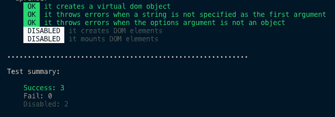

# 通过构建 UI 框架学习 JS:第 2 部分-测试

> 原文：<https://dev.to/carlmungazi/learn-js-by-building-a-ui-framework-part-2-testing-3pff>

本文是深入研究 JavaScript 系列文章的第二篇。你可以在这里查看第一篇文章。

本系列并没有全面涵盖每一个 JavaScript 语言特性。相反，当功能出现在问题的解决方案中时，它们会被包含在内。另外，每篇文章都是基于教程和其他开发者开发的开源库，所以和你一样，我也从每篇文章中学到了新的东西。

* * *

# 让测试开始吧

测试还是不测试，这是个问题。在上一篇文章的结尾，我们思考了为框架编写第一段代码后的下一步行动。我们推测，我们可以编写更多的代码，直到我们有一个工作框架，或者开始添加测试。每种选择都有利弊。编写更多的代码意味着快速创建一个工作原型。或者，编写测试意味着在早期编写更健壮的代码，但代价是更慢的开发。答案没有对错之分。有时候你需要快速地原型化和测试不同的解决方案，而其他时候你需要添加测试，这样你才能写出更好的代码。

我们将走测试路线，因为除了使我们的代码更健壮之外，它给我们另一个机会从不同的角度探索 JavaScript。下面是我们的`createElement`函数目前的样子:

```
function createElement (type, opts) {
  if (type == null || typeof type !== 'string') {
    throw Error('The element type must be a string');
  }

  if (arguments[1] !== undefined && Object.prototype.toString.call(opts) !== '[object Object]') { 
    throw Error('The options argument must be an object'); 
  }

  const { attrs = {}, children = [] } = opts || {};

  return {
    type,
    attrs,
    children
  }
} 
```

下面是我们将在本文中涉及的测试。

```
group('createElement function', () => {
  check('it creates a virtual dom object', () => {
    const target = createElement('div', {});
    const copy = { type: 'div', attrs: {}, children: [] };
    assert.isDeeplyEqual(target, copy);
  }); 

  check('it throws errors when a string is not specified as the first argument', () => {
    const err = () => createElement(1, null);
    assert.throws(err, 'The element type must be a string');
  });

  check('it throws errors when the options argument is not an object', () => {
    const err = () => createElement('h1', null);
    assert.throws(err, 'The options argument must be an object');
  });

  xcheck('it creates DOM elements', () => {
    // do some testing
  });

  xcheck('it mounts DOM elements', () => {
    // do some testing
  });
}); 
```

当测试运行时，我们会看到:

[](https://res.cloudinary.com/practicaldev/image/fetch/s--PDRlRtSt--/c_limit%2Cf_auto%2Cfl_progressive%2Cq_auto%2Cw_880/https://thepracticaldev.s3.amazonaws.com/i/ec7qvth3ovdxlrw65e88.png)

测试中的工作由`group`、`check`、`xcheck`和`assert`完成。我们将从检查`group`和`check`开始。*注意:为简洁起见，省略了一些代码*

```
function group (title, fn) {
  console.log(title);
  fn();
}

function check(title, fn) {
  console.log(title);
  try {
    fn();
  } catch (e) {
    console.log(title);
    console.log((e.message);
    console.log(e.stack);
  }
}; 
```

这两种方法的行为都很简单，但是它们引入了两个我们以前没有涉及过的新事物: **`try/catch`** 和 **`arrow functions`** 。

在上一篇文章中，我们通过关键字`throw`首次尝试了错误处理。`Try/catch`是另一个错误处理特性。它用于测试代码块的错误，然后处理任何异常。在`check`函数中，`try`块将执行作为第二个参数传入的函数。任何执行都被发送到 catch 块，该块被传递一个[错误对象](https://developer.mozilla.org/en-US/docs/Web/JavaScript/Reference/Global_Objects/Error)。该对象包含一条描述错误的消息和一个指示哪一行代码导致了错误的堆栈跟踪。注意:传递给`catch`块的变量`e`是块范围的，所以这段代码会导致错误:

```
function errorWaitingToHappen() {
  try {
    throw Error('I am an error');
  } catch (errorWithLongVariableName) {
    console.log(errorWithLongVariableName)
  }

  console.log(errorWithLongVariableName) // this is undefined
}

errorWaitingToHappen(); // Uncaught ReferenceError: errorWithLongVariableName is not defined 
```

箭头函数是在 ES6 中引入的，一般来说，除了在[这些](https://github.com/getify/You-Dont-Know-JS/blob/master/es6%20&%20beyond/ch2.md#not-just-shorter-syntax-but-this)T2 的情况下，它们的行为就像普通函数一样。我们使用它们是因为链接中列出的问题都不适用，它们使我们的代码更简洁。

我们的下一课不是来自我们正在构建的测试库，而是来自被测试的代码。用某些参数调用时应该抛出异常。测试这种行为需要我们用指定的参数将它传递给`assert.throws`。我们可以这样做:

```
assert.throws(createElement, ['h1', null], 'The options argument must be an object'); 
```

然后执行`assert.throws` :

```
throws(fn, args, errMsg = '') {
  try {
    fn(...args);
  } catch (e) {
    // do something
  }
} 
```

通过在数组中传递错误诱导参数，我们可以[将它们](https://developer.mozilla.org/en-US/docs/Web/JavaScript/Reference/Operators/Spread_syntax)传播到`createElement`中，以成功触发异常。然而，这不是一个最佳的解决方案，因为它污染了我们的`assert.throws`实现。该函数不应该关心抛出异常所需的参数。它的唯一目的是执行函数并检查错误。我们可以通过引入另一个新概念来实现这个目标:**懒惰评估** :

```
const err = () => createElement('h1', null);
assert.throws(err, 'The options argument must be an object'); 
```

即使我们在分配给`err`的函数中调用`createElement`，我们也不必担心，因为实际的执行发生在`assert.throws`的上下文中。只有在需要时才进行评估，因此有了这个术语。我们写了这个吗:

```
assert.throws(createElement('h1', null), 'The options argument must be an object'); 
```

`createElement`将在`check`的上下文中调用。因为`check`有自己的`try/catch`块，它会处理异常，这意味着`assert.throws`永远不会运行，我们的测试在应该通过的时候会失败。完成排序后，我们可以填写`assert.throws`的剩余部分。

```
throws(fn, errMsg = '') {
  const didNotThrowErr = new Error('The supplied function didn\'t throw an error');

  try {
    fn();
    throw didNotThrowErr;
  } catch (e) {
    if (e === didNotThrowErr) throw didNotThrowErr;

    if (!errMsg || e.message === errMsg) return true;

    throw new Error(`\n\nFound: ${e.message}\nWanted: ${errMsg}\n\n`); 
  }
} 
```

* * *

# 检查对象是否相等

`assert.isDeeplyEqual`的实现提出了一些有趣的问题。正如我们在下面看到的，它的目的是检查任何两个给定的对象是否相等。

```
check('it creates a virtual dom object', () => {
  const target = createElement('div', {});
  const copy = { type: 'div', attrs: {}, children: [] };
  assert.isDeeplyEqual(target, copy);
}); 
```

我们在这里检查的是哪种等式？JavaScript 中的复合值(对象、数组等)是由引用赋值的[，所以使用内置的等式操作符对我们没有帮助。我们希望确保两个对象包含相同的属性，并且这些属性也包含相同的值。以下是我们的解决方案需要回答的一些问题:](https://medium.com/@naveenkarippai/learning-how-references-work-in-javascript-a066a4e15600)

*   两个值都是对象吗？
*   它们包含相同数量的属性吗？
*   所有这些属性都有相同的值吗？如果有:
    *   它们是我们可以使用等式运算符轻松检查的原始值吗？
    *   如果是复合值，我们怎么办？
    *   我们要处理每一种复合值吗？

我们将调用执行检查的函数`deepEqual`，我们需要做的第一件事是检查我们是否正在处理对象。稍后将再次重复该检查，因此我们可以用下面的实用函数将其抽象出来:

```
function getLengthAndType(obj) {
  if (Object.prototype.toString.call(obj) === '[object Array]') {
    return { type: "array", length: obj.length }
  }

  if (Object.prototype.toString.call(obj) === '[object Object]') {
    return { type: "object", length: Object.keys(obj).length }
  }

  return null;
} 
```

我们返回一个包含有用信息的对象，这些信息我们以后会用到，这也有助于我们避免重复`Object.prototype.toString.call`调用。这是第一部分中的实用程序。

```
function deepEqual(obj, comparisonObj) {
  const objInfo = getLengthAndType(obj);
  const comparisonObjInfo = getLengthAndType(comparisonObj); 

  // only go forward with arrays or objects
  if ( !objInfo || !comparisonObjInfo) {
    return false
  }

  if (objInfo.length !== comparisonObjInfo.length || objInfo.type !== comparisonObjInfo.type) {
    return false
  } 
```

对于非数组和非对象，`getLengthAndType`返回`null`,因此我们可以快速建立我们正在比较的值的类型，因为`null`是一个伪值。之后，我们检查长度，确保两个对象是相同的类型。接下来要考虑的是我们如何迭代数组或对象，并检查每个值。

```
if (objInfo.type === 'array') {
  for (var i = 0; i < objInfo.length; i++) {
    if (compare(obj[i], comparisonObj[i]) === false) return false;
  }    
} else {
  for (let [key] of Object.entries(obj)) {
    if (compare(obj[key], comparisonObj[key]) === false) return false;
  } 
} 
```

使用一个`for`循环允许我们迭代数组并轻松检查值。然而，这个解决方案有一个缺点，它假设我们要检查的值在两个数组中共享相同的索引位置。这对我们的用例来说很好，因为我们正在检查虚拟 dom 对象的`children`数组中定义的对象是否在相同的位置。`Object.entries`返回一个对象的`[key, value]`对数组。再加上`for..of`，它在[可迭代对象](https://developer.mozilla.org/en-US/docs/Web/JavaScript/Reference/Iteration_protocols#The_iterable_protocol)上创建了一个循环，我们也可以迭代一个对象。另一种方法是使用`for..in`，但这需要额外的`hasOwnProperty`检查，因为`for..in`还会迭代[继承的](https://developer.mozilla.org/en-US/docs/Web/JavaScript/Inheritance_and_the_prototype_chain)属性，而`Object.entries`不会这样做。这种替代方法将如下所示:

```
if (objInfo.type === 'array') {
  for (var i = 0; i < objInfo.length; i++) {
    if (compare(obj[i], comparisonObj[i]) === false) return false;
  }    
} else {
  for (var prop in obj ) {
    if (obj.hasOwnProperty(prop)) {
      if (compare(obj[prop], comparisonObj[prop]) === false) return false;
    }
  }  
} 
```

关于`deepEqual`最有趣的是它在其内部`compare`函数中引入的概念。正如你在下面看到的，我们很容易分别用`toString()`方法和等式操作符来比较函数和原始值。然而，比较数组或对象要复杂得多。

```
const compare = (val, comparisonVal) => {
  const isArrayOrObject = getLengthAndType(val);
  const isFunction = Object.prototype.toString.call(val) === '[object Function]';

  if (isArrayOrObject) {
    if (!deepEqual(val, comparisonVal)) return false;
  } 

  else {
    if (isFunction) {        
      if (val.toString() !== comparisonVal.toString()) return false;
    } else {
      if (val !== comparisonVal) return false;
    }
  }
}; 
```

到目前为止，我们一直在一个地方声明我们的函数，然后在另一个地方调用它们。用`deepEqual`，我们称之为它自身之内。这个过程叫做 [**递归**](https://github.com/getify/Functional-Light-JS/blob/master/manuscript/ch8.md/#chapter-8-recursion) ，使`deepEqual`成为*递归函数*。给定这个调用`isDeeplyEqual( {arr: [1, 2, 3]}, {arr: [1, 2, 3]} )`，当程序到达`compare`函数时，会发生:

```
// The initial recursive call
const compare = (val, comparisonVal) => {
  // val is {arr: [1, 2, 3]}
  // comparisonVal is {arr: [1, 2, 3]}
  const isArrayOrObject = getLengthAndType(val); // { type: "object", length: 2 }

  if (isArrayOrObject) { // true
    if (!deepEqual(val, comparisonVal)) return false; // recursion! 
  }
  //...
}

// We reach compare again and make another recursive call
const compare = (val, comparisonVal) => {
  // val is [1, 2, 3]
  // comparisonVal is [1, 2, 3]
  const isArrayOrObject = getLengthAndType(val); // { type: "array", length: 3 }

  if (isArrayOrObject) { // true
    if (!deepEqual(val, comparisonVal)) return false; // more recursion! 
  }
  //...
}

// No more recursive calls 
// We are now comparing every element in the array [1, 2, 3]
const compare = (val, comparisonVal) => {
  // val is 1
  // comparisonVal is 1
  const isArrayOrObject = getLengthAndType(val); // false

  if (isArrayOrObject) { // false
    if (!deepEqual(val, comparisonVal)) return false; // no recursion :-(
  }
  //...
} 
```

递归是在嵌套数据结构上导航和执行操作的好方法。在我们的场景中，它抽象出了编写条件检查来处理未知数量的嵌套对象和数组的复杂性。每当我们调用一个函数时，一个新的[执行上下文](http://davidshariff.com/blog/what-is-the-execution-context-in-javascript/)被创建并添加到[调用栈](http://davidshariff.com/blog/what-is-the-execution-context-in-javascript/)，因此我们可以将该工作卸载到 JavaScript 引擎并等待返回。放在一起，`deepEqual`看起来是这样的:

```
function getLengthAndType(obj) {
  if (Object.prototype.toString.call(obj) === '[object Array]') {
    return { type: "array", length: obj.length }
  }

  if (Object.prototype.toString.call(obj) === '[object Object]') {
    return { type: "object", length: Object.keys(obj).length }
  }

  return null;
}

function deepEqual(obj, comparisonObj) {
  const objInfo = getLengthAndType(obj);
  const comparisonObjInfo = getLengthAndType(comparisonObj); 

  // only go forward with arrays or objects
  if ( !objInfo || !comparisonObjInfo) {
    return false
  }

  if (objInfo.length !== comparisonObjInfo.length || objInfo.type !== comparisonObjInfo.type) {
    return false
  }

  const compare = (val, comparisonVal) => {
    const isArrayOrObject = getLengthAndType(val);
    const isFunction = Object.prototype.toString.call(val) === '[object Function]';

    if (isArrayOrObject) {
      if (!deepEqual(val, comparisonVal)) return false;
    } 

    else {
      if (isFunction) {        
        if (val.toString() !== comparisonVal.toString()) return false;
      } else {
        if (val !== comparisonVal) return false; // we are comparing primitive values
      }
    }
  };

  if (objInfo.type === 'array') {
    for (var i = 0; i < objInfo.length; i++) {
      if (compare(obj[i], comparisonObj[i]) === false) return false;
    }    
  } else {
    for (let [key] of Object.entries(obj)) {
      if (compare(obj[key], comparisonObj[key]) === false) return false;
    }
  }

  return true; // nothing failed
} 
```

到目前为止，我们只看了负责实际测试的代码，但是我们如何向用户显示测试结果和其他信息呢？与我们将用于在浏览器中创建用户界面的框架不同，我们的测试框架只在命令行上工作。让我们从`check`和`group`的最终实现开始。`xcheck`也包括在内，但作用不大。

```
const colors = require('colors');
const assert = require('./assertions');

const repeat = (str, n) => Array(n).join(str);
const indent = n => repeat('  ', n);
const indentLines = (str, n) => indent(n) + str.replace(/\n/g, `\n${indent(n)}`);
const log = str => console.log(str);
const summary = { success: 0, fail: 0, disabled: 0 };

let indentLevel = 0;
let examinar;

function group(title, fn) {
  indentLevel++;
  log(`\n${indent(indentLevel)}⇨ ${title}`.yellow);
  fn();
  indentLevel--;
}

function check(title, fn) {
  try {
    fn();
    log(`${indent(indentLevel + 1)}${' OK '.bgGreen.black}  ${title.green}`);
    summary.success++;
  } catch (e) {
    log(`${indent(indentLevel + 1)}${' FAIL '.bgRed.black}  ${title.red}`);
    log(indentLines(e.message.red, indentLevel + 1));
    log(indentLines(e.stack.red, indentLevel + 1));
    summary.fail++;
  }
}

function xcheck(title) {
  log(`${indent(indentLevel + 1)}${' DISABLED '.bgWhite.black}  ${title.gray}`);
  summary.disabled++;
}

function end() {
  log(`\n${repeat('.', 60)}\n`);
  log('Test summary:\n');
  log(`    Success: ${summary.success}`.green);
  log(`    Fail: ${summary.fail}`.red);
  log(`    Disabled: ${summary.disabled}\n\n`.gray);

  if (summary.fail > 0 ) process.exit(1);
  process.exit(0);
}

module.exports = { assert, check, end, group, xcheck }; 
```

显示结果和相关信息是通过缩进、添加颜色和总结的组合来实现的。每次我们分组一些测试，我们使用 [**模板文字**](https://developer.mozilla.org/en-US/docs/Web/JavaScript/Reference/Template_literals) 和[颜色](https://github.com/Marak/colors.js)模块记录标题。你会注意到这是我们项目中第一次使用第三方库。这是因为，尽管我们试图编写自己的代码，但这并不总是可能的，而且有些情况下，由于时间或复杂性，利用现有的解决方案更有意义。然而，当使用第三方代码时，它确实有助于从更高的层面理解到底什么被抽象掉了。颜色模块通过扩展`String.prototype`并定义返回指定颜色的 getters 来工作。您可以通过导入模块并编写`console.log(''.__proto__)`来测试这一点。模板文字可以评估表达式，所以结合颜色模块，它们为我们的测试创建了很好的视觉效果。

在记录摘要之后，`end`函数终止我们的测试套件。这是通过使用全局可用的`process.exit()`方法来实现的，该方法指示 Node.js 以退出代码同步终止当前进程:`1`表示失败，`0`表示成功。

从函数末尾的代码中我们还可以学到一件事:**导出模块**。在我们的下一篇文章中，当设置我们的开发环境时，我们将更深入地探讨这个主题，但是现在，我们可以简单地介绍一下。模块是代码单元，很像乐高积木，可以组合在一起创造各种东西。节点将每个文件视为一个单独的模块。您可以使用`require`关键字导入文件，使用`module.exports`或`exports`导出文件。`module.exports`或`exports`都引用同一个对象，所以:

```
module.exports = { assert, check, end, group, xcheck }; 
```

相当于:

```
exports.check = check();
exports.end = end();
exports.assert = assert;
exports.group = group();
exports.xcheck = xcheck() 
```

* * *

## 总结

在这篇文章中，我们在实际的框架代码上没有取得任何进展，但是我们开始为未来的开发打下基础。在创建测试框架的过程中，我们学习了**箭头函数**、**尝试/捕捉**、**懒惰评估**、**递归**、**模板字符串**和**导出模块**。所有这些课程都很简短，但却很有力量，因为我们是在一个非常实际的项目中完成的。这种方法使概念更加具体。

* * *

### 资源

#### 测试教程:[https://medium . freecodecamp . org/learn bydiy-how-to-create-a-JavaScript-unit-Testing-framework-from-scratch-c 94 E0 ba 1c 57 a](https://medium.freecodecamp.org/learnbydiy-how-to-create-a-javascript-unit-testing-framework-from-scratch-c94e0ba1c57a)

#### 对象相等教程:[https://gomake things . com/check-if-two-arrays-or-objects-are-equal-with-JavaScript](https://gomakethings.com/check-if-two-arrays-or-objects-are-equal-with-javascript)