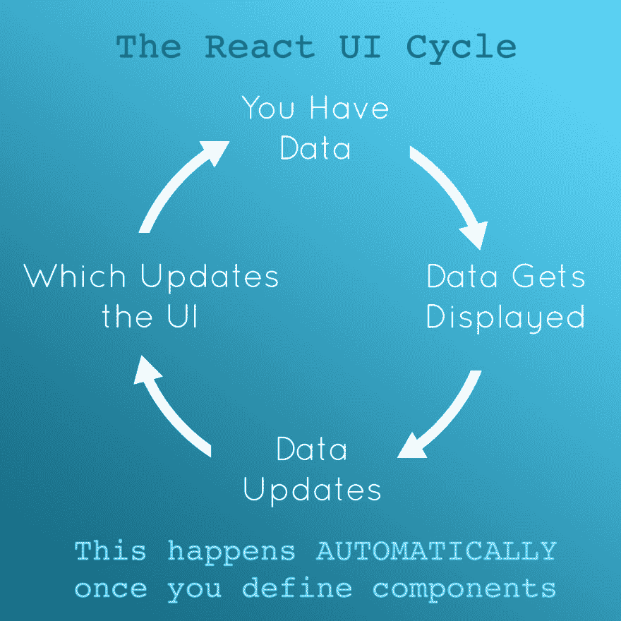
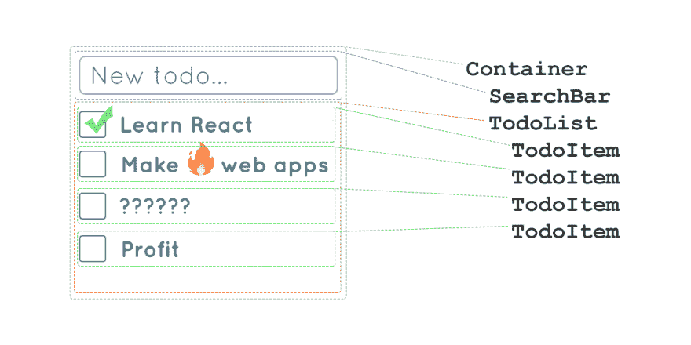
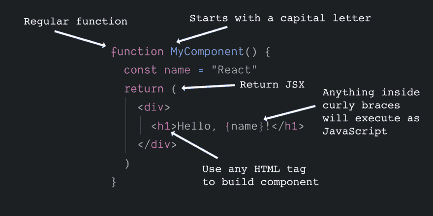
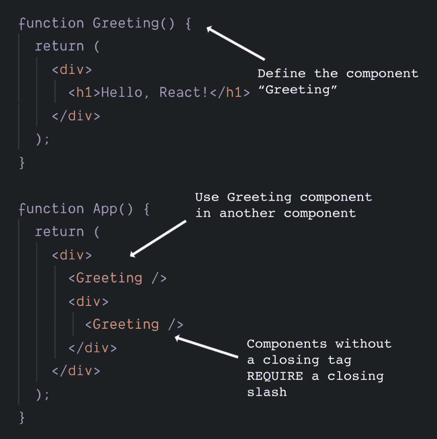
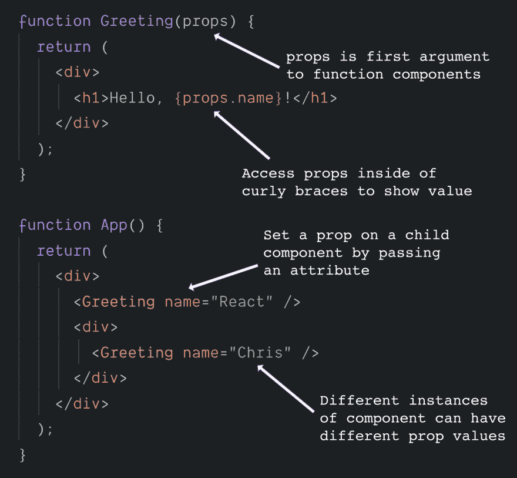
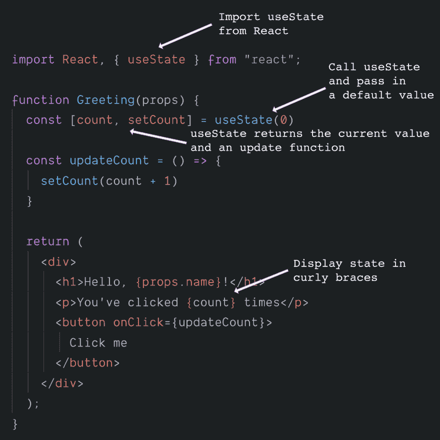
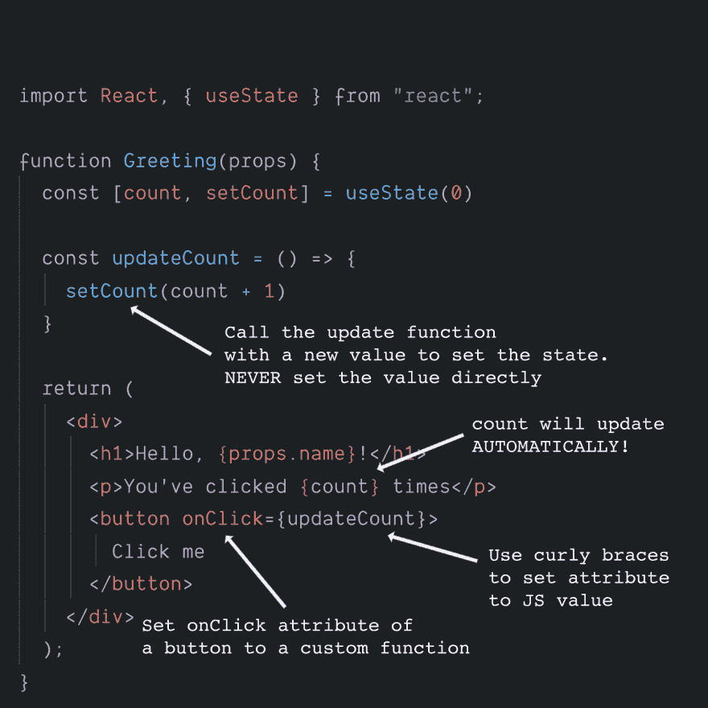
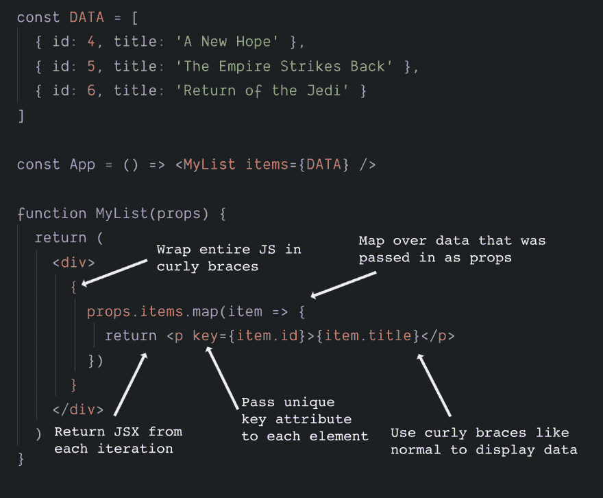
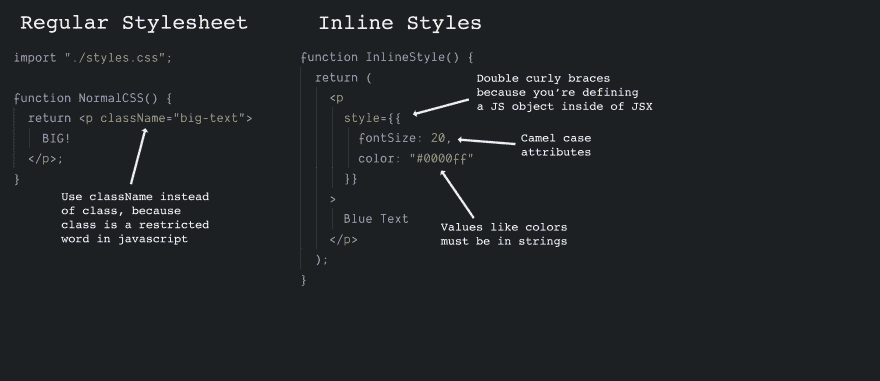
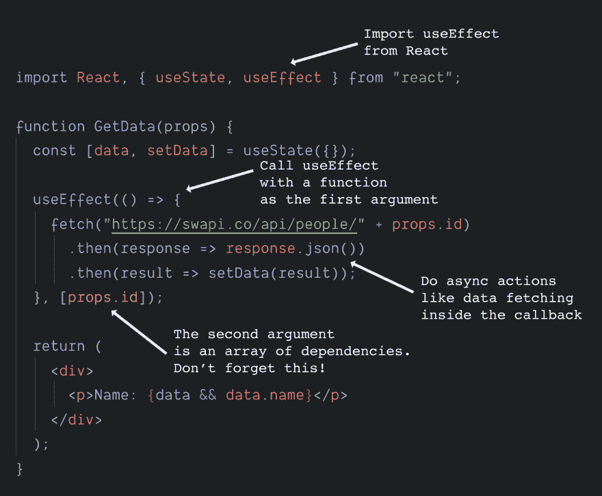

# 🔥学会在 10 条推文中做出反应(带挂钩)

> 原文：<https://dev.to/chrisachard/learn-react-in-10-tweets-with-hooks-59bc>

*这最初是作为 twitter 帖子发布的:[https://twitter.com/chrisachard/status/1175022111758442497](https://twitter.com/chrisachard/status/1175022111758442497)T3】*

🔥学会在 10 条推文中做出反应(带挂钩)👇

# 1。

React 的工作原理:

*   您在网页上显示数据
*   用户与它互动
*   现在数据改变了...
*   ...你希望网页看起来不一样

React 会帮你做到的！💯

# 2。

作出反应:

将你的用户界面分成自定义组件。

每个组件负责根据可用的*外部*和*内部*数据显示自身。

为完整的 UI 构建这些组件的树

# 3。

组件是返回 JSX 的函数

JSX 看起来像 HTML，但实际上是 JavaScript

在 JSX 内部，用花括号包含 JS

很多人会说“呸！”当他们看到看起来像 HTML 的东西混合到 JS 中，但 JSX 实际上是让 React 变得很棒的东西之一🦄

# 4。

在定义一个功能组件之后，你可以在另一个组件中使用它——它是一个“定制组件”

使用这个方法构建一个定义整个 UI 的组件“树”

# 5。

来自组件外部的数据被称为“属性”

这可以通过 JSX 属性从父代传递给子代

Props 作为函数的第一个参数进入函数组件。

# 6。

内部，*可变的*数据称为“状态”。

状态由返回数据的`useState`函数和更改数据的函数(在数组中)定义。

不要直接设置状态变量——总是使用那个函数(因为下一点👇)

# 7。

当状态或道具改变时，组件会自动更新🎉

✨这是神奇的反应了！✨

你几乎不需要亲自去大教堂

(如果你认为你知道——你可能正试图用“艰难的方式”去做)

# 8。

通过使用`map`循环遍历一组数据来制作列表

从每次循环迭代中返回一个元素

为列表中的每个元素提供唯一的`key`,以确保最佳性能

# 9。

2 种内置的组件样式方法:

1.  用`className`设置类，使用常规 CSS 文件

2.  用`style={{ }}`和骆驼大小写键
    设置内联样式👉注意双花括号

# 10。

在`useEffect`中执行异步函数和副作用(接受回调)

第二个参数是一组依赖项。

包括 useEffect 使用的任何可能更改的变量，或者如果没有变量，则包括一个空数组。

# 奖金

就是这样！React 的大部分只是那 10 个点的特例。

现在:想看吗👀这个速成班是电影剧本吗？你的愿望实现了！🎉

查看一下，以便更好地理解每一点👇

[https://www . reactscreencasts . com/crash _ courses/react _ with _ hooks](https://www.reactscreencasts.com/crash_courses/react_with_hooks)

**喜欢这个速成班？**

我在推特上发布更多: [@chrisachard](https://twitter.com/chrisachard)
或者加入时事通讯！[https://chrisachard.com/newsletter/](https://chrisachard.com/newsletter/)

感谢阅读！