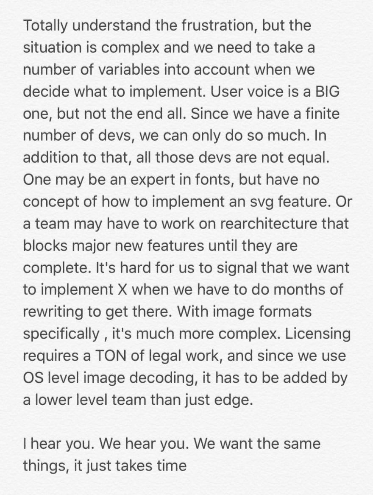
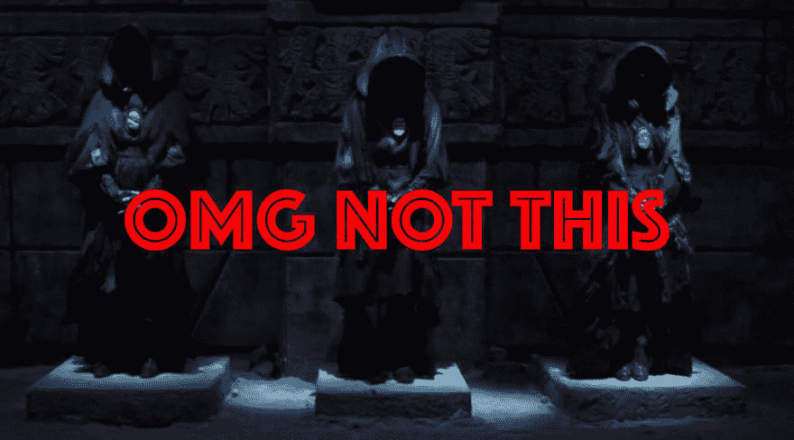
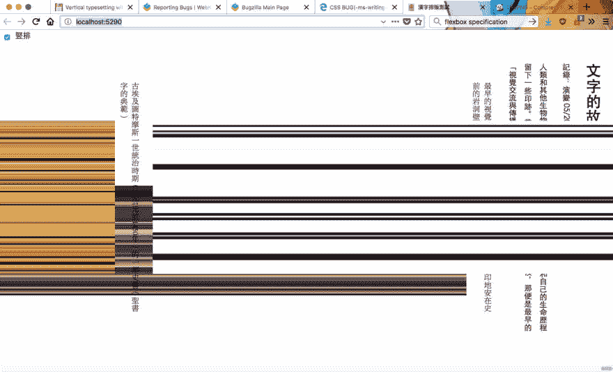

# 通过阅读规范学习 CSS

> 原文：<https://dev.to/huijing/learning-css-by-reading-specs-1pbe>

最近，我有机会采访了维塔利·弗莱德曼，作为今年九月在 T2 召开的观点来源会议的一部分。我们聊的一件事是关于新的 CSS。

[https://player.vimeo.com/video/353173490](https://player.vimeo.com/video/353173490)

我的好朋友，魏，是一位出色的技术作家，他非常热衷于开源项目的文档工作。她编写了大部分的 [React-Redux](https://react-redux.js.org/) 文档，并且是 [Docusaurus](https://docusaurus.io/) 的核心维护者之一。

> 马克埃里克森@阿塞马克。 [@wgao19](https://twitter.com/wgao19) 为我们新的 React-Redux 文档写了很大一部分，并且做得非常出色(我认为这是她最初参与 Docusaurus 的原因)。她值得关注，这个关于文档 Docusaurus v2 的总括问题看起来值得一读！[twitter.com/wgao19/status/…](https://t.co/oltj6XEgh2)2019 年 7 月 30 日上午 01:22ᴡᴇɪ👩🏻‍🌾 [@wgao19](https://dev.to/wgao19)我的兄弟们正在做一些出色的工作来创建@docusaurus 2，这需要分享，我需要了解它是如何构建的。好奇的猫可以和我一起抓住这个机会，从头开始为 D2 写文档。#learnInPublic 的官方文档是最好的💩https://t.co/LDbgiXzm0b

有一个如此关注文档的密友让我对软件开发的这个方面有了更多的思考，我个人觉得这个方面被严重低估了。

注意:写完这整件事之后，我意识到它比我预期的要长，所以它的 TL:DR 是，不要担心阅读 CSS 规范。它们对理解 CSS 有很大的帮助。还有，你，是的，你，也可以为 CSS 的发展做出贡献。

## 警告，故事时间…

我曾在各种不同的组织中工作过，从代理机构到初创企业，再到大型企业公司，并且是对文档持有不同态度的团队的一员。

我最难忘的经历是在一家初创公司，该公司专注于将机器学习技术应用于来自组织的大型数据集，这些组织拥有大量数据，但没有专业知识来处理这些数据。

新加坡的团队一直在研究一个机器学习平台，但由于我们新加坡办公室的关闭，他们一直未能完成这项工作。

但是那一年与经验丰富、技术娴熟的高级工程师一起工作，他们都是各自领域的专家，教给我的软件工程知识比我以前所有工作经验的总和还要多。

它们的一个共同点是强调清晰和全面的文档。

## CSS 规范是文档，挺

[Codrops](https://tympanus.net/codrops/) 有一个非常好的 [CSS 参考](https://tympanus.net/codrops/css_reference/)部分，主要是由不屈不挠的 [Sara Soueidan](https://www.sarasoueidan.com/) 编写的。在 Sara 转向其他项目后，我帮助完成了一些后期作品。我如此熟悉 CSS 网格的原因是因为我为那个写了[条目。](https://tympanus.net/codrops/css_reference/grid/)

我写的每一篇文章都让我有理由仔细研究相关的 CSS 规范，此外还会研究任何涉及相同内容的教程和博客帖子，但使用不同的方式。

但规范始终是我唯一的真理来源，它给了我足够的清晰度来辨别一篇文章或博客帖子上的信息是否完全准确。我现在会参考我写的每一篇关于 CSS 的博客文章的规范，而且更多的时候，我会发现一些我以前不知道的东西。

<figcaption>对我的准确描绘</figcaption>

在我们的采访中，Vitaly 提到的一件事是，一些人觉得该规范令人生畏，它看起来像是一份真正的技术文档，其中有一段又一段难以解读的文本。

对我来说，这部分是正确的，尤其是对于在 CSS3 之前[编写的规范，当时决定将规范分成不同的模块，以便于开发和维护。我也有过多次阅读同一段落却仍然一无所知的经历。](https://www.w3.org/Style/2011/CSS-process)

我还具有英语流利的优势，因此，与英语不是母语的人相比，我能够更快、更容易地理解说明书中的信息。

也就是说，当 Vitaly 问我，当我开始从事 web 开发时，有没有一件事是我希望知道的，我的回答是从第一天起就知道阅读 CSS 规范。

CSS 工作组投入了大量的时间和精力来尽可能全面地定义 CSS 应该如何表现。

引用艾丽卡·埃特马德(又名幻想)的话:

> 你不需要成为一个程序员或者 CS 专业的学生来理解 CSS 规范。你不需要超过 18 岁或者有学士学位。你只需要非常迂腐，非常执着，非常彻底。

## 规格入门

幸运的是，许多文章和资源都是专门为了帮助人们阅读 W3C 规范而编写的。如果你从未访问过 W3C 的 CSS 主页，我推荐你从那里开始。

它会不断更新 CSS 工作组正在做什么，哪些规范已经正式更新，以及相关事件和会议的新闻。

了解 CSS 的历史也是有益的，因为它揭示了 CSS 在过去二十年中是如何发展的，以及为什么某些东西是今天的样子。

2016 年 12 月 17 日是 CSS 20 周年纪念日，W3C 发布了一个纪念网站，[CSS 20 年](https://www.w3.org/Style/CSS20/)，庆祝那个里程碑。

CSS 工作组已经完成了所有规范和草案的完整列表，因此这是了解所有最新发展的最佳位置。至于规范的实际阅读，[如何阅读由](http://alistapart.com/article/readspec/) [J. David Eisenberg](https://catcode.com/) 撰写的 W3C 规范可能是最好的起点。

理解 Elika 的 CSS 规范为我们提供了一个很好的路线图，告诉我们应该首先涵盖哪些规范，同时也强调了一些我们有兴趣参与的项目。

## 促成 CSS 的发展

在我的 web 开发生涯中，最幸运的事情之一是结识了从事浏览器、规范和 web 平台工作的人。

我从他们的随意交谈中获得的大量真知灼见对我形成对这个行业的看法非常宝贵，我选择了这个行业作为我的职业。

我第一次见到瑞秋·安德鲁是在她来新加坡参加 [CSSConf 的时候。亚洲 2016](https://2016.cssconf.asia/) ，她勇敢地同意参加[讲座的小组讨论。CSS 周年庆特辑](https://singaporecss.github.io/12/)。

[https://www.youtube.com/embed/Y6aWQ7h70rA](https://www.youtube.com/embed/Y6aWQ7h70rA)

我认为她是一个真正的 CSS 倡导者，她鼓励像你我这样的 web 开发人员向规范作者和浏览器供应商提供反馈，并为 web 平台的开发做出贡献。

对我来说，CSS 是并将永远是我最喜欢的开源项目。

### 写作/谈论 CSS

尝试 CSS 特性，尤其是较新的特性，然后写下或讲述它是如何工作的，它是如何解决一个特定的用例，或者没有解决，这是非常有帮助的，不仅对其他可能遇到类似情况的开发人员是如此，对规范作者和浏览器供应商也是如此。

如果我们仅仅因为新功能没有得到广泛支持而回避使用它们，我们就开始了一个负面的循环，最终将该功能进一步推离广泛的浏览器支持。谈到优先级，浏览器厂商确实注意到了围绕 CSS 特性的讨论。

有时候，我想知道开发人员是否忘记了浏览器也是由像你我这样的工程师构建和维护的软件项目。与任何软件项目一样，功能和漏洞必须得到优先考虑，因为即使像谷歌和微软这样的公司很大，但开发浏览器的团队并没有那么大。

当 CSS grid 在 2017 年首次问世时，它引起了相当多的关注，Patrick Kettner 的一条特别的推文迫使我写了一篇关于我们行业中善良(有时是缺乏善良)的[简要说明。](https://www.chenhuijing.com/blog/a-little-more-kindness)

> Patrick Kettner@ patrickkettner[@ marcosc](https://twitter.com/marcosc)[@ jsscclr](https://twitter.com/jsscclr)千吨的思绪，又没有足够的时间去 tweetstorm，所以...2017 年 3 月 19 日上午 00:55

我的观点是，请尝试尽可能多的新功能。你不必在生产中使用它们，这里的一个附带项目或那里的一个 CodePen，只是看看它是如何工作的，就足够了。如果你有时间，写一篇简短的文章，即使是子弹形式的也可以。浏览器厂商正在倾听。

### 对 CSS 工作底稿回购提出问题

CSS 规范不是在一个深藏地下的洞穴里由穿着黑色长袍的神秘人围绕着一个沸腾的大锅吟诵而开发出来的。他们是在露天做的。每个人都可以参与讨论[邮件列表，www-style@w3.org](https://lists.w3.org/Archives/Public/www-style/)，你可以[在这里](https://lists.w3.org/Archives/Public/www-style/)订阅。

如果你不喜欢邮件列表，那么在 [GitHub](https://github.com/w3c/csswg-drafts) 上提出问题也可以。所有的 CSS 工作草案都是在 GitHub 上编写和开发的，所以跟随它看看一个规范是如何在其开发过程中演变的真的很有趣。

诚然，规范作者、浏览器供应商和各自领域的专家(可访问性、国际化、排版等)之间正在进行大量的讨论。)，但是也有像您和我一样的开发人员询问具体的用例并要求澄清。

<figcaption>这些都是来自 CSSWG</figcaption>

 的优秀民间

理想情况下，你会希望对你的用例清晰而具体，并提供一个简化的测试用例来最好地说明这个问题，如果适用的话。大多数情况下，有人能够帮助你，或者标记能够帮助你的人。

对我来说，简单地阅读我觉得有趣的问题就足够令人着迷了，因为通常它们都围绕着我从未想到过的用例，并且我已经对规范中投入的思想量有了更大的理解。

### 记录各自浏览器厂商的 bug

我特别感兴趣的 CSS 属性之一是`writing-mode`。公平地说，它可能最适用于我们这些使用东亚语言如汉语或日语的人。但这并不意味着你们中的那些人不必错过乐趣。

竖排文字在平面设计领域已经使用了很长时间，Jen Simmons 有很多演示来展示竖排文字如何用于艺术导向的布局。但是我跑题了。这一节讲的是浏览器 bug。

因为网页上的垂直书写比其他 CSS 功能使用得少，所以有一些错误没有被清除。但是当时我对垂直布局做了很多实验，并在 Firefox 中遇到了一个非常奇怪的错误。

在这篇博客文章中的[中有关于整个练习的全部细节。我在 Firefox 的问题日志中提出了这个错误，在下一个版本中，这个错误已经被解决了。这让我震惊。虽然我也有很多朋友向我提到，当他们遇到奇怪的行为时，他们不会想到这可能是浏览器的错误。](https://www.chenhuijing.com/blog/vertical-typesetting-revisited)

所以我想在这里指出的是，有时候，当你的 CSS 看起来在做奇怪的事情时，要承认这可能是浏览器的错误。通过检查这是否是一个现存的问题来帮助浏览器供应商，如果不是，提出一个。

以下是主要浏览器的所有问题日志列表:

*   [火狐 bug 追踪器](https://bugzilla.mozilla.org/index.cgi)
*   [铬虫追踪器](https://bugs.chromium.org/p/chromium/issues/list)
*   [Webkit bug tracker](https://bugs.webkit.org/query.cgi?format=specific&product=WebKit)
*   [EdgeHTML 问题跟踪器](https://developer.microsoft.com/en-us/microsoft-edge/platform/issues/)

还有一个由志愿者领导的名为 [Web Compat](https://webcompat.com/) 的项目，它有助于简化提出浏览器兼容性问题的过程。

### Web 平台测试项目

2017 年，当我在奥斯汀担任 Mozilla All-Hands 时，当我听到一些人谈论它时，我知道了 [Web 平台测试](https://web-platform-tests.org/)项目。然后，Rachel Andrew [写了这篇关于 24ways](https://24ways.org/2017/testing-the-web-platform/) 的文章，提供了一个通过编写测试参与项目的逐步指南。

引用她文章中的话:

> 你需要真正了解一个特性，才能准确地想出一种方法来测试它在不同的引擎中是否工作。这并不是一项迷人的工作，但却是一件非常有用的事情。除了帮助你自己，以及开发那种能够做出贡献的平台的深度知识，你将真正地帮助规范的进展。

这是我还没有开始探索的东西，但它肯定在我的遗愿清单上，希望我能在未来开始有所贡献。

## 包装完毕

这种情况持续了很长时间，但我希望它能揭示为什么阅读 CSS 规范对建立对 CSS 的深刻理解非常有帮助，同时也强调了从事 web 工作的开发人员如何为塑造 web 平台做出贡献。

## 相关阅读及链接

*   W3C:级联样式表
*   [如何阅读 W3C 规范](http://alistapart.com/article/readspec/)
*   [了解 CSS 规范](https://www.w3.org/Style/CSS/read)
*   [CSS:等级、快照、模块…](https://www.w3.org/Style/2011/CSS-process)
*   [CSS 工作组编辑草稿](https://github.com/w3c/csswg-drafts)
*   [网络平台测试文档](https://web-platform-tests.org/)
*   [网络平台测试仪表板](https://wpt.fyi/results/?label=master&label=experimental)
*   [网络平台规格测试套件](https://github.com/web-platform-tests/wpt)
*   [给未来自己的圣诞礼物:测试网络平台](https://24ways.org/2017/testing-the-web-platform/)
*   [让事情变得更好:重新定义 CSS 的技术可能性](https://noti.st/rachelandrew/ClxWtN/making-things-better-redefining-the-technical-possibilities-of-css)