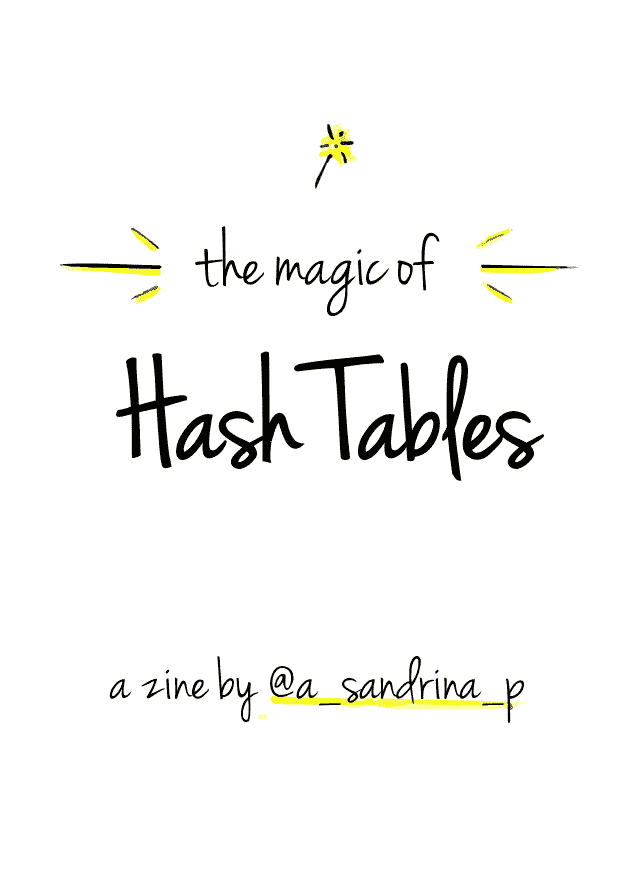
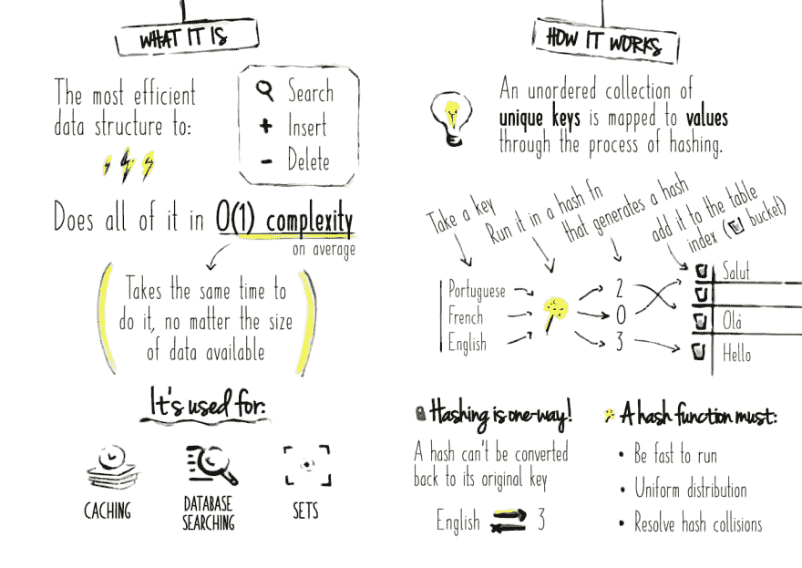
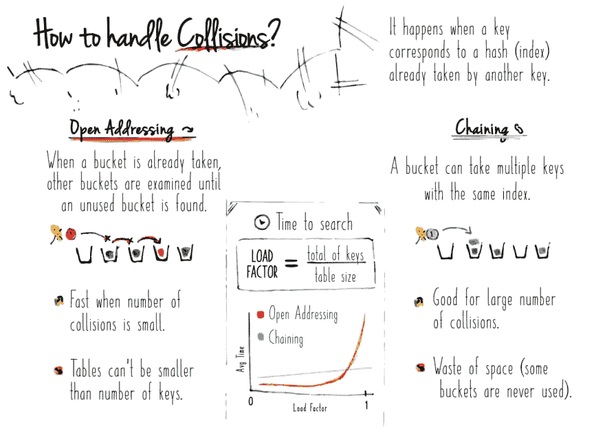
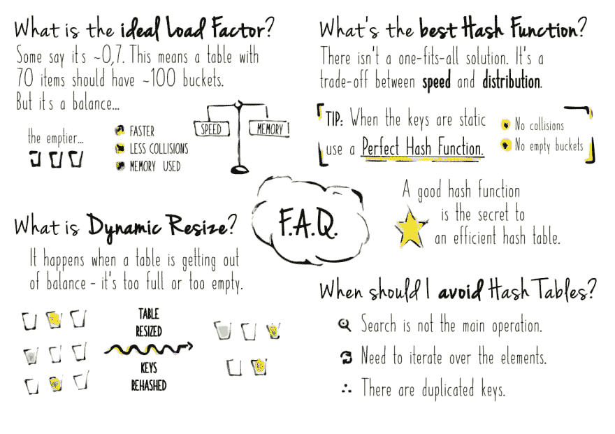
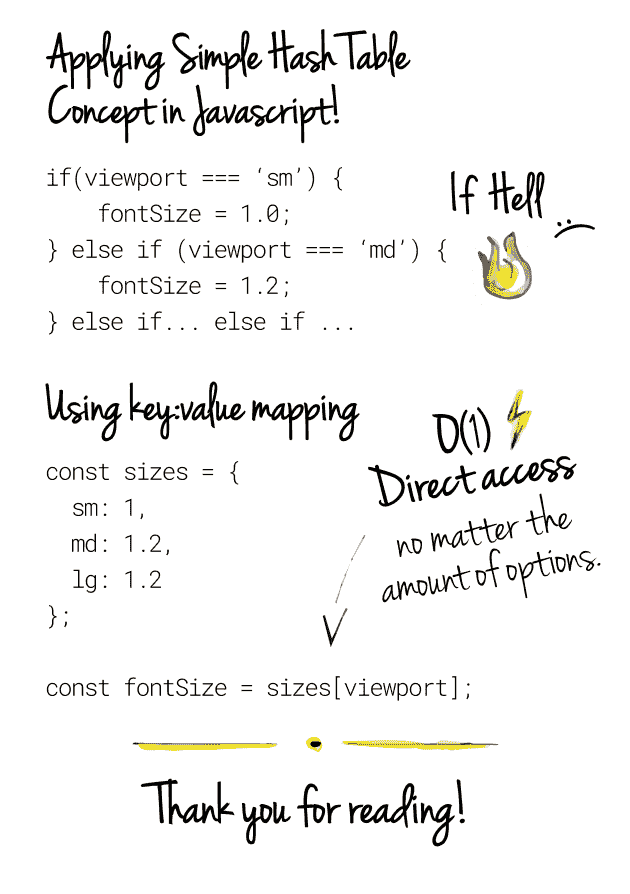

# 通过绘图学习哈希表🎨

> 原文：<https://dev.to/a_sandrina_p/learning-hash-tables-with-drawings-99o>

我一直在学习数据结构，这一切似乎非常火箭科学。🙃为了帮助我更好地理解它(学会学习),我做了一个关于其中之一的小杂志——散列表⚡️

在底部，您可以通过参考资料查看完整的书面版本，但是现在，请查看说明性版本！

欢迎[下载可打印版本](https://github.com/sandrina-p/sketching/blob/master/zine_hash-tables/print.png)。这里还有[原创手工版](https://github.com/sandrina-p/sketching/blob/master/zine_hash-tables/original.jpg)。

[](https://res.cloudinary.com/practicaldev/image/fetch/s--Br9vi3Ng--/c_limit%2Cf_auto%2Cfl_progressive%2Cq_auto%2Cw_880/https://github.com/sandrina-p/sketching/raw/master/zine_hash-tables/0_cover.png)

[](https://res.cloudinary.com/practicaldev/image/fetch/s--SWF_E304--/c_limit%2Cf_auto%2Cfl_progressive%2Cq_auto%2Cw_880/https://github.com/sandrina-p/sketching/raw/master/zine_hash-tables/1_intro.png)

[](https://res.cloudinary.com/practicaldev/image/fetch/s--9Hia6R2z--/c_limit%2Cf_auto%2Cfl_progressive%2Cq_auto%2Cw_880/https://github.com/sandrina-p/sketching/raw/master/zine_hash-tables/2_collisions.png)

[](https://res.cloudinary.com/practicaldev/image/fetch/s--ryzQd0Ml--/c_limit%2Cf_auto%2Cfl_progressive%2Cq_auto%2Cw_880/https://github.com/sandrina-p/sketching/raw/master/zine_hash-tables/3_faq.png)

...现在是书面版本...

# 哈希表的魔力

## 这是什么

最有效的数据结构🔍搜索➕Insert 和🗑Delete.

平均来说，所有这些操作的复杂度都是 o(1)o(t1)吗(也就是说，无论可用数据的大小如何，to
都要花费相同的时间)

它用于缓存、数据库搜索和设置

## 工作原理

一个无序的**唯一键**集合通过散列过程被映射到**值**。

取一个密钥->在哈希函数中运行->生成哈希

葡萄牙语- > ✨ - > 2
法语- > ✨ - > 0
英语- > ✨ - > 3

...并将其添加到表上的匹配索引(也称为“桶”):

| 混杂 | 价值 |
| --- | --- |
| Zero | 祝你健康 |
| one | - |
| Two | -你好 |
| three | 你好 |

### 哈希是单向的！

哈希不能转换回它的原始键。

例:散列“英语”返回 3，但是用 3 你不能得到“英语”

### 哈希函数必须:

*   🏎快跑。
*   🧩均匀分布。
*   💥解决哈希冲突。

## 如何处理碰撞？

当一个键对应于另一个键已经采用的散列(索引)时，就会发生冲突。

### 开放寻址

当一个存储桶已经被占用时，将检查其他存储桶，直到找到一个未使用的存储桶。

*   💚碰撞次数少时速度快。
*   🚨表格不能小于键的数量。

### 链接

一个桶可以包含多个具有相同索引的键。

*   💚适用于大量碰撞。
*   🚨浪费空间(有些桶从不使用)。

## 💡常见问题解答

### 理想的负载系数是多少？

有人说是 0.7 左右。这意味着一个有 70 个条目的表应该有大约 100 个存储桶。但这是一种平衡。桶越空，速度越快，冲突越少，但使用的内存越多。

### 什么是动态调整大小？

当一张桌子失去平衡时就会发生这种情况——太满或太空。它调整表的大小并重新散列键。

### 最好的哈希函数是什么？

没有万能的解决方案。这是速度和分布之间的权衡。

好的哈希函数是高效哈希表的秘密。

提示:当密钥是静态的时候，使用一个完美的散列函数。* *无碰撞* * *无空桶* *

### 什么时候应该避免哈希表？

*   搜索不是主要操作。
*   需要迭代元素。
*   有重复的钥匙。

## 🎁额外收获:在 Javascript 中应用简单的哈希表概念！

### 😰使用 If 语句时...

当处理不同的场景来分配变量时，您会陷入 if hell(或 switch hell)。

```
if(viewport === 'sm') {
    fontSize = 1.0;
} else if (viewport === 'md') {
    fontSize = 1.2;

} // else if ... else if ... 
```

Enter fullscreen mode Exit fullscreen mode

### ⚡️却使用`key:value`映射...

无论选项的数量有多少，您都可以直接锁定 O(1)复杂度，并使用更简洁的代码。多酷啊。

```
const sizes = {

    sm: 1,
    md: 1.2,
    lg: 1.2

};

const fontSize = sizes[viewport]; 
```

Enter fullscreen mode Exit fullscreen mode

[](https://res.cloudinary.com/practicaldev/image/fetch/s--y9GfLw06--/c_limit%2Cf_auto%2Cfl_progressive%2Cq_auto%2Cw_880/https://i.imgur.com/3RUDmmL.png)

* * *

入门资源:

*   📝[哈希表-维基百科](https://en.wikipedia.org/wiki/Hash_table)
*   🎥[哈希表和哈希函数](https://www.youtube.com/watch?v=KyUTuwz_b7Q&t=21s)
*   🎥[哈希表简化版](https://www.youtube.com/watch?v=mFY0J5W8Udk)

* * *

感谢您的阅读！