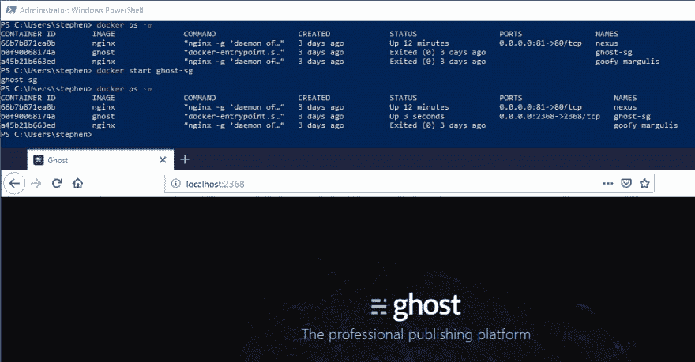

# 学习使用 Docker

> 原文：<https://dev.to/stegriff/learning-to-use-docker-2gp8>

*综合自[在 stegriff.co.uk 学习使用 Docker](https://stegriff.co.uk/upblog/learning-to-use-docker/)T3】*

有没有过那种恐慌的感觉，觉得未来就要来临，而你却被抛在了后面？

每当我读到 Docker 和 Kubernetes 的时候，我就有这种感觉，所以我想我已经过了开始这段旅程的期限了！

> Docker 是一种获取某些软件及其所有依赖项，并在某种程度上隔离的环境中运行该软件的方法。

总之，这是我的简短定义。

图像可以从注册中心获得，通常是 Docker Hub(【https://hub.docker.com/】)或微软容器注册中心。

一个**映像**类似于一个软件安装程序或软件包。你可以用它在你的机器上`create`一个**容器**。容器可以运行或停止。您可能有许多相同图像的容器，每个容器都有不同的设置。它们中的每一个都可以独立启动和停止。

在写作中，这听起来有点笨重，但在实践中，它很酷。只需几个命令，您就可以启动并运行像 MongoDB 或 Ghost 这样的复杂包。一方面，这可以让你测试一项新技术，看看它是否适合，而不必经过费力的设置。在生产中，容器构成了服务和微服务的**可复制**和硬件无关设置的基础。

## Windows 上的设置

要在 Windows 上安装 Docker，请访问[https://hub.docker.com/](https://hub.docker.com/)并点击“Docker 桌面”的下载链接。我想这以前叫做“Windows Docker”。在撰写本文时，下载行为是一个大横幅，位于登录页面的前端和中央。

当你第一次设置 Docker Desktop 时，你有一个复选框来选择你是想处于 Linux 容器模式还是 Windows 模式。让它不被选中来使用 Linux。您可以随时轻松地进行更改，并在 Linux/Windows 模式之间切换。

## 一些命令

打开一个终端，不管是 cmd，PowerShell，git bash...您可以单独运行`docker`来查看包含命令列表的帮助文本。以下是我的剧本中相关的例子。

### 图像

以下是在您的机器上查找和管理图像的一些命令。每个命令行前面都有一个注释来解释其意图:

```
# Search docker hub for an image
docker search nginx

# Download an image (doesn't create a container)
docker pull nginx

# List the images that you have on the machine
docker images

# Remove the downloaded nginx image
# (all running containers of that image have to be stopped first)
docker rmi nginx 
```

Enter fullscreen mode Exit fullscreen mode

### 容器

[](https://res.cloudinary.com/practicaldev/image/fetch/s--m1von9WK--/c_limit%2Cf_auto%2Cfl_progressive%2Cq_auto%2Cw_880/https://thepracticaldev.s3.amazonaws.com/i/hkc2wvyucj1iq4pnaioj.png)

创建容器后，您可以使用它的**全名**，或者使用它的 ID 的**明确片段来识别它。id 看起来像 git 提交散列。如果你不给一个容器命名，它会得到一个基于`[adjective]_[scientist]`的随机名字！** 

```
# Create a container based on the nginx image
# Called 'my-server' (optional)
# Mapping container port 80 to host port 8080
docker create --name my-server -p 8080:80 nginx

# Start the container
# Detached by default, use -it for interactive terminal
docker start my-server
docker start -it my-server

# Stop a container
docker stop my-server

# List all running containers
docker ps

# List all containers, running and stopped
docker ps -a

# Delete a container
# Doesn't affect the image or any other containers of the same image
docker rm my-server 
```

Enter fullscreen mode Exit fullscreen mode

注意`ps`命令，它是以列出正在运行的进程的 Unix `ps`命令命名的。令人困惑的是，`ps -a`是获取所有现存容器列表的命令，不管运行与否。

对于`docker start`，`-it`是`-i`和`-t`标志的组合。

### 一体机

`docker run nginx`是一个速记命令，它将:

*   如果图像不存在，下载图像(即 nginx)
*   基于图像创建一个新容器
*   启动容器

因此，您可以将其他命令中的许多参数提供给`docker run`，比如端口的`--name`和`-p`。运行`docker run --help`获取完整列表。

**被警告**`docker run`将总是创建一个新的容器。因此，如果您对同一个映像重复使用它，您将会得到同一个软件的许多不同的运行容器！我发现`ps -a`对于保持领先至关重要。

好的一面是，一旦你的机器上有了基础**映像**的给定版本，Docker 将使用本地副本，而不是重新下载软件。当`latest`版本增加时，大概`docker run`会下载并运行更新的版本？需要事实检查器！

## 运行中的容器可以做什么？

到目前为止，我与这些容器交互的主要方式是让它们将它们的关键功能(网站、数据库等等)暴露给主机上的一个端口——我的电脑。

然后，我可以使用这个连接在浏览器中使用运行的软件，或者将一个应用程序连接到运行的数据库。

尽管运行软件的基础上有一个 Linux 发行版(通常是 Alpine)，但我还没有尝试远程处理 Linux-y 部分。以“L”代表“以后”。

## 关于容器的更多信息

因此，容器实际上在您的网络上是虚拟存在的！

你可以用`docker inspect container-name`找到(太多)关于一个容器的信息。该命令的长 JSON 结果的底部附近是一个 IP 地址。我还不知道你能用这个做什么。

我知道在使用 Docker Swarm 和 Kubernetes 的多容器设置中，这些虚拟网络 IP 用于容器间的通信。以“懒惰”一词归入“L”一栏。

## 包容你的热情

不管容器是不是“未来”(对许多人来说，它们是“现在”)，我认为我们需要掌握这种范式。所以我正在努力！感谢你读到这里，我希望你能从我的新手笔记中得到些什么。