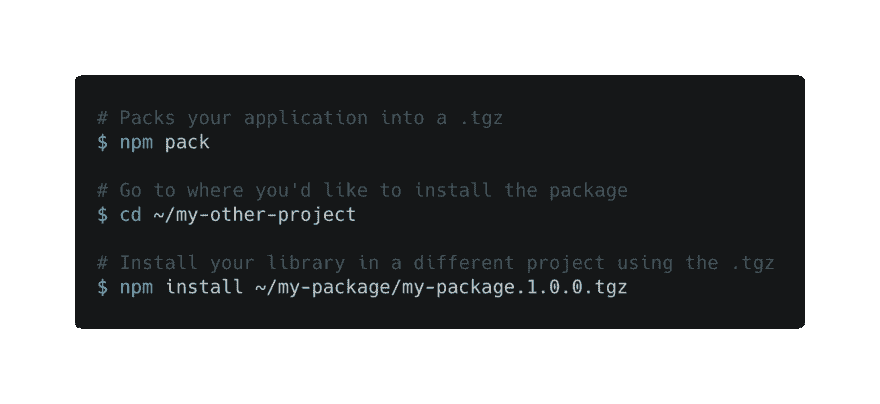
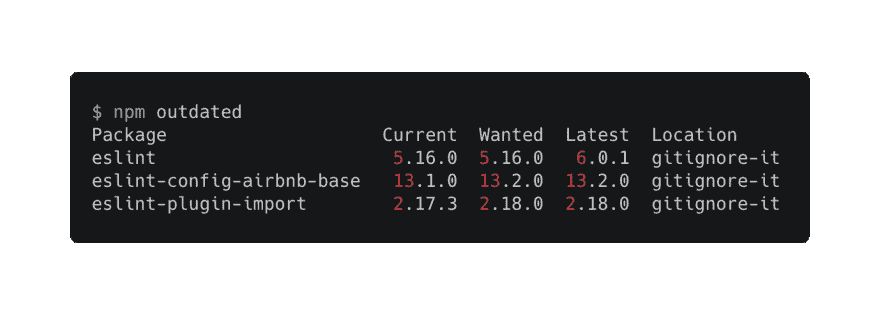
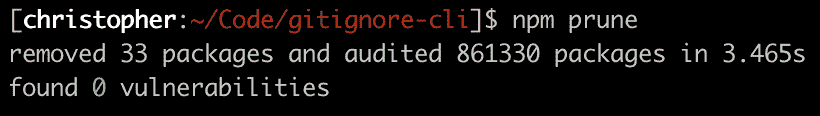
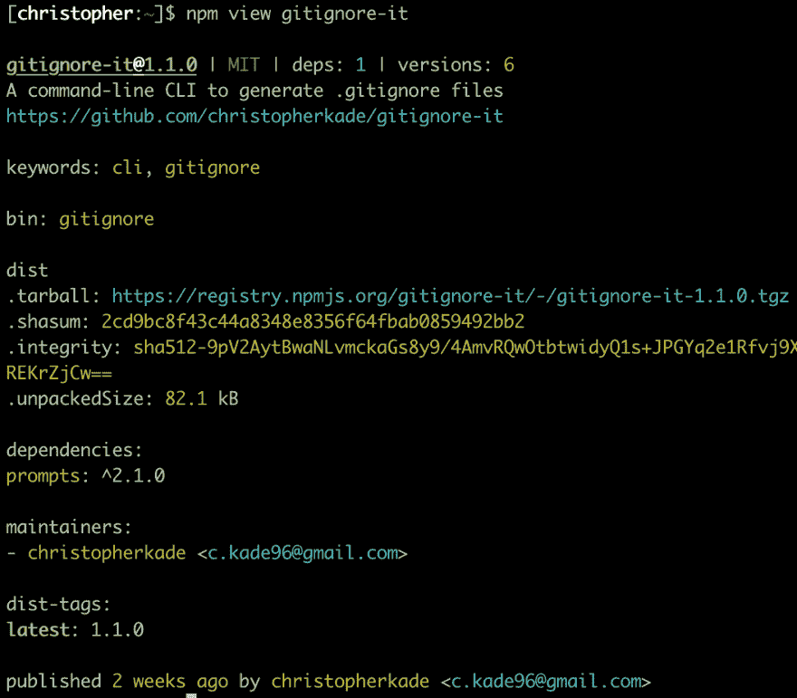
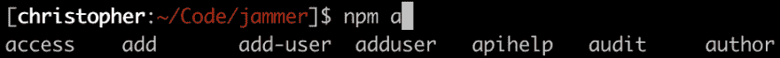

# 鲜为人知的 npm CLI 命令

> 原文：<https://dev.to/christopherkade/lesser-known-npm-cli-commands-46fe>

我们都知道并且每天都在使用`npm start`、`npm audit`、`npm init`以及更多的`npm`命令，但是有相当多的命令没有被充分利用！这篇文章将向您展示使用`npm`命令行界面可以做的一些很棒的事情。

## `npm pack`

> 从包中创建一个 tarball

如果你正在开发一个`npm`包，并想测试它是否在不发布的情况下安装，运行`npm pack`会将你的模块打包成一个`tgz`文件，可以使用`npm install`安装。

📄[文档](https://docs.npmjs.com/cli/pack.html)

## `npm outdated`

> 检查过期的包

很明显，如果当前安装的软件包过时了，它会检查注册表。

📄[文档](https://docs.npmjs.com/cli/outdated.html)

## `npm prune`

> 移除无关的包

删除未在父包的依赖项列表中列出的包。

📄[文档](https://docs.npmjs.com/cli/prune.html)

## `npm star <pkg>`

> 标记您最喜欢的包裹

允许你对给定的包装表达爱意。

`npm stars`列出您当前已加星的套餐。

📄[文档](https://docs.npmjs.com/cli/star.html)

## `npm view <name> <field>`

> 查看注册表信息

您也可以添加任何在`package.json`中可以找到的`field`，如`dependencies`，查看相关信息。

📄[文档](https://docs.npmjs.com/cli/view.html)

## `npm docs <pkg>`

> web 浏览器中的包文档

有多少次你最终手动寻找一个包的文档？运行`npm docs <pkg>`会自动为你打开相关页面(只有在包的`package.json`文件中列出的情况下)。

📄[文档](https://docs.npmjs.com/cli/repo.html)

## `npm dedupe`

> 减少重复

重复数据删除会搜索本地程序包树，并尝试通过将依赖关系沿树向上移动来简化其结构。这样，它们可以更有效地被多个依赖包共享。

📄[文档](https://docs.npmjs.com/cli/dedupe.html)

## `npm completion`

> npm 的选项卡完成

运行`npm completion`将显示一个 bash 脚本，它将负责自动完成任何未来的 npm 命令。你所要做的就是按照命令给出的指示去做。

对我来说，`npm completion >> ~/.bashrc`足以让我利用这个特性！

📄[文档](https://docs.npmjs.com/cli/completion.html)

一天就够了！

在我看来，其中一些命令非常有用，所以我希望你喜欢这篇文章。

如果你做了，在推特上关注我 [@christo_kade](http://twitter.com/christo_kade) 可能是表达你支持的最好方式。我贴了很多我发现的很酷的开源东西，JS & CSS 技巧等等。

感谢您的阅读！